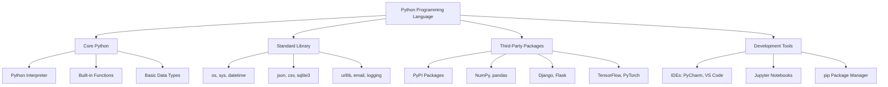

# Complete Python Programming Tutorial

## Table of Contents

1. [Introduction to Python](https://claude.ai/chat/25f3fd72-933d-41fd-b7ff-0cb0fe497d36#introduction-to-python)
2. [Getting Started](https://claude.ai/chat/25f3fd72-933d-41fd-b7ff-0cb0fe497d36#getting-started)
3. [Basic Syntax and Elements](https://claude.ai/chat/25f3fd72-933d-41fd-b7ff-0cb0fe497d36#basic-syntax-and-elements)
4. [Variables and Data Types](https://claude.ai/chat/25f3fd72-933d-41fd-b7ff-0cb0fe497d36#variables-and-data-types)
5. [Built-in Collections](https://claude.ai/chat/25f3fd72-933d-41fd-b7ff-0cb0fe497d36#built-in-collections)
6. [Operations and Expressions](https://claude.ai/chat/25f3fd72-933d-41fd-b7ff-0cb0fe497d36#operations-and-expressions)
7. [Control Structures](https://claude.ai/chat/25f3fd72-933d-41fd-b7ff-0cb0fe497d36#control-structures)
8. [Functions and Modules](https://claude.ai/chat/25f3fd72-933d-41fd-b7ff-0cb0fe497d36#functions-and-modules)
9. [Object-Oriented Programming (OOP)](https://claude.ai/chat/25f3fd72-933d-41fd-b7ff-0cb0fe497d36#object-oriented-programming-oop)
10. [Error Handling](https://claude.ai/chat/25f3fd72-933d-41fd-b7ff-0cb0fe497d36#error-handling)
11. [File Handling](https://claude.ai/chat/25f3fd72-933d-41fd-b7ff-0cb0fe497d36#file-handling)
12. [Built-in Functions](https://claude.ai/chat/25f3fd72-933d-41fd-b7ff-0cb0fe497d36#built-in-functions)
13. [Advanced Topics](https://claude.ai/chat/25f3fd72-933d-41fd-b7ff-0cb0fe497d36#advanced-topics)
14. [Quick Reference](https://claude.ai/chat/25f3fd72-933d-41fd-b7ff-0cb0fe497d36#quick-reference)

---

## Introduction to Python

### What is Python?

Python is a high-level, interpreted programming language that emphasizes code readability and simplicity. Created by Guido van Rossum and first released in 1991, Python has become one of the most popular programming languages in the world.

**Why is Python so popular?**

* **Easy to learn and read** - Python's syntax is clean and intuitive
* **Versatile** - Used for web development, data science, AI, automation, and more
* **Large ecosystem** - Thousands of libraries and frameworks available
* **Community support** - Active, helpful community worldwide
* **Cross-platform** - Runs on Windows, macOS, Linux, and more
* **Free and open-source** - No licensing costs

**What can you do with Python?**

* **Web Development** : Django, Flask, FastAPI
* **Data Science & Analytics** : pandas, NumPy, matplotlib
* **Machine Learning & AI** : scikit-learn, TensorFlow, PyTorch
* **Automation & Scripting** : Automate repetitive tasks
* **Game Development** : pygame, Panda3D
* **Desktop Applications** : tkinter, PyQt, Kivy
* **Scientific Computing** : SciPy, SymPy
* **Cybersecurity** : Penetration testing, security analysis

### Python Ecosystem Overview



### Benefits of Python

1. **Beginner-Friendly**
   * Simple, readable syntax
   * Minimal boilerplate code
   * Interactive interpreter for learning
2. **Productivity**
   * Rapid development and prototyping
   * Extensive standard library
   * "Batteries included" philosophy
3. **Flexibility**
   * Multiple programming paradigms (procedural, OOP, functional)
   * Dynamic typing
   * Interpreted language (no compilation step)
4. **Performance**
   * While not the fastest, it's fast enough for most applications
   * Can be optimized with C extensions
   * Libraries like NumPy provide near-C performance
5. **Career Opportunities**
   * High demand in job market
   * Competitive salaries
   * Used by major companies (Google, Netflix, Instagram, etc.)

---

## Getting Started

### Installing Python

**Step 1: Download Python**

1. Visit [python.org](https://www.python.org/downloads/)
2. Download the latest stable version (Python 3.11+ recommended)
3. Choose the installer for your operating system

**Step 2: Installation Process**

**Windows:**

* Run the installer
* ✅  **IMPORTANT** : Check "Add Python to PATH"
* Check "Install pip"
* Click "Install Now"

**macOS:**

* Run the .pkg installer
* Follow installation wizard
* Python will be available as `python3`

**Linux (Ubuntu/Debian):**

```bash
sudo apt update
sudo apt install python3 python3-pip
```

**Step 3: Verify Installation**
Open terminal/command prompt and run:

```bash
python --version
# or
python3 --version

pip --version
# or
pip3 --version
```

**Output:**

```
Python 3.11.5
pip 23.2.1
```

### Development Environment Options

#### 1. Command Line / Terminal

* **Pros** : Simple, always available, great for learning
* **Cons** : No syntax highlighting, limited debugging
* **Usage** : Type `python` or `python3` to start interactive interpreter

```python
$ python3
Python 3.11.5 (main, Aug 24 2023, 15:18:16)
>>> print("Hello, World!")
Hello, World!
>>> 2 + 3
5
>>> exit()
```

#### 2. Text Editors

* **VS Code** (Recommended for beginners)
  * Free, lightweight, excellent Python extension
  * Built-in terminal, debugging, IntelliSense
* **Sublime Text** : Fast, customizable
* **Atom** : GitHub's editor (now discontinued, but still usable)

#### 3. Integrated Development Environments (IDEs)

* **PyCharm** (Professional/Community)
  * Full-featured, excellent for large projects
  * Debugging, testing, version control integration
* **Spyder** : Scientific Python development
* **Thonny** : Beginner-friendly Python IDE

#### 4. Online Platforms

* **Replit** : Browser-based coding
* **Jupyter Notebooks** : Great for data science and learning
* **Google Colab** : Free cloud-based notebooks
* **CodePen** : Quick testing and sharing

### Installing Additional Packages

Python uses `pip` (Package Installer for Python) to manage external libraries:

```bash
# Install a single package
pip install requests

# Install multiple packages
pip install numpy pandas matplotlib

# Install from requirements file
pip install -r requirements.txt

# Install specific version
pip install django==4.2.0

# Upgrade package
pip install --upgrade package_name

# List installed packages
pip list

# Show package information
pip show package_name

# Uninstall package
pip uninstall package_name
```

**Creating a requirements.txt file:**

```bash
pip freeze > requirements.txt
```

This creates a file listing all installed packages and their versions, making it easy to recreate the environment.

### Python Package Management Best Practices

#### Virtual Environments

Virtual environments create isolated Python environments for different projects:

```bash
# Create virtual environment
python -m venv myproject_env

# Activate virtual environment
# Windows:
myproject_env\Scripts\activate
# macOS/Linux:
source myproject_env/bin/activate

# Install packages in virtual environment
pip install requests pandas

# Deactivate virtual environment
deactivate
```

#### Modern Tools

* **pipenv** : Combines pip and virtualenv
* **poetry** : Advanced dependency management
* **conda** : Popular in data science community

---

## Basic Syntax and Elements

### Python Philosophy: The Zen of Python

```python
import this
```

**Output:**

```
The Zen of Python, by Tim Peters

Beautiful is better than ugly.
Explicit is better than implicit.
Simple is better than complex.
Complex is better than complicated.
Readability counts.
Special cases aren't special enough to break the rules.
Although practicality beats purity.
Errors should never pass silently.
Unless explicitly silenced.
In the face of ambiguity, refuse the temptation to guess.
There should be one-- and preferably only one --obvious way to do it.
Although that way may not be obvious at first unless you're Dutch.
Now is better than never.
Although never is often better than *right* now.
If the implementation is hard to explain, it's a bad idea.
If the implementation is easy to explain, it may be a good idea.
Namespaces are one honking great idea -- let's do more of those!
```

### Basic Syntax Rules

#### 1. Indentation (Critical in Python!)

Python uses indentation to define code blocks (not curly braces):

```python
# Correct indentation
if 5 > 3:
    print("Five is greater than three")
    print("This is also inside the if block")

# Incorrect indentation (will cause IndentationError)
if 5 > 3:
print("This will cause an error")

# Nested indentation
if 10 > 5:
    print("Ten is greater than five")
    if 10 > 8:
        print("Ten is also greater than eight")
    print("Back to first level")
```

**Output:**

```
Five is greater than three
This is also inside the if block
Ten is greater than five
Ten is also greater than eight
Back to first level
```

#### 2. Case Sensitivity

Python is case-sensitive:

```python
name = "Alice"
Name = "Bob"
NAME = "Charlie"

print(name)   # Alice
print(Name)   # Bob  
print(NAME)   # Charlie
# These are three different variables!
```

#### 3. Line Continuation

```python
# Using backslash for line continuation
long_calculation = 1 + 2 + 3 + 4 + 5 + \
                   6 + 7 + 8 + 9 + 10

# Using parentheses (preferred method)
long_calculation = (1 + 2 + 3 + 4 + 5 +
                   6 + 7 + 8 + 9 + 10)

# For strings
long_string = ("This is a very long string that "
               "spans multiple lines and is "
               "concatenated automatically")
```

### Comments

Comments are essential for code documentation and explanation:

#### 1. Single-line Comments

```python
# This is a single-line comment
print("Hello, World!")  # Comment at end of line

# Comments can explain complex logic
x = 5  # Store user's age
y = x * 2  # Calculate double the age
```

#### 2. Multi-line Comments

```python
"""
This is a multi-line comment.
It can span several lines and is useful
for longer explanations or documentation.
"""

'''
You can also use single quotes
for multi-line comments.
Both work the same way.
'''

def calculate_area(radius):
    """
    Calculate the area of a circle.
  
    Args:
        radius (float): The radius of the circle
      
    Returns:
        float: The area of the circle
    """
    return 3.14159 * radius ** 2
```

#### 3. Docstrings (Documentation Strings)

```python
def greet_user(name, greeting="Hello"):
    """
    Greet a user with a customizable message.
  
    This function takes a user's name and an optional greeting
    to create a personalized greeting message.
  
    Parameters:
    -----------
    name : str
        The name of the user to greet
    greeting : str, optional
        The greeting message (default is "Hello")
      
    Returns:
    --------
    str
        A formatted greeting message
      
    Examples:
    ---------
    >>> greet_user("Alice")
    'Hello, Alice!'
  
    >>> greet_user("Bob", "Hi")
    'Hi, Bob!'
    """
    return f"{greeting}, {name}!"

# Access docstring
print(greet_user.__doc__)
```

### Output: print() Function

The `print()` function is used to display output:

```python
# Basic printing
print("Hello, World!")
print(42)
print(3.14)

# Multiple values
print("Name:", "Alice", "Age:", 25)

# Custom separator
print("apple", "banana", "cherry", sep=" | ")

# Custom end character (default is newline)
print("Loading", end="")
print(".", end="")
print(".", end="")
print(".")

# Print to different outputs
import sys
print("Error message", file=sys.stderr)

# Formatted printing
name = "Alice"
age = 25
print(f"My name is {name} and I am {age} years old")
```

**Output:**

```
Hello, World!
42
3.14
Name: Alice Age: 25
apple | banana | cherry
Loading...
My name is Alice and I am 25 years old
```

### Input: input() Function

The `input()` function gets user input:

```python
# Basic input
name = input("What is your name? ")
print(f"Hello, {name}!")

# Input always returns a string
age_str = input("What is your age? ")
age = int(age_str)  # Convert to integer
print(f"You are {age} years old")

# Input with validation
while True:
    try:
        number = int(input("Enter a number: "))
        break
    except ValueError:
        print("Please enter a valid number!")

print(f"You entered: {number}")

# Multiple inputs
first_name = input("First name: ")
last_name = input("Last name: ")
full_name = f"{first_name} {last_name}"
print(f"Full name: {full_name}")
```

**Interactive Example:**

```
What is your name? Alice
Hello, Alice!
What is your age? 25
You are 25 years old
Enter a number: abc
Please enter a valid number!
Enter a number: 42
You entered: 42
```

---

## Variables and Data Types

### Variables

Variables are containers for storing data values. In Python, you don't need to declare variable types explicitly.

#### Variable Assignment

```python
# Basic assignment
name = "Alice"
age = 25
height = 5.6
is_student = True

# Multiple assignment
x, y, z = 1, 2, 3
print(f"x={x}, y={y}, z={z}")

# Same value to multiple variables
a = b = c = 10
print(f"a={a}, b={b}, c={c}")

# Swapping variables
x, y = y, x
print(f"After swap: x={x}, y={y}")
```

#### Variable Naming Rules

```python
# Valid variable names
user_name = "Alice"       # Snake case (recommended)
userName = "Bob"          # Camel case
_private_var = 42         # Leading underscore
VAR_CONSTANT = 100        # Constants (by convention)
name2 = "Charlie"         # Numbers allowed (not at start)

# Invalid variable names (will cause SyntaxError)
# 2name = "Invalid"       # Can't start with number
# user-name = "Invalid"   # Hyphens not allowed
# class = "Invalid"       # Reserved keyword
# my var = "Invalid"      # Spaces not allowed
```

### Basic Data Types

Python has several built-in data types. Let's explore each one:

#### 1. Numeric Types

##### Integer (int)

```python
# Integers - whole numbers
age = 25
negative_num = -10
big_number = 1000000

# Different number bases
binary_num = 0b1010      # Binary (10 in decimal)
octal_num = 0o12         # Octal (10 in decimal)
hex_num = 0xa            # Hexadecimal (10 in decimal)

print(f"Binary: {binary_num}")
print(f"Octal: {octal_num}")
print(f"Hex: {hex_num}")

# Integer operations
print(f"Age type: {type(age)}")
print(f"Max int in Python: {float('inf')}")  # Python 3 has unlimited precision
```

##### Float

```python
# Floating-point numbers
height = 5.6
temperature = -2.5
scientific = 1.5e6      # Scientific notation (1,500,000)
small_num = 3.14e-4     # 0.000314

print(f"Height: {height}, type: {type(height)}")
print(f"Scientific: {scientific}")
print(f"Small number: {small_num}")

# Float precision
print(f"0.1 + 0.2 = {0.1 + 0.2}")  # Floating point precision issue
print(f"Rounded: {round(0.1 + 0.2, 1)}")
```

##### Complex

```python
# Complex numbers (real + imaginary)
complex_num = 3 + 4j
another_complex = complex(5, 6)  # 5 + 6j

print(f"Complex number: {complex_num}")
print(f"Real part: {complex_num.real}")
print(f"Imaginary part: {complex_num.imag}")
print(f"Magnitude: {abs(complex_num)}")
```

#### 2. Text Type (String)

```python
# String creation
single_quotes = 'Hello'
double_quotes = "World"
triple_quotes = """This is a
multi-line string"""

# String operations
first_name = "Alice"
last_name = "Johnson"
full_name = first_name + " " + last_name

print(f"Full name: {full_name}")
print(f"Length: {len(full_name)}")
print(f"Uppercase: {full_name.upper()}")
print(f"Lowercase: {full_name.lower()}")

# String indexing and slicing
text = "Python Programming"
print(f"First character: {text[0]}")
print(f"Last character: {text[-1]}")
print(f"First 6 characters: {text[:6]}")
print(f"Last 11 characters: {text[7:]}")
print(f"Every 2nd character: {text[::2]}")

# String methods
email = "  ALICE@EXAMPLE.COM  "
print(f"Original: '{email}'")
print(f"Cleaned: '{email.strip().lower()}'")
print(f"Contains @: {email.count('@')}")
print(f"Starts with space: {email.startswith(' ')}")
```

**Output:**

```
Full name: Alice Johnson
Length: 13
Uppercase: ALICE JOHNSON
Lowercase: alice johnson
First character: P
Last character: g
First 6 characters: Python
Last 11 characters: Programming
Every 2nd character: Pto rgamn
Original: '  ALICE@EXAMPLE.COM  '
Cleaned: 'alice@example.com'
Contains @: 1
Starts with space: True
```

#### 3. Boolean Type

```python
# Boolean values
is_active = True
is_expired = False

# Boolean operations
print(f"True and False: {True and False}")
print(f"True or False: {True or False}")
print(f"Not True: {not True}")

# Boolean conversion
print(f"bool(1): {bool(1)}")
print(f"bool(0): {bool(0)}")
print(f"bool(''): {bool('')}")
print(f"bool('hello'): {bool('hello')}")
print(f"bool([]): {bool([])}")
print(f"bool([1, 2]): {bool([1, 2])}")

# Truthiness examples
values = [0, 1, "", "hello", [], [1, 2], None, {}, {"key": "value"}]
for value in values:
    print(f"bool({value!r}): {bool(value)}")
```

#### 4. None Type

```python
# None represents absence of value
result = None
print(f"Result: {result}")
print(f"Type: {type(result)}")

# Common usage
def get_user_data(user_id):
    if user_id > 0:
        return {"name": "Alice", "age": 25}
    else:
        return None

user = get_user_data(-1)
if user is None:
    print("User not found")
else:
    print(f"User: {user}")

# Checking for None
data = None
print(f"data is None: {data is None}")
print(f"data == None: {data == None}")  # Works but 'is None' is preferred
```

### Type Checking and Conversion

```python
# Type checking
age = 25
name = "Alice"
height = 5.6

print(f"type(age): {type(age)}")
print(f"isinstance(age, int): {isinstance(age, int)}")
print(f"isinstance(name, str): {isinstance(name, str)}")

# Type conversion
str_number = "42"
int_number = int(str_number)
float_number = float(str_number)

print(f"String: {str_number}, type: {type(str_number)}")
print(f"Integer: {int_number}, type: {type(int_number)}")
print(f"Float: {float_number}, type: {type(float_number)}")

# Converting back to string
back_to_str = str(int_number)
print(f"Back to string: {back_to_str}, type: {type(back_to_str)}")

# Safe conversion with error handling
def safe_int_convert(value):
    try:
        return int(value)
    except ValueError:
        print(f"Cannot convert '{value}' to integer")
        return None

print(safe_int_convert("123"))    # 123
print(safe_int_convert("abc"))    # None
```

### String Formatting

Python offers several ways to format strings:

#### 1. F-strings (Recommended, Python 3.6+)

```python
name = "Alice"
age = 25
height = 5.6

# Basic f-string
greeting = f"Hello, {name}!"
print(greeting)

# With expressions
message = f"{name} is {age} years old and {age * 12} months old"
print(message)

# Formatting numbers
price = 19.99
print(f"Price: ${price:.2f}")  # 2 decimal places
print(f"Price: ${price:>10.2f}")  # Right-aligned, width 10

# Date formatting
from datetime import datetime
now = datetime.now()
print(f"Current time: {now:%Y-%m-%d %H:%M:%S}")
```

#### 2. .format() Method

```python
template = "Hello, {}! You are {} years old."
message = template.format("Alice", 25)
print(message)

# Named placeholders
template = "Hello, {name}! You are {age} years old."
message = template.format(name="Alice", age=25)
print(message)

# Number formatting
print("Price: ${:.2f}".format(19.99))
```

#### 3. % Formatting (Older style)

```python
name = "Alice"
age = 25
message = "Hello, %s! You are %d years old." % (name, age)
print(message)
```

---

## Built-in Collections

Python provides several built-in collection types for storing and organizing data.

### Lists

Lists are ordered, mutable collections that can contain different data types.

#### Creating Lists

```python
# Empty list
empty_list = []
empty_list2 = list()

# List with values
fruits = ["apple", "banana", "cherry"]
numbers = [1, 2, 3, 4, 5]
mixed = ["Alice", 25, True, 3.14]

# Nested lists
matrix = [[1, 2, 3], [4, 5, 6], [7, 8, 9]]

print(f"Fruits: {fruits}")
print(f"Numbers: {numbers}")
print(f"Mixed: {mixed}")
print(f"Matrix: {matrix}")
```

#### List Operations

```python
# List length
fruits = ["apple", "banana", "cherry"]
print(f"Length: {len(fruits)}")

# Accessing elements
print(f"First fruit: {fruits[0]}")
print(f"Last fruit: {fruits[-1]}")
print(f"Second fruit: {fruits[1]}")

# Slicing
numbers = [0, 1, 2, 3, 4, 5, 6, 7, 8, 9]
print(f"First 5: {numbers[:5]}")
print(f"Last 5: {numbers[-5:]}")
print(f"Middle: {numbers[3:7]}")
print(f"Every 2nd: {numbers[::2]}")
print(f"Reverse: {numbers[::-1]}")

# Modifying lists
fruits.append("date")           # Add to end
fruits.insert(1, "blueberry")   # Insert at position
fruits.remove("banana")         # Remove first occurrence
last_fruit = fruits.pop()       # Remove and return last
fruits[0] = "avocado"          # Change element

print(f"Modified fruits: {fruits}")
print(f"Removed fruit: {last_fruit}")
```

#### List Methods

```python
numbers = [3, 1, 4, 1, 5, 9, 2, 6]

# Sorting
numbers.sort()                  # Sort in place
print(f"Sorted: {numbers}")

numbers.sort(reverse=True)      # Sort descending
print(f"Descending: {numbers}")

# Other useful methods
original = [3, 1, 4, 1, 5, 9, 2, 6]
print(f"Count of 1: {original.count(1)}")
print(f"Index of 4: {original.index(4)}")

# List concatenation and repetition
list1 = [1, 2, 3]
list2 = [4, 5, 6]
combined = list1 + list2
repeated = list1 * 3

print(f"Combined: {combined}")
print(f"Repeated: {repeated}")
```

#### List Comprehensions

```python
# Basic list comprehension
squares = [x**2 for x in range(10)]
print(f"Squares: {squares}")

# With condition
even_squares = [x**2 for x in range(10) if x % 2 == 0]
print(f"Even squares: {even_squares}")

# Complex example
words = ["hello", "world", "python", "programming"]
capitalized = [word.upper() for word in words if len(word) > 5]
print(f"Long words capitalized: {capitalized}")

# Nested comprehension
matrix = [[i*j for j in range(1, 4)] for i in range(1, 4)]
print(f"Matrix: {matrix}")
```

### Tuples

Tuples are ordered, immutable collections.

#### Creating and Using Tuples

```python
# Creating tuples
empty_tuple = ()
single_item = (42,)  # Note the comma!
coordinates = (10, 20)
person = ("Alice", 25, "Engineer")

print(f"Coordinates: {coordinates}")
print(f"Person: {person}")

# Accessing elements (same as lists)
print(f"Name: {person[0]}")
print(f"Age: {person[1]}")
print(f"Job: {person[2]}")

# Tuple unpacking
name, age, job = person
print(f"Unpacked: {name}, {age}, {job}")

# Multiple assignment using tuples
x, y = 10, 20
print(f"x={x}, y={y}")

# Swapping variables
x, y = y, x
print(f"After swap: x={x}, y={y}")
```

#### Tuple Methods and Operations

```python
numbers = (1, 2, 3, 2, 4, 2, 5)

# Tuple methods
print(f"Count of 2: {numbers.count(2)}")
print(f"Index of 4: {numbers.index(4)}")

# Tuple operations
tuple1 = (1, 2, 3)
tuple2 = (4, 5, 6)
combined = tuple1 + tuple2
repeated = tuple1 * 3

print(f"Combined: {combined}")
print(f"Repeated: {repeated}")

# Converting between lists and tuples
list_data = [1, 2, 3, 4, 5]
tuple_data = tuple(list_data)
back_to_list = list(tuple_data)

print(f"List to tuple: {tuple_data}")
print(f"Tuple to list: {back_to_list}")
```

#### When to Use Tuples vs Lists

```python
# Use tuples for:
# 1. Coordinates
point = (10, 20)

# 2. RGB colors
red = (255, 0, 0)

# 3. Database records
user_record = ("alice", "alice@email.com", 25)

# 4. Function returns
def get_name_age():
    return "Alice", 25

name, age = get_name_age()

# Use lists for:
# 1. Collections that change
shopping_cart = ["apple", "bread", "milk"]
shopping_cart.append("eggs")

# 2. Unknown size at creation
user_inputs = []
while True:
    user_input = input("Enter item (or 'quit'): ")
    if user_input == 'quit':
        break
    user_inputs.append(user_input)
```

### Sets

Sets are unordered collections of unique elements.

#### Creating and Basic Operations

```python
# Creating sets
empty_set = set()  # Note: {} creates a dictionary, not a set
fruits = {"apple", "banana", "cherry"}
numbers = {1, 2, 3, 4, 5}

# From list (removes duplicates)
list_with_duplicates = [1, 2, 2, 3, 3, 3, 4, 5]
unique_numbers = set(list_with_duplicates)
print(f"Unique numbers: {unique_numbers}")

# Adding and removing elements
fruits.add("date")
fruits.remove("banana")    # Raises KeyError if not found
fruits.discard("grape")    # No error if not found

print(f"Fruits: {fruits}")
```

#### Set Operations

```python
set1 = {1, 2, 3, 4, 5}
set2 = {4, 5, 6, 7, 8}

# Union (all elements from both sets)
union = set1 | set2
union2 = set1.union(set2)
print(f"Union: {union}")

# Intersection (common elements)
intersection = set1 & set2
intersection2 = set1.intersection(set2)
print(f"Intersection: {intersection}")

# Difference (elements in set1 but not set2)
difference = set1 - set2
difference2 = set1.difference(set2)
print(f"Difference: {difference}")

# Symmetric difference (elements in either set, but not both)
sym_diff = set1 ^ set2
sym_diff2 = set1.symmetric_difference(set2)
print(f"Symmetric difference: {sym_diff}")

# Subset and superset
small_set = {2, 3}
print(f"Is {small_set} subset of {set1}? {small_set.issubset(set1)}")
print(f"Is {set1} superset of {small_set}? {set1.issuperset(small_set)}")
```

#### Set Comprehensions

```python
# Set comprehension
squares = {x**2 for x in range(10)}
print(f"Squares set: {squares}")

# Remove duplicates from a list
words = ["apple", "banana", "apple", "cherry", "banana"]
unique_words = {word for word in words}
print(f"Unique words: {unique_words}")

# Conditional set comprehension
even_squares = {x**2 for x in range(10) if x % 2 == 0}
print(f"Even squares: {even_squares}")
```

### Dictionaries

Dictionaries are unordered collections of key-value pairs.

#### Creating Dictionaries

```python
# Empty dictionary
empty_dict = {}
empty_dict2 = dict()

# Dictionary with values
person = {
    "name": "Alice",
    "age": 25,
    "city": "New York",
    "is_student": False
}

# Different ways to create
scores = dict(alice=95, bob=87, charlie=92)
coordinates = dict([("x", 10), ("y", 20)])

print(f"Person: {person}")
print(f"Scores: {scores}")
print(f"Coordinates: {coordinates}")
```

#### Dictionary Operations

```python
# Accessing values
person = {"name": "Alice", "age": 25, "city": "New York"}

print(f"Name: {person['name']}")
print(f"Age: {person.get('age')}")
print(f"Country: {person.get('country', 'Unknown')}")  # Default value

# Adding/modifying values
person["job"] = "Engineer"
person["age"] = 26
person.update({"salary": 75000, "city": "San Francisco"})

print(f"Updated person: {person}")

# Removing values
removed_job = person.pop("job")
removed_item = person.popitem()  # Removes last item (Python 3.7+)
del person["salary"]

print(f"Removed job: {removed_job}")
print(f"Removed item: {removed_item}")
print(f"Final person: {person}")
```

#### Dictionary Methods

```python
person = {"name": "Alice", "age": 25, "city": "New York"}

# Getting keys, values, and items
print(f"Keys: {list(person.keys())}")
print(f"Values: {list(person.values())}")
print(f"Items: {list(person.items())}")

# Checking existence
print(f"Has 'name' key: {'name' in person}")
print(f"Has 'job' key: {'job' in person}")

# Copying dictionaries
person_copy = person.copy()
person_deepcopy = dict(person)

# Clear dictionary
temp_dict = {"a": 1, "b": 2}
temp_dict.clear()
print(f"Cleared dict: {temp_dict}")
```

#### Iterating Over Dictionaries

```python
person = {"name": "Alice", "age": 25, "city": "New York"}

# Iterate over keys
print("Keys:")
for key in person:
    print(f"  {key}")

# Iterate over values
print("Values:")
for value in person.values():
    print(f"  {value}")

# Iterate over key-value pairs
print("Key-value pairs:")
for key, value in person.items():
    print(f"  {key}: {value}")
```

#### Dictionary Comprehensions

```python
# Basic dictionary comprehension
squares = {x: x**2 for x in range(5)}
print(f"Squares: {squares}")

# From two lists
names = ["Alice", "Bob", "Charlie"]
ages = [25, 30, 35]
people = {name: age for name, age in zip(names, ages)}
print(f"People: {people}")

# Conditional dictionary comprehension
numbers = range(10)
even_squares = {x: x**2 for x in numbers if x % 2 == 0}
print(f"Even squares: {even_squares}")

# Complex example
words = ["hello", "world", "python"]
word_info = {word: {"length": len(word), "upper": word.upper()} 
             for word in words}
print(f"Word info: {word_info}")
```

### Nested Collections

```python
# Complex data structures
students = [
    {
        "name": "Alice",
        "age": 20,
        "grades": [85, 90, 78, 92],
        "subjects": {"math", "science", "english"}
    },
    {
        "name": "Bob", 
        "age": 22,
        "grades": [88, 76, 94, 89],
        "subjects": {"math", "history", "art"}
    }
]

# Accessing nested data
print(f"First student: {students[0]['name']}")
print(f"Alice's first grade: {students[0]['grades'][0]}")
print(f"Bob's subjects: {students[1]['subjects']}")

# Processing nested data
for student in students:
    name = student["name"]
    avg_grade = sum(student["grades"]) / len(student["grades"])
    print(f"{name}'s average grade: {avg_grade:.1f}")

# Nested comprehensions
all_grades = [grade for student in students for grade in student["grades"]]
print(f"All grades: {all_grades}")

# Complex nested structure
company = {
    "name": "Tech Corp",
    "departments": {
        "engineering": {
            "employees": [
                {"name": "Alice", "skills": ["Python", "JavaScript"]},
                {"name": "Bob", "skills": ["Java", "C++"]}
            ]
        },
        "sales": {
            "employees": [
                {"name": "Charlie", "skills": ["Communication", "CRM"]},
                {"name": "Diana", "skills": ["Negotiation", "Excel"]}
            ]
        }
    }
}

# Navigate complex structure
for dept_name, dept_info in company["departments"].items():
    print(f"\n{dept_name.title()} Department:")
    for employee in dept_info["employees"]:
        print(f"  {employee['name']}: {', '.join(employee['skills'])}")
```

---

## Operations and Expressions

### Arithmetic Operations

```python
# Basic arithmetic operators
a = 10
b = 3

print(f"Addition: {a} + {b} = {a + b}")
print(f"Subtraction: {a} - {b} = {a - b}")
print(f"Multiplication: {a} * {b} = {a * b}")
print(f"Division: {a} / {b} = {a / b}")
print(f"Floor division: {a} // {b} = {a // b}")
print(f"Modulus: {a} % {b} = {a % b}")
print(f"Exponentiation: {a} ** {b} = {a ** b}")

# Order of operations (PEMDAS)
result = 2 + 3 * 4 ** 2 / 8 - 1
print(f"2 + 3 * 4 ** 2 / 8 - 1 = {result}")

# With parentheses
result_with_parens = ((2 + 3) * 4) ** 2 / (8 - 1)
print(f"((2 + 3) * 4) ** 2 / (8 - 1) = {result_with_parens}")

# Augmented assignment operators
x = 10
x += 5    # x = x + 5
print(f"After x += 5: {x}")
x -= 3    # x = x - 3
print(f"After x -= 3: {x}")
x *= 2    # x = x * 2
print(f"After x *= 2: {x}")
x /= 4    # x = x / 4
print(f"After x /= 4: {x}")
x //= 2   # x = x // 2
print(f"After x //= 2: {x}")
x %= 3    # x = x % 3
print(f"After x %= 3: {x}")
x **= 3   # x = x ** 3
print(f"After x **= 3: {x}")
```

### Comparison (Relational) Operations

```python
# Comparison operators
a = 10
b = 20
c = 10

print(f"{a} == {b}: {a == b}")  # Equal
print(f"{a} != {b}: {a != b}")  # Not equal
print(f"{a} < {b}: {a < b}")    # Less than
print(f"{a} > {b}: {a > b}")    # Greater than
print(f"{a} <= {c}: {a <= c}")  # Less than or equal
print(f"{a} >= {c}: {a >= c}")  # Greater than or equal

# Chained comparisons
x = 15
print(f"10 < {x} < 20: {10 < x < 20}")
print(f"20 <= {x} <= 30: {20 <= x <= 30}")

# String comparisons (lexicographic)
print(f"'apple' < 'banana': {'apple' < 'banana'}")
print(f"'Python' == 'python': {'Python' == 'python'}")
print(f"'10' < '2': {'10' < '2'}")  # String comparison, not numeric!

# List comparisons (element by element)
list1 = [1, 2, 3]
list2 = [1, 2, 4]
list3 = [1, 2, 3]
print(f"{list1} < {list2}: {list1 < list2}")
print(f"{list1} == {list3}: {list1 == list3}")
```

### Logical Operations

```python
# Logical operators
a = True
b = False

print(f"{a} and {b}: {a and b}")
print(f"{a} or {b}: {a or b}")
print(f"not {a}: {not a}")
print(f"not {b}: {not b}")

# Short-circuit evaluation
def true_func():
    print("true_func called")
    return True

def false_func():
    print("false_func called")
    return False

print("Testing 'and' short-circuit:")
result = false_func() and true_func()  # true_func won't be called
print(f"Result: {result}")

print("\nTesting 'or' short-circuit:")
result = true_func() or false_func()   # false_func won't be called
print(f"Result: {result}")

# Logical operations with other types
print(f"1 and 2: {1 and 2}")  # Returns 2 (last truthy value)
print(f"0 or 5: {0 or 5}")    # Returns 5 (first truthy value)
print(f"[] or 'default': {[] or 'default'}")  # Returns 'default'

# Complex logical expressions
age = 25
has_license = True
has_car = False

can_drive = age >= 16 and has_license
needs_ride = not has_car or not has_license
print(f"Can drive: {can_drive}")
print(f"Needs ride: {needs_ride}")
```

### Bitwise Operations

```python
# Bitwise operators (work on binary representations)
a = 60  # 111100 in binary
b = 13  # 001101 in binary

print(f"a = {a} (binary: {bin(a)})")
print(f"b = {b} (binary: {bin(b)})")

print(f"a & b = {a & b} (binary: {bin(a & b)})")   # AND
print(f"a | b = {a | b} (binary: {bin(a | b)})")   # OR
print(f"a ^ b = {a ^ b} (binary: {bin(a ^ b)})")   # XOR
print(f"~a = {~a} (binary: {bin(~a)})")            # NOT
print(f"a << 2 = {a << 2} (binary: {bin(a << 2)})") # Left shift
print(f"a >> 2 = {a >> 2} (binary: {bin(a >> 2)})") # Right shift

# Practical example: checking if number is even/odd
def is_even(n):
    return n & 1 == 0

print(f"5 is even: {is_even(5)}")
print(f"8 is even: {is_even(8)}")

# Setting/clearing/toggling bits
flags = 0b0000  # Starting with no flags

# Set flag (position 2)
flags |= 1 << 2  # Set bit 2
print(f"After setting bit 2: {bin(flags)}")

# Check if flag is set
is_set = bool(flags & (1 << 2))
print(f"Bit 2 is set: {is_set}")

# Clear flag
flags &= ~(1 << 2)  # Clear bit 2
print(f"After clearing bit 2: {bin(flags)}")
```

### Identity and Membership Operations

```python
# Identity operators (is, is not)
a = [1, 2, 3]
b = [1, 2, 3]
c = a

print(f"a == b: {a == b}")    # True (same content)
print(f"a is b: {a is b}")    # False (different objects)
print(f"a is c: {a is c}")    # True (same object)

# Common use with None
value = None
print(f"value is None: {value is None}")  # Preferred
print(f"value == None: {value == None}")  # Works but not recommended

# Integer caching (Python optimization)
x = 256
y = 256
print(f"x is y (256): {x is y}")  # True (cached)

x = 257
y = 257
print(f"x is y (257): {x is y}")  # May be False (not always cached)

# Membership operators (in, not in)
fruits = ["apple", "banana", "cherry"]
print(f"'apple' in fruits: {'apple' in fruits}")
print(f"'grape' not in fruits: {'grape' not in fruits}")

# With strings
text = "Hello, World!"
print(f"'World' in text: {'World' in text}")
print(f"'world' in text: {'world' in text}")  # Case sensitive

# With dictionaries (checks keys)
person = {"name": "Alice", "age": 25}
print(f"'name' in person: {'name' in person}")
print(f"'Alice' in person: {'Alice' in person}")  # False (checking keys)
print(f"'Alice' in person.values(): {'Alice' in person.values()}")  # True
```

### Walrus Operator (:=)

The walrus operator (Python 3.8+) allows assignment within expressions:

```python
# Traditional approach
numbers = [1, 2, 3, 4, 5]
n = len(numbers)
if n > 3:
    print(f"List has {n} elements, which is more than 3")

# With walrus operator
if (n := len(numbers)) > 3:
    print(f"List has {n} elements, which is more than 3")

# Useful in while loops
import random

# Traditional approach
data = []
value = random.randint(1, 10)
while value != 5:
    data.append(value)
    value = random.randint(1, 10)

# With walrus operator
data = []
while (value := random.randint(1, 10)) != 5:
    data.append(value)

# In list comprehensions
words = ["hello", "world", "python", "programming"]
long_words = [word.upper() for word in words if (length := len(word)) > 5]
print(f"Long words: {long_words}")

# Function calls
def expensive_function(x):
    print(f"Processing {x}...")
    return x * 2

# Instead of calling the function twice
data = [1, 2, 3, 4, 5]
results = []
for item in data:
    if (result := expensive_function(item)) > 6:
        results.append(result)

print(f"Results: {results}")
```

### Ternary Operator (Conditional Expression)

```python
# Ternary operator: value_if_true if condition else value_if_false
age = 20
status = "adult" if age >= 18 else "minor"
print(f"Status: {status}")

# Equivalent if-else
if age >= 18:
    status = "adult"
else:
    status = "minor"

# Multiple ternary operators (use sparingly)
score = 85
grade = "A" if score >= 90 else "B" if score >= 80 else "C" if score >= 70 else "F"
print(f"Grade: {grade}")

# In function calls
def get_greeting(is_formal):
    return "Good day" if is_formal else "Hey"

print(get_greeting(True))
print(get_greeting(False))

# With lists
numbers = [1, 2, 3, 4, 5]
result = "has items" if numbers else "empty"
print(f"List {result}")

# Nested ternary (complex, use carefully)
x = 10
result = "positive" if x > 0 else "zero" if x == 0 else "negative"
print(f"{x} is {result}")
```

### Operator Precedence

Python follows standard mathematical precedence rules:

```python
# Precedence from highest to lowest:
# 1. Parentheses: ()
# 2. Exponentiation: **
# 3. Unary: +x, -x, ~x
# 4. Multiplication, Division, Modulus: *, /, //, %
# 5. Addition, Subtraction: +, -
# 6. Bitwise shifts: <<, >>
# 7. Bitwise AND: &
# 8. Bitwise XOR: ^
# 9. Bitwise OR: |
# 10. Comparisons: ==, !=, <, >, <=, >=, is, is not, in, not in
# 11. Boolean NOT: not
# 12. Boolean AND: and
# 13. Boolean OR: or
# 14. Conditional expression: if-else
# 15. Assignment: =, +=, -=, etc.

# Examples
result = 2 + 3 * 4 ** 2    # 2 + 3 * 16 = 2 + 48 = 50
print(f"2 + 3 * 4 ** 2 = {result}")

result = (2 + 3) * 4 ** 2  # 5 * 16 = 80
print(f"(2 + 3) * 4 ** 2 = {result}")

# Boolean precedence
result = True or False and False  # True or (False and False) = True
print(f"True or False and False = {result}")

result = (True or False) and False  # (True) and False = False
print(f"(True or False) and False = {result}")

# Complex expression
x = 5
y = 10
result = x < y and y < 15 or x > 3 and not y == 5
# Equivalent to: ((x < y) and (y < 15)) or ((x > 3) and (not (y == 5)))
print(f"Complex expression result: {result}")
```

---

## Control Structures

Control structures determine the flow of program execution. Python provides several mechanisms to control which code runs and when.

### Conditional Statements

#### if Statement

```python
# Basic if statement
temperature = 25

if temperature > 20:
    print("It's warm outside!")
    print("Good weather for a walk.")

# if with else
age = 17

if age >= 18:
    print("You can vote!")
else:
    print("You're too young to vote.")

# Multiple conditions
score = 85

if score >= 90:
    grade = "A"
    print("Excellent work!")
elif score >= 80:
    grade = "B"
    print("Good job!")
elif score >= 70:
    grade = "C"
    print("You passed!")
elif score >= 60:
    grade = "D"
    print("Need improvement")
else:
    grade = "F"
    print("Failed")

print(f"Your grade is: {grade}")
```

#### Nested if Statements

```python
weather = "sunny"
temperature = 25
has_umbrella = True

if weather == "rainy":
    if has_umbrella:
        print("Great! You have an umbrella.")
    else:
        print("You should take an umbrella.")
elif weather == "sunny":
    if temperature > 20:
        print("Perfect weather for outdoor activities!")
    else:
        print("It's sunny but a bit cold.")
else:
    print("Check the weather forecast.")

# Complex decision making
user_age = 25
has_license = True
has_car = False
has_money = True

if user_age >= 18:
    print("You're an adult.")
  
    if has_license:
        print("You can legally drive.")
      
        if has_car:
            print("You can drive your own car.")
        else:
            if has_money:
                print("You could rent a car or use ride-sharing.")
            else:
                print("You might need to use public transport.")
    else:
        print("You should get a driver's license.")
else:
    print("You're too young to drive.")
```

#### Logical Operators in Conditions

```python
# Using and, or, not
username = "alice"
password = "secret123"
is_active = True

if username == "alice" and password == "secret123" and is_active:
    print("Login successful!")
else:
    print("Login failed!")

# Complex logical conditions
age = 25
income = 50000
credit_score = 750

# Loan approval logic
if (age >= 18 and age <= 65) and (income >= 30000 or credit_score >= 700):
    print("Loan approved!")
else:
    print("Loan denied.")

# Using not operator
email = ""
if not email:
    print("Please provide an email address.")

# Membership testing in conditions
valid_colors = ["red", "green", "blue", "yellow"]
user_color = "purple"

if user_color in valid_colors:
    print(f"{user_color} is a valid color.")
else:
    print(f"{user_color} is not a valid color.")
```

### match-case Statement (Python 3.10+)

The `match-case` statement is Python's equivalent to switch statements in other languages:

```python
# Basic match-case
def handle_status_code(code):
    match code:
        case 200:
            return "OK"
        case 404:
            return "Not Found"
        case 500:
            return "Internal Server Error"
        case _:  # Default case
            return "Unknown status code"

print(handle_status_code(200))  # OK
print(handle_status_code(999))  # Unknown status code

# Match with multiple values
def get_season(month):
    match month:
        case 12 | 1 | 2:  # December, January, February
            return "Winter"
        case 3 | 4 | 5:   # March, April, May
            return "Spring"
        case 6 | 7 | 8:   # June, July, August
            return "Summer"
        case 9 | 10 | 11: # September, October, November
            return "Fall"
        case _:
            return "Invalid month"

print(get_season(7))   # Summer
print(get_season(13))  # Invalid month

# Pattern matching with data structures
def analyze_data(data):
    match data:
        case []:
            return "Empty list"
        case [x]:
            return f"Single item: {x}"
        case [x, y]:
            return f"Two items: {x}, {y}"
        case [x, *rest]:
            return f"First item: {x}, remaining: {len(rest)} items"
        case {"name": name, "age": age} if age >= 18:
            return f"Adult: {name}"
        case {"name": name, "age": age}:
            return f"Minor: {name}"
        case _:
            return "Unknown data structure"

# Test pattern matching
print(analyze_data([]))                           # Empty list
print(analyze_data([42]))                         # Single item: 42
print(analyze_data([1, 2]))                       # Two items: 1, 2
print(analyze_data([1, 2, 3, 4]))                # First item: 1, remaining: 3 items
print(analyze_data({"name": "Alice", "age": 25})) # Adult: Alice
print(analyze_data({"name": "Bob", "age": 16}))   # Minor: Bob

# Match with guards (conditions)
def categorize_number(x):
    match x:
        case n if n < 0:
            return "Negative"
        case 0:
            return "Zero"
        case n if n > 0 and n <= 10:
            return "Small positive"
        case n if n > 10:
            return "Large positive"

print(categorize_number(-5))   # Negative
print(categorize_number(0))    # Zero
print(categorize_number(7))    # Small positive
print(categorize_number(15))   # Large positive
```

### Loops

#### for Loop

```python
# Basic for loop with range
print("Counting from 0 to 4:")
for i in range(5):
    print(f"Count: {i}")

# for loop with range parameters
print("\nCounting from 1 to 10:")
for i in range(1, 11):
    print(i, end=" ")
print()  # New line

print("\nEven numbers from 0 to 20:")
for i in range(0, 21, 2):
    print(i, end=" ")
print()

# Iterating over lists
fruits = ["apple", "banana", "cherry", "date"]
print("\nFruits:")
for fruit in fruits:
    print(f"I like {fruit}")

# Iterating with enumerate (get index and value)
print("\nFruits with indices:")
for index, fruit in enumerate(fruits):
    print(f"{index}: {fruit}")

# Starting enumerate from different number
for index, fruit in enumerate(fruits, start=1):
    print(f"#{index}: {fruit}")

# Iterating over strings
word = "Python"
print(f"\nLetters in '{word}':")
for letter in word:
    print(letter, end=" ")
print()

# Iterating over dictionaries
person = {"name": "Alice", "age": 25, "city": "New York"}

print("\nDictionary keys:")
for key in person:
    print(key)

print("\nDictionary values:")
for value in person.values():
    print(value)

print("\nDictionary key-value pairs:")
for key, value in person.items():
    print(f"{key}: {value}")

# Nested loops
print("\nMultiplication table:")
for i in range(1, 6):
    for j in range(1, 6):
        print(f"{i*j:2d}", end=" ")
    print()  # New line after each row
```

#### while Loop

```python
# Basic while loop
count = 0
print("Counting with while loop:")
while count < 5:
    print(f"Count: {count}")
    count += 1

# while loop with user input
total = 0
while True:
    user_input = input("Enter a number (or 'quit' to stop): ")
    if user_input.lower() == 'quit':
        break
  
    try:
        number = float(user_input)
        total += number
        print(f"Running total: {total}")
    except ValueError:
        print("Please enter a valid number!")

print(f"Final total: {total}")

# while loop with condition
import random

print("\nGuessing game:")
secret_number = random.randint(1, 10)
attempts = 0
max_attempts = 3

while attempts < max_attempts:
    guess = int(input(f"Guess the number (1-10), attempt {attempts + 1}: "))
    attempts += 1
  
    if guess == secret_number:
        print(f"Congratulations! You guessed it in {attempts} attempts!")
        break
    elif guess < secret_number:
        print("Too low!")
    else:
        print("Too high!")
else:
    # This executes if the loop completes without breaking
    print(f"Sorry! The number was {secret_number}")

# while loop for data processing
numbers = [1, 2, 3, 4, 5, 6, 7, 8, 9, 10]
index = 0
even_numbers = []

while index < len(numbers):
    if numbers[index] % 2 == 0:
        even_numbers.append(numbers[index])
    index += 1

print(f"Even numbers: {even_numbers}")
```

#### Loop Control: break, continue, else

```python
# break - exit loop immediately
print("Finding first number divisible by 7:")
for i in range(1, 100):
    if i % 7 == 0:
        print(f"Found: {i}")
        break
    print(f"Checking: {i}")

# continue - skip rest of current iteration
print("\nEven numbers from 1 to 10:")
for i in range(1, 11):
    if i % 2 != 0:  # If odd
        continue    # Skip the rest and go to next iteration
    print(f"Even: {i}")

# else clause in loops
print("\nSearching for 'python' in list:")
items = ["java", "javascript", "ruby", "go"]
for item in items:
    if item == "python":
        print("Found Python!")
        break
    print(f"Checking: {item}")
else:
    # This executes only if loop completed without break
    print("Python not found in the list")

# Practical example: validating input
while True:
    try:
        age = int(input("Enter your age (0-120): "))
        if 0 <= age <= 120:
            print(f"Valid age: {age}")
            break
        else:
            print("Age must be between 0 and 120")
            continue
    except ValueError:
        print("Please enter a valid number")
        continue

# Nested loops with break and continue
print("\nMatrix processing:")
matrix = [
    [1, 2, 3, 4],
    [5, 6, 7, 8],
    [9, 10, 11, 12]
]

target = 7
found = False

for row_idx, row in enumerate(matrix):
    for col_idx, value in enumerate(row):
        if value == target:
            print(f"Found {target} at position ({row_idx}, {col_idx})")
            found = True
            break
    if found:
        break
else:
    print(f"{target} not found in matrix")
```

#### Loop Patterns and Best Practices

```python
# Pattern 1: Processing sequences
def process_grades(grades):
    total = 0
    count = 0
    for grade in grades:
        if grade >= 0:  # Valid grade
            total += grade
            count += 1
  
    return total / count if count > 0 else 0

student_grades = [85, 92, 78, -1, 96, 88]  # -1 represents missing grade
average = process_grades(student_grades)
print(f"Average grade: {average:.1f}")

# Pattern 2: Building new collections
def filter_and_transform(numbers, threshold):
    result = []
    for num in numbers:
        if num > threshold:
            result.append(num ** 2)
    return result

numbers = [1, 5, 3, 8, 2, 9, 4]
filtered = filter_and_transform(numbers, 4)
print(f"Numbers > 4, squared: {filtered}")

# Pattern 3: Finding items
def find_user(users, target_id):
    for user in users:
        if user["id"] == target_id:
            return user
    return None

users = [
    {"id": 1, "name": "Alice"},
    {"id": 2, "name": "Bob"},
    {"id": 3, "name": "Charlie"}
]

user = find_user(users, 2)
print(f"Found user: {user}")

# Pattern 4: Counting occurrences
def count_occurrences(text, char):
    count = 0
    for c in text:
        if c.lower() == char.lower():
            count += 1
    return count

text = "Hello, World!"
char_count = count_occurrences(text, 'l')
print(f"'{text}' contains '{char}' {char_count} times")

# Pattern 5: Early termination
def has_duplicate(items):
    seen = set()
    for item in items:
        if item in seen:
            return True
        seen.add(item)
    return False

test_list1 = [1, 2, 3, 4, 5]
test_list2 = [1, 2, 3, 2, 5]
print(f"List 1 has duplicates: {has_duplicate(test_list1)}")
print(f"List 2 has duplicates: {has_duplicate(test_list2)}")
```

---

## Functions and Modules

### Defining Functions

Functions are reusable blocks of code that perform specific tasks.

#### Basic Function Syntax

```python
# Simple function
def greet():
    """A simple greeting function."""
    print("Hello, World!")

# Call the function
greet()

# Function with parameters
def greet_person(name):
    """Greet a specific person."""
    print(f"Hello, {name}!")

greet_person("Alice")

# Function with return value
def add_numbers(a, b):
    """Add two numbers and return the result."""
    result = a + b
    return result

sum_result = add_numbers(5, 3)
print(f"5 + 3 = {sum_result}")

# Function with multiple parameters and default values
def create_profile(name, age, city="Unknown", country="Unknown"):
    """Create a user profile with optional location."""
    profile = {
        "name": name,
        "age": age,
        "city": city,
        "country": country
    }
    return profile

# Different ways to call the function
profile1 = create_profile("Alice", 25)
profile2 = create_profile("Bob", 30, "New York")
profile3 = create_profile("Charlie", 35, "London", "UK")

print(f"Profile 1: {profile1}")
print(f"Profile 2: {profile2}")
print(f"Profile 3: {profile3}")
```

#### Function Parameters

```python
# Positional arguments
def describe_pet(name, animal_type, age):
    """Display information about a pet."""
    print(f"I have a {age}-year-old {animal_type} named {name}")

describe_pet("Buddy", "dog", 3)

# Keyword arguments
describe_pet(animal_type="cat", name="Whiskers", age=2)

# Default parameters
def make_pizza(size, *toppings, crust="thin", **extras):
    """Make a pizza with various options."""
    print(f"Making a {size}-inch pizza with {crust} crust")
  
    if toppings:
        print("Toppings:")
        for topping in toppings:
            print(f"  - {topping}")
  
    if extras:
        print("Extras:")
        for key, value in extras.items():
            print(f"  - {key}: {value}")

# Various ways to call the function
make_pizza(12, "pepperoni", "mushrooms")
make_pizza(16, "cheese", crust="thick", sauce="extra", cheese="double")

# *args and **kwargs
def flexible_function(*args, **kwargs):
    """A function that accepts any number of arguments."""
    print(f"Positional arguments: {args}")
    print(f"Keyword arguments: {kwargs}")

flexible_function(1, 2, 3, name="Alice", age=25)

# Unpacking arguments
def calculate_total(price, tax_rate, discount=0):
    """Calculate total price with tax and discount."""
    discounted_price = price * (1 - discount)
    total = discounted_price * (1 + tax_rate)
    return total

# Using a tuple for positional arguments
price_info = (100, 0.08)  # price, tax_rate
total1 = calculate_total(*price_info)
print(f"Total 1: ${total1:.2f}")

# Using a dictionary for keyword arguments
price_details = {"price": 100, "tax_rate": 0.08, "discount": 0.1}
total2 = calculate_total(**price_details)
print(f"Total 2: ${total2:.2f}")
```

#### Advanced Function Features

```python
# Function annotations (type hints)
def calculate_bmi(weight: float, height: float) -> float:
    """
    Calculate BMI (Body Mass Index).
  
    Args:
        weight: Weight in kilograms
        height: Height in meters
  
    Returns:
        BMI value as a float
    """
    return weight / (height ** 2)

bmi = calculate_bmi(70.0, 1.75)
print(f"BMI: {bmi:.1f}")

# Functions as first-class objects
def square(x):
    return x ** 2

def cube(x):
    return x ** 3

# Store functions in variables
operations = [square, cube]

number = 5
for operation in operations:
    result = operation(number)
    print(f"{operation.__name__}({number}) = {result}")

# Functions as arguments
def apply_operation(numbers, operation):
    """Apply an operation to all numbers in a list."""
    return [operation(num) for num in numbers]

numbers = [1, 2, 3, 4, 5]
squared = apply_operation(numbers, square)
cubed = apply_operation(numbers, cube)

print(f"Original: {numbers}")
print(f"Squared: {squared}")
print(f"Cubed: {cubed}")

# Returning functions
def create_multiplier(n):
    """Create a function that multiplies by n."""
    def multiplier(x):
        return x * n
    return multiplier

double = create_multiplier(2)
triple = create_multiplier(3)

print(f"double(5) = {double(5)}")
print(f"triple(5) = {triple(5)}")

# Closures
def create_counter(start=0):
    """Create a counter function with enclosed state."""
    count = start
  
    def counter():
        nonlocal count
        count += 1
        return count
  
    return counter

counter1 = create_counter()
counter2 = create_counter(10)

print(f"Counter 1: {counter1()}, {counter1()}, {counter1()}")
print(f"Counter 2: {counter2()}, {counter2()}, {counter2()}")
```

### Lambda Functions

Lambda functions are small, anonymous functions for simple operations.

```python
# Basic lambda function
square = lambda x: x ** 2
print(f"square(5) = {square(5)}")

# Lambda with multiple arguments
add = lambda x, y: x + y
print(f"add(3, 4) = {add(3, 4)}")

# Using lambda with built-in functions
numbers = [1, 2, 3, 4, 5, 6, 7, 8, 9, 10]

# Filter even numbers
evens = list(filter(lambda x: x % 2 == 0, numbers))
print(f"Even numbers: {evens}")

# Map to squares
squares = list(map(lambda x: x ** 2, numbers))
print(f"Squares: {squares}")

# Sort by custom criteria
students = [
    {"name": "Alice", "grade": 85},
    {"name": "Bob", "grade": 92},
    {"name": "Charlie", "grade": 78},
    {"name": "Diana", "grade": 96}
]

# Sort by grade
sorted_by_grade = sorted(students, key=lambda student: student["grade"])
print("Students sorted by grade:")
for student in sorted_by_grade:
    print(f"  {student['name']}: {student['grade']}")

# Sort by name length
sorted_by_name_length = sorted(students, key=lambda student: len(student["name"]))
print("\nStudents sorted by name length:")
for student in sorted_by_name_length:
    print(f"  {student['name']}: {len(student['name'])} characters")

# Using lambda in reduce
from functools import reduce

numbers = [1, 2, 3, 4, 5]
product = reduce(lambda x, y: x * y, numbers)
print(f"Product of {numbers}: {product}")

# Complex lambda example
people = [
    {"name": "Alice", "age": 25, "salary": 50000},
    {"name": "Bob", "age": 30, "salary": 60000},
    {"name": "Charlie", "age": 35, "salary": 70000},
    {"name": "Diana", "age": 28, "salary": 55000}
]

# Find high earners
high_earners = list(filter(lambda p: p["salary"] > 55000, people))
print(f"\nHigh earners: {[p['name'] for p in high_earners]}")

# Calculate total compensation (salary + bonus)
with_bonus = list(map(lambda p: {**p, "total_comp": p["salary"] * 1.1}, people))
print("\nWith 10% bonus:")
for person in with_bonus:
    print(f"  {person['name']}: ${person['total_comp']:,.0f}")
```

### Modules and Packages

#### Creating and Using Modules

Create a file called `math_utils.py`:

```python
# math_utils.py
"""
A module containing useful mathematical functions.
"""

import math

def factorial(n):
    """Calculate factorial of n."""
    if n < 0:
        raise ValueError("Factorial is not defined for negative numbers")
    if n == 0 or n == 1:
        return 1
    return n * factorial(n - 1)

def is_prime(n):
    """Check if a number is prime."""
    if n < 2:
        return False
    for i in range(2, int(math.sqrt(n)) + 1):
        if n % i == 0:
            return False
    return True

def fibonacci(n):
    """Generate first n Fibonacci numbers."""
    if n <= 0:
        return []
    elif n == 1:
        return [0]
    elif n == 2:
        return [0, 1]
  
    fib = [0, 1]
    for i in range(2, n):
        fib.append(fib[i-1] + fib[i-2])
    return fib

# Module-level variables
PI = 3.14159265359
E = 2.71828182846

# Code that runs when module is imported
print(f"Math utils module loaded!")

# Test code (only runs when module is executed directly)
if __name__ == "__main__":
    print("Testing math_utils module...")
    print(f"factorial(5) = {factorial(5)}")
    print(f"is_prime(17) = {is_prime(17)}")
    print(f"fibonacci(10) = {fibonacci(10)}")
```

Using the module:

```python
# Importing entire module
import math_utils

print(f"5! = {math_utils.factorial(5)}")
print(f"Is 17 prime? {math_utils.is_prime(17)}")
print(f"PI value: {math_utils.PI}")

# Importing specific functions
from math_utils import fibonacci, is_prime

fib_numbers = fibonacci(8)
print(f"First 8 Fibonacci numbers: {fib_numbers}")

# Check if numbers are prime
test_numbers = [2, 3, 4, 5, 6, 7, 8, 9, 10, 11]
primes = [num for num in test_numbers if is_prime(num)]
print(f"Prime numbers in {test_numbers}: {primes}")

# Importing with alias
import math_utils as mu

print(f"Using alias - 6! = {mu.factorial(6)}")

# Importing all (use with caution)
from math_utils import *

print(f"Using import * - E value: {E}")
```

#### Standard Library Modules

```python
# datetime module
from datetime import datetime, date, timedelta

now = datetime.now()
today = date.today()
tomorrow = today + timedelta(days=1)

print(f"Current time: {now}")
print(f"Today: {today}")
print(f"Tomorrow: {tomorrow}")

# os module
import os

print(f"Current directory: {os.getcwd()}")
print(f"Home directory: {os.path.expanduser('~')}")
print(f"Environment PATH: {os.environ.get('PATH', 'Not found')[:50]}...")

# random module
import random

# Generate random numbers
print(f"Random integer 1-10: {random.randint(1, 10)}")
print(f"Random float 0-1: {random.random():.3f}")

# Random choices
colors = ["red", "green", "blue", "yellow"]
print(f"Random color: {random.choice(colors)}")

# Shuffle a list
numbers = list(range(1, 11))
random.shuffle(numbers)
print(f"Shuffled numbers: {numbers}")

# json module
import json

# Python object to JSON
data = {
    "name": "Alice",
    "age": 25,
    "hobbies": ["reading", "coding", "hiking"]
}

json_string = json.dumps(data, indent=2)
print(f"JSON string:\n{json_string}")

# JSON to Python object
parsed_data = json.loads(json_string)
print(f"Parsed data: {parsed_data}")

# urllib module for web requests
from urllib.request import urlopen
from urllib.parse import urlencode

# Example: Get data from a URL (commented out for safety)
# with urlopen("https://httpbin.org/json") as response:
#     data = json.loads(response.read())
#     print(f"Response data: {data}")

# collections module
from collections import Counter, defaultdict, namedtuple

# Counter for counting items
text = "hello world"
char_count = Counter(text)
print(f"Character count: {char_count}")

# defaultdict for default values
dd = defaultdict(list)
dd['fruits'].append('apple')
dd['fruits'].append('banana')
print(f"Default dict: {dict(dd)}")

# namedtuple for structured data
Point = namedtuple('Point', ['x', 'y'])
p1 = Point(10, 20)
print(f"Point: {p1}, x={p1.x}, y={p1.y}")
```

#### Package Structure

Create a package structure:

```
mypackage/
    __init__.py
    math_operations/
        __init__.py
        basic.py
        advanced.py
    string_operations/
        __init__.py
        formatting.py
        validation.py
```

Example `mypackage/math_operations/basic.py`:

```python
# mypackage/math_operations/basic.py
def add(a, b):
    """Add two numbers."""
    return a + b

def subtract(a, b):
    """Subtract b from a."""
    return a - b

def multiply(a, b):
    """Multiply two numbers."""
    return a * b

def divide(a, b):
    """Divide a by b."""
    if b == 0:
        raise ValueError("Cannot divide by zero")
    return a / b
```

Example `mypackage/__init__.py`:

```python
# mypackage/__init__.py
"""
A sample package for demonstrating Python package structure.
"""

from .math_operations.basic import add, subtract
from .string_operations.formatting import capitalize_words

__version__ = "1.0.0"
__author__ = "Your Name"

# Package-level constants
DEFAULT_PRECISION = 2

def package_info():
    """Return information about this package."""
    return {
        "name": "mypackage",
        "version": __version__,
        "author": __author__
    }
```

Using the package:

```python
# Using the package
from mypackage import add, subtract, package_info
from mypackage.math_operations import advanced
from mypackage.string_operations.validation import is_email_valid

result = add(10, 5)
print(f"10 + 5 = {result}")

info = package_info()
print(f"Package info: {info}")
```

---

## Object-Oriented Programming (OOP)

Object-Oriented Programming is a programming paradigm based on the concept of "objects" which contain data (attributes) and code (methods).

### Classes and Objects

#### Basic Class Definition

```python
# Basic class
class Dog:
    """A simple Dog class."""
  
    # Class variable (shared by all instances)
    species = "Canis familiaris"
  
    def __init__(self, name, age, breed):
        """Initialize a Dog instance."""
        # Instance variables (unique to each instance)
        self.name = name
        self.age = age
        self.breed = breed
  
    def bark(self):
        """Make the dog bark."""
        return f"{self.name} says Woof!"
  
    def get_info(self):
        """Return information about the dog."""
        return f"{self.name} is a {self.age}-year-old {self.breed}"
  
    def have_birthday(self):
        """Increase the dog's age by 1."""
        self.age += 1
        return f"Happy birthday {self.name}! Now {self.age} years old."

# Creating objects (instances)
dog1 = Dog("Buddy", 3, "Golden Retriever")
dog2 = Dog("Max", 5, "German Shepherd")

print(dog1.get_info())
print(dog2.get_info())
print(dog1.bark())
print(dog2.bark())

# Accessing attributes
print(f"{dog1.name} is a {dog1.breed}")
print(f"Species: {Dog.species}")  # Accessing class variable

# Calling methods
print(dog1.have_birthday())
print(dog1.get_info())  # Age should be updated
```

#### Class Methods and Static Methods

```python
class Calculator:
    """A calculator class demonstrating different method types."""
  
    # Class variable
    calculation_count = 0
  
    def __init__(self, name="Default Calculator"):
        self.name = name
        self.history = []
  
    # Instance method
    def add(self, a, b):
        """Add two numbers and record the operation."""
        result = a + b
        self.history.append(f"{a} + {b} = {result}")
        Calculator.calculation_count += 1
        return result
  
    # Class method
    @classmethod
    def get_calculation_count(cls):
        """Return the total number of calculations performed."""
        return cls.calculation_count
  
    @classmethod
    def create_scientific_calculator(cls):
        """Factory method to create a scientific calculator."""
        return cls("Scientific Calculator")
  
    # Static method
    @staticmethod
    def is_even(number):
        """Check if a number is even."""
        return number % 2 == 0
  
    @staticmethod
    def factorial(n):
        """Calculate factorial of n."""
        if n <= 1:
            return 1
        return n * Calculator.factorial(n - 1)
  
    def get_history(self):
        """Return calculation history."""
        return self.history

# Using different method types
calc1 = Calculator("Basic Calculator")
calc2 = Calculator("Advanced Calculator")

# Instance methods
result1 = calc1.add(5, 3)
result2 = calc2.add(10, 7)

print(f"Result 1: {result1}")
print(f"Result 2: {result2}")

# Class method
print(f"Total calculations: {Calculator.get_calculation_count()}")

# Factory method
sci_calc = Calculator.create_scientific_calculator()
print(f"Created: {sci_calc.name}")

# Static methods (can be called on class or instance)
print(f"Is 8 even? {Calculator.is_even(8)}")
print(f"Is 7 even? {calc1.is_even(7)}")  # Can also call on instance
print(f"5! = {Calculator.factorial(5)}")

# Instance method
print(f"Calc1 history: {calc1.get_history()}")
```

### The Four Pillars of OOP (A.P.I.E.)

#### 1. Abstraction

```python
from abc import ABC, abstractmethod

# Abstract base class
class Shape(ABC):
    """Abstract base class for shapes."""
  
    def __init__(self, color="black"):
        self.color = color
  
    @abstractmethod
    def area(self):
        """Calculate area - must be implemented by subclasses."""
        pass
  
    @abstractmethod
    def perimeter(self):
        """Calculate perimeter - must be implemented by subclasses."""
        pass
  
    # Concrete method (shared by all shapes)
    def describe(self):
        """Describe the shape."""
        return f"A {self.color} {self.__class__.__name__.lower()}"

class Rectangle(Shape):
    """Rectangle implementation of Shape."""
  
    def __init__(self, width, height, color="black"):
        super().__init__(color)
        self.width = width
        self.height = height
  
    def area(self):
        """Calculate rectangle area."""
        return self.width * self.height
  
    def perimeter(self):
        """Calculate rectangle perimeter."""
        return 2 * (self.width + self.height)

class Circle(Shape):
    """Circle implementation of Shape."""
  
    def __init__(self, radius, color="black"):
        super().__init__(color)
        self.radius = radius
  
    def area(self):
        """Calculate circle area."""
        return 3.14159 * self.radius ** 2
  
    def perimeter(self):
        """Calculate circle circumference."""
        return 2 * 3.14159 * self.radius

# Using abstraction
shapes = [
    Rectangle(5, 3, "red"),
    Circle(4, "blue"),
    Rectangle(2, 8, "green")
]

for shape in shapes:
    print(f"{shape.describe()}")
    print(f"  Area: {shape.area():.2f}")
    print(f"  Perimeter: {shape.perimeter():.2f}")
    print()

# Cannot instantiate abstract class
# shape = Shape()  # This would raise TypeError
```

#### 2. Polymorphism

```python
# Polymorphism - same interface, different implementations
class Animal:
    """Base Animal class."""
  
    def __init__(self, name):
        self.name = name
  
    def make_sound(self):
        """Make animal sound - to be overridden."""
        return f"{self.name} makes a sound"
  
    def move(self):
        """Animal movement - to be overridden."""
        return f"{self.name} moves"

class Dog(Animal):
    """Dog class inheriting from Animal."""
  
    def make_sound(self):
        return f"{self.name} barks: Woof!"
  
    def move(self):
        return f"{self.name} runs on four legs"

class Cat(Animal):
    """Cat class inheriting from Animal."""
  
    def make_sound(self):
        return f"{self.name} meows: Meow!"
  
    def move(self):
        return f"{self.name} prowls silently"

class Bird(Animal):
    """Bird class inheriting from Animal."""
  
    def make_sound(self):
        return f"{self.name} chirps: Tweet!"
  
    def move(self):
        return f"{self.name} flies through the air"

# Polymorphism in action
animals = [
    Dog("Buddy"),
    Cat("Whiskers"),
    Bird("Tweety"),
    Dog("Max"),
    Cat("Fluffy")
]

print("Animal sounds:")
for animal in animals:
    print(f"  {animal.make_sound()}")

print("\nAnimal movements:")
for animal in animals:
    print(f"  {animal.move()}")

# Function that works with any Animal
def animal_concert(animals):
    """Make all animals perform."""
    print("🎵 Animal Concert 🎵")
    for animal in animals:
        print(f"  {animal.make_sound()}")

animal_concert(animals)

# Duck typing - if it walks like a duck and quacks like a duck...
class Robot:
    """Robot class - not an Animal but has similar interface."""
  
    def __init__(self, name):
        self.name = name
  
    def make_sound(self):
        return f"{self.name} beeps: Beep boop!"
  
    def move(self):
        return f"{self.name} rolls on wheels"

# Robot can be used with animal functions due to duck typing
robot = Robot("R2D2")
all_performers = animals + [robot]

print("\n🤖 Mixed Concert (Animals + Robot):")
animal_concert(all_performers)  # Robot works too!
```

#### 3. Inheritance

```python
# Single inheritance
class Vehicle:
    """Base Vehicle class."""
  
    def __init__(self, make, model, year):
        self.make = make
        self.model = model
        self.year = year
        self.odometer = 0
  
    def get_description(self):
        """Return vehicle description."""
        return f"{self.year} {self.make} {self.model}"
  
    def read_odometer(self):
        """Display odometer reading."""
        return f"This vehicle has {self.odometer} miles on it."
  
    def update_odometer(self, mileage):
        """Update odometer reading."""
        if mileage >= self.odometer:
            self.odometer = mileage
        else:
            print("You can't roll back an odometer!")
  
    def increment_odometer(self, miles):
        """Add to odometer reading."""
        self.odometer += miles

class Car(Vehicle):
    """Car class inheriting from Vehicle."""
  
    def __init__(self, make, model, year, fuel_capacity=15):
        # Call parent constructor
        super().__init__(make, model, year)
        self.fuel_capacity = fuel_capacity
        self.fuel_level = 0
  
    def fill_gas_tank(self):
        """Fill the gas tank."""
        self.fuel_level = self.fuel_capacity
        return f"Gas tank filled to {self.fuel_capacity} gallons"
  
    def get_description(self):
        """Override parent method with car-specific info."""
        base_description = super().get_description()
        return f"{base_description} (Car)"

class ElectricCar(Car):
    """Electric car class inheriting from Car."""
  
    def __init__(self, make, model, year, battery_size=75):
        # Call parent constructor (Car)
        super().__init__(make, model, year, fuel_capacity=0)
        self.battery_size = battery_size
        self.battery_level = 0
  
    def charge_battery(self):
        """Charge the battery."""
        self.battery_level = 100
        return f"Battery charged to 100%"
  
    def fill_gas_tank(self):
        """Override - electric cars don't have gas tanks."""
        return "This car doesn't have a gas tank!"
  
    def get_description(self):
        """Override with electric car specific info."""
        base_description = super().get_description()
        return f"{base_description.replace('(Car)', '(Electric Car)')}"

# Multiple inheritance
class GPS:
    """GPS functionality mixin."""
  
    def __init__(self):
        self.current_location = "Unknown"
        self.destination = "None"
  
    def set_destination(self, destination):
        """Set GPS destination."""
        self.destination = destination
        return f"Destination set to {destination}"
  
    def get_directions(self):
        """Get directions to destination."""
        return f"Navigating from {self.current_location} to {self.destination}"

class SmartCar(Car, GPS):
    """Smart car with GPS capabilities."""
  
    def __init__(self, make, model, year, fuel_capacity=15):
        # Initialize both parent classes
        Car.__init__(self, make, model, year, fuel_capacity)
        GPS.__init__(self)
        self.autopilot = False
  
    def enable_autopilot(self):
        """Enable autopilot mode."""
        self.autopilot = True
        return "Autopilot enabled"
  
    def get_description(self):
        """Override with smart car info."""
        base_description = super().get_description()
        return f"{base_description.replace('(Car)', '(Smart Car)')}"

# Using inheritance
regular_car = Car("Toyota", "Camry", 2022)
electric_car = ElectricCar("Tesla", "Model 3", 2023, battery_size=80)
smart_car = SmartCar("Mercedes", "S-Class", 2023)

vehicles = [regular_car, electric_car, smart_car]

for vehicle in vehicles:
    print(f"\n{vehicle.get_description()}")
    print(f"  {vehicle.read_odometer()}")
  
    # Polymorphism - different behavior for different classes
    if isinstance(vehicle, ElectricCar):
        print(f"  {vehicle.charge_battery()}")
        print(f"  {vehicle.fill_gas_tank()}")  # Different behavior
    elif isinstance(vehicle, Car):
        print(f"  {vehicle.fill_gas_tank()}")
  
    # Smart car specific features
    if isinstance(vehicle, SmartCar):
        print(f"  {vehicle.set_destination('New York')}")
        print(f"  {vehicle.get_directions()}")
        print(f"  {vehicle.enable_autopilot()}")

# Method Resolution Order (MRO)
print(f"\nSmartCar MRO: {SmartCar.__mro__}")
```

#### 4. Encapsulation

```python
class BankAccount:
    """Bank account class demonstrating encapsulation."""
  
    # Class variable
    _bank_name = "Python Bank"
    _interest_rate = 0.02
  
    def __init__(self, account_holder, initial_balance=0):
        # Public attributes
        self.account_holder = account_holder
        self.account_number = self._generate_account_number()
      
        # Protected attributes (convention: single underscore)
        self._creation_date = "2024-01-01"
      
        # Private attributes (name mangling: double underscore)
        self.__balance = initial_balance
        self.__transaction_history = []
      
        # Record initial deposit
        if initial_balance > 0:
            self.__transaction_history.append(f"Initial deposit: ${initial_balance}")
  
    @staticmethod
    def _generate_account_number():
        """Generate a random account number."""
        import random
        return f"ACC{random.randint(100000, 999999)}"
  
    # Public methods (interface)
    def deposit(self, amount):
        """Deposit money into account."""
        if amount <= 0:
            raise ValueError("Deposit amount must be positive")
      
        self.__balance += amount
        self.__transaction_history.append(f"Deposit: ${amount}")
        return f"Deposited ${amount}. New balance: ${self.__balance}"
  
    def withdraw(self, amount):
        """Withdraw money from account."""
        if amount <= 0:
            raise ValueError("Withdrawal amount must be positive")
      
        if amount > self.__balance:
            raise ValueError("Insufficient funds")
      
        self.__balance -= amount
        self.__transaction_history.append(f"Withdrawal: ${amount}")
        return f"Withdrew ${amount}. New balance: ${self.__balance}"
  
    def get_balance(self):
        """Get current balance (controlled access)."""
        return self.__balance
  
    def get_transaction_history(self):
        """Get transaction history (controlled access)."""
        return self.__transaction_history.copy()  # Return copy, not original
  
    # Property decorator for controlled access
    @property
    def bank_name(self):
        """Get bank name."""
        return self._bank_name
  
    @property
    def interest_rate(self):
        """Get interest rate."""
        return self._interest_rate
  
    # Private method
    def __calculate_interest(self):
        """Calculate interest (internal use only)."""
        return self.__balance * self._interest_rate
  
    # Protected method
    def _apply_monthly_interest(self):
        """Apply monthly interest (for internal/subclass use)."""
        interest = self.__calculate_interest()
        self.__balance += interest
        self.__transaction_history.append(f"Interest: ${interest:.2f}")
        return interest
  
    # Getter and setter methods
    def set_interest_rate(self, rate):
        """Set interest rate (validation)."""
        if 0 <= rate <= 0.1:  # 0% to 10%
            self._interest_rate = rate
        else:
            raise ValueError("Interest rate must be between 0% and 10%")
  
    def __str__(self):
        """String representation."""
        return (f"Account: {self.account_number}\n"
                f"Holder: {self.account_holder}\n"
                f"Balance: ${self.__balance}")
  
    def __repr__(self):
        """Developer representation."""
        return (f"BankAccount('{self.account_holder}', "
                f"{self.__balance})")

class SavingsAccount(BankAccount):
    """Savings account with additional features."""
  
    def __init__(self, account_holder, initial_balance=0, min_balance=100):
        super().__init__(account_holder, initial_balance)
        self._min_balance = min_balance
  
    def withdraw(self, amount):
        """Override withdraw with minimum balance check."""
        if self.get_balance() - amount < self._min_balance:
            raise ValueError(f"Cannot withdraw: minimum balance is ${self._min_balance}")
      
        return super().withdraw(amount)
  
    def apply_monthly_interest(self):
        """Public method to apply interest."""
        interest = self._apply_monthly_interest()
        return f"Applied monthly interest: ${interest:.2f}"

# Using encapsulation
account1 = BankAccount("Alice Johnson", 1000)
savings = SavingsAccount("Bob Smith", 500, min_balance=50)

print(account1)
print(f"Bank: {account1.bank_name}")
print(f"Interest rate: {account1.interest_rate * 100}%")

# Public interface
print(account1.deposit(250))
print(account1.withdraw(100))
print(f"Balance: ${account1.get_balance()}")

# Accessing protected method (from subclass)
interest = savings.apply_monthly_interest()
print(f"Savings account: {interest}")

# Trying to access private attributes (won't work as expected)
try:
    print(f"Trying to access private balance: {account1.__balance}")
except AttributeError as e:
    print(f"Error: {e}")

# Name mangling - Python changes __balance to _BankAccount__balance
print(f"Accessing mangled name: {account1._BankAccount__balance}")

# Transaction history (controlled access)
history = account1.get_transaction_history()
print(f"Transaction history: {history}")

# Trying to modify the returned history won't affect the original
history.append("Fake transaction")
print(f"Original history unchanged: {account1.get_transaction_history()}")
```

### Special Methods (Magic Methods)

```python
class Vector:
    """2D Vector class demonstrating special methods."""
  
    def __init__(self, x, y):
        self.x = x
        self.y = y
  
    # String representation
    def __str__(self):
        """Human-readable string representation."""
        return f"Vector({self.x}, {self.y})"
  
    def __repr__(self):
        """Developer string representation."""
        return f"Vector({self.x!r}, {self.y!r})"
  
    # Arithmetic operations
    def __add__(self, other):
        """Add two vectors."""
        if isinstance(other, Vector):
            return Vector(self.x + other.x, self.y + other.y)
        elif isinstance(other, (int, float)):
            return Vector(self.x + other, self.y + other)
        return NotImplemented
  
    def __radd__(self, other):
        """Right-side addition."""
        return self.__add__(other)
  
    def __sub__(self, other):
        """Subtract vectors."""
        if isinstance(other, Vector):
            return Vector(self.x - other.x, self.y - other.y)
        return NotImplemented
  
    def __mul__(self, scalar):
        """Multiply vector by scalar."""
        if isinstance(scalar, (int, float)):
            return Vector(self.x * scalar, self.y * scalar)
        return NotImplemented
  
    def __rmul__(self, scalar):
        """Right-side multiplication."""
        return self.__mul__(scalar)
  
    def __truediv__(self, scalar):
        """Divide vector by scalar."""
        if isinstance(scalar, (int, float)) and scalar != 0:
            return Vector(self.x / scalar, self.y / scalar)
        return NotImplemented
  
    # Comparison operations
    def __eq__(self, other):
        """Check equality."""
        if isinstance(other, Vector):
            return self.x == other.x and self.y == other.y
        return False
  
    def __lt__(self, other):
        """Less than comparison (by magnitude)."""
        if isinstance(other, Vector):
            return self.magnitude() < other.magnitude()
        return NotImplemented
  
    def __le__(self, other):
        """Less than or equal."""
        return self < other or self == other
  
    # Container-like behavior
    def __len__(self):
        """Return 'length' (always 2 for 2D vector)."""
        return 2
  
    def __getitem__(self, index):
        """Get component by index."""
        if index == 0:
            return self.x
        elif index == 1:
            return self.y
        else:
            raise IndexError("Vector index out of range")
  
    def __setitem__(self, index, value):
        """Set component by index."""
        if index == 0:
            self.x = value
        elif index == 1:
            self.y = value
        else:
            raise IndexError("Vector index out of range")
  
    def __iter__(self):
        """Make vector iterable."""
        yield self.x
        yield self.y
  
    def __contains__(self, value):
        """Check if value is in vector."""
        return value in (self.x, self.y)
  
    # Callable
    def __call__(self):
        """Make vector callable - returns magnitude."""
        return self.magnitude()
  
    # Context manager
    def __enter__(self):
        """Enter context manager."""
        print(f"Entering context with {self}")
        return self
  
    def __exit__(self, exc_type, exc_val, exc_tb):
        """Exit context manager."""
        print(f"Exiting context with {self}")
        return False
  
    # Hash (for use in sets and as dict keys)
    def __hash__(self):
        """Return hash value."""
        return hash((self.x, self.y))
  
    # Boolean conversion
    def __bool__(self):
        """Boolean value (True if non-zero vector)."""
        return self.x != 0 or self.y != 0
  
    # Utility methods
    def magnitude(self):
        """Calculate vector magnitude."""
        return (self.x ** 2 + self.y ** 2) ** 0.5
  
    def dot(self, other):
        """Calculate dot product."""
        return self.x * other.x + self.y * other.y

# Using special methods
v1 = Vector(3, 4)
v2 = Vector(1, 2)
v3 = Vector(0, 0)

print(f"v1: {v1}")
print(f"v2: {v2}")

# Arithmetic operations
print(f"v1 + v2 = {v1 + v2}")
print(f"v1 - v2 = {v1 - v2}")
print(f"v1 * 2 = {v1 * 2}")
print(f"3 * v1 = {3 * v1}")
print(f"v1 / 2 = {v1 / 2}")

# Comparison operations
print(f"v1 == v2: {v1 == v2}")
print(f"v1 < v2: {v1 < v2}")
print(f"v1 magnitude: {v1.magnitude():.2f}")
print(f"v2 magnitude: {v2.magnitude():.2f}")

# Container-like behavior
print(f"len(v1): {len(v1)}")
print(f"v1[0]: {v1[0]}, v1[1]: {v1[1]}")
print(f"Iterating over v1: {list(v1)}")
print(f"3 in v1: {3 in v1}")
print(f"5 in v1: {5 in v1}")

# Callable
print(f"v1(): {v1():.2f}")  # Calls magnitude

# Boolean conversion
print(f"bool(v1): {bool(v1)}")
print(f"bool(v3): {bool(v3)}")

# Context manager
with v1 as vector:
    print(f"Working with {vector}")
    print(f"Magnitude: {vector.magnitude():.2f}")

# Hash (can be used in sets)
vectors = {v1, v2, Vector(3, 4)}  # Note: Vector(3, 4) same as v1
print(f"Unique vectors: {vectors}")
```

### Dataclasses

Dataclasses provide a decorator to automatically generate special methods:

```python
from dataclasses import dataclass, field
from typing import List, Optional
from datetime import datetime

@dataclass
class Person:
    """Simple person dataclass."""
    name: str
    age: int
    email: str = "unknown@example.com"
  
    def greet(self):
        return f"Hello, I'm {self.name}"

# Automatically generates __init__, __repr__, __eq__, etc.
person1 = Person("Alice", 25, "alice@example.com")
person2 = Person("Bob", 30)

print(person1)
print(person2)
print(person1.greet())
print(person1 == person2)

@dataclass(order=True, frozen=True)
class Product:
    """Product with ordering and immutability."""
    name: str
    price: float
    category: str = "General"
  
    def __post_init__(self):
        """Validation after initialization."""
        if self.price < 0:
            raise ValueError("Price cannot be negative")

# With order=True, can compare products
product1 = Product("Laptop", 999.99, "Electronics")
product2 = Product("Mouse", 29.99, "Electronics")

print(f"Product 1: {product1}")
print(f"Product 2: {product2}")
print(f"Product 1 > Product 2: {product1 > product2}")  # Compares by fields

# With frozen=True, objects are immutable
# product1.price = 899.99  # This would raise FrozenInstanceError

@dataclass
class ShoppingCart:
    """Shopping cart with complex fields."""
    customer_id: str
    items: List[Product] = field(default_factory=list)
    created_at: datetime = field(default_factory=datetime.now)
    discount_rate: float = 0.0
  
    def add_item(self, product: Product):
        """Add product to cart."""
        self.items.append(product)
  
    def total_value(self) -> float:
        """Calculate total cart value."""
        subtotal = sum(item.price for item in self.items)
        return subtotal * (1 - self.discount_rate)
  
    def __len__(self):
        return len(self.items)

cart = ShoppingCart("user123")
cart.add_item(product1)
cart.add_item(product2)

print(f"\nShopping cart: {cart}")
print(f"Items in cart: {len(cart)}")
print(f"Total value: ${cart.total_value():.2f}")

@dataclass
class Employee:
    """Employee with computed properties and validation."""
    first_name: str
    last_name: str
    salary: float
    department: str = "General"
    is_manager: bool = False
  
    @property
    def full_name(self) -> str:
        """Get full name."""
        return f"{self.first_name} {self.last_name}"
  
    @property
    def annual_bonus(self) -> float:
        """Calculate annual bonus."""
        base_bonus = self.salary * 0.1
        return base_bonus * 1.5 if self.is_manager else base_bonus
  
    def __post_init__(self):
        """Validate and normalize data."""
        if self.salary < 0:
            raise ValueError("Salary cannot be negative")
      
        # Normalize names
        self.first_name = self.first_name.title()
        self.last_name = self.last_name.title()
        self.department = self.department.title()

employee = Employee("john", "doe", 75000, "engineering", True)
print(f"\nEmployee: {employee}")
print(f"Full name: {employee.full_name}")
print(f"Annual bonus: ${employee.annual_bonus:,.2f}")
```

### Pydantic (Data Validation)

Pydantic provides data validation using Python type annotations:

```python
# Note: Install with: pip install pydantic
from pydantic import BaseModel, Field, validator, root_validator
from typing import Optional, List
from datetime import datetime
from enum import Enum

class UserRole(str, Enum):
    """User role enumeration."""
    ADMIN = "admin"
    USER = "user"
    MODERATOR = "moderator"

class User(BaseModel):
    """User model with validation."""
    id: int = Field(..., gt=0, description="User ID must be positive")
    username: str = Field(..., min_length=3, max_length=20)
    email: str = Field(..., regex=r'^[^@]+@[^@]+\.[^@]+)
    age: Optional[int] = Field(None, ge=0, le=120)
    role: UserRole = UserRole.USER
    is_active: bool = True
    created_at: datetime = Field(default_factory=datetime.now)
  
    @validator('username')
    def username_alphanumeric(cls, v):
        """Validate username is alphanumeric."""
        if not v.isalnum():
            raise ValueError('Username must be alphanumeric')
        return v.lower()
  
    @validator('email')
    def email_lowercase(cls, v):
        """Convert email to lowercase."""
        return v.lower()
  
    class Config:
        # Allow enum values to be used by value
        use_enum_values = True
        # Example data for documentation
        schema_extra = {
            "example": {
                "id": 1,
                "username": "johndoe",
                "email": "john@example.com",
                "age": 25,
                "role": "user"
            }
        }

class Address(BaseModel):
    """Address model."""
    street: str
    city: str
    state: str = Field(..., min_length=2, max_length=2)
    zip_code: str = Field(..., regex=r'^\d{5}(-\d{4})?)
    country: str = "USA"

class UserProfile(BaseModel):
    """Extended user profile."""
    user: User
    address: Optional[Address] = None
    phone: Optional[str] = Field(None, regex=r'^\+?1?\d{9,15})
    bio: Optional[str] = Field(None, max_length=500)
    followers: List[int] = []
  
    @root_validator
    def validate_admin_requirements(cls, values):
        """Admin users must have complete profiles."""
        user = values.get('user')
        if user and user.role == UserRole.ADMIN:
            if not values.get('address'):
                raise ValueError('Admin users must have an address')
            if not values.get('phone'):
                raise ValueError('Admin users must have a phone number')
        return values

# Using Pydantic models
try:
    # Valid user
    user_data = {
        "id": 1,
        "username": "JohnDoe",
        "email": "JOHN@EXAMPLE.COM",
        "age": 25,
        "role": "admin"
    }
  
    user = User(**user_data)
    print(f"Valid user: {user}")
    print(f"Username normalized: {user.username}")
    print(f"Email normalized: {user.email}")
  
    # Valid address
    address = Address(
        street="123 Main St",
        city="Anytown",
        state="CA",
        zip_code="12345-6789"
    )
  
    # Valid profile
    profile = UserProfile(
        user=user,
        address=address,
        phone="+1234567890",
        bio="Software developer passionate about Python"
    )
  
    print(f"\nValid profile: {profile}")
  
    # Convert to dictionary
    profile_dict = profile.dict()
    print(f"\nAs dictionary: {profile_dict}")
  
    # Convert to JSON
    profile_json = profile.json(indent=2)
    print(f"\nAs JSON:\n{profile_json}")
  
except Exception as e:
    print(f"Validation error: {e}")

# Invalid data examples
try:
    # Invalid email
    invalid_user = User(
        id=1,
        username="test",
        email="invalid-email",
        age=25
    )
except Exception as e:
    print(f"\nEmail validation error: {e}")

try:
    # Invalid age
    invalid_user = User(
        id=1,
        username="test",
        email="test@example.com",
        age=150  # Too old
    )
except Exception as e:
    print(f"Age validation error: {e}")

try:
    # Admin without required fields
    admin_user = User(
        id=2,
        username="admin",
        email="admin@example.com",
        role="admin"
    )
  
    incomplete_profile = UserProfile(user=admin_user)
except Exception as e:
    print(f"Admin validation error: {e}")

# Parsing from JSON
json_data = '''
{
    "user": {
        "id": 3,
        "username": "jane_doe",
        "email": "jane@example.com",
        "age": 30,
        "role": "moderator"
    },
    "phone": "555-0123",
    "bio": "Community moderator and Python enthusiast"
}
'''

profile_from_json = UserProfile.parse_raw(json_data)
print(f"\nParsed from JSON: {profile_from_json}")

# Field validation details
print(f"\nUser model schema:")
print(User.schema_json(indent=2))
```

---

## Error Handling

Error handling allows programs to gracefully deal with unexpected situations and provide meaningful feedback to users.

### Types of Errors

```python
# Syntax Errors (prevent code from running)
# print "Hello"  # SyntaxError: Missing parentheses

# Runtime Errors (occur during execution)
# print(undefined_variable)  # NameError

# Logical Errors (code runs but produces wrong results)
def calculate_average(numbers):
    return sum(numbers) / len(numbers)  # Works fine
    # But what if numbers is empty? ZeroDivisionError!

# Common built-in exceptions
def demonstrate_exceptions():
    """Demonstrate common Python exceptions."""
  
    examples = [
        # ZeroDivisionError
        ("10 / 0", lambda: 10 / 0),
      
        # TypeError
        ("'hello' + 5", lambda: 'hello' + 5),
      
        # ValueError
        ("int('abc')", lambda: int('abc')),
      
        # IndexError
        ("[1, 2, 3][10]", lambda: [1, 2, 3][10]),
      
        # KeyError
        ("{'a': 1}['b']", lambda: {'a': 1}['b']),
      
        # AttributeError
        ("'hello'.nonexistent_method()", lambda: 'hello'.nonexistent_method()),
      
        # FileNotFoundError
        ("open('nonexistent.txt')", lambda: open('nonexistent.txt')),
      
        # ImportError
        ("import nonexistent_module", lambda: __import__('nonexistent_module')),
    ]
  
    for description, func in examples:
        try:
            func()
        except Exception as e:
            print(f"{description:<30} → {type(e).__name__}: {e}")

demonstrate_exceptions()
```

### try-except Statements

```python
# Basic try-except
def safe_divide(a, b):
    """Safely divide two numbers."""
    try:
        result = a / b
        return result
    except ZeroDivisionError:
        print("Error: Cannot divide by zero!")
        return None

print(f"10 / 2 = {safe_divide(10, 2)}")
print(f"10 / 0 = {safe_divide(10, 0)}")

# Multiple exception types
def process_user_input(user_input):
    """Process user input with multiple exception handling."""
    try:
        # Try to convert to integer
        number = int(user_input)
      
        # Try to perform calculation
        result = 100 / number
      
        # Try to access list element
        data = [1, 2, 3, 4, 5]
        element = data[number]
      
        return f"Success: 100/{number} = {result}, element = {element}"
      
    except ValueError:
        return "Error: Please enter a valid number"
    except ZeroDivisionError:
        return "Error: Cannot divide by zero"
    except IndexError:
        return "Error: Number is out of range for list access"
    except Exception as e:
        return f"Unexpected error: {type(e).__name__}: {e}"

# Test different inputs
test_inputs = ["5", "0", "abc", "10", "-1"]
for test_input in test_inputs:
    result = process_user_input(test_input)
    print(f"Input '{test_input}': {result}")

# Catching multiple exceptions at once
def robust_calculation(x, y, operation):
    """Perform calculation with robust error handling."""
    try:
        x_num = float(x)
        y_num = float(y)
      
        if operation == "add":
            return x_num + y_num
        elif operation == "subtract":
            return x_num - y_num
        elif operation == "multiply":
            return x_num * y_num
        elif operation == "divide":
            return x_num / y_num
        elif operation == "power":
            return x_num ** y_num
        else:
            raise ValueError(f"Unknown operation: {operation}")
          
    except (ValueError, TypeError) as e:
        return f"Input error: {e}"
    except ZeroDivisionError:
        return "Error: Division by zero"
    except OverflowError:
        return "Error: Result too large"
    except Exception as e:
        return f"Unexpected error: {e}"

# Test calculations
calculations = [
    ("10", "5", "add"),
    ("abc", "5", "multiply"),
    ("10", "0", "divide"),
    ("2", "1000", "power"),
    ("10", "5", "unknown")
]

for x, y, op in calculations:
    result = robust_calculation(x, y, op)
    print(f"{x} {op} {y} = {result}")
```

### try-except-else-finally

```python
def read_and_process_file(filename):
    """Demonstrate try-except-else-finally."""
    file_handle = None
  
    try:
        print(f"Attempting to open {filename}")
        file_handle = open(filename, 'r')
      
        print("File opened successfully")
        content = file_handle.read()
      
        # This might raise an exception
        lines = content.split('\n')
      
        return lines
      
    except FileNotFoundError:
        print(f"Error: File '{filename}' not found")
        return None
      
    except PermissionError:
        print(f"Error: Permission denied to read '{filename}'")
        return None
      
    except Exception as e:
        print(f"Unexpected error reading file: {e}")
        return None
      
    else:
        # This runs only if no exception occurred
        print(f"Successfully read {len(lines)} lines from file")
      
    finally:
        # This ALWAYS runs, whether exception occurred or not
        if file_handle and not file_handle.closed:
            file_handle.close()
            print("File closed")
        print("Cleanup completed")

# Test with different scenarios
print("=== Test 1: Non-existent file ===")
result1 = read_and_process_file("nonexistent.txt")

print("\n=== Test 2: Create and read a file ===")
# Create a test file
try:
    with open("test_file.txt", "w") as f:
        f.write("Line 1\nLine 2\nLine 3")
  
    result2 = read_and_process_file("test_file.txt")
    print(f"File contents: {result2}")
  
    # Clean up
    import os
    os.remove("test_file.txt")
  
except Exception as e:
    print(f"Error in test: {e}")

# Resource management example
class DatabaseConnection:
    """Simulate a database connection."""
  
    def __init__(self, database_name):
        self.database_name = database_name
        self.connected = False
  
    def connect(self):
        """Simulate connecting to database."""
        print(f"Connecting to {self.database_name}...")
        # Simulate potential connection failure
        import random
        if random.random() < 0.3:  # 30% chance of failure
            raise ConnectionError("Failed to connect to database")
        self.connected = True
        print("Connected successfully")
  
    def execute_query(self, query):
        """Simulate executing a query."""
        if not self.connected:
            raise RuntimeError("Not connected to database")
        print(f"Executing: {query}")
        return f"Results for: {query}"
  
    def disconnect(self):
        """Disconnect from database."""
        if self.connected:
            print("Disconnecting from database")
            self.connected = False

def database_operation(db_name, query):
    """Perform database operation with proper cleanup."""
    db = DatabaseConnection(db_name)
  
    try:
        db.connect()
        result = db.execute_query(query)
        return result
      
    except ConnectionError as e:
        print(f"Connection failed: {e}")
        return None
      
    except RuntimeError as e:
        print(f"Runtime error: {e}")
        return None
      
    else:
        print("Database operation completed successfully")
      
    finally:
        # Always clean up, regardless of what happened
        db.disconnect()
        print("Database cleanup completed")

# Test database operations
print("\n=== Database Operation Test ===")
for i in range(3):
    print(f"\nAttempt {i + 1}:")
    result = database_operation("TestDB", "SELECT * FROM users")
    if result:
        print(f"Query result: {result}")
```

### Raising Exceptions

```python
# Raising built-in exceptions
def validate_age(age):
    """Validate age with appropriate exceptions."""
    if not isinstance(age, (int, float)):
        raise TypeError(f"Age must be a number, got {type(age).__name__}")
  
    if age < 0:
        raise ValueError("Age cannot be negative")
  
    if age > 150:
        raise ValueError("Age seems unrealistic (over 150)")
  
    return True

# Test age validation
test_ages = [25, -5, "abc", 200, 0, 150]
for age in test_ages:
    try:
        validate_age(age)
        print(f"✓ Age {age} is valid")
    except (TypeError, ValueError) as e:
        print(f"✗ Age {age}: {e}")

# Custom exceptions
class InsufficientFundsError(Exception):
    """Raised when account has insufficient funds."""
  
    def __init__(self, balance, amount):
        self.balance = balance
        self.amount = amount
        message = f"Insufficient funds: balance ${balance}, attempted ${amount}"
        super().__init__(message)

class AccountLockedError(Exception):
    """Raised when account is locked."""
    pass

class InvalidAccountError(Exception):
    """Raised when account doesn't exist."""
    pass

class BankAccount:
    """Bank account with custom exceptions."""
  
    def __init__(self, account_number, initial_balance=0):
        self.account_number = account_number
        self.balance = initial_balance
        self.is_locked = False
        self.failed_attempts = 0
  
    def withdraw(self, amount, pin):
        """Withdraw money with various validations."""
        # Check if account is locked
        if self.is_locked:
            raise AccountLockedError("Account is locked due to too many failed attempts")
    
        # Simulate PIN validation
        if pin != "1234":  # Hardcoded for demo
            self.failed_attempts += 1
            if self.failed_attempts >= 3:
                self.is_locked = True
                raise AccountLockedError("Account locked after 3 failed PIN attempts")
            raise ValueError(f"Invalid PIN. {3 - self.failed_attempts} attempts remaining")
    
        # Reset failed attempts on successful PIN
        self.failed_attempts = 0
    
        # Check for sufficient funds
        if amount > self.balance:
            raise InsufficientFundsError(self.balance, amount)
    
        # Check for reasonable withdrawal amount
        if amount <= 0:
            raise ValueError("Withdrawal amount must be positive")
    
        if amount > 10000:
            raise ValueError("Daily withdrawal limit is $10,000")
    
        # Perform withdrawal
        self.balance -= amount
        return f"Withdrew ${amount}. New balance: ${self.balance}"
  
    def deposit(self, amount):
        """Deposit money."""
        if amount <= 0:
            raise ValueError("Deposit amount must be positive")
    
        self.balance += amount
        return f"Deposited ${amount}. New balance: ${self.balance}"

# Test custom exceptions
account = BankAccount("ACC123", 1000)

test_scenarios = [
    # (amount, pin, description)
    (500, "1234", "Valid withdrawal"),
    (2000, "1234", "Insufficient funds
```
