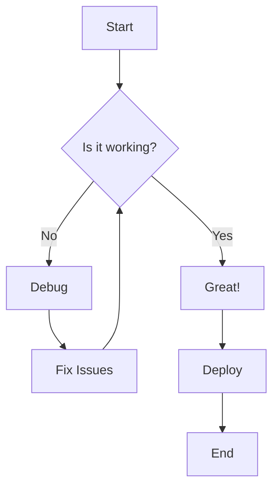
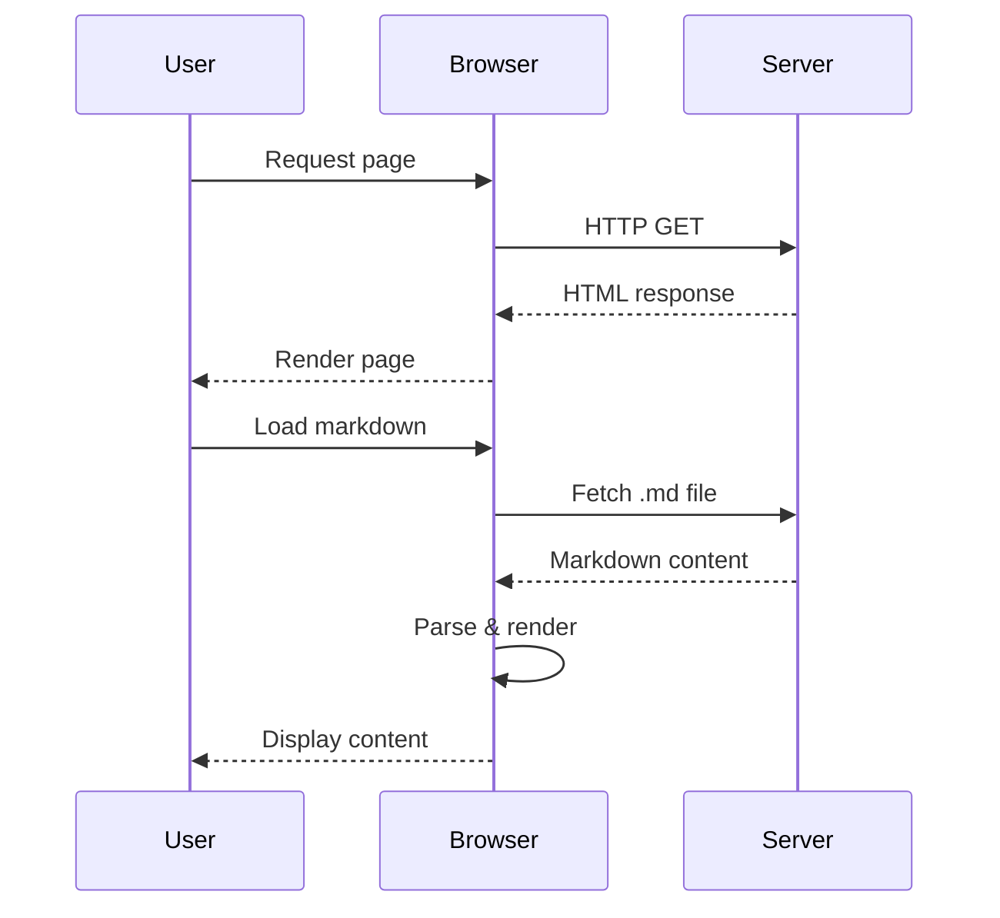

# Test Content Documentation

## Introduction

This is a comprehensive test document to showcase various markdown elements and their rendering capabilities.

## Code Examples

### JavaScript Function

```javascript
function renderMarkdown(fileName) {
    fetch(fileName)
        .then(response => response.text())
        .then(content => {
            const renderedHtml = marked.parse(content);
            document.getElementById('content').innerHTML = renderedHtml;
        })
        .catch(error => console.error('Error loading file:', error));
}
```

### Python Data Processing

```python
import pandas as pd
import numpy as np

def process_data(file_path):
    """Process CSV data and return statistics"""
    df = pd.read_csv(file_path)
  
    # Calculate basic statistics
    stats = {
        'mean': df.mean(),
        'median': df.median(),
        'std': df.std()
    }
  
    return stats
```

### CSS Styling

```css
.markdown-container {
    max-width: 800px;
    margin: 0 auto;
    padding: 20px;
    font-family: 'Segoe UI', Tahoma, Geneva, Verdana, sans-serif;
}

.code-block {
    background: #f8f9fa;
    border-radius: 8px;
    padding: 16px;
    margin: 16px 0;
    position: relative;
}
```

## Mermaid Diagrams

### Flowchart Example



### Sequence Diagram



## Text Formatting

This document demonstrates  **bold text** ,  *italic text* , and  ***bold italic text*** . We can also use `inline code` and ~~strikethrough~~ text.

> This is a blockquote that can contain multiple lines of text.
> It's useful for highlighting important information or quotes.

## Lists

### Unordered List

* First item
* Second item with **bold** text
* Third item with `code`
  * Nested item
  * Another nested item
* Fourth item

### Ordered List

1. First step
2. Second step with *emphasis*
3. Third step
   1. Sub-step A
   2. Sub-step B
4. Final step

## Tables

| Feature           | Status         | Priority |
| ----------------- | -------------- | -------- |
| Code highlighting | ✅ Complete    | High     |
| Copy button       | ✅ Complete    | High     |
| Mermaid diagrams  | ✅ Complete    | Medium   |
| Responsive design | ✅ Complete    | High     |
| Dark mode         | 🚧 In Progress | Medium   |

## Links and Images

Visit [GitHub](https://github.com/) for more repositories.

You can also use reference-style links like [this one](https://example.com/ "Reference link example").

## Mathematical Expressions

The quadratic formula is: ax² + bx + c = 0

For inline math: The area of a circle is πr².

## Task Lists

* [X] Create markdown parser
* [X] Add syntax highlighting
* [X] Implement copy functionality
* [ ] Add search feature
* [ ] Create table of contents
* [ ] Add export options

## Advanced Code Block with Multiple Languages

### HTML Structure

```html
<!DOCTYPE html>
<html lang="en">
<head>
    <meta charset="UTF-8">
    <meta name="viewport" content="width=device-width, initial-scale=1.0">
    <title>Markdown Renderer</title>
</head>
<body>
    <div id="content"></div>
    <script src="app.js"></script>
</body>
</html>
```

### SQL Query

```sql
SELECT 
    users.name,
    COUNT(orders.id) as order_count,
    SUM(orders.total) as total_spent
FROM users
LEFT JOIN orders ON users.id = orders.user_id
WHERE users.created_at >= '2024-01-01'
GROUP BY users.id, users.name
ORDER BY total_spent DESC
LIMIT 10;
```

## Conclusion

This test document covers most common markdown elements including:

* Headers and text formatting
* Code blocks with syntax highlighting
* Mermaid diagrams for visualization
* Lists, tables, and links
* Task lists and blockquotes

The rendering system should handle all these elements with proper styling and interactive features like copy buttons for code blocks.
