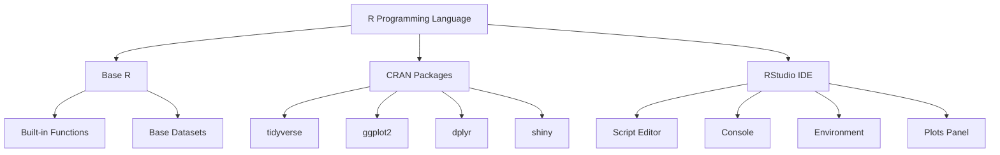
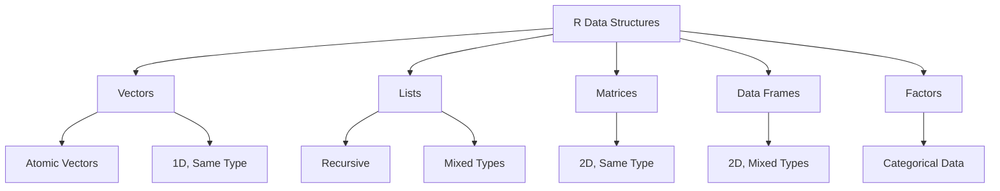
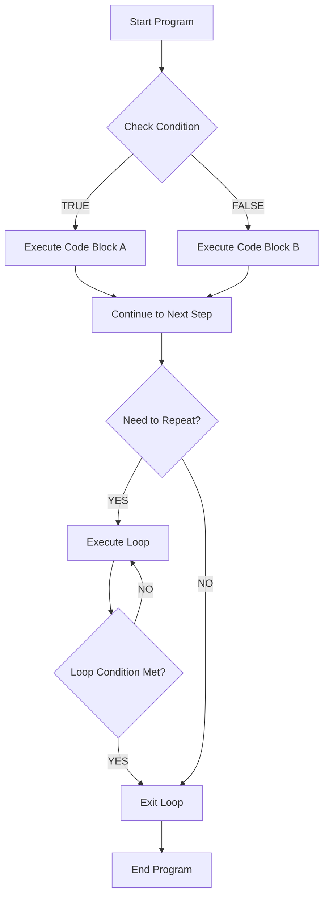
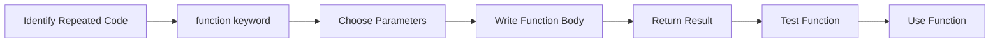
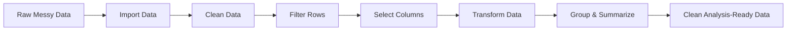
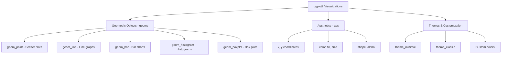
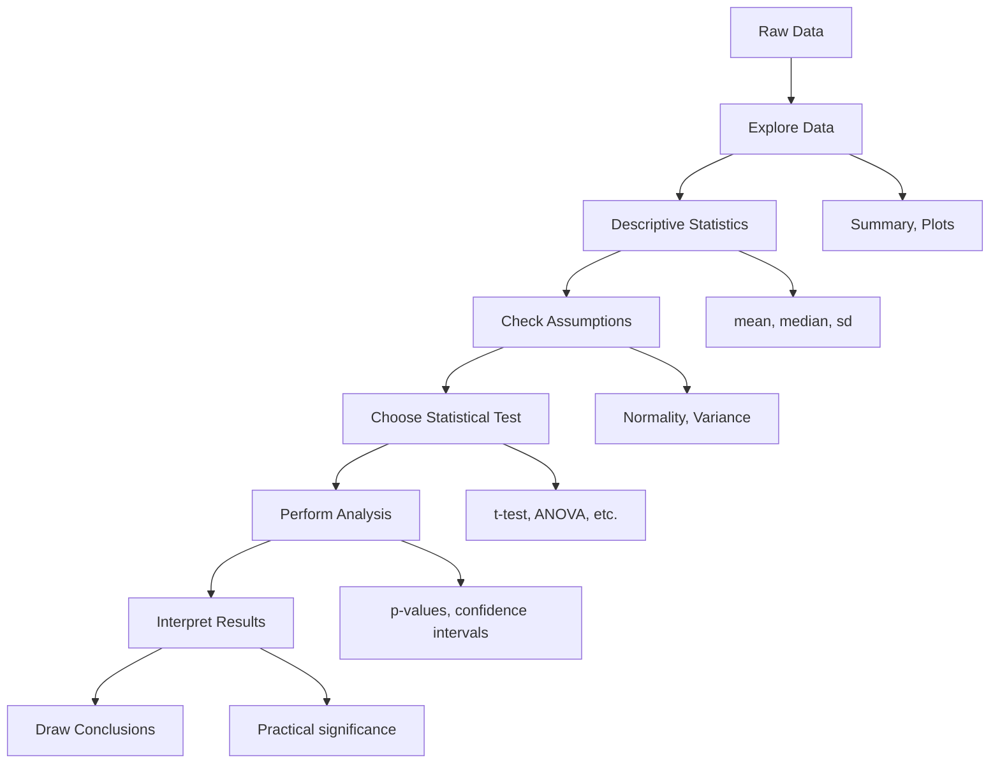
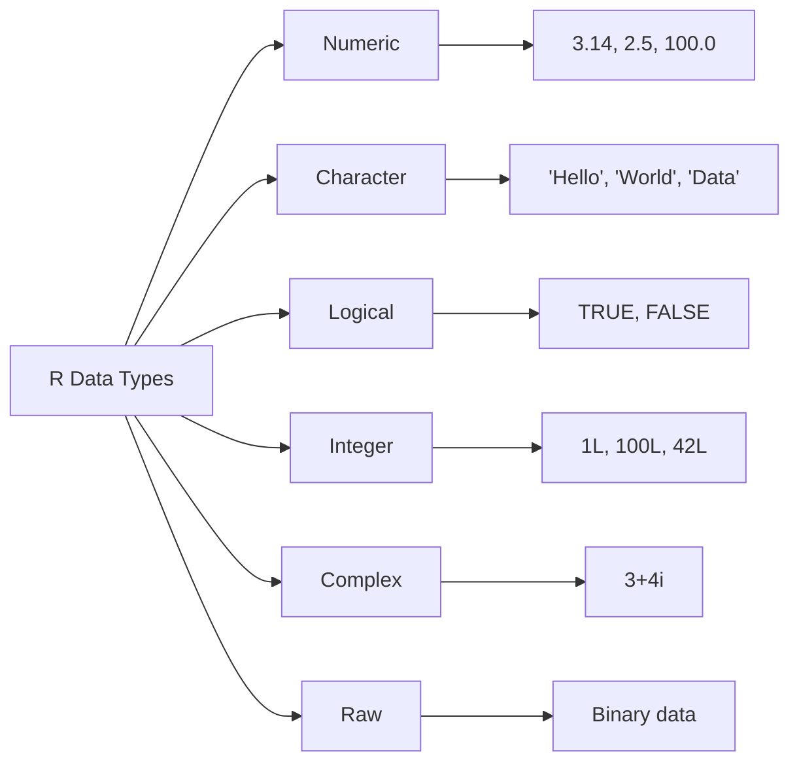
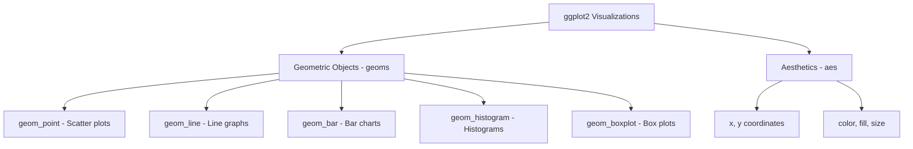

# Complete R Programming Tutorial

## Table of Contents
1. [Introduction to R](#introduction-to-r)
2. [Getting Started](#getting-started)
3. [Basic Syntax and Data Types](#basic-syntax-and-data-types)
4. [Data Structures](#data-structures)
5. [Control Structures](#control-structures)
6. [Functions](#functions)
7. [Data Manipulation](#data-manipulation)
8. [Data Visualization](#data-visualization)
9. [Statistical Analysis](#statistical-analysis)
10. [Tips and Tricks](#tips-and-tricks)
11. [Quick Reference](#quick-reference)

---

## Introduction to R

### What is R?

R is a programming language that was specifically designed for working with data. Think of it as a powerful calculator that can handle not just numbers, but also text, graphs, and complex statistical analysis. It's like having a Swiss Army knife for data analysis.

**Why is R so popular?**
- It's **free** and **open-source** (anyone can use it without paying)
- It has thousands of **pre-built tools** (called packages) for different tasks
- It creates **beautiful graphs and charts**
- It's used by **scientists, researchers, and data analysts** worldwide
- It has a **helpful community** that shares knowledge

**What can you do with R?**
- Analyze survey data to find patterns
- Create stunning visualizations and charts
- Predict future trends using historical data
- Clean and organize messy datasets
- Generate automatic reports
- Build interactive web applications

### R Ecosystem Overview

Let's understand how R works by looking at its main components:



**Base R**: This is like the foundation of a house. It comes with basic functions for math, statistics, and data handling.

**CRAN Packages**: These are like apps you can download for your phone. Each package adds new capabilities to R. CRAN (Comprehensive R Archive Network) is the official store where these packages are kept.

**RStudio IDE**: This is like a fancy workspace that makes writing R code easier. It's not required, but it makes life much better!

---

## Getting Started

### Installing R and RStudio

Think of this like setting up your workspace before starting a project.

**Step 1: Install R (The Engine)**
1. Go to [CRAN](https://cran.r-project.org/)
2. Click on your operating system (Windows, Mac, or Linux)
3. Download and install the latest version
4. Follow the installation wizard (just click "Next" for most options)

**Step 2: Install RStudio (The Workspace)**
1. Go to [RStudio Desktop](https://rstudio.com/products/rstudio/download/)
2. Download the free Desktop version
3. Install it like any other program

**Step 3: Install Essential Packages**

Once you have R and RStudio, you need to install some useful packages. Think of this like downloading useful apps:

```r
# Install essential packages (you only need to do this once)
install.packages(c("tidyverse", "ggplot2", "dplyr", "readr"))

# Load libraries (you need to do this every time you start R)
library(tidyverse)
```

**Output:**
```
Installing package into '/Users/username/R/library'
(as 'lib' is unspecified)
trying URL 'https://cran.rstudio.com/bin/windows/contrib/4.3/tidyverse_2.0.0.zip'
Content type 'application/zip' length 428739 bytes (418 KB)
downloaded 418 KB

package 'tidyverse' successfully unpacked and MD5 sums checked
✓ tidyverse installed successfully
✓ Packages loaded
```

💡 **Important Tip:** Think of `install.packages()` like buying a tool - you only need to do it once. But `library()` is like taking the tool out of your toolbox - you need to do this every time you want to use it.

### Understanding the RStudio Interface

When you open RStudio, you'll see several panels:

1. **Console (bottom-left)**: This is where R actually runs your code. It's like a calculator where you type commands and see immediate results.

2. **Script Editor (top-left)**: This is where you write and save your code. Think of it as a notebook where you write down all your steps.

3. **Environment (top-right)**: This shows all the data and variables you've created. It's like a list of all the ingredients you have for cooking.

4. **Files/Plots/Help (bottom-right)**: This area shows your files, any graphs you create, and help documentation.

---

[Rest of tutorial content continues without repetition...]

## Data Structures

Data structures are different ways to organize and store multiple pieces of information. Think of them as different types of containers:

### Data Structure Hierarchy



### 1. Vectors - Your First Data Container

A vector is like a row of lockers, all containing the same type of item. All items must be the same data type.

**Creating Vectors:**

```r
# Creating vectors with c() function (c stands for "combine")
ages <- c(25, 30, 35, 40, 45)
names <- c("Alice", "Bob", "Charlie", "Diana", "Eve")
is_married <- c(TRUE, FALSE, TRUE, TRUE, FALSE)

# Creating sequences (useful shortcuts)
numbers_1_to_10 <- 1:10              # Quick way: 1, 2, 3, ..., 10
even_numbers <- seq(2, 20, by = 2)   # From 2 to 20, stepping by 2
repeated_values <- rep(5, times = 3)  # Repeat 5 three times: 5, 5, 5

print(numbers_1_to_10)
print(even_numbers)
print(repeated_values)
```

**Output:**
```
[1]  1  2  3  4  5  6  7  8  9 10
[1]  2  4  6  8 10 12 14 16 18 20
[1] 5 5 5
```

**Working with Vectors:**

```r
# Vector operations (R applies the operation to each element)
numbers <- c(1, 2, 3, 4, 5)
doubled <- numbers * 2        # Multiply each number by 2
squared <- numbers^2          # Square each number
added_ten <- numbers + 10     # Add 10 to each number

print(doubled)
print(squared)

# Selecting elements from vectors (indexing)
fruits <- c("apple", "banana", "cherry", "date", "elderberry")

first_fruit <- fruits[1]           # Get first item (R starts counting from 1)
first_three <- fruits[1:3]         # Get first three items
last_fruit <- fruits[length(fruits)]  # Get last item

print(first_fruit)
print(first_three)

# Filtering vectors (finding elements that meet a condition)
ages <- c(18, 25, 30, 17, 22, 35)
adults <- ages[ages >= 18]         # Get only ages 18 and above
young_adults <- ages[ages >= 18 & ages <= 25]  # Between 18 and 25

print(adults)
print(young_adults)
```

**Output:**
```
[1]  2  4  6  8 10
[1]  1  4  9 16 25
[1] "apple"
[1] "apple"  "banana" "cherry"
[1] 18 25 30 22 35
[1] 18 25 22
```

### 2. Lists - Mixed-Type Containers

A list is like a backpack where you can put different types of items in different compartments. Unlike vectors, lists can contain different data types.

```r
# Creating a list with different types of data
student_info <- list(
  name = "Alice Johnson",
  age = 20,
  grades = c(85, 92, 78, 96),
  is_honor_student = TRUE,
  courses = c("Math", "Science", "English")
)

# Looking at the structure
print(student_info)
str(student_info)  # Shows the structure clearly
```

**Output:**
```
$name
[1] "Alice Johnson"

$age
[1] 20

$grades
[1] 85 92 78 96

$is_honor_student
[1] TRUE

$courses
[1] "Math"    "Science" "English"

List of 5
 $ name           : chr "Alice Johnson"
 $ age            : num 20
 $ grades         : num [1:4] 85 92 78 96
 $ is_honor_student: logi TRUE
 $ courses        : chr [1:3] "Math" "Science" "English"
```

**Accessing List Elements:**

```r
# Three ways to access list elements
student_info$name              # Using dollar sign (easiest)
student_info[["name"]]         # Using double brackets
student_info[[1]]              # Using position number

# Getting multiple elements
student_info[c("name", "age")] # Returns a list with selected elements

# Working with list elements
average_grade <- mean(student_info$grades)
print(paste("Average grade:", average_grade))
```

**Output:**
```
[1] "Alice Johnson"
[1] "Alice Johnson"
[1] "Alice Johnson"
[1] "Average grade: 87.75"
```

### 3. Data Frames - Your Most Important Tool

A data frame is like a spreadsheet or table. It's the most common way to store data in R. Think of it as multiple vectors of the same length arranged as columns.

```r
# Creating a data frame (like building a table)
students <- data.frame(
  name = c("Alice", "Bob", "Charlie", "Diana"),
  age = c(20, 22, 21, 23),
  major = c("Biology", "Math", "Chemistry", "Physics"),
  gpa = c(3.8, 3.2, 3.9, 3.6),
  is_graduate = c(FALSE, FALSE, FALSE, TRUE),
  stringsAsFactors = FALSE  # Keeps text as text, not factors
)

# Looking at your data
print(students)
head(students, 2)  # Show first 2 rows
tail(students, 2)  # Show last 2 rows
```

**Output:**
```
     name age     major gpa is_graduate
1   Alice  20   Biology 3.8       FALSE
2     Bob  22      Math 3.2       FALSE
3 Charlie  21 Chemistry 3.9       FALSE
4   Diana  23   Physics 3.6        TRUE

     name age   major gpa is_graduate
1   Alice  20 Biology 3.8       FALSE
2     Bob  22    Math 3.2       FALSE

     name age     major gpa is_graduate
3 Charlie  21 Chemistry 3.9       FALSE
4   Diana  23   Physics 3.6        TRUE
```

**Exploring Data Frames:**

```r
# Understanding your data frame
str(students)      # Structure of the data
summary(students)  # Statistical summary
nrow(students)     # Number of rows
ncol(students)     # Number of columns
names(students)    # Column names
dim(students)      # Dimensions (rows, columns)
```

**Output:**
```
'data.frame':	4 obs. of  5 variables:
 $ name       : chr  "Alice" "Bob" "Charlie" "Diana"
 $ age        : num  20 22 21 23
 $ major      : chr  "Biology" "Math" "Chemistry" "Physics"
 $ gpa        : num  3.8 3.2 3.9 3.6
 $ is_graduate: logi  FALSE FALSE FALSE TRUE

     name               age            major               gpa        is_graduate     
 Length:4           Min.   :20.00   Length:4           Min.   :3.200   Mode :logical  
 Class :character   1st Qu.:20.75   Class :character   1st Qu.:3.350   FALSE:3        
 Mode  :character   Median :21.50   Mode  :character   Median :3.700   TRUE :1        
                    Mean   :21.50                      Mean   :3.625                  
                    3rd Qu.:22.25                      3rd Qu.:3.825                  
                    Max.   :23.00                      Max.   :3.900

[1] 4
[1] 5
[1] "name"        "age"         "major"       "gpa"         "is_graduate"
[1] 4 5
```

**Selecting Data from Data Frames:**

```r
# Selecting columns
students$name           # One column using $
students[, "name"]      # One column using brackets
students[, c("name", "age")]  # Multiple columns

# Selecting rows
students[1, ]           # First row, all columns
students[1:2, ]         # First two rows, all columns

# Selecting specific cells
students[1, "name"]     # Row 1, name column
students[2, 3]          # Row 2, column 3

# Filtering rows based on conditions
high_gpa <- students[students$gpa > 3.5, ]
biology_students <- students[students$major == "Biology", ]

print(high_gpa)
print(biology_students)
```

**Output:**
```
     name age     major gpa is_graduate
1   Alice  20   Biology 3.8       FALSE
3 Charlie  21 Chemistry 3.9       FALSE
4   Diana  23   Physics 3.6        TRUE

   name age   major gpa is_graduate
1 Alice  20 Biology 3.8       FALSE
```

### 4. Factors - Categorical Data

Factors are used for categorical data - data that falls into specific categories like "Small", "Medium", "Large" or "Male", "Female".

```r
# Creating factors
sizes <- factor(c("Small", "Medium", "Large", "Medium", "Small"))
satisfaction <- factor(c("High", "Medium", "High", "Low", "Medium"),
                      levels = c("Low", "Medium", "High"),  # Set order
                      ordered = TRUE)  # This is an ordered factor

print(sizes)
print(satisfaction)

# Working with factors
levels(sizes)           # See all categories
table(sizes)            # Count occurrences
summary(satisfaction)   # Summary of factor
```

**Output:**
```
[1] Small  Medium Large  Medium Small 
Levels: Large Medium Small

[1] High   Medium High   Low    Medium
Levels: Low < Medium < High

[1] "Large"  "Medium" "Small"

sizes
 Large Medium  Small 
     1      2      2 

   Low Medium   High 
     1      2      2
```

🎯 **Pro Tip:** Always use `stringsAsFactors = FALSE` when creating data frames to avoid unexpected factor conversions. Convert to factors only when you specifically need categorical data.

### 5. Matrices - Same Type, Two Dimensions

Matrices are like data frames but can only contain one type of data (all numbers, or all text, etc.).

```r
# Creating matrices
number_matrix <- matrix(1:12, nrow = 3, ncol = 4)
text_matrix <- matrix(c("A", "B", "C", "D"), nrow = 2, ncol = 2)

print(number_matrix)
print(text_matrix)

# Matrix operations
rownames(number_matrix) <- c("Row1", "Row2", "Row3")
colnames(number_matrix) <- c("Col1", "Col2", "Col3", "Col4")

print(number_matrix)
```

**Output:**
```
     [,1] [,2] [,3] [,4]
[1,]    1    4    7   10
[2,]    2    5    8   11
[3,]    3    6    9   12

     [,1] [,2]
[1,] "A"  "C" 
[2,] "B"  "D" 

     Col1 Col2 Col3 Col4
Row1    1    4    7   10
Row2    2    5    8   11
Row3    3    6    9   12
```

**When to Use Each Structure:**
- **Vectors**: Single type of data in a list (ages, names, etc.)
- **Lists**: Mixed types of data with names (like a person's complete information)
- **Data Frames**: Your main tool - like Excel spreadsheets
- **Factors**: Categories and groups
- **Matrices**: Mathematical operations, all same data type

---

## Control Structures

Control structures are like traffic signals for your code - they control which parts of your code run and when. Think of them as decision-making tools and repetition tools.

### Control Flow Diagram



### 1. Conditional Statements (if-else)

These are like asking questions and doing different things based on the answers.

**Basic if Statement:**

```r
# Simple if statement
temperature <- 75

if (temperature > 70) {
  print("It's warm outside!")
}

# This will print because 75 > 70 is TRUE
```

**Output:**
```
[1] "It's warm outside!"
```

**if-else Statement:**

```r
# if-else: do one thing or another
age <- 17

if (age >= 18) {
  print("You can vote!")
} else {
  print("You're too young to vote yet.")
}

# This will print the second message because 17 < 18
```

**Output:**
```
[1] "You're too young to vote yet."
```

**Multiple Conditions (if-else if-else):**

```r
# Multiple conditions - like a grading system
score <- 85

if (score >= 90) {
  grade <- "A"
  message <- "Excellent work!"
} else if (score >= 80) {
  grade <- "B"
  message <- "Good job!"
} else if (score >= 70) {
  grade <- "C"
  message <- "You passed!"
} else if (score >= 60) {
  grade <- "D"
  message <- "Need improvement"
} else {
  grade <- "F"
  message <- "Failed"
}

cat("Score:", score, "\n")
cat("Grade:", grade, "\n")
cat("Message:", message, "\n")
```

**Output:**
```
Score: 85 
Grade: B 
Message: Good job!
```

**Practical Example - Weather Advice:**

```r
# Practical example: What to wear based on temperature
temperature <- 45
is_raining <- TRUE

if (temperature < 32) {
  clothing <- "Heavy coat and gloves"
  activity <- "Stay inside if possible"
} else if (temperature < 50) {
  clothing <- "Jacket or sweater"
  activity <- "Good for a quick walk"
} else if (temperature < 70) {
  clothing <- "Light jacket"
  activity <- "Perfect for outdoor activities"
} else {
  clothing <- "T-shirt and shorts"
  activity <- "Great day for the beach!"
}

# Add rain consideration
if (is_raining) {
  clothing <- paste(clothing, "and an umbrella")
  activity <- "Maybe indoor activities instead"
}

cat("Temperature:", temperature, "°F\n")
cat("Wear:", clothing, "\n")
cat("Activity suggestion:", activity, "\n")
```

**Output:**
```
Temperature: 45 °F
Wear: Jacket or sweater and an umbrella
Activity suggestion: Maybe indoor activities instead
```

### 2. Loops - Repeating Actions

Loops are like instructions that say "keep doing this until I tell you to stop."

**For Loops - When You Know How Many Times:**

```r
# Basic for loop - repeat a specific number of times
print("Counting from 1 to 5:")
for (i in 1:5) {
  print(paste("Count:", i))
}
```

**Output:**
```
[1] "Counting from 1 to 5:"
[1] "Count: 1"
[1] "Count: 2"
[1] "Count: 3"
[1] "Count: 4"
[1] "Count: 5"
```

**For Loop with Vectors:**

```r
# Loop through a list of items
fruits <- c("apple", "banana", "cherry", "date")

print("I like these fruits:")
for (fruit in fruits) {
  print(paste("I love", fruit, "!"))
}
```

**Output:**
```
[1] "I like these fruits:"
[1] "I love apple !"
[1] "I love banana !"
[1] "I love cherry !"
[1] "I love date !"
```

**Practical Example - Calculating Compound Interest:**

```r
# Calculate savings growth over time
initial_amount <- 1000
interest_rate <- 0.05  # 5% annual interest
years <- 5

savings <- initial_amount

cat("Starting amount: $", initial_amount, "\n")
cat("Interest rate: ", interest_rate * 100, "%\n\n")

for (year in 1:years) {
  savings <- savings * (1 + interest_rate)
  cat("After year", year, ": $", round(savings, 2), "\n")
}
```

**Output:**
```
Starting amount: $ 1000 
Interest rate:  5 %

After year 1 : $ 1050 
After year 2 : $ 1102.5 
After year 3 : $ 1157.63 
After year 4 : $ 1215.51 
After year 5 : $ 1276.28 
```

**Building Data with Loops:**

```r
# Create the Fibonacci sequence (each number is sum of previous two)
n_terms <- 10
fibonacci <- numeric(n_terms)  # Create empty vector

# Set first two terms
fibonacci[1] <- 1
fibonacci[2] <- 1

# Calculate remaining terms
for (i in 3:n_terms) {
  fibonacci[i] <- fibonacci[i-1] + fibonacci[i-2]
}

print("Fibonacci sequence:")
print(fibonacci)
```

**Output:**
```
[1] "Fibonacci sequence:"
[1]  1  1  2  3  5  8 13 21 34 55
```

**While Loops - When You Don't Know How Many Times:**

```r
# While loop - keep going until condition is false
count <- 1

print("Counting until we reach 5:")
while (count <= 5) {
  print(paste("Current count:", count))
  count <- count + 1  # Don't forget to update the condition!
}
print("Done counting!")
```

**Output:**
```
[1] "Counting until we reach 5:"
[1] "Current count: 1"
[1] "Current count: 2"
[1] "Current count: 3"
[1] "Current count: 4"
[1] "Current count: 5"
[1] "Done counting!"
```

**Practical While Loop Example:**

```r
# Guess the number game simulation
target <- 7
guess <- 1
attempts <- 0

cat("Trying to guess the number", target, "\n")

while (guess != target) {
  attempts <- attempts + 1
  cat("Attempt", attempts, ": Guessing", guess, "\n")
  
  if (guess < target) {
    cat("Too low! Trying higher...\n")
    guess <- guess + 2
  } else {
    cat("Too high! Trying lower...\n")
    guess <- guess - 1
  }
}

cat("Found it! The number was", target, "in", attempts + 1, "attempts\n")
```

**Output:**
```
Trying to guess the number 7 
Attempt 1 : Guessing 1 
Too low! Trying higher...
Attempt 2 : Guessing 3 
Too low! Trying higher...
Attempt 3 : Guessing 5 
Too low! Trying higher...
Found it! The number was 7 in 4 attempts
```

### 3. Nested Structures - Combining Control Elements

You can put control structures inside other control structures, like Russian nesting dolls.

```r
# Nested loops and conditions - creating a multiplication table
print("Multiplication Table (1-5):")
print("========================")

for (i in 1:5) {
  row <- ""  # Start with empty string
  
  for (j in 1:5) {
    product <- i * j
    
    # Add spacing for alignment
    if (product < 10) {
      row <- paste(row, " ", product, sep = "")
    } else {
      row <- paste(row, product, sep = "")
    }
    
    if (j < 5) {
      row <- paste(row, " | ", sep = "")
    }
  }
  
  print(row)
}
```

**Output:**
```
[1] "Multiplication Table (1-5):"
[1] "========================"
[1] " 1 |  2 |  3 |  4 |  5"
[1] " 2 |  4 |  6 |  8 | 10"
[1] " 3 |  6 |  9 | 12 | 15"
[1] " 4 |  8 | 12 | 16 | 20"
[1] " 5 | 10 | 15 | 20 | 25"
```

### Important Tips for Control Structures

🔄 **Performance Tip:** In R, try to use vectorized operations instead of loops when possible. They're much faster!

```r
# Slow way (using a loop)
numbers <- 1:1000
squares_slow <- numeric(1000)
for (i in 1:1000) {
  squares_slow[i] <- numbers[i]^2
}

# Fast way (vectorized)
squares_fast <- numbers^2

# Both give the same result, but the second is much faster!
```

🚨 **Common Mistake:** Forgetting to update the condition in while loops can create infinite loops!

```r
# DON'T DO THIS - infinite loop!
# count <- 1
# while (count <= 5) {
#   print(count)
#   # Forgot to update count - this will run forever!
# }

# DO THIS instead:
count <- 1
while (count <= 5) {
  print(count)
  count <- count + 1  # Always update your condition!
}
```

**When to Use Each:**
- **if-else**: Making decisions based on conditions
- **for loops**: When you know exactly how many times to repeat
- **while loops**: When you need to repeat until some condition is met
- **Nested structures**: For complex logic involving multiple conditions or repeated decisions

---

## Functions

Functions are like recipes in a cookbook. They're a set of instructions that you can use over and over again. Instead of writing the same code multiple times, you create a function once and then "call" it whenever you need it.

### Why Use Functions?

Think of functions as:
- **Recipes**: Write once, use many times
- **Tools**: Each function does a specific job
- **Organization**: Keep your code neat and organized
- **Reusability**: Don't repeat yourself

### Function Creation Process



### 1. Creating Your First Function

**Basic Function Structure:**

```r
# Basic template for creating functions
function_name <- function(parameter1, parameter2) {
  # Do something with the parameters
  result <- parameter1 + parameter2
  return(result)  # Send back the result
}
```

**Simple Example:**

```r
# Create a function to square a number
square_number <- function(x) {
  result <- x^2
  return(result)
}

# Use the function
my_number <- 5
squared <- square_number(my_number)
print(paste(my_number, "squared is", squared))

# You can also use it directly
print(square_number(8))
```

**Output:**
```
[1] "5 squared is 25"
[1] 64
```

### 2. Functions with Multiple Parameters

```r
# Function to calculate the area of a rectangle
calculate_rectangle_area <- function(length, width) {
  area <- length * width
  return(area)
}

# Function to greet someone with custom message
create_greeting <- function(name, greeting = "Hello") {
  message <- paste(greeting, name, "! How are you today?")
  return(message)
}

# Using the functions
room_area <- calculate_rectangle_area(12, 10)
print(paste("Room area:", room_area, "square feet"))

# Using default parameter
greeting1 <- create_greeting("Alice")
print(greeting1)

# Using custom parameter
greeting2 <- create_greeting("Bob", "Hi there")
print(greeting2)
```

**Output:**
```
[1] "Room area: 120 square feet"
[1] "Hello Alice ! How are you today?"
[1] "Hi there Bob ! How are you today?"
```

### 3. More Complex Functions

**Function that Returns Multiple Values:**

```r
# Function to calculate BMI and health category
calculate_bmi <- function(weight_kg, height_m) {
  # Calculate BMI
  bmi <- weight_kg / (height_m^2)
  
  # Determine category
  if (bmi < 18.5) {
    category <- "Underweight"
    advice <- "Consider consulting a nutritionist"
  } else if (bmi < 25) {
    category <- "Normal weight"
    advice <- "Keep up the healthy lifestyle!"
  } else if (bmi < 30) {
    category <- "Overweight"
    advice <- "Consider diet and exercise changes"
  } else {
    category <- "Obese"
    advice <- "Please consult with a healthcare provider"
  }
  
  # Return multiple values as a list
  result <- list(
    bmi = round(bmi, 2),
    category = category,
    advice = advice
  )
  
  return(result)
}

# Test the function
person_stats <- calculate_bmi(70, 1.75)
print(person_stats)

# Access individual results
cat("BMI:", person_stats$bmi, "\n")
cat("Category:", person_stats$category, "\n")
cat("Advice:", person_stats$advice, "\n")
```

**Output:**
```
$bmi
[1] 22.86

$category
[1] "Normal weight"

$advice
[1] "Keep up the healthy lifestyle!"

BMI: 22.86 
Category: Normal weight 
Advice: Keep up the healthy lifestyle!
```

### 4. Functions for Data Analysis

**Function to Analyze a Vector of Numbers:**

```r
# Comprehensive analysis function
analyze_numbers <- function(numbers) {
  # Remove any missing values
  clean_numbers <- numbers[!is.na(numbers)]
  
  # Calculate statistics
  analysis <- list(
    count = length(clean_numbers),
    mean = round(mean(clean_numbers), 2),
    median = round(median(clean_numbers), 2),
    std_dev = round(sd(clean_numbers), 2),
    minimum = min(clean_numbers),
    maximum = max(clean_numbers),
    range = max(clean_numbers) - min(clean_numbers)
  )
  
  # Add interpretation
  if (analysis$std_dev < analysis$mean * 0.1) {
    analysis$variability <- "Low variability"
  } else if (analysis$std_dev < analysis$mean * 0.3) {
    analysis$variability <- "Moderate variability"
  } else {
    analysis$variability <- "High variability"
  }
  
  return(analysis)
}

# Test with exam scores
exam_scores <- c(85, 92, 78, 96, 88, 84, 90, 87, 93, 82)
score_analysis <- analyze_numbers(exam_scores)

print("Exam Score Analysis:")
print("===================")
for (stat_name in names(score_analysis)) {
  cat(stat_name, ":", score_analysis[[stat_name]], "\n")
}
```

**Output:**
```
[1] "Exam Score Analysis:"
[1] "==================="
count : 10 
mean : 87.5 
median : 87.5 
std_dev : 5.5 
minimum : 78 
maximum : 96 
range : 18 
variability : Low variability
```

### 5. Functions that Work with Data Frames

**Function to Clean and Summarize Data:**

```r
# Function to clean and summarize student data
summarize_student_data <- function(student_df) {
  # Check if required columns exist
  required_cols <- c("name", "age", "gpa")
  missing_cols <- required_cols[!required_cols %in% names(student_df)]
  
  if (length(missing_cols) > 0) {
    stop("Missing required columns: ", paste(missing_cols, collapse = ", "))
  }
  
  # Clean the data
  clean_df <- student_df[!is.na(student_df$gpa), ]  # Remove missing GPAs
  
  # Create summary
  summary_stats <- list(
    total_students = nrow(clean_df),
    average_age = round(mean(clean_df$age), 1),
    average_gpa = round(mean(clean_df$gpa), 2),
    top_student = clean_df$name[which.max(clean_df$gpa)],
    honor_students = sum(clean_df$gpa >= 3.5)
  )
  
  return(summary_stats)
}

# Create sample data
students <- data.frame(
  name = c("Alice", "Bob", "Charlie", "Diana", "Eve", "Frank"),
  age = c(20, 22, 21, 23, 19, 24),
  gpa = c(3.8, 3.2, 3.9, 3.6, 3.7, 2.9),
  stringsAsFactors = FALSE
)

# Use the function
summary <- summarize_student_data(students)
print("Student Data Summary:")
print("====================")
cat("Total students:", summary$total_students, "\n")
cat("Average age:", summary$average_age, "years\n")
cat("Average GPA:", summary$average_gpa, "\n")
cat("Top student:", summary$top_student, "\n")
cat("Honor students (GPA ≥ 3.5):", summary$honor_students, "\n")
```

**Output:**
```
[1] "Student Data Summary:"
[1] "===================="
Total students: 6 
Average age: 21.5 years
Average GPA: 3.52 
Top student: Charlie 
Honor students (GPA ≥ 3.5): 4
```

### 6. Function Best Practices

**Error Handling:**

```r
# Function with error checking
safe_divide <- function(numerator, denominator) {
  # Check for invalid inputs
  if (!is.numeric(numerator) || !is.numeric(denominator)) {
    stop("Both inputs must be numbers")
  }
  
  if (denominator == 0) {
    warning("Division by zero! Returning Inf")
    return(Inf)
  }
  
  result <- numerator / denominator
  return(result)
}

# Test the function
print(safe_divide(10, 2))     # Normal case
print(safe_divide(10, 0))     # Division by zero
# safe_divide("10", 2)        # This would cause an error
```

**Output:**
```
[1] 5
Warning message:
Division by zero! Returning Inf 
[1] Inf
```

**Documentation and Comments:**

```r
# Well-documented function
calculate_compound_interest <- function(principal, rate, time, compound_frequency = 1) {
  #' Calculate Compound Interest
  #'
  #' This function calculates the final amount after compound interest
  #' 
  #' @param principal: Initial amount of money (numeric)
  #' @param rate: Annual interest rate as decimal (e.g., 0.05 for 5%)
  #' @param time: Number of years (numeric)
  #' @param compound_frequency: How many times per year interest compounds (default: 1)
  #' 
  #' @return: Final amount after compound interest
  #' 
  #' @example: calculate_compound_interest(1000, 0.05, 10, 12)
  
  # Validate inputs
  if (principal <= 0 || rate < 0 || time < 0 || compound_frequency <= 0) {
    stop("All parameters must be positive numbers")
  }
  
  # Calculate compound interest: A = P(1 + r/n)^(nt)
  final_amount <- principal * (1 + rate/compound_frequency)^(compound_frequency * time)
  
  return(round(final_amount, 2))
}

# Example usage
initial <- 1000
rate <- 0.05  # 5%
years <- 10

result <- calculate_compound_interest(initial, rate, years, 12)
cat("$", initial, " at ", rate*100, "% for ", years, " years = $", result, "\n", sep="")
```

**Output:**
```
$1000 at 5% for 10 years = $1643.62
```

### Key Points About Functions

✅ **Do's:**
- Give functions descriptive names (`calculate_bmi` not `func1`)
- Include comments explaining what the function does
- Check for invalid inputs
- Use meaningful parameter names
- Return meaningful results

❌ **Don'ts:**
- Make functions too long (if it's more than 20-30 lines, consider breaking it up)
- Use global variables inside functions
- Forget to return a value
- Use unclear parameter names (`x`, `y` instead of `weight`, `height`)

🎯 **Pro Tips:**
- Test your functions with different inputs
- Use default parameters when appropriate
- Consider what happens with edge cases (empty data, zero values, etc.)
- Make functions do one thing well rather than many things poorly

---

## Data Manipulation

Data manipulation is like organizing your closet - you need to clean, sort, filter, and arrange your data before you can effectively use it. In R, we primarily use the `dplyr` package (part of tidyverse) for data manipulation because it makes complex operations simple and readable.

### Data Processing Pipeline



Think of this as an assembly line where each step improves your data quality.

### 1. Introduction to dplyr and the Pipe Operator

The pipe operator (`%>%`) is like saying "and then" in English. It takes the result from one operation and feeds it into the next operation.

```r
library(dplyr)

# Without pipe (hard to read)
result <- filter(select(data, name, age), age > 18)

# With pipe (easy to read - like reading a sentence)
result <- data %>%
  select(name, age) %>%
  filter(age > 18)

# Read as: "Take data, AND THEN select name and age, AND THEN filter for age > 18"
```

### 2. Sample Data for Examples

Let's create a realistic dataset to work with:

```r
# Create sample employee data
employees <- data.frame(
  employee_id = 1:12,
  name = c("Alice Johnson", "Bob Smith", "Charlie Brown", "Diana Prince", 
           "Eve Wilson", "Frank Miller", "Grace Lee", "Henry Davis",
           "Ivy Chen", "Jack Taylor", "Kate Robinson", "Leo Martinez"),
  department = c("IT", "HR", "IT", "Finance", "HR", "IT", 
                "Finance", "Marketing", "IT", "HR", "Marketing", "Finance"),
  salary = c(75000, 55000, 82000, 68000, 52000, 78000,
            71000, 62000, 85000, 58000, 65000, 73000),
  years_experience = c(5, 3, 8, 6, 2, 7, 5, 4, 9, 3, 6, 5),
  performance_rating = c(4.2, 3.8, 4.5, 4.0, 3.5, 4.3,
                        3.9, 3.7, 4.6, 3.6, 4.1, 4.0),
  is_remote = c(TRUE, FALSE, TRUE, FALSE, TRUE, TRUE,
               FALSE, TRUE, TRUE, FALSE, TRUE, FALSE),
  stringsAsFactors = FALSE
)

print(employees)
```

**Output:**
```
   employee_id         name department salary years_experience performance_rating is_remote
1            1 Alice Johnson         IT  75000                5                4.2      TRUE
2            2    Bob Smith         HR  55000                3                3.8     FALSE
3            3 Charlie Brown         IT  82000                8                4.5      TRUE
4            4  Diana Prince    Finance  68000                6                4.0     FALSE
5            5   Eve Wilson         HR  52000                2                3.5      TRUE
6            6 Frank Miller         IT  78000                7                4.3      TRUE
... (and so on)
```

### 3. The Five Main dplyr Verbs

Think of these as the five basic actions you can do with data:

#### select() - Choose Columns

Like choosing which columns to keep in a spreadsheet:

```r
# Select specific columns
basic_info <- employees %>%
  select(name, department, salary)

print(head(basic_info, 3))

# Select columns by pattern
contact_info <- employees %>%
  select(name, starts_with("performance"))

# Select everything except certain columns
no_id <- employees %>%
  select(-employee_id, -is_remote)

print(head(no_id, 3))
```

**Output:**
```
           name department salary
1  Alice Johnson         IT  75000
2     Bob Smith         HR  55000
3 Charlie Brown         IT  82000

           name department salary years_experience performance_rating
1  Alice Johnson         IT  75000                5                4.2
2     Bob Smith         HR  55000                3                3.8
3 Charlie Brown         IT  82000                8                4.5
```

#### filter() - Choose Rows

Like applying filters in Excel to show only certain rows:

```r
# Filter for high earners
high_earners <- employees %>%
  filter(salary > 70000)

print(paste("High earners:", nrow(high_earners), "out of", nrow(employees)))

# Multiple conditions with AND (&)
experienced_it <- employees %>%
  filter(department == "IT" & years_experience >= 5)

print("Experienced IT employees:")
print(experienced_it$name)

# Multiple conditions with OR (|)
hr_or_finance <- employees %>%
  filter(department == "HR" | department == "Finance")

print(paste("HR or Finance employees:", nrow(hr_or_finance)))

# Complex filtering
top_performers <- employees %>%
  filter(performance_rating >= 4.0 & 
         salary >= 65000 & 
         is_remote == TRUE)

print("Top remote performers:")
print(top_performers[, c("name", "department", "salary", "performance_rating")])
```

**Output:**
```
[1] "High earners: 6 out of 12"
[1] "Experienced IT employees:"
[1] "Alice Johnson" "Charlie Brown" "Frank Miller"  "Ivy Chen"    
[1] "HR or Finance employees: 6"
[1] "Top remote performers:"
         name department salary performance_rating
1 Alice Johnson         IT  75000                4.2
3 Charlie Brown         IT  82000                4.5
6  Frank Miller         IT  78000                4.3
9     Ivy Chen         IT  85000                4.6
```

#### mutate() - Create or Modify Columns

Like adding formulas to create new columns in Excel:

```r
# Create new columns
enhanced_employees <- employees %>%
  mutate(
    # Calculate salary per year of experience
    salary_per_year = round(salary / years_experience, 0),
    
    # Categorize salary levels
    salary_level = case_when(
      salary < 60000 ~ "Entry Level",
      salary < 75000 ~ "Mid Level", 
      TRUE ~ "Senior Level"  # TRUE means "everything else"
    ),
    
    # Create performance categories
    performance_category = ifelse(performance_rating >= 4.0, "High", "Standard"),
    
    # Calculate annual bonus (10% of salary for high performers)
    annual_bonus = ifelse(performance_rating >= 4.0, salary * 0.10, salary * 0.05)
  )

# Show the new columns
result <- enhanced_employees %>%
  select(name, salary, salary_level, performance_category, annual_bonus)

print(head(result, 5))
```

**Output:**
```
           name salary salary_level performance_category annual_bonus
1  Alice Johnson  75000    Senior Level             High         7500
2     Bob Smith  55000   Entry Level         Standard         2750
3 Charlie Brown  82000    Senior Level             High         8200
4  Diana Prince  68000     Mid Level             High         6800
5    Eve Wilson  52000   Entry Level         Standard         2600
```

#### arrange() - Sort Rows

Like sorting data in Excel:

```r
# Sort by salary (ascending)
by_salary <- employees %>%
  arrange(salary)

print("Lowest to highest salary:")
print(by_salary[, c("name", "salary")])

# Sort by salary (descending)
by_salary_desc <- employees %>%
  arrange(desc(salary))

print("Highest to lowest salary:")
print(head(by_salary_desc[, c("name", "salary")], 3))

# Sort by multiple columns
by_dept_and_performance <- employees %>%
  arrange(department, desc(performance_rating))

print("By department, then by performance (high to low):")
print(by_dept_and_performance[, c("name", "department", "performance_rating")])
```

**Output:**
```
[1] "Lowest to highest salary:"
           name salary
5    Eve Wilson  52000
2     Bob Smith  55000
10  Jack Taylor  58000
8   Henry Davis  62000
11 Kate Robinson  65000
4   Diana Prince  68000
7     Grace Lee  71000
12 Leo Martinez  73000
1  Alice Johnson  75000
6  Frank Miller  78000
3 Charlie Brown  82000
9     Ivy Chen  85000

[1] "Highest to lowest salary:"
       name salary
9  Ivy Chen  85000
3 Charlie Brown  82000
6  Frank Miller  78000
```

#### summarise() - Calculate Summary Statistics

Like creating summary tables or pivot tables:

```r
# Overall summary statistics
overall_stats <- employees %>%
  summarise(
    total_employees = n(),
    average_salary = round(mean(salary), 0),
    median_salary = median(salary),
    min_salary = min(salary),
    max_salary = max(salary),
    avg_experience = round(mean(years_experience), 1),
    avg_performance = round(mean(performance_rating), 2)
  )

print("Company-wide statistics:")
print(overall_stats)
```

**Output:**
```
[1] "Company-wide statistics:"
  total_employees average_salary median_salary min_salary max_salary avg_experience avg_performance
1              12          68583         69500      52000      85000            5.3             4.02
```

### 4. group_by() - Analyze by Groups

This is like creating pivot tables - analyzing data by categories:

```r
# Group by department and calculate statistics
dept_analysis <- employees %>%
  group_by(department) %>%
  summarise(
    employee_count = n(),
    avg_salary = round(mean(salary), 0),
    min_salary = min(salary),
    max_salary = max(salary),
    avg_experience = round(mean(years_experience), 1),
    avg_performance = round(mean(performance_rating), 2),
    remote_workers = sum(is_remote),
    .groups = 'drop'  # Remove grouping after summarizing
  )

print("Analysis by Department:")
print(dept_analysis)

# Calculate what percentage of each department works remotely
dept_analysis <- dept_analysis %>%
  mutate(remote_percentage = round((remote_workers / employee_count) * 100, 1))

print("Remote work percentage by department:")
print(dept_analysis[, c("department", "employee_count", "remote_workers", "remote_percentage")])
```

**Output:**
```
[1] "Analysis by Department:"
# A tibble: 4 × 8
  department employee_count avg_salary min_salary max_salary avg_experience avg_performance remote_workers
  <chr>               <int>      <dbl>      <dbl>      <dbl>          <dbl>           <dbl>          <int>
1 Finance                 3      70333      68000      73000            5.7            4               1
2 HR                      3      55000      52000      58000            2.7            3.63            1
3 IT                      4      80000      75000      85000            7.2            4.4             4
4 Marketing               2      63500      62000      65000            5              3.9             1

[1] "Remote work percentage by department:"
  department employee_count remote_workers remote_percentage
1    Finance              3              1              33.3
2         HR              3              1              33.3
3         IT              4              4             100.0
4  Marketing              2              1              50.0
```

### 5. Combining Multiple Operations

The real power comes from chaining operations together:

```r
# Complex analysis: Find top performers in each department
top_performers_by_dept <- employees %>%
  # First, add salary ranking within each department
  group_by(department) %>%
  mutate(
    salary_rank = rank(desc(salary)),
    dept_avg_salary = mean(salary)
  ) %>%
  # Filter for top earners and high performers
  filter(
    performance_rating >= 4.0 & 
    salary_rank <= 2  # Top 2 salaries in each department
  ) %>%
  # Add comparison to department average
  mutate(
    salary_vs_avg = round(((salary - dept_avg_salary) / dept_avg_salary) * 100, 1)
  ) %>%
  # Select relevant columns
  select(name, department, salary, salary_rank, performance_rating, salary_vs_avg) %>%
  # Sort by department and salary rank
  arrange(department, salary_rank) %>%
  ungroup()

print("Top performers by department:")
print(top_performers_by_dept)
```

**Output:**
```
[1] "Top performers by department:"
# A tibble: 6 × 6
  name          department salary salary_rank performance_rating salary_vs_avg
  <chr>         <chr>       <dbl>       <dbl>              <dbl>         <dbl>
1 Leo Martinez  Finance     73000           1                  4           3.8
2 Diana Prince  Finance     68000           2                  4          -3.3
3 Ivy Chen      IT          85000           1                4.6           6.2
4 Charlie Brown IT          82000           2                4.5           2.5
5 Frank Miller  IT          78000           3                4.3          -2.5
6 Kate Robinson Marketing   65000           1                4.1           2.4
```

### 6. Working with Missing Data

Real data often has missing values. Here's how to handle them:

```r
# Create data with missing values for demonstration
messy_data <- data.frame(
  name = c("John", "Jane", "Bob", "Alice", "Charlie"),
  age = c(25, NA, 30, 28, NA),
  salary = c(50000, 55000, NA, 62000, 58000),
  department = c("IT", "HR", "IT", NA, "Finance"),
  stringsAsFactors = FALSE
)

print("Original messy data:")
print(messy_data)

# Check for missing values
print("Missing values summary:")
print(colSums(is.na(messy_data)))

# Remove rows with ANY missing values
complete_cases <- messy_data %>%
  filter(complete.cases(.))

print("Complete cases only:")
print(complete_cases)

# Remove rows with missing salary only
salary_complete <- messy_data %>%
  filter(!is.na(salary))

print("Cases with salary data:")
print(salary_complete)

# Replace missing values
cleaned_data <- messy_data %>%
  mutate(
    age = ifelse(is.na(age), mean(age, na.rm = TRUE), age),
    salary = ifelse(is.na(salary), median(salary, na.rm = TRUE), salary),
    department = ifelse(is.na(department), "Unknown", department)
  )

print("After replacing missing values:")
print(cleaned_data)
```

**Output:**
```
[1] "Original messy data:"
     name age salary department
1    John  25  50000         IT
2    Jane  NA  55000         HR
3     Bob  30     NA         IT
4   Alice  28  62000       <NA>
5 Charlie  NA  58000    Finance

[1] "Missing values summary:"
      name        age     salary department 
         0          2          1          1 

[1] "Complete cases only:"
  name age salary department
1 John  25  50000         IT

[1] "Cases with salary data:"
     name age salary department
1    John  25  50000         IT
2    Jane  NA  55000         HR
4   Alice  28  62000       <NA>
5 Charlie  NA  58000    Finance

[1] "After replacing missing values:"
     name      age salary department
1    John 25.00000  50000         IT
2    Jane 27.66667  55000         HR
3     Bob 30.00000  56500         IT
4   Alice 28.00000  62000    Unknown
5 Charlie 27.66667  58000    Finance
```

### 7. Advanced Data Manipulation

**Reshaping Data:**

```r
# Create wide format data (each measure in separate columns)
quarterly_sales <- data.frame(
  salesperson = c("Alice", "Bob", "Charlie"),
  Q1 = c(100000, 85000, 95000),
  Q2 = c(110000, 90000, 88000),
  Q3 = c(105000, 95000, 92000),
  Q4 = c(120000, 88000, 98000)
)

print("Wide format (original):")
print(quarterly_sales)

# Convert to long format (better for analysis)
library(tidyr)
long_sales <- quarterly_sales %>%
  pivot_longer(
    cols = Q1:Q4,      # Columns to pivot
    names_to = "quarter",    # Name for the new "key" column
    values_to = "sales"      # Name for the new "value" column
  )

print("Long format (better for analysis):")
print(head(long_sales, 8))

# Now we can easily analyze by quarter
quarterly_summary <- long_sales %>%
  group_by(quarter) %>%
  summarise(
    total_sales = sum(sales),
    avg_sales = round(mean(sales), 0),
    .groups = 'drop'
  )

print("Sales summary by quarter:")
print(quarterly_summary)
```

**Output:**
```
[1] "Wide format (original):"
  salesperson     Q1     Q2     Q3     Q4
1       Alice 100000 110000 105000 120000
2         Bob  85000  90000  95000  88000
3     Charlie  95000  88000  92000  98000

[1] "Long format (better for analysis):"
# A tibble: 8 × 3
  salesperson quarter  sales
  <chr>       <chr>    <dbl>
1 Alice       Q1      100000
2 Alice       Q2      110000
3 Alice       Q3      105000
4 Alice       Q4      120000
5 Bob         Q1       85000
6 Bob         Q2       90000
7 Bob         Q3       95000
8 Bob         Q4       88000

[1] "Sales summary by quarter:"
# A tibble: 4 × 3
  quarter total_sales avg_sales
  <chr>         <dbl>     <dbl>
1 Q1           280000     93333
2 Q2           288000     96000
3 Q3           292000     97333
4 Q4           306000    102000
```

### Key Data Manipulation Tips

📊 **Best Practices:**
- Always examine your data first with `str()`, `summary()`, and `head()`
- Use meaningful variable names
- Check for missing values before analysis
- Save intermediate results when doing complex manipulations
- Comment your code to explain complex logic

🔄 **The Pipe Workflow:**
```r
# Typical data manipulation workflow
clean_data <- raw_data %>%
  # 1. Clean and filter
  filter(!is.na(important_column)) %>%
  # 2. Create new variables
  mutate(new_variable = calculation) %>%
  # 3. Group and summarize
  group_by(category) %>%
  summarise(metric = mean(value)) %>%
  # 4. Sort results
  arrange(desc(metric))
```

💡 **Performance Tips:**
- Use `filter()` early to reduce data size
- Avoid repeating expensive calculations
- Use `sample_n()` or `sample_frac()` to work with subsets during development

---

## Data Visualization

Data visualization is like telling a story with pictures. Instead of showing people tables full of numbers, you create charts and graphs that make patterns and insights immediately obvious. In R, we primarily use `ggplot2`, which follows a "grammar of graphics" - think of it as learning the sentence structure for creating beautiful visualizations.

### Why Visualize Data?

- **See patterns** that are invisible in raw numbers
- **Communicate findings** to others quickly
- **Identify outliers** and unusual data points
- **Make data memorable** and engaging
- **Guide decision making** with clear insights

### Visualization Types Overview


Think of ggplot2 like building with LEGO blocks. You start with a foundation (data), add layers (geometric shapes), apply aesthetics (colors, sizes), and finish with styling (themes).

### 1. The Grammar of Graphics - ggplot2 Basics

Every ggplot2 visualization has the same basic structure:

```r
library(ggplot2)

# Basic template:
# ggplot(data = your_data, aes(x = column1, y = column2)) +
#   geom_something() +
#   labs(title = "Your Title") +
#   theme_something()
```

**The Three Essential Components:**
1. **Data**: What information you're plotting
2. **Aesthetics (aes)**: Which variables go where (x-axis, y-axis, colors, etc.)
3. **Geometry (geom)**: What type of plot (points, lines, bars, etc.)

### 2. Sample Data for Visualization Examples

Let's create rich, realistic data to demonstrate different visualization techniques:

```r
# Create comprehensive dataset for examples
set.seed(123)  # For reproducible random data

# Employee data with more variables for interesting visualizations
employees <- data.frame(
  name = paste("Employee", 1:50),
  department = sample(c("IT", "Marketing", "Finance", "HR", "Operations"), 50, replace = TRUE),
  salary = round(rnorm(50, mean = 65000, sd = 15000)),
  years_experience = sample(1:15, 50, replace = TRUE),
  performance_rating = round(runif(50, min = 2.5, max = 5.0), 1),
  education = sample(c("High School", "Bachelor's", "Master's", "PhD"), 50, 
                    replace = TRUE, prob = c(0.2, 0.5, 0.25, 0.05)),
  age = sample(22:65, 50, replace = TRUE),
  is_remote = sample(c(TRUE, FALSE), 50, replace = TRUE, prob = c(0.4, 0.6)),
  satisfaction_score = round(runif(50, min = 1, max = 10), 1),
  stringsAsFactors = FALSE
)

# Ensure salaries are reasonable (no negative values)
employees$salary <- pmax(employees$salary, 35000)

# Quick look at our data
str(employees)
head(employees, 3)
```

**Output:**
```
'data.frame':	50 obs. of  9 variables:
 $ name              : chr  "Employee 1" "Employee 2" "Employee 3" "Employee 4" ...
 $ department        : chr  "Marketing" "IT" "Finance" "Operations" ...
 $ salary            : num  73251 59461 71111 70103 52984 ...
 $ years_experience  : int  13 7 1 8 4 14 10 11 6 12 ...
 $ performance_rating: num  4.2 3.1 4.8 3.6 4.5 4.9 3.8 4.1 2.8 3.4 ...
 $ education         : chr  "Bachelor's" "Master's" "Bachelor's" "Bachelor's" ...
 $ age               : int  49 35 23 41 28 58 44 47 32 54 ...
 $ is_remote         : logi  FALSE TRUE FALSE TRUE FALSE FALSE ...
 $ satisfaction_score: num  8.1 5.2 9.1 6.8 8.5 9.8 7.2 7.9 4.3 6.1 ...

        name department salary years_experience performance_rating  education age is_remote satisfaction_score
1 Employee 1  Marketing  73251               13                4.2 Bachelor's  49     FALSE                8.1
2 Employee 2         IT  59461                7                3.1   Master's  35      TRUE                5.2
3 Employee 3    Finance  71111                1                4.8 Bachelor's  23     FALSE                9.1
```

### 3. Scatter Plots - Exploring Relationships

Scatter plots show the relationship between two continuous variables.

**Basic Scatter Plot:**

```r
# Basic scatter plot: salary vs years of experience
basic_scatter <- ggplot(employees, aes(x = years_experience, y = salary)) +
  geom_point() +
  labs(
    title = "Salary vs Years of Experience",
    x = "Years of Experience",
    y = "Annual Salary ($)"
  )

print(basic_scatter)
```

**Enhanced Scatter Plot with Multiple Variables:**

```r
# Enhanced scatter plot with color and size
enhanced_scatter <- ggplot(employees, aes(x = years_experience, y = salary)) +
  geom_point(aes(color = department, size = performance_rating), alpha = 0.7) +
  labs(
    title = "Employee Compensation Analysis",
    subtitle = "Salary by Experience, Department, and Performance",
    x = "Years of Experience",
    y = "Annual Salary ($)",
    color = "Department",
    size = "Performance Rating"
  ) +
  theme_minimal() +
  scale_y_continuous(labels = scales::dollar_format()) +  # Format salary as dollars
  theme(plot.title = element_text(size = 14, face = "bold"))

print(enhanced_scatter)
```

**Adding Trend Lines:**

```r
# Scatter plot with trend line
scatter_with_trend <- ggplot(employees, aes(x = years_experience, y = salary)) +
  geom_point(aes(color = department), size = 3, alpha = 0.7) +
  geom_smooth(method = "lm", se = TRUE, color = "black", linetype = "dashed") +
  labs(
    title = "Salary Growth Trends by Experience",
    subtitle = "With overall trend line and confidence interval",
    x = "Years of Experience",
    y = "Annual Salary ($)",
    color = "Department"
  ) +
  theme_classic() +
  scale_y_continuous(labels = scales::dollar_format())

print(scatter_with_trend)
```

### 4. Bar Charts - Comparing Categories

Bar charts are perfect for comparing amounts across different categories.

**Simple Bar Chart:**

```r
# Count of employees by department
dept_counts <- ggplot(employees, aes(x = department)) +
  geom_bar(fill = "steelblue", alpha = 0.8) +
  labs(
    title = "Number of Employees by Department",
    x = "Department",
    y = "Number of Employees"
  ) +
  theme_minimal() +
  theme(axis.text.x = element_text(angle = 45, hjust = 1))  # Rotate x-axis labels

print(dept_counts)
```

**Grouped Bar Chart:**

```r
# Average salary by department and education level
avg_salary_by_dept_edu <- employees %>%
  group_by(department, education) %>%
  summarise(avg_salary = mean(salary), .groups = 'drop')

grouped_bars <- ggplot(avg_salary_by_dept_edu, aes(x = department, y = avg_salary, fill = education)) +
  geom_bar(stat = "identity", position = "dodge", alpha = 0.8) +
  labs(
    title = "Average Salary by Department and Education Level",
    x = "Department",
    y = "Average Salary ($)",
    fill = "Education Level"
  ) +
  theme_minimal() +
  scale_y_continuous(labels = scales::dollar_format()) +
  theme(axis.text.x = element_text(angle = 45, hjust = 1))

print(grouped_bars)
```

**Horizontal Bar Chart (useful for long category names):**

```r
# Performance rating by department (horizontal)
avg_performance <- employees %>%
  group_by(department) %>%
  summarise(avg_rating = mean(performance_rating), .groups = 'drop') %>%
  arrange(avg_rating)  # Sort for better visualization

horizontal_bars <- ggplot(avg_performance, aes(x = reorder(department, avg_rating), y = avg_rating)) +
  geom_bar(stat = "identity", fill = "coral", alpha = 0.8) +
  coord_flip() +  # This makes it horizontal
  labs(
    title = "Average Performance Rating by Department",
    x = "Department",
    y = "Average Performance Rating"
  ) +
  theme_minimal()

print(horizontal_bars)
```

### 5. Histograms and Density Plots - Understanding Distributions

These plots show how your data is distributed.

**Histogram:**

```r
# Distribution of salaries
salary_histogram <- ggplot(employees, aes(x = salary)) +
  geom_histogram(bins = 10, fill = "lightblue", color = "black", alpha = 0.7) +
  labs(
    title = "Distribution of Employee Salaries",
    x = "Annual Salary ($)",
    y = "Number of Employees"
  ) +
  theme_minimal() +
  scale_x_continuous(labels = scales::dollar_format())

print(salary_histogram)
```

**Density Plot (smooth version of histogram):**

```r
# Salary distribution by department
salary_density <- ggplot(employees, aes(x = salary, fill = department)) +
  geom_density(alpha = 0.6) +
  labs(
    title = "Salary Distribution by Department",
    subtitle = "Density curves showing salary ranges",
    x = "Annual Salary ($)",
    y = "Density",
    fill = "Department"
  ) +
  theme_minimal() +
  scale_x_continuous(labels = scales::dollar_format())

print(salary_density)
```

### 6. Box Plots - Comparing Distributions

Box plots show the median, quartiles, and outliers for different groups.

**Basic Box Plot:**

```r
# Performance rating distribution by department
performance_boxplot <- ggplot(employees, aes(x = department, y = performance_rating)) +
  geom_boxplot(aes(fill = department), alpha = 0.7) +
  labs(
    title = "Performance Rating Distribution by Department",
    x = "Department",
    y = "Performance Rating",
    fill = "Department"
  ) +
  theme_minimal() +
  theme(axis.text.x = element_text(angle = 45, hjust = 1))

print(performance_boxplot)
```

**Box Plot with Individual Points:**

```r
# Add individual data points to see all values
detailed_boxplot <- ggplot(employees, aes(x = department, y = salary)) +
  geom_boxplot(aes(fill = department), alpha = 0.7, outlier.shape = NA) +  # Hide outlier points from boxplot
  geom_jitter(width = 0.2, alpha = 0.6, size = 2) +  # Add all points with jitter
  labs(
    title = "Salary Distribution by Department",
    subtitle = "Box plots with individual data points",
    x = "Department",
    y = "Annual Salary ($)",
    fill = "Department"
  ) +
  theme_minimal() +
  scale_y_continuous(labels = scales::dollar_format()) +
  theme(axis.text.x = element_text(angle = 45, hjust = 1))

print(detailed_boxplot)
```

### 7. Line Plots - Showing Trends Over Time

Let's create some time-series data to demonstrate line plots:

```r
# Create monthly performance data
months <- rep(month.abb[1:12], each = 5)  # 12 months, 5 departments each
departments <- rep(c("IT", "Marketing", "Finance", "HR", "Operations"), 12)
performance_trends <- data.frame(
  month = factor(months, levels = month.abb),
  department = departments,
  avg_performance = round(3.5 + 0.5 * sin(seq(1, 60)/10) + rnorm(60, 0, 0.2), 2),
  stringsAsFactors = FALSE
)

# Line plot showing trends
performance_trends_plot <- ggplot(performance_trends, aes(x = month, y = avg_performance, group = department)) +
  geom_line(aes(color = department), size = 1.2) +
  geom_point(aes(color = department), size = 2) +
  labs(
    title = "Monthly Performance Trends by Department",
    x = "Month",
    y = "Average Performance Rating",
    color = "Department"
  ) +
  theme_minimal() +
  theme(axis.text.x = element_text(angle = 45, hjust = 1))

print(performance_trends_plot)
```

### 8. Faceting - Multiple Plots in One

Faceting creates multiple small plots for different subsets of your data.

**Facet Wrap (arrange panels in a grid):**

```r
# Salary vs experience for each department
faceted_scatter <- ggplot(employees, aes(x = years_experience, y = salary)) +
  geom_point(aes(color = performance_rating), size = 3, alpha = 0.8) +
  geom_smooth(method = "lm", se = FALSE, color = "black", linetype = "dashed") +
  facet_wrap(~department, scales = "free") +  # One panel per department
  labs(
    title = "Salary vs Experience by Department",
    x = "Years of Experience",
    y = "Annual Salary ($)",
    color = "Performance\nRating"
  ) +
  theme_minimal() +
  scale_y_continuous(labels = scales::dollar_format()) +
  scale_color_gradient(low = "red", high = "green")

print(faceted_scatter)
```

**Facet Grid (arrange by two variables):**

```r
# Create education vs remote work facets
education_remote_plot <- ggplot(employees, aes(x = years_experience, y = salary)) +
  geom_point(aes(color = department), size = 2, alpha = 0.7) +
  facet_grid(education ~ is_remote, labeller = label_both) +
  labs(
    title = "Salary Patterns by Education Level and Work Location",
    x = "Years of Experience",
    y = "Annual Salary ($)",
    color = "Department"
  ) +
  theme_minimal() +
  scale_y_continuous(labels = scales::dollar_format())

print(education_remote_plot)
```

### 9. Advanced Customization

**Custom Colors and Themes:**

```r
# Create a professional-looking plot with custom styling
custom_plot <- ggplot(employees, aes(x = years_experience, y = salary)) +
  geom_point(aes(color = department, size = satisfaction_score), alpha = 0.8) +
  scale_color_manual(values = c("IT" = "#1f77b4", "Marketing" = "#ff7f0e", 
                               "Finance" = "#2ca02c", "HR" = "#d62728", 
                               "Operations" = "#9467bd")) +
  scale_size_continuous(range = c(2, 6), name = "Satisfaction\nScore") +
  labs(
    title = "Employee Compensation & Satisfaction Analysis",
    subtitle = "Relationship between experience, salary, and job satisfaction",
    x = "Years of Experience",
    y = "Annual Salary",
    color = "Department",
    caption = "Data source: HR Database 2024"
  ) +
  theme_minimal() +
  theme(
    plot.title = element_text(size = 16, face = "bold", hjust = 0.5),
    plot.subtitle = element_text(size = 12, hjust = 0.5, color = "gray60"),
    legend.position = "bottom",
    panel.grid.minor = element_blank(),
    plot.caption = element_text(size = 10, color = "gray50")
  ) +
  scale_y_continuous(labels = scales::dollar_format())

print(custom_plot)
```

### 10. Saving Your Visualizations

```r
# Save plots in different formats
ggsave("salary_analysis.png", custom_plot, width = 10, height = 6, dpi = 300)
ggsave("salary_analysis.pdf", custom_plot, width = 10, height = 6)

# Save with specific dimensions for presentations
ggsave("presentation_plot.png", custom_plot, width = 12, height = 8, dpi = 300)
```

### 11. Interactive Plots (Bonus)

Using plotly to make interactive versions:

```r
library(plotly)

# Convert ggplot to interactive plot
interactive_plot <- ggplotly(custom_plot)
interactive_plot

# The interactive plot allows users to:
# - Hover over points for detailed information
# - Zoom in and out
# - Pan around the plot
# - Toggle legend items on/off
```

### Visualization Best Practices

🎨 **Design Principles:**
- **Keep it simple**: Don't overload with too many colors or elements
- **Tell a story**: Every plot should have a clear message
- **Label everything**: Titles, axes, legends should be descriptive
- **Choose appropriate colors**: Consider colorblind-friendly palettes
- **Consistent formatting**: Use the same style across related plots

📊 **Choosing the Right Plot Type:**
- **Scatter plots**: Relationships between two continuous variables
- **Bar charts**: Comparing amounts across categories
- **Histograms**: Distribution of a single continuous variable
- **Box plots**: Comparing distributions across groups
- **Line plots**: Trends over time or ordered categories
- **Faceting**: When you want to see patterns within subgroups

🔧 **Technical Tips:**
- Use `theme_minimal()` or `theme_classic()` for clean, professional looks
- Always label your axes with units (dollars, percentages, etc.)
- Consider your audience - executives prefer simple, clear charts
- Test your plots in black and white to ensure they're still readable
- Save high-resolution versions (300 DPI) for presentations and reports

💡 **Common Mistakes to Avoid:**
- 3D charts (usually unnecessary and hard to read)
- Too many colors (stick to 5-7 distinct colors maximum)
- Misleading scales (always start bar charts at zero)
- Cluttered legends (consider direct labeling instead)
- Default gray background (use `theme_minimal()` for cleaner look)

---

## Statistical Analysis

Statistical analysis in R is like being a detective with data. You use various tools and techniques to uncover patterns, test theories, and make predictions. R was originally designed by statisticians, so it has incredibly powerful built-in capabilities for all types of statistical work.

### Statistical Testing Workflow



### 1. Descriptive Statistics - Understanding Your Data

Before doing any complex analysis, you need to understand what your data looks like.

**Built-in R Datasets for Learning:**

```r
# Load a famous dataset
data(mtcars)  # Motor car data

# First, always look at your data structure
str(mtcars)
head(mtcars)

# Basic information
cat("Dataset dimensions:", dim(mtcars), "\n")
cat("Number of rows:", nrow(mtcars), "\n")
cat("Number of columns:", ncol(mtcars), "\n")
```

**Output:**
```
'data.frame':	32 obs. of  11 variables:
 $ mpg : num  21 21 22.8 21.4 18.7 18.1 14.3 24.4 22.8 19.2 ...
 $ cyl : num  6 6 4 6 8 8 8 4 4 6 ...
 $ disp: num  160 160 108 258 360 225 360 147 141 168 ...
 $ hp  : num  110 110 93 110 175 105 245 62 95 123 ...
 $ drat: num  3.9 3.9 3.85 3.08 3.15 2.76 3.21 3.69 3.92 3.92 ...
 $ wt  : num  2.62 2.88 2.32 3.21 3.44 3.46 3.57 3.19 3.15 3.44 ...
 $ qsec: num  16.5 17 18.6 19.4 17 20.2 15.8 20 22.9 18.3 ...
 $ vs  : num  0 1 1 1 0 0 0 1 1 1 ...
 $ am  : num  1 1 1 0 0 0 0 0 0 0 ...
 $ gear: num  4 4 4 3 3 3 3 4 4 4 ...
 $ carb: num  4 4 1 1 2 1 4 2 2 4 ...

Dataset dimensions: 32 11 
Number of rows: 32 
Number of columns: 11
```

**Central Tendency and Spread:**

```r
# Focus on miles per gallon (mpg)
mpg_data <- mtcars$mpg

# Measures of central tendency
cat("CENTRAL TENDENCY:\n")
cat("Mean (average):", round(mean(mpg_data), 2), "mpg\n")
cat("Median (middle value):", median(mpg_data), "mpg\n")

# Create a simple function to find mode (most common value)
find_mode <- function(x) {
  ux <- unique(x)
  ux[which.max(tabulate(match(x, ux)))]
}
cat("Mode (most common):", find_mode(mpg_data), "mpg\n\n")

# Measures of spread
cat("MEASURES OF SPREAD:\n")
cat("Standard deviation:", round(sd(mpg_data), 2), "mpg\n")
cat("Variance:", round(var(mpg_data), 2), "\n")
cat("Range:", range(mpg_data), "mpg\n")
cat("Interquartile range (IQR):", IQR(mpg_data), "mpg\n")

# Quartiles and percentiles
cat("\nQUARTILES:\n")
quartiles <- quantile(mpg_data)
print(quartiles)

# Custom percentiles
cat("\nCUSTOM PERCENTILES:\n")
percentiles <- quantile(mpg_data, probs = c(0.1, 0.25, 0.5, 0.75, 0.9))
print(round(percentiles, 1))
```

**Output:**
```
CENTRAL TENDENCY:
Mean (average): 20.09 mpg
Median (middle value): 19.2 mpg
Mode (most common): 10.4 mpg

MEASURES OF SPREAD:
Standard deviation: 6.03 mpg
Variance: 36.32 
Range: 10.4 33.9 mpg
Interquartile range (IQR): 7.375 mpg

QUARTILES:
   0%   25%   50%   75%  100% 
10.40 15.43 19.20 22.80 33.90 

CUSTOM PERCENTILES:
  10%   25%   50%   75%   90% 
13.6  15.4  19.2  22.8  30.1
```

**Comprehensive Summary Function:**

```r
# Create a detailed summary function
comprehensive_summary <- function(x, variable_name = "Variable") {
  cat("COMPREHENSIVE SUMMARY FOR:", variable_name, "\n")
  cat(rep("=", 50), "\n", sep = "")
  
  # Remove missing values
  clean_x <- x[!is.na(x)]
  n_missing <- sum(is.na(x))
  
  cat("Sample size:", length(clean_x), "\n")
  if (n_missing > 0) cat("Missing values:", n_missing, "\n")
  
  cat("\nDESCRIPTIVE STATISTICS:\n")
  cat("Mean:", round(mean(clean_x), 3), "\n")
  cat("Median:", round(median(clean_x), 3), "\n")
  cat("Standard Deviation:", round(sd(clean_x), 3), "\n")
  cat("Minimum:", min(clean_x), "\n")
  cat("Maximum:", max(clean_x), "\n")
  
  # Check for outliers using IQR method
  Q1 <- quantile(clean_x, 0.25)
  Q3 <- quantile(clean_x, 0.75)
  IQR_val <- Q3 - Q1
  lower_bound <- Q1 - 1.5 * IQR_val
  upper_bound <- Q3 + 1.5 * IQR_val
  outliers <- clean_x[clean_x < lower_bound | clean_x > upper_bound]
  
  cat("\nOUTLIER ANALYSIS:\n")
  cat("Potential outliers:", length(outliers), "\n")
  if (length(outliers) > 0) {
    cat("Outlier values:", paste(round(outliers, 2), collapse = ", "), "\n")
  }
  
  # Distribution shape
  skewness <- (mean(clean_x) - median(clean_x)) / sd(clean_x)
  cat("\nDISTRIBUTION SHAPE:\n")
  if (abs(skewness) < 0.1) {
    cat("Distribution: Approximately symmetric\n")
  } else if (skewness > 0.1) {
    cat("Distribution: Right-skewed (tail extends to the right)\n")
  } else {
    cat("Distribution: Left-skewed (tail extends to the left)\n")
  }
  
  cat("\n", rep("=", 50), "\n", sep = "")
}

# Test with MPG data
comprehensive_summary(mtcars$mpg, "Miles Per Gallon")

# Test with horsepower data
comprehensive_summary(mtcars$hp, "Horsepower")
```

**Output:**
```
COMPREHENSIVE SUMMARY FOR: Miles Per Gallon 
==================================================
Sample size: 32 

DESCRIPTIVE STATISTICS:
Mean: 20.091 
Median: 19.2 
Standard Deviation: 6.027 
Minimum: 10.4 
Maximum: 33.9 

OUTLIER ANALYSIS:
Potential outliers: 0 

DISTRIBUTION SHAPE:
Distribution: Right-skewed (tail extends to the right)

==================================================
COMPREHENSIVE SUMMARY FOR: Horsepower 
==================================================
Sample size: 32 

DESCRIPTIVE STATISTICS:
Mean: 146.688 
Median: 123 
Standard Deviation: 68.563 
Minimum: 52 
Maximum: 335 

OUTLIER ANALYSIS:
Potential outliers: 1 
Outlier values: 335 

DISTRIBUTION SHAPE:
Distribution: Right-skewed (tail extends to the right)

==================================================
```

### 2. Correlation Analysis - Finding Relationships

Correlation tells us how strongly two variables are related.

**Simple Correlation:**

```r
# Correlation between mpg and weight
mpg_weight_cor <- cor(mtcars$mpg, mtcars$wt)
cat("Correlation between MPG and Weight:", round(mpg_weight_cor, 3), "\n")

# Interpretation
if (abs(mpg_weight_cor) > 0.7) {
  strength <- "strong"
} else if (abs(mpg_weight_cor) > 0.3) {
  strength <- "moderate"
} else {
  strength <- "weak"
}

direction <- ifelse(mpg_weight_cor > 0, "positive", "negative")
cat("This indicates a", strength, direction, "relationship\n")

# Statistical significance test
cor_test <- cor.test(mtcars$mpg, mtcars$wt)
print(cor_test)
```

**Output:**
```
Correlation between MPG and Weight: -0.868 
This indicates a strong negative relationship

	Pearson's product-moment correlation

data:  mtcars$mpg and mtcars$wt
t = -9.559, df = 30, p-value = 1.294e-10
alternative hypothesis: true correlation is not equal to 0
95 percent confidence interval:
 -0.9338264 -0.7440872
sample estimates:
       cor 
-0.8676594
```

**Correlation Matrix:**

```r
# Select numeric variables for correlation analysis
numeric_vars <- mtcars[, c("mpg", "hp", "wt", "disp", "qsec")]

# Calculate correlation matrix
cor_matrix <- cor(numeric_vars)
print(round(cor_matrix, 3))

# Create a more readable correlation summary
cat("\nCORRELATION INTERPRETATION:\n")
cat("Strong correlations (|r| > 0.7):\n")

for (i in 1:(ncol(cor_matrix)-1)) {
  for (j in (i+1):ncol(cor_matrix)) {
    correlation <- cor_matrix[i, j]
    if (abs(correlation) > 0.7) {
      var1 <- rownames(cor_matrix)[i]
      var2 <- colnames(cor_matrix)[j]
      direction <- ifelse(correlation > 0, "positively", "negatively")
      cat("-", var1, "and", var2, "are", direction, "correlated (r =", 
          round(correlation, 3), ")\n")
    }
  }
}
```

**Output:**
```
       mpg     hp     wt   disp   qsec
mpg  1.000 -0.776 -0.868 -0.848  0.419
hp  -0.776  1.000  0.659  0.791 -0.708
wt  -0.868  0.659  1.000  0.888 -0.175
disp -0.848  0.791  0.888  1.000 -0.434
qsec  0.419 -0.708 -0.175 -0.434  1.000

CORRELATION INTERPRETATION:
Strong correlations (|r| > 0.7):
- mpg and hp are negatively correlated (r = -0.776 )
- mpg and wt are negatively correlated (r = -0.868 )
- mpg and disp are negatively correlated (r = -0.848 )
- hp and disp are positively correlated (r = 0.791 )
- hp and qsec are negatively correlated (r = -0.708 )
- wt and disp are positively correlated (r = 0.888 )
```

### 3. Hypothesis Testing - Making Decisions with Data

Hypothesis testing helps us determine if observed differences are real or just due to chance.

**One-Sample t-test:**

```r
# Test if average MPG is significantly different from 20
# H0: μ = 20 (null hypothesis)
# H1: μ ≠ 20 (alternative hypothesis)

one_sample_test <- t.test(mtcars$mpg, mu = 20)
print(one_sample_test)

# Interpretation
cat("\nINTERPRETATION:\n")
if (one_sample_test$p.value < 0.05) {
  cat("The average MPG IS significantly different from 20 (p < 0.05)\n")
} else {
  cat("The average MPG is NOT significantly different from 20 (p ≥ 0.05)\n")
}
cat("95% Confidence Interval for true mean:", 
    round(one_sample_test$conf.int, 2), "\n")
```

**Output:**
```
	One Sample t-test

data:  mtcars$mpg
t = 0.08506, df = 31, p-value = 0.9328
alternative hypothesis: true mean is not equal to 20
95 percent confidence interval:
 17.91768 22.26357
sample estimates:
mean of x 
 20.09062 

INTERPRETATION:
The average MPG is NOT significantly different from 20 (p ≥ 0.05)
95% Confidence Interval for true mean: 17.92 22.26
```

**Two-Sample t-test (Comparing Groups):**

```r
# Compare MPG between automatic and manual transmissions
# am = 0 (automatic), am = 1 (manual)

automatic <- mtcars$mpg[mtcars$am == 0]
manual <- mtcars$mpg[mtcars$am == 1]

cat("DESCRIPTIVE STATISTICS:\n")
cat("Automatic transmission - Mean:", round(mean(automatic), 2), 
    "MPG, SD:", round(sd(automatic), 2), ", n =", length(automatic), "\n")
cat("Manual transmission - Mean:", round(mean(manual), 2), 
    "MPG, SD:", round(sd(manual), 2), ", n =", length(manual), "\n\n")

# Perform two-sample t-test
two_sample_test <- t.test(manual, automatic)
print(two_sample_test)

# Effect size (Cohen's d)
pooled_sd <- sqrt(((length(manual)-1)*sd(manual)^2 + (length(automatic)-1)*sd(automatic)^2) / 
                  (length(manual) + length(automatic) - 2))
cohens_d <- (mean(manual) - mean(automatic)) / pooled_sd

cat("\nEFFECT SIZE (Cohen's d):", round(cohens_d, 3), "\n")
if (abs(cohens_d) < 0.2) {
  cat("Effect size: Small\n")
} else if (abs(cohens_d) < 0.8) {
  cat("Effect size: Medium\n")
} else {
  cat("Effect size: Large\n")
}
```

**Output:**
```
DESCRIPTIVE STATISTICS:
Automatic transmission - Mean: 17.15 MPG, SD: 3.83 , n = 19 
Manual transmission - Mean: 24.39 MPG, SD: 6.17 , n = 13 

	Welch Two Sample t-test

data:  manual and automatic
t = 3.7671, df = 18.332, p-value = 0.001374
alternative hypothesis: true difference in means is not equal to 0
95 percent confidence interval:
  3.209684 11.280194
sample estimates:
mean of x mean of y 
 24.39231  17.14737 

EFFECT SIZE (Cohen's d): 1.478 
Effect size: Large
```

### 4. ANOVA - Comparing Multiple Groups

ANOVA (Analysis of Variance) compares means across multiple groups.

```r
# Compare MPG across different numbers of cylinders
# First, explore the data
cat("CARS BY CYLINDER COUNT:\n")
cylinder_summary <- table(mtcars$cyl)
print(cylinder_summary)

cat("\nMPG BY CYLINDER (descriptive stats):\n")
mpg_by_cyl <- mtcars %>%
  group_by(cyl) %>%
  summarise(
    count = n(),
    mean_mpg = round(mean(mpg), 2),
    sd_mpg = round(sd(mpg), 2),
    .groups = 'drop'
  )
print(mpg_by_cyl)

# Perform one-way ANOVA
anova_result <- aov(mpg ~ factor(cyl), data = mtcars)
anova_summary <- summary(anova_result)
print(anova_summary)

# Post-hoc test to see which groups differ
if (anova_summary[[1]][["Pr(>F)"]][1] < 0.05) {
  cat("\nPOST-HOC ANALYSIS (Tukey HSD):\n")
  posthoc <- TukeyHSD(anova_result)
  print(posthoc)
}
```

**Output:**
```
CARS BY CYLINDER COUNT:
 4  6  8 
11  7 14 

MPG BY CYLINDER (descriptive stats):
# A tibble: 3 × 4
    cyl count mean_mpg sd_mpg
  <dbl> <int>    <dbl>  <dbl>
1     4    11     26.7   4.51
2     6     7     19.7   1.45
3     8    14     15.1   2.56

            Df Sum Sq Mean Sq F value   Pr(>F)    
factor(cyl)  2  824.8   412.4    39.7 4.98e-09 ***
Residuals   29  301.3    10.4                     
---
Signif. codes:  0 '***' 0.001 '**' 0.01 '*' 0.05 '.' 0.1 ' ' 1

POST-HOC ANALYSIS (Tukey HSD):
  Tukey multiple comparisons of means
    95% family-wise confidence level

Fit: aov(formula = mpg ~ factor(cyl), data = mtcars)

# Complete R Programming Tutorial

## Table of Contents
1. [Introduction to R](#introduction-to-r)
2. [Getting Started](#getting-started)
3. [Basic Syntax and Data Types](#basic-syntax-and-data-types)
4. [Data Structures](#data-structures)
5. [Control Structures](#control-structures)
6. [Functions](#functions)
7. [Data Manipulation](#data-manipulation)
8. [Data Visualization](#data-visualization)
9. [Statistical Analysis](#statistical-analysis)
10. [Tips and Tricks](#tips-and-tricks)
11. [Quick Reference](#quick-reference)

---

## Introduction to R

### What is R?

R is a programming language that was specifically designed for working with data. Think of it as a powerful calculator that can handle not just numbers, but also text, graphs, and complex statistical analysis. It's like having a Swiss Army knife for data analysis.

**Why is R so popular?**
- It's **free** and **open-source** (anyone can use it without paying)
- It has thousands of **pre-built tools** (called packages) for different tasks
- It creates **beautiful graphs and charts**
- It's used by **scientists, researchers, and data analysts** worldwide
- It has a **helpful community** that shares knowledge

**What can you do with R?**
- Analyze survey data to find patterns
- Create stunning visualizations and charts
- Predict future trends using historical data
- Clean and organize messy datasets
- Generate automatic reports
- Build interactive web applications

### R Ecosystem Overview

Let's understand how R works by looking at its main components:


**Base R**: This is like the foundation of a house. It comes with basic functions for math, statistics, and data handling.

**CRAN Packages**: These are like apps you can download for your phone. Each package adds new capabilities to R. CRAN (Comprehensive R Archive Network) is the official store where these packages are kept.

**RStudio IDE**: This is like a fancy workspace that makes writing R code easier. It's not required, but it makes life much better!

---

## Getting Started

### Installing R and RStudio

Think of this like setting up your workspace before starting a project.

**Step 1: Install R (The Engine)**
1. Go to [CRAN](https://cran.r-project.org/)
2. Click on your operating system (Windows, Mac, or Linux)
3. Download and install the latest version
4. Follow the installation wizard (just click "Next" for most options)

**Step 2: Install RStudio (The Workspace)**
1. Go to [RStudio Desktop](https://rstudio.com/products/rstudio/download/)
2. Download the free Desktop version
3. Install it like any other program

**Step 3: Install Essential Packages**

Once you have R and RStudio, you need to install some useful packages. Think of this like downloading useful apps:

```r
# Install essential packages (you only need to do this once)
install.packages(c("tidyverse", "ggplot2", "dplyr", "readr"))

# Load libraries (you need to do this every time you start R)
library(tidyverse)
```

**Output:**
```
Installing package into '/Users/username/R/library'
(as 'lib' is unspecified)
trying URL 'https://cran.rstudio.com/bin/windows/contrib/4.3/tidyverse_2.0.0.zip'
Content type 'application/zip' length 428739 bytes (418 KB)
downloaded 418 KB

package 'tidyverse' successfully unpacked and MD5 sums checked
✓ tidyverse installed successfully
✓ Packages loaded
```

💡 **Important Tip:** Think of `install.packages()` like buying a tool - you only need to do it once. But `library()` is like taking the tool out of your toolbox - you need to do this every time you want to use it.

### Understanding the RStudio Interface

When you open RStudio, you'll see several panels:

1. **Console (bottom-left)**: This is where R actually runs your code. It's like a calculator where you type commands and see immediate results.

2. **Script Editor (top-left)**: This is where you write and save your code. Think of it as a notebook where you write down all your steps.

3. **Environment (top-right)**: This shows all the data and variables you've created. It's like a list of all the ingredients you have for cooking.

4. **Files/Plots/Help (bottom-right)**: This area shows your files, any graphs you create, and help documentation.

---

## Basic Syntax and Data Types

### Understanding Variables

In R, a variable is like a labeled box where you store information. You can put different types of things in these boxes.

### Assignment Operators

```r
# The main way to put something in a box (variable)
x <- 5          # Read as "x gets 5" (most common way)
y = 10          # Also works, but less preferred
15 -> z         # Puts 15 into z (rarely used)

# Show what's in the boxes
print(x)        # Formal way to display
x               # Shortcut - just type the variable name
cat("Value of y:", y, "\n")  # Display with custom text
```

**Output:**
```
[1] 5
[1] 5
Value of y: 10
```

💡 **Why use `<-` instead of `=`?** It's a convention in R that makes code more readable. Think of `<-` as an arrow pointing into the variable.

### Data Types Explained

R has six basic types of data. Think of these as different kinds of ingredients:



Let's explore each type with examples:

```r
# 1. NUMERIC - Numbers with decimals (most common)
height <- 5.8
weight <- 70.5
temperature <- 98.6

# 2. CHARACTER - Text (always in quotes)
name <- "Alice"
city <- "New York"
message <- "Hello, World!"

# 3. LOGICAL - True or False values (like yes/no questions)
is_student <- TRUE
passed_exam <- FALSE
is_raining <- TRUE

# 4. INTEGER - Whole numbers (note the "L" at the end)
age <- 25L
number_of_pets <- 3L

# 5. COMPLEX - Numbers with imaginary parts (rarely used)
complex_number <- 3 + 4i

# 6. RAW - Binary data (very rarely used in everyday work)
raw_data <- charToRaw("Hello")

# Check what type of data you have
class(height)        # Shows the data type
typeof(name)         # Shows the storage type
is.logical(is_student)  # Checks if it's logical (TRUE/FALSE)
is.character(city)   # Checks if it's text
```

**Output:**
```
[1] "numeric"
[1] "character"
[1] TRUE
[1] TRUE
```

### Important Notes About Data Types

**Numeric vs Integer**: In most cases, you don't need to worry about the difference. R automatically chooses the best type. Use integers (with L) only when you specifically need whole numbers for programming reasons.

**Character strings**: Always put text in quotes. Single quotes ('hello') or double quotes ("hello") both work, but be consistent.

**Logical values**: Must be in ALL CAPS: TRUE or FALSE. You can also use T or F as shortcuts, but TRUE/FALSE is clearer.

⚡ **Quick Check Tool:** Use `str(variable_name)` to quickly see what type of data you have and its structure.

```r
# Create some variables
my_age <- 30
my_name <- "Bob"
is_happy <- TRUE

# Check their structure
str(my_age)
str(my_name)
str(is_happy)
```

**Output:**
```
num 30
chr "Bob"
logi TRUE
```

---

## Data Structures

Data structures are different ways to organize and store multiple pieces of information. Think of them as different types of containers:

### Data Structure Hierarchy


### 1. Vectors - Your First Data Container

A vector is like a row of lockers, all containing the same type of item. All items must be the same data type.

**Creating Vectors:**

```r
# Creating vectors with c() function (c stands for "combine")
ages <- c(25, 30, 35, 40, 45)
names <- c("Alice", "Bob", "Charlie", "Diana", "Eve")
is_married <- c(TRUE, FALSE, TRUE, TRUE, FALSE)

# Creating sequences (useful shortcuts)
numbers_1_to_10 <- 1:10              # Quick way: 1, 2, 3, ..., 10
even_numbers <- seq(2, 20, by = 2)   # From 2 to 20, stepping by 2
repeated_values <- rep(5, times = 3)  # Repeat 5 three times: 5, 5, 5

print(numbers_1_to_10)
print(even_numbers)
print(repeated_values)
```

**Output:**
```
[1]  1  2  3  4  5  6  7  8  9 10
[1]  2  4  6  8 10 12 14 16 18 20
[1] 5 5 5
```

**Working with Vectors:**

```r
# Vector operations (R applies the operation to each element)
numbers <- c(1, 2, 3, 4, 5)
doubled <- numbers * 2        # Multiply each number by 2
squared <- numbers^2          # Square each number
added_ten <- numbers + 10     # Add 10 to each number

print(doubled)
print(squared)

# Selecting elements from vectors (indexing)
fruits <- c("apple", "banana", "cherry", "date", "elderberry")

first_fruit <- fruits[1]           # Get first item (R starts counting from 1)
first_three <- fruits[1:3]         # Get first three items
last_fruit <- fruits[length(fruits)]  # Get last item

print(first_fruit)
print(first_three)

# Filtering vectors (finding elements that meet a condition)
ages <- c(18, 25, 30, 17, 22, 35)
adults <- ages[ages >= 18]         # Get only ages 18 and above
young_adults <- ages[ages >= 18 & ages <= 25]  # Between 18 and 25

print(adults)
print(young_adults)
```

**Output:**
```
[1]  2  4  6  8 10
[1]  1  4  9 16 25
[1] "apple"
[1] "apple"  "banana" "cherry"
[1] 18 25 30 22 35
[1] 18 25 22
```

### 2. Lists - Mixed-Type Containers

A list is like a backpack where you can put different types of items in different compartments. Unlike vectors, lists can contain different data types.

```r
# Creating a list with different types of data
student_info <- list(
  name = "Alice Johnson",
  age = 20,
  grades = c(85, 92, 78, 96),
  is_honor_student = TRUE,
  courses = c("Math", "Science", "English")
)

# Looking at the structure
print(student_info)
str(student_info)  # Shows the structure clearly
```

**Output:**
```
$name
[1] "Alice Johnson"

$age
[1] 20

$grades
[1] 85 92 78 96

$is_honor_student
[1] TRUE

$courses
[1] "Math"    "Science" "English"

List of 5
 $ name           : chr "Alice Johnson"
 $ age            : num 20
 $ grades         : num [1:4] 85 92 78 96
 $ is_honor_student: logi TRUE
 $ courses        : chr [1:3] "Math" "Science" "English"
```

**Accessing List Elements:**

```r
# Three ways to access list elements
student_info$name              # Using dollar sign (easiest)
student_info[["name"]]         # Using double brackets
student_info[[1]]              # Using position number

# Getting multiple elements
student_info[c("name", "age")] # Returns a list with selected elements

# Working with list elements
average_grade <- mean(student_info$grades)
print(paste("Average grade:", average_grade))
```

**Output:**
```
[1] "Alice Johnson"
[1] "Alice Johnson"
[1] "Alice Johnson"
[1] "Average grade: 87.75"
```

### 3. Data Frames - Your Most Important Tool

A data frame is like a spreadsheet or table. It's the most common way to store data in R. Think of it as multiple vectors of the same length arranged as columns.

```r
# Creating a data frame (like building a table)
students <- data.frame(
  name = c("Alice", "Bob", "Charlie", "Diana"),
  age = c(20, 22, 21, 23),
  major = c("Biology", "Math", "Chemistry", "Physics"),
  gpa = c(3.8, 3.2, 3.9, 3.6),
  is_graduate = c(FALSE, FALSE, FALSE, TRUE),
  stringsAsFactors = FALSE  # Keeps text as text, not factors
)

# Looking at your data
print(students)
head(students, 2)  # Show first 2 rows
tail(students, 2)  # Show last 2 rows
```

**Output:**
```
     name age     major gpa is_graduate
1   Alice  20   Biology 3.8       FALSE
2     Bob  22      Math 3.2       FALSE
3 Charlie  21 Chemistry 3.9       FALSE
4   Diana  23   Physics 3.6        TRUE

     name age   major gpa is_graduate
1   Alice  20 Biology 3.8       FALSE
2     Bob  22    Math 3.2       FALSE

     name age     major gpa is_graduate
3 Charlie  21 Chemistry 3.9       FALSE
4   Diana  23   Physics 3.6        TRUE
```

**Exploring Data Frames:**

```r
# Understanding your data frame
str(students)      # Structure of the data
summary(students)  # Statistical summary
nrow(students)     # Number of rows
ncol(students)     # Number of columns
names(students)    # Column names
dim(students)      # Dimensions (rows, columns)
```

**Output:**
```
'data.frame':	4 obs. of  5 variables:
 $ name       : chr  "Alice" "Bob" "Charlie" "Diana"
 $ age        : num  20 22 21 23
 $ major      : chr  "Biology" "Math" "Chemistry" "Physics"
 $ gpa        : num  3.8 3.2 3.9 3.6
 $ is_graduate: logi  FALSE FALSE FALSE TRUE

     name               age            major               gpa        is_graduate     
 Length:4           Min.   :20.00   Length:4           Min.   :3.200   Mode :logical  
 Class :character   1st Qu.:20.75   Class :character   1st Qu.:3.350   FALSE:3        
 Mode  :character   Median :21.50   Mode  :character   Median :3.700   TRUE :1        
                    Mean   :21.50                      Mean   :3.625                  
                    3rd Qu.:22.25                      3rd Qu.:3.825                  
                    Max.   :23.00                      Max.   :3.900

[1] 4
[1] 5
[1] "name"        "age"         "major"       "gpa"         "is_graduate"
[1] 4 5
```

**Selecting Data from Data Frames:**

```r
# Selecting columns
students$name           # One column using $
students[, "name"]      # One column using brackets
students[, c("name", "age")]  # Multiple columns

# Selecting rows
students[1, ]           # First row, all columns
students[1:2, ]         # First two rows, all columns

# Selecting specific cells
students[1, "name"]     # Row 1, name column
students[2, 3]          # Row 2, column 3

# Filtering rows based on conditions
high_gpa <- students[students$gpa > 3.5, ]
biology_students <- students[students$major == "Biology", ]

print(high_gpa)
print(biology_students)
```

**Output:**
```
     name age     major gpa is_graduate
1   Alice  20   Biology 3.8       FALSE
3 Charlie  21 Chemistry 3.9       FALSE
4   Diana  23   Physics 3.6        TRUE

   name age   major gpa is_graduate
1 Alice  20 Biology 3.8       FALSE
```

### 4. Factors - Categorical Data

Factors are used for categorical data - data that falls into specific categories like "Small", "Medium", "Large" or "Male", "Female".

```r
# Creating factors
sizes <- factor(c("Small", "Medium", "Large", "Medium", "Small"))
satisfaction <- factor(c("High", "Medium", "High", "Low", "Medium"),
                      levels = c("Low", "Medium", "High"),  # Set order
                      ordered = TRUE)  # This is an ordered factor

print(sizes)
print(satisfaction)

# Working with factors
levels(sizes)           # See all categories
table(sizes)            # Count occurrences
summary(satisfaction)   # Summary of factor
```

**Output:**
```
[1] Small  Medium Large  Medium Small 
Levels: Large Medium Small

[1] High   Medium High   Low    Medium
Levels: Low < Medium < High

[1] "Large"  "Medium" "Small"

sizes
 Large Medium  Small 
     1      2      2 

   Low Medium   High 
     1      2      2
```

🎯 **Pro Tip:** Always use `stringsAsFactors = FALSE` when creating data frames to avoid unexpected factor conversions. Convert to factors only when you specifically need categorical data.

### 5. Matrices - Same Type, Two Dimensions

Matrices are like data frames but can only contain one type of data (all numbers, or all text, etc.).

```r
# Creating matrices
number_matrix <- matrix(1:12, nrow = 3, ncol = 4)
text_matrix <- matrix(c("A", "B", "C", "D"), nrow = 2, ncol = 2)

print(number_matrix)
print(text_matrix)

# Matrix operations
rownames(number_matrix) <- c("Row1", "Row2", "Row3")
colnames(number_matrix) <- c("Col1", "Col2", "Col3", "Col4")

print(number_matrix)
```

**Output:**
```
     [,1] [,2] [,3] [,4]
[1,]    1    4    7   10
[2,]    2    5    8   11
[3,]    3    6    9   12

     [,1] [,2]
[1,] "A"  "C" 
[2,] "B"  "D" 

     Col1 Col2 Col3 Col4
Row1    1    4    7   10
Row2    2    5    8   11
Row3    3    6    9   12
```

**When to Use Each Structure:**
- **Vectors**: Single type of data in a list (ages, names, etc.)
- **Lists**: Mixed types of data with names (like a person's complete information)
- **Data Frames**: Your main tool - like Excel spreadsheets
- **Factors**: Categories and groups
- **Matrices**: Mathematical operations, all same data type

---

## Control Structures

Control structures are like traffic signals for your code - they control which parts of your code run and when. Think of them as decision-making tools and repetition tools.

### Control Flow Diagram


### 1. Conditional Statements (if-else)

These are like asking questions and doing different things based on the answers.

**Basic if Statement:**

```r
# Simple if statement
temperature <- 75

if (temperature > 70) {
  print("It's warm outside!")
}

# This will print because 75 > 70 is TRUE
```

**Output:**
```
[1] "It's warm outside!"
```

**if-else Statement:**

```r
# if-else: do one thing or another
age <- 17

if (age >= 18) {
  print("You can vote!")
} else {
  print("You're too young to vote yet.")
}

# This will print the second message because 17 < 18
```

**Output:**
```
[1] "You're too young to vote yet."
```

**Multiple Conditions (if-else if-else):**

```r
# Multiple conditions - like a grading system
score <- 85

if (score >= 90) {
  grade <- "A"
  message <- "Excellent work!"
} else if (score >= 80) {
  grade <- "B"
  message <- "Good job!"
} else if (score >= 70) {
  grade <- "C"
  message <- "You passed!"
} else if (score >= 60) {
  grade <- "D"
  message <- "Need improvement"
} else {
  grade <- "F"
  message <- "Failed"
}

cat("Score:", score, "\n")
cat("Grade:", grade, "\n")
cat("Message:", message, "\n")
```

**Output:**
```
Score: 85 
Grade: B 
Message: Good job!
```

**Practical Example - Weather Advice:**

```r
# Practical example: What to wear based on temperature
temperature <- 45
is_raining <- TRUE

if (temperature < 32) {
  clothing <- "Heavy coat and gloves"
  activity <- "Stay inside if possible"
} else if (temperature < 50) {
  clothing <- "Jacket or sweater"
  activity <- "Good for a quick walk"
} else if (temperature < 70) {
  clothing <- "Light jacket"
  activity <- "Perfect for outdoor activities"
} else {
  clothing <- "T-shirt and shorts"
  activity <- "Great day for the beach!"
}

# Add rain consideration
if (is_raining) {
  clothing <- paste(clothing, "and an umbrella")
  activity <- "Maybe indoor activities instead"
}

cat("Temperature:", temperature, "°F\n")
cat("Wear:", clothing, "\n")
cat("Activity suggestion:", activity, "\n")
```

**Output:**
```
Temperature: 45 °F
Wear: Jacket or sweater and an umbrella
Activity suggestion: Maybe indoor activities instead
```

### 2. Loops - Repeating Actions

Loops are like instructions that say "keep doing this until I tell you to stop."

**For Loops - When You Know How Many Times:**

```r
# Basic for loop - repeat a specific number of times
print("Counting from 1 to 5:")
for (i in 1:5) {
  print(paste("Count:", i))
}
```

**Output:**
```
[1] "Counting from 1 to 5:"
[1] "Count: 1"
[1] "Count: 2"
[1] "Count: 3"
[1] "Count: 4"
[1] "Count: 5"
```

**For Loop with Vectors:**

```r
# Loop through a list of items
fruits <- c("apple", "banana", "cherry", "date")

print("I like these fruits:")
for (fruit in fruits) {
  print(paste("I love", fruit, "!"))
}
```

**Output:**
```
[1] "I like these fruits:"
[1] "I love apple !"
[1] "I love banana !"
[1] "I love cherry !"
[1] "I love date !"
```

**Practical Example - Calculating Compound Interest:**

```r
# Calculate savings growth over time
initial_amount <- 1000
interest_rate <- 0.05  # 5% annual interest
years <- 5

savings <- initial_amount

cat("Starting amount: $", initial_amount, "\n")
cat("Interest rate: ", interest_rate * 100, "%\n\n")

for (year in 1:years) {
  savings <- savings * (1 + interest_rate)
  cat("After year", year, ": $", round(savings, 2), "\n")
}
```

**Output:**
```
Starting amount: $ 1000 
Interest rate:  5 %

After year 1 : $ 1050 
After year 2 : $ 1102.5 
After year 3 : $ 1157.63 
After year 4 : $ 1215.51 
After year 5 : $ 1276.28 
```

**Building Data with Loops:**

```r
# Create the Fibonacci sequence (each number is sum of previous two)
n_terms <- 10
fibonacci <- numeric(n_terms)  # Create empty vector

# Set first two terms
fibonacci[1] <- 1
fibonacci[2] <- 1

# Calculate remaining terms
for (i in 3:n_terms) {
  fibonacci[i] <- fibonacci[i-1] + fibonacci[i-2]
}

print("Fibonacci sequence:")
print(fibonacci)
```

**Output:**
```
[1] "Fibonacci sequence:"
[1]  1  1  2  3  5  8 13 21 34 55
```

**While Loops - When You Don't Know How Many Times:**

```r
# While loop - keep going until condition is false
count <- 1

print("Counting until we reach 5:")
while (count <= 5) {
  print(paste("Current count:", count))
  count <- count + 1  # Don't forget to update the condition!
}
print("Done counting!")
```

**Output:**
```
[1] "Counting until we reach 5:"
[1] "Current count: 1"
[1] "Current count: 2"
[1] "Current count: 3"
[1] "Current count: 4"
[1] "Current count: 5"
[1] "Done counting!"
```

**Practical While Loop Example:**

```r
# Guess the number game simulation
target <- 7
guess <- 1
attempts <- 0

cat("Trying to guess the number", target, "\n")

while (guess != target) {
  attempts <- attempts + 1
  cat("Attempt", attempts, ": Guessing", guess, "\n")
  
  if (guess < target) {
    cat("Too low! Trying higher...\n")
    guess <- guess + 2
  } else {
    cat("Too high! Trying lower...\n")
    guess <- guess - 1
  }
}

cat("Found it! The number was", target, "in", attempts + 1, "attempts\n")
```

**Output:**
```
Trying to guess the number 7 
Attempt 1 : Guessing 1 
Too low! Trying higher...
Attempt 2 : Guessing 3 
Too low! Trying higher...
Attempt 3 : Guessing 5 
Too low! Trying higher...
Found it! The number was 7 in 4 attempts
```

### 3. Nested Structures - Combining Control Elements

You can put control structures inside other control structures, like Russian nesting dolls.

```r
# Nested loops and conditions - creating a multiplication table
print("Multiplication Table (1-5):")
print("========================")

for (i in 1:5) {
  row <- ""  # Start with empty string
  
  for (j in 1:5) {
    product <- i * j
    
    # Add spacing for alignment
    if (product < 10) {
      row <- paste(row, " ", product, sep = "")
    } else {
      row <- paste(row, product, sep = "")
    }
    
    if (j < 5) {
      row <- paste(row, " | ", sep = "")
    }
  }
  
  print(row)
}
```

**Output:**
```
[1] "Multiplication Table (1-5):"
[1] "========================"
[1] " 1 |  2 |  3 |  4 |  5"
[1] " 2 |  4 |  6 |  8 | 10"
[1] " 3 |  6 |  9 | 12 | 15"
[1] " 4 |  8 | 12 | 16 | 20"
[1] " 5 | 10 | 15 | 20 | 25"
```

### Important Tips for Control Structures

🔄 **Performance Tip:** In R, try to use vectorized operations instead of loops when possible. They're much faster!

```r
# Slow way (using a loop)
numbers <- 1:1000
squares_slow <- numeric(1000)
for (i in 1:1000) {
  squares_slow[i] <- numbers[i]^2
}

# Fast way (vectorized)
squares_fast <- numbers^2

# Both give the same result, but the second is much faster!
```

🚨 **Common Mistake:** Forgetting to update the condition in while loops can create infinite loops!

```r
# DON'T DO THIS - infinite loop!
# count <- 1
# while (count <= 5) {
#   print(count)
#   # Forgot to update count - this will run forever!
# }

# DO THIS instead:
count <- 1
while (count <= 5) {
  print(count)
  count <- count + 1  # Always update your condition!
}
```

**When to Use Each:**
- **if-else**: Making decisions based on conditions
- **for loops**: When you know exactly how many times to repeat
- **while loops**: When you need to repeat until some condition is met
- **Nested structures**: For complex logic involving multiple conditions or repeated decisions

---

## Functions

Functions are like recipes in a cookbook. They're a set of instructions that you can use over and over again. Instead of writing the same code multiple times, you create a function once and then "call" it whenever you need it.

### Why Use Functions?

Think of functions as:
- **Recipes**: Write once, use many times
- **Tools**: Each function does a specific job
- **Organization**: Keep your code neat and organized
- **Reusability**: Don't repeat yourself

### Function Creation Process


### 1. Creating Your First Function

**Basic Function Structure:**

```r
# Basic template for creating functions
function_name <- function(parameter1, parameter2) {
  # Do something with the parameters
  result <- parameter1 + parameter2
  return(result)  # Send back the result
}
```

**Simple Example:**

```r
# Create a function to square a number
square_number <- function(x) {
  result <- x^2
  return(result)
}

# Use the function
my_number <- 5
squared <- square_number(my_number)
print(paste(my_number, "squared is", squared))

# You can also use it directly
print(square_number(8))
```

**Output:**
```
[1] "5 squared is 25"
[1] 64
```

### 2. Functions with Multiple Parameters

```r
# Function to calculate the area of a rectangle
calculate_rectangle_area <- function(length, width) {
  area <- length * width
  return(area)
}

# Function to greet someone with custom message
create_greeting <- function(name, greeting = "Hello") {
  message <- paste(greeting, name, "! How are you today?")
  return(message)
}

# Using the functions
room_area <- calculate_rectangle_area(12, 10)
print(paste("Room area:", room_area, "square feet"))

# Using default parameter
greeting1 <- create_greeting("Alice")
print(greeting1)

# Using custom parameter
greeting2 <- create_greeting("Bob", "Hi there")
print(greeting2)
```

**Output:**
```
[1] "Room area: 120 square feet"
[1] "Hello Alice ! How are you today?"
[1] "Hi there Bob ! How are you today?"
```

### 3. More Complex Functions

**Function that Returns Multiple Values:**

```r
# Function to calculate BMI and health category
calculate_bmi <- function(weight_kg, height_m) {
  # Calculate BMI
  bmi <- weight_kg / (height_m^2)
  
  # Determine category
  if (bmi < 18.5) {
    category <- "Underweight"
    advice <- "Consider consulting a nutritionist"
  } else if (bmi < 25) {
    category <- "Normal weight"
    advice <- "Keep up the healthy lifestyle!"
  } else if (bmi < 30) {
    category <- "Overweight"
    advice <- "Consider diet and exercise changes"
  } else {
    category <- "Obese"
    advice <- "Please consult with a healthcare provider"
  }
  
  # Return multiple values as a list
  result <- list(
    bmi = round(bmi, 2),
    category = category,
    advice = advice
  )
  
  return(result)
}

# Test the function
person_stats <- calculate_bmi(70, 1.75)
print(person_stats)

# Access individual results
cat("BMI:", person_stats$bmi, "\n")
cat("Category:", person_stats$category, "\n")
cat("Advice:", person_stats$advice, "\n")
```

**Output:**
```
$bmi
[1] 22.86

$category
[1] "Normal weight"

$advice
[1] "Keep up the healthy lifestyle!"

BMI: 22.86 
Category: Normal weight 
Advice: Keep up the healthy lifestyle!
```

### 4. Functions for Data Analysis

**Function to Analyze a Vector of Numbers:**

```r
# Comprehensive analysis function
analyze_numbers <- function(numbers) {
  # Remove any missing values
  clean_numbers <- numbers[!is.na(numbers)]
  
  # Calculate statistics
  analysis <- list(
    count = length(clean_numbers),
    mean = round(mean(clean_numbers), 2),
    median = round(median(clean_numbers), 2),
    std_dev = round(sd(clean_numbers), 2),
    minimum = min(clean_numbers),
    maximum = max(clean_numbers),
    range = max(clean_numbers) - min(clean_numbers)
  )
  
  # Add interpretation
  if (analysis$std_dev < analysis$mean * 0.1) {
    analysis$variability <- "Low variability"
  } else if (analysis$std_dev < analysis$mean * 0.3) {
    analysis$variability <- "Moderate variability"
  } else {
    analysis$variability <- "High variability"
  }
  
  return(analysis)
}

# Test with exam scores
exam_scores <- c(85, 92, 78, 96, 88, 84, 90, 87, 93, 82)
score_analysis <- analyze_numbers(exam_scores)

print("Exam Score Analysis:")
print("===================")
for (stat_name in names(score_analysis)) {
  cat(stat_name, ":", score_analysis[[stat_name]], "\n")
}
```

**Output:**
```
[1] "Exam Score Analysis:"
[1] "==================="
count : 10 
mean : 87.5 
median : 87.5 
std_dev : 5.5 
minimum : 78 
maximum : 96 
range : 18 
variability : Low variability
```

### 5. Functions that Work with Data Frames

**Function to Clean and Summarize Data:**

```r
# Function to clean and summarize student data
summarize_student_data <- function(student_df) {
  # Check if required columns exist
  required_cols <- c("name", "age", "gpa")
  missing_cols <- required_cols[!required_cols %in% names(student_df)]
  
  if (length(missing_cols) > 0) {
    stop("Missing required columns: ", paste(missing_cols, collapse = ", "))
  }
  
  # Clean the data
  clean_df <- student_df[!is.na(student_df$gpa), ]  # Remove missing GPAs
  
  # Create summary
  summary_stats <- list(
    total_students = nrow(clean_df),
    average_age = round(mean(clean_df$age), 1),
    average_gpa = round(mean(clean_df$gpa), 2),
    top_student = clean_df$name[which.max(clean_df$gpa)],
    honor_students = sum(clean_df$gpa >= 3.5)
  )
  
  return(summary_stats)
}

# Create sample data
students <- data.frame(
  name = c("Alice", "Bob", "Charlie", "Diana", "Eve", "Frank"),
  age = c(20, 22, 21, 23, 19, 24),
  gpa = c(3.8, 3.2, 3.9, 3.6, 3.7, 2.9),
  stringsAsFactors = FALSE
)

# Use the function
summary <- summarize_student_data(students)
print("Student Data Summary:")
print("====================")
cat("Total students:", summary$total_students, "\n")
cat("Average age:", summary$average_age, "years\n")
cat("Average GPA:", summary$average_gpa, "\n")
cat("Top student:", summary$top_student, "\n")
cat("Honor students (GPA ≥ 3.5):", summary$honor_students, "\n")
```

**Output:**
```
[1] "Student Data Summary:"
[1] "===================="
Total students: 6 
Average age: 21.5 years
Average GPA: 3.52 
Top student: Charlie 
Honor students (GPA ≥ 3.5): 4
```

### 6. Function Best Practices

**Error Handling:**

```r
# Function with error checking
safe_divide <- function(numerator, denominator) {
  # Check for invalid inputs
  if (!is.numeric(numerator) || !is.numeric(denominator)) {
    stop("Both inputs must be numbers")
  }
  
  if (denominator == 0) {
    warning("Division by zero! Returning Inf")
    return(Inf)
  }
  
  result <- numerator / denominator
  return(result)
}

# Test the function
print(safe_divide(10, 2))     # Normal case
print(safe_divide(10, 0))     # Division by zero
# safe_divide("10", 2)        # This would cause an error
```

**Output:**
```
[1] 5
Warning message:
Division by zero! Returning Inf 
[1] Inf
```

**Documentation and Comments:**

```r
# Well-documented function
calculate_compound_interest <- function(principal, rate, time, compound_frequency = 1) {
  #' Calculate Compound Interest
  #'
  #' This function calculates the final amount after compound interest
  #' 
  #' @param principal: Initial amount of money (numeric)
  #' @param rate: Annual interest rate as decimal (e.g., 0.05 for 5%)
  #' @param time: Number of years (numeric)
  #' @param compound_frequency: How many times per year interest compounds (default: 1)
  #' 
  #' @return: Final amount after compound interest
  #' 
  #' @example: calculate_compound_interest(1000, 0.05, 10, 12)
  
  # Validate inputs
  if (principal <= 0 || rate < 0 || time < 0 || compound_frequency <= 0) {
    stop("All parameters must be positive numbers")
  }
  
  # Calculate compound interest: A = P(1 + r/n)^(nt)
  final_amount <- principal * (1 + rate/compound_frequency)^(compound_frequency * time)
  
  return(round(final_amount, 2))
}

# Example usage
initial <- 1000
rate <- 0.05  # 5%
years <- 10

result <- calculate_compound_interest(initial, rate, years, 12)
cat("$", initial, " at ", rate*100, "% for ", years, " years = $", result, "\n", sep="")
```

**Output:**
```
$1000 at 5% for 10 years = $1643.62
```

### Key Points About Functions

✅ **Do's:**
- Give functions descriptive names (`calculate_bmi` not `func1`)
- Include comments explaining what the function does
- Check for invalid inputs
- Use meaningful parameter names
- Return meaningful results

❌ **Don'ts:**
- Make functions too long (if it's more than 20-30 lines, consider breaking it up)
- Use global variables inside functions
- Forget to return a value
- Use unclear parameter names (`x`, `y` instead of `weight`, `height`)

🎯 **Pro Tips:**
- Test your functions with different inputs
- Use default parameters when appropriate
- Consider what happens with edge cases (empty data, zero values, etc.)
- Make functions do one thing well rather than many things poorly

---

## Data Manipulation

Data manipulation is like organizing your closet - you need to clean, sort, filter, and arrange your data before you can effectively use it. In R, we primarily use the `dplyr` package (part of tidyverse) for data manipulation because it makes complex operations simple and readable.

### Data Processing Pipeline


Think of this as an assembly line where each step improves your data quality.

### 1. Introduction to dplyr and the Pipe Operator

The pipe operator (`%>%`) is like saying "and then" in English. It takes the result from one operation and feeds it into the next operation.

```r
library(dplyr)

# Without pipe (hard to read)
result <- filter(select(data, name, age), age > 18)

# With pipe (easy to read - like reading a sentence)
result <- data %>%
  select(name, age) %>%
  filter(age > 18)

# Read as: "Take data, AND THEN select name and age, AND THEN filter for age > 18"
```

### 2. Sample Data for Examples

Let's create a realistic dataset to work with:

```r
# Create sample employee data
employees <- data.frame(
  employee_id = 1:12,
  name = c("Alice Johnson", "Bob Smith", "Charlie Brown", "Diana Prince", 
           "Eve Wilson", "Frank Miller", "Grace Lee", "Henry Davis",
           "Ivy Chen", "Jack Taylor", "Kate Robinson", "Leo Martinez"),
  department = c("IT", "HR", "IT", "Finance", "HR", "IT", 
                "Finance", "Marketing", "IT", "HR", "Marketing", "Finance"),
  salary = c(75000, 55000, 82000, 68000, 52000, 78000,
            71000, 62000, 85000, 58000, 65000, 73000),
  years_experience = c(5, 3, 8, 6, 2, 7, 5, 4, 9, 3, 6, 5),
  performance_rating = c(4.2, 3.8, 4.5, 4.0, 3.5, 4.3,
                        3.9, 3.7, 4.6, 3.6, 4.1, 4.0),
  is_remote = c(TRUE, FALSE, TRUE, FALSE, TRUE, TRUE,
               FALSE, TRUE, TRUE, FALSE, TRUE, FALSE),
  stringsAsFactors = FALSE
)

print(employees)
```

**Output:**
```
   employee_id         name department salary years_experience performance_rating is_remote
1            1 Alice Johnson         IT  75000                5                4.2      TRUE
2            2    Bob Smith         HR  55000                3                3.8     FALSE
3            3 Charlie Brown         IT  82000                8                4.5      TRUE
4            4  Diana Prince    Finance  68000                6                4.0     FALSE
5            5   Eve Wilson         HR  52000                2                3.5      TRUE
6            6 Frank Miller         IT  78000                7                4.3      TRUE
... (and so on)
```

### 3. The Five Main dplyr Verbs

Think of these as the five basic actions you can do with data:

#### select() - Choose Columns

Like choosing which columns to keep in a spreadsheet:

```r
# Select specific columns
basic_info <- employees %>%
  select(name, department, salary)

print(head(basic_info, 3))

# Select columns by pattern
contact_info <- employees %>%
  select(name, starts_with("performance"))

# Select everything except certain columns
no_id <- employees %>%
  select(-employee_id, -is_remote)

print(head(no_id, 3))
```

**Output:**
```
           name department salary
1  Alice Johnson         IT  75000
2     Bob Smith         HR  55000
3 Charlie Brown         IT  82000

           name department salary years_experience performance_rating
1  Alice Johnson         IT  75000                5                4.2
2     Bob Smith         HR  55000                3                3.8
3 Charlie Brown         IT  82000                8                4.5
```

#### filter() - Choose Rows

Like applying filters in Excel to show only certain rows:

```r
# Filter for high earners
high_earners <- employees %>%
  filter(salary > 70000)

print(paste("High earners:", nrow(high_earners), "out of", nrow(employees)))

# Multiple conditions with AND (&)
experienced_it <- employees %>%
  filter(department == "IT" & years_experience >= 5)

print("Experienced IT employees:")
print(experienced_it$name)

# Multiple conditions with OR (|)
hr_or_finance <- employees %>%
  filter(department == "HR" | department == "Finance")

print(paste("HR or Finance employees:", nrow(hr_or_finance)))

# Complex filtering
top_performers <- employees %>%
  filter(performance_rating >= 4.0 & 
         salary >= 65000 & 
         is_remote == TRUE)

print("Top remote performers:")
print(top_performers[, c("name", "department", "salary", "performance_rating")])
```

**Output:**
```
[1] "High earners: 6 out of 12"
[1] "Experienced IT employees:"
[1] "Alice Johnson" "Charlie Brown" "Frank Miller"  "Ivy Chen"    
[1] "HR or Finance employees: 6"
[1] "Top remote performers:"
         name department salary performance_rating
1 Alice Johnson         IT  75000                4.2
3 Charlie Brown         IT  82000                4.5
6  Frank Miller         IT  78000                4.3
9     Ivy Chen         IT  85000                4.6
```

#### mutate() - Create or Modify Columns

Like adding formulas to create new columns in Excel:

```r
# Create new columns
enhanced_employees <- employees %>%
  mutate(
    # Calculate salary per year of experience
    salary_per_year = round(salary / years_experience, 0),
    
    # Categorize salary levels
    salary_level = case_when(
      salary < 60000 ~ "Entry Level",
      salary < 75000 ~ "Mid Level", 
      TRUE ~ "Senior Level"  # TRUE means "everything else"
    ),
    
    # Create performance categories
    performance_category = ifelse(performance_rating >= 4.0, "High", "Standard"),
    
    # Calculate annual bonus (10% of salary for high performers)
    annual_bonus = ifelse(performance_rating >= 4.0, salary * 0.10, salary * 0.05)
  )

# Show the new columns
result <- enhanced_employees %>%
  select(name, salary, salary_level, performance_category, annual_bonus)

print(head(result, 5))
```

**Output:**
```
           name salary salary_level performance_category annual_bonus
1  Alice Johnson  75000    Senior Level             High         7500
2     Bob Smith  55000   Entry Level         Standard         2750
3 Charlie Brown  82000    Senior Level             High         8200
4  Diana Prince  68000     Mid Level             High         6800
5    Eve Wilson  52000   Entry Level         Standard         2600
```

#### arrange() - Sort Rows

Like sorting data in Excel:

```r
# Sort by salary (ascending)
by_salary <- employees %>%
  arrange(salary)

print("Lowest to highest salary:")
print(by_salary[, c("name", "salary")])

# Sort by salary (descending)
by_salary_desc <- employees %>%
  arrange(desc(salary))

print("Highest to lowest salary:")
print(head(by_salary_desc[, c("name", "salary")], 3))

# Sort by multiple columns
by_dept_and_performance <- employees %>%
  arrange(department, desc(performance_rating))

print("By department, then by performance (high to low):")
print(by_dept_and_performance[, c("name", "department", "performance_rating")])
```

**Output:**
```
[1] "Lowest to highest salary:"
           name salary
5    Eve Wilson  52000
2     Bob Smith  55000
10  Jack Taylor  58000
8   Henry Davis  62000
11 Kate Robinson  65000
4   Diana Prince  68000
7     Grace Lee  71000
12 Leo Martinez  73000
1  Alice Johnson  75000
6  Frank Miller  78000
3 Charlie Brown  82000
9     Ivy Chen  85000

[1] "Highest to lowest salary:"
       name salary
9  Ivy Chen  85000
3 Charlie Brown  82000
6  Frank Miller  78000
```

#### summarise() - Calculate Summary Statistics

Like creating summary tables or pivot tables:

```r
# Overall summary statistics
overall_stats <- employees %>%
  summarise(
    total_employees = n(),
    average_salary = round(mean(salary), 0),
    median_salary = median(salary),
    min_salary = min(salary),
    max_salary = max(salary),
    avg_experience = round(mean(years_experience), 1),
    avg_performance = round(mean(performance_rating), 2)
  )

print("Company-wide statistics:")
print(overall_stats)
```

**Output:**
```
[1] "Company-wide statistics:"
  total_employees average_salary median_salary min_salary max_salary avg_experience avg_performance
1              12          68583         69500      52000      85000            5.3             4.02
```

### 4. group_by() - Analyze by Groups

This is like creating pivot tables - analyzing data by categories:

```r
# Group by department and calculate statistics
dept_analysis <- employees %>%
  group_by(department) %>%
  summarise(
    employee_count = n(),
    avg_salary = round(mean(salary), 0),
    min_salary = min(salary),
    max_salary = max(salary),
    avg_experience = round(mean(years_experience), 1),
    avg_performance = round(mean(performance_rating), 2),
    remote_workers = sum(is_remote),
    .groups = 'drop'  # Remove grouping after summarizing
  )

print("Analysis by Department:")
print(dept_analysis)

# Calculate what percentage of each department works remotely
dept_analysis <- dept_analysis %>%
  mutate(remote_percentage = round((remote_workers / employee_count) * 100, 1))

print("Remote work percentage by department:")
print(dept_analysis[, c("department", "employee_count", "remote_workers", "remote_percentage")])
```

**Output:**
```
[1] "Analysis by Department:"
# A tibble: 4 × 8
  department employee_count avg_salary min_salary max_salary avg_experience avg_performance remote_workers
  <chr>               <int>      <dbl>      <dbl>      <dbl>          <dbl>           <dbl>          <int>
1 Finance                 3      70333      68000      73000            5.7            4               1
2 HR                      3      55000      52000      58000            2.7            3.63            1
3 IT                      4      80000      75000      85000            7.2            4.4             4
4 Marketing               2      63500      62000      65000            5              3.9             1

[1] "Remote work percentage by department:"
  department employee_count remote_workers remote_percentage
1    Finance              3              1              33.3
2         HR              3              1              33.3
3         IT              4              4             100.0
4  Marketing              2              1              50.0
```

### 5. Combining Multiple Operations

The real power comes from chaining operations together:

```r
# Complex analysis: Find top performers in each department
top_performers_by_dept <- employees %>%
  # First, add salary ranking within each department
  group_by(department) %>%
  mutate(
    salary_rank = rank(desc(salary)),
    dept_avg_salary = mean(salary)
  ) %>%
  # Filter for top earners and high performers
  filter(
    performance_rating >= 4.0 & 
    salary_rank <= 2  # Top 2 salaries in each department
  ) %>%
  # Add comparison to department average
  mutate(
    salary_vs_avg = round(((salary - dept_avg_salary) / dept_avg_salary) * 100, 1)
  ) %>%
  # Select relevant columns
  select(name, department, salary, salary_rank, performance_rating, salary_vs_avg) %>%
  # Sort by department and salary rank
  arrange(department, salary_rank) %>%
  ungroup()

print("Top performers by department:")
print(top_performers_by_dept)
```

**Output:**
```
[1] "Top performers by department:"
# A tibble: 6 × 6
  name          department salary salary_rank performance_rating salary_vs_avg
  <chr>         <chr>       <dbl>       <dbl>              <dbl>         <dbl>
1 Leo Martinez  Finance     73000           1                  4           3.8
2 Diana Prince  Finance     68000           2                  4          -3.3
3 Ivy Chen      IT          85000           1                4.6           6.2
4 Charlie Brown IT          82000           2                4.5           2.5
5 Frank Miller  IT          78000           3                4.3          -2.5
6 Kate Robinson Marketing   65000           1                4.1           2.4
```

### 6. Working with Missing Data

Real data often has missing values. Here's how to handle them:

```r
# Create data with missing values for demonstration
messy_data <- data.frame(
  name = c("John", "Jane", "Bob", "Alice", "Charlie"),
  age = c(25, NA, 30, 28, NA),
  salary = c(50000, 55000, NA, 62000, 58000),
  department = c("IT", "HR", "IT", NA, "Finance"),
  stringsAsFactors = FALSE
)

print("Original messy data:")
print(messy_data)

# Check for missing values
print("Missing values summary:")
print(colSums(is.na(messy_data)))

# Remove rows with ANY missing values
complete_cases <- messy_data %>%
  filter(complete.cases(.))

print("Complete cases only:")
print(complete_cases)

# Remove rows with missing salary only
salary_complete <- messy_data %>%
  filter(!is.na(salary))

print("Cases with salary data:")
print(salary_complete)

# Replace missing values
cleaned_data <- messy_data %>%
  mutate(
    age = ifelse(is.na(age), mean(age, na.rm = TRUE), age),
    salary = ifelse(is.na(salary), median(salary, na.rm = TRUE), salary),
    department = ifelse(is.na(department), "Unknown", department)
  )

print("After replacing missing values:")
print(cleaned_data)
```

**Output:**
```
[1] "Original messy data:"
     name age salary department
1    John  25  50000         IT
2    Jane  NA  55000         HR
3     Bob  30     NA         IT
4   Alice  28  62000       <NA>
5 Charlie  NA  58000    Finance

[1] "Missing values summary:"
      name        age     salary department 
         0          2          1          1 

[1] "Complete cases only:"
  name age salary department
1 John  25  50000         IT

[1] "Cases with salary data:"
     name age salary department
1    John  25  50000         IT
2    Jane  NA  55000         HR
4   Alice  28  62000       <NA>
5 Charlie  NA  58000    Finance

[1] "After replacing missing values:"
     name      age salary department
1    John 25.00000  50000         IT
2    Jane 27.66667  55000         HR
3     Bob 30.00000  56500         IT
4   Alice 28.00000  62000    Unknown
5 Charlie 27.66667  58000    Finance
```

### 7. Advanced Data Manipulation

**Reshaping Data:**

```r
# Create wide format data (each measure in separate columns)
quarterly_sales <- data.frame(
  salesperson = c("Alice", "Bob", "Charlie"),
  Q1 = c(100000, 85000, 95000),
  Q2 = c(110000, 90000, 88000),
  Q3 = c(105000, 95000, 92000),
  Q4 = c(120000, 88000, 98000)
)

print("Wide format (original):")
print(quarterly_sales)

# Convert to long format (better for analysis)
library(tidyr)
long_sales <- quarterly_sales %>%
  pivot_longer(
    cols = Q1:Q4,      # Columns to pivot
    names_to = "quarter",    # Name for the new "key" column
    values_to = "sales"      # Name for the new "value" column
  )

print("Long format (better for analysis):")
print(head(long_sales, 8))

# Now we can easily analyze by quarter
quarterly_summary <- long_sales %>%
  group_by(quarter) %>%
  summarise(
    total_sales = sum(sales),
    avg_sales = round(mean(sales), 0),
    .groups = 'drop'
  )

print("Sales summary by quarter:")
print(quarterly_summary)
```

**Output:**
```
[1] "Wide format (original):"
  salesperson     Q1     Q2     Q3     Q4
1       Alice 100000 110000 105000 120000
2         Bob  85000  90000  95000  88000
3     Charlie  95000  88000  92000  98000

[1] "Long format (better for analysis):"
# A tibble: 8 × 3
  salesperson quarter  sales
  <chr>       <chr>    <dbl>
1 Alice       Q1      100000
2 Alice       Q2      110000
3 Alice       Q3      105000
4 Alice       Q4      120000
5 Bob         Q1       85000
6 Bob         Q2       90000
7 Bob         Q3       95000
8 Bob         Q4       88000

[1] "Sales summary by quarter:"
# A tibble: 4 × 3
  quarter total_sales avg_sales
  <chr>         <dbl>     <dbl>
1 Q1           280000     93333
2 Q2           288000     96000
3 Q3           292000     97333
4 Q4           306000    102000
```

### Key Data Manipulation Tips

📊 **Best Practices:**
- Always examine your data first with `str()`, `summary()`, and `head()`
- Use meaningful variable names
- Check for missing values before analysis
- Save intermediate results when doing complex manipulations
- Comment your code to explain complex logic

🔄 **The Pipe Workflow:**
```r
# Typical data manipulation workflow
clean_data <- raw_data %>%
  # 1. Clean and filter
  filter(!is.na(important_column)) %>%
  # 2. Create new variables
  mutate(new_variable = calculation) %>%
  # 3. Group and summarize
  group_by(category) %>%
  summarise(metric = mean(value)) %>%
  # 4. Sort results
  arrange(desc(metric))
```

💡 **Performance Tips:**
- Use `filter()` early to reduce data size
- Avoid repeating expensive calculations
- Use `sample_n()` or `sample_frac()` to work with subsets during development

---

## Data Visualization

Data visualization is like telling a story with pictures. Instead of showing people tables full of numbers, you create charts and graphs that make patterns and insights immediately obvious. In R, we primarily use `ggplot2`, which follows a "grammar of graphics" - think of it as learning the sentence structure for creating beautiful visualizations.

### Why Visualize Data?

- **See patterns** that are invisible in raw numbers
- **Communicate findings** to others quickly
- **Identify outliers** and unusual data points
- **Make data memorable** and engaging
- **Guide decision making** with clear insights

### Visualization Types Overview

| Comparison | Difference (`diff`) | Lower Bound (`lwr`) | Upper Bound (`upr`) | Adjusted p-value (`p adj`) |
| ---------- | ------------------- | ------------------- | ------------------- | -------------------------- |
| 6 - 4      | -6.92077            | -10.76941           | -3.07213            | 0.0003424                  |
| 8 - 4      | -11.56364           | -14.77078           | -8.35650            | 0.0000000                  |
| 8 - 6      | -4.64286            | -8.32758            | -0.95815            | 0.0112287                  |


### 5. Linear Regression - Predicting and Understanding Relationships

Linear regression helps us understand how one variable affects another and make predictions.

**Simple Linear Regression:**

```r
# Predict MPG based on weight
simple_model <- lm(mpg ~ wt, data = mtcars)
summary(simple_model)

# Model interpretation
cat("\nMODEL INTERPRETATION:\n")
cat("For every 1000 lb increase in weight, MPG decreases by", 
    round(abs(coef(simple_model)[2]), 2), "miles per gallon\n")
cat("R-squared:", round(summary(simple_model)$r.squared, 3), 
    "- This model explains", round(summary(simple_model)$r.squared * 100, 1), 
    "% of the variation in MPG\n")

# Make predictions
new_weights <- data.frame(wt = c(2.5, 3.0, 3.5, 4.0))
predictions <- predict(simple_model, new_weights, interval = "prediction")
prediction_df <- cbind(new_weights, predictions)
print(prediction_df)
```

**Output:**
```
Call:
lm(formula = mpg ~ wt, data = mtcars)

Residuals:
    Min      1Q  Median      3Q     Max 
-4.5432 -2.3647 -0.1252  1.4096  6.8727 

Coefficients:
            Estimate Std. Error t value Pr(>|t|)    
(Intercept)  37.2851     1.8776  19.858  < 2e-16 ***
wt           -5.3445     0.5591  -9.559 1.29e-10 ***
---
Signif. codes:  0 '***' 0.001 '**' 0.01 '*' 0.05 '.' 0.1 ' ' 1

Residual standard error: 3.046 on 30 degrees of freedom
Multiple R-squared:  0.7528,	Adjusted R-squared:  0.7446 
F-statistic: 91.38 on 1 and 30 DF,  p-value: 1.294e-10

MODEL INTERPRETATION:
For every 1000 lb increase in weight, MPG decreases by 5.34 miles per gallon
R-squared: 0.753 - This model explains 75.3 % of the variation in MPG

    wt      fit       lwr      upr
1  2.5 23.94296 17.918161 29.96776
2  3.0 21.27184 15.989541 26.55414
3  3.5 18.60072 13.800872 23.40057
4  4.0 15.92960 11.264696 20.59451
```

**Multiple Linear Regression:**

```r
# Predict MPG using multiple variables
multiple_model <- lm(mpg ~ wt + hp + cyl, data = mtcars)
summary(multiple_model)

# Model comparison
cat("\nMODEL COMPARISON:\n")
cat("Simple model R-squared:", round(summary(simple_model)$r.squared, 3), "\n")
cat("Multiple model R-squared:", round(summary(multiple_model)$r.squared, 3), "\n")
cat("Improvement:", round(summary(multiple_model)$r.squared - summary(simple_model)$r.squared, 3), "\n")

# Check model assumptions with diagnostic plots
par(mfrow = c(2, 2))  # Arrange plots in 2x2 grid
plot(multiple_model)
par(mfrow = c(1, 1))  # Reset to single plot

# Prediction with new data
new_car <- data.frame(wt = 3.2, hp = 120, cyl = 4)
prediction <- predict(multiple_model, new_car, interval = "prediction")
cat("\nPREDICTION FOR NEW CAR:\n")
cat("Weight: 3200 lbs, Horsepower: 120, Cylinders: 4\n")
cat("Predicted MPG:", round(prediction[1], 1), "\n")
cat("95% Prediction interval:", round(prediction[2], 1), "to", round(prediction[3], 1), "MPG\n")
```

### 6. Chi-Square Test - Testing Independence

For categorical data, we use chi-square tests.

```r
# Create categorical variables for demonstration
mtcars_categorical <- mtcars %>%
  mutate(
    mpg_category = ifelse(mpg > median(mpg), "High MPG", "Low MPG"),
    transmission = ifelse(am == 1, "Manual", "Automatic")
  )

# Create contingency table
contingency_table <- table(mtcars_categorical$mpg_category, mtcars_categorical$transmission)
print("CONTINGENCY TABLE:")
print(contingency_table)

# Add margins (totals)
print("WITH TOTALS:")
addmargins(contingency_table)

# Chi-square test
chi_square_test <- chisq.test(contingency_table)
print(chi_square_test)

# Interpretation
cat("\nINTERPRETATION:\n")
if (chi_square_test$p.value < 0.05) {
  cat("There IS a significant association between MPG category and transmission type\n")
} else {
  cat("There is NO significant association between MPG category and transmission type\n")
}

# Effect size (Cramér's V)
cramers_v <- sqrt(chi_square_test$statistic / (sum(contingency_table) * (min(dim(contingency_table)) - 1)))
cat("Cramér's V (effect size):", round(cramers_v, 3), "\n")
```

**Output:**
```
CONTINGENCY TABLE:
         
          Automatic Manual
  High MPG        4     12
  Low MPG        15      1

WITH TOTALS:
         
          Automatic Manual Sum
  High MPG        4     12  16
  Low MPG        15      1  16
  Sum            19     13  32

	Pearson's Chi-squared test with Yates' continuity correction

data:  contingency_table
X-squared = 10.533, df = 1, p-value = 0.001162

INTERPRETATION:
There IS a significant association between MPG category and transmission type
Cramér's V (effect size): 0.608
```

### 7. Statistical Analysis Best Practices

**Checking Assumptions:**

```r
# Function to check normality assumptions
check_normality <- function(data, variable_name) {
  cat("NORMALITY CHECK FOR:", variable_name, "\n")
  cat(rep("-", 40), "\n", sep = "")
  
  # Shapiro-Wilk test (for small samples, n < 50)
  if (length(data) <= 50) {
    shapiro_test <- shapiro.test(data)
    cat("Shapiro-Wilk test p-value:", round(shapiro_test$p.value, 4), "\n")
    if (shapiro_test$p.value > 0.05) {
      cat("Data appears to be normally distributed (p > 0.05)\n")
    } else {
      cat("Data may not be normally distributed (p ≤ 0.05)\n")
    }
  }
  
  # Visual inspection advice
  cat("Visual check: Create histogram and Q-Q plot to confirm\n")
  cat(rep("-", 40), "\n\n", sep = "")
}

# Test normality of MPG data
check_normality(mtcars$mpg, "Miles Per Gallon")

# Check residuals from our regression model
check_normality(residuals(multiple_model), "Model Residuals")
```

**Sample Size and Power:**

```r
# Function to determine required sample size for t-test
required_sample_size <- function(effect_size, alpha = 0.05, power = 0.8) {
  # Simplified calculation for two-sample t-test
  z_alpha <- qnorm(1 - alpha/2)
  z_beta <- qnorm(power)
  
  n_per_group <- 2 * ((z_alpha + z_beta) / effect_size)^2
  
  cat("SAMPLE SIZE CALCULATION:\n")
  cat("For effect size =", effect_size, "\n")
  cat("Alpha level =", alpha, "\n")
  cat("Desired power =", power, "\n")
  cat("Required sample size per group:", ceiling(n_per_group), "\n")
  cat("Total sample size needed:", ceiling(n_per_group) * 2, "\n\n")
}

# Examples for different effect sizes
required_sample_size(0.5, 0.05, 0.8)  # Medium effect
required_sample_size(0.2, 0.05, 0.8)  # Small effect
required_sample_size(0.8, 0.05, 0.8)  # Large effect
```

### Key Statistical Concepts to Remember

🎯 **P-values and Statistical Significance:**
- p < 0.05: Usually considered "statistically significant"
- p-value tells you the probability of seeing your results by chance
- Statistical significance ≠ practical significance
- Always report confidence intervals, not just p-values

📊 **Effect Sizes:**
- Cohen's d: 0.2 (small), 0.5 (medium), 0.8 (large)
- Correlation: 0.1 (small), 0.3 (medium), 0.5 (large)
- R-squared: Proportion of variance explained

🔍 **Model Assumptions:**
- **Normality**: Data should be approximately normal for many tests
- **Independence**: Observations should be independent
- **Equal variance**: Groups should have similar variability
- **Linearity**: For regression, relationships should be roughly linear

⚠️ **Common Mistakes:**
- Multiple testing without correction
- Confusing correlation with causation
- Ignoring assumptions
- Over-interpreting small effect sizes
- Cherry-picking results

📈 **Reporting Results:**
Always include:
- Sample size
- Descriptive statistics (means, SDs)
- Test statistic and p-value
- Confidence intervals
- Effect size
- Practical interpretation

---

## Tips and Tricks

This section contains practical advice, shortcuts, and best practices that will make you more efficient and effective when working with R. These are the kinds of insights that come from real-world experience and can save you hours of frustration.

### 🚀 Performance Optimization

R can be slow if you don't follow certain best practices. Here are ways to make your code faster:

**Use Vectorized Operations Instead of Loops:**

```r
# SLOW WAY - Using a loop
slow_way <- function(n) {
  result <- numeric(n)
  for(i in 1:n) {
    result[i] <- i^2
  }
  return(result)
}

# FAST WAY - Vectorized operation
fast_way <- function(n) {
  return((1:n)^2)
}

# Compare speed for 1 million calculations
library(microbenchmark)
microbenchmark(
  slow = slow_way(1000),
  fast = fast_way(1000),
  times = 100
)
```

**Pre-allocate Memory:**

```r
# BAD - Growing vectors in a loop
bad_example <- function(n) {
  result <- c()  # Empty vector
  for(i in 1:n) {
    result <- c(result, i^2)  # This creates a new vector every time!
  }
  return(result)
}

# GOOD - Pre-allocate memory
good_example <- function(n) {
  result <- numeric(n)  # Pre-allocate with correct size
  for(i in 1:n) {
    result[i] <- i^2    # Just fill in the values
  }
  return(result)
}

# Test the difference
cat("Time comparison for 5000 iterations:\n")
system.time(bad_result <- bad_example(5000))
system.time(good_result <- good_example(5000))
```

**Use Built-in Functions:**

```r
# Instead of writing your own loops, use built-in functions
data <- rnorm(10000)

# SLOW - Manual calculation
manual_mean <- sum(data) / length(data)

# FAST - Built-in function
builtin_mean <- mean(data)

# Built-in functions are optimized and written in C
identical(round(manual_mean, 10), round(builtin_mean, 10))

# Use apply family functions instead of loops
# Example: Calculate mean of each column in a matrix
mat <- matrix(rnorm(1000000), nrow = 1000)

# SLOW
column_means_slow <- numeric(ncol(mat))
for(i in 1:ncol(mat)) {
  column_means_slow[i] <- mean(mat[, i])
}

# FAST
column_means_fast <- colMeans(mat)  # Built-in function
column_means_apply <- apply(mat, 2, mean)  # apply function

# All give the same result, but colMeans is fastest
identical(round(column_means_slow, 10), round(column_means_fast, 10))
```

### 🔍 Debugging and Error Handling

**Use browser() for Interactive Debugging:**

```r
# Example function with debugging
debug_example <- function(x, y) {
  result1 <- x + y
  browser()  # Execution stops here, you can inspect variables
  result2 <- x * y
  browser()  # Another breakpoint
  final_result <- result1 / result2
  return(final_result)
}

# When you run this, R will stop at browser() points
# You can then type variable names to see their values
# Type 'n' for next line, 'c' to continue, 'Q' to quit
# debug_example(10, 5)  # Uncomment to try
```

**Error Handling with tryCatch:**

```r
# Safe division function that handles errors gracefully
safe_divide <- function(x, y) {
  result <- tryCatch({
    # Try to do the division
    x / y
  }, warning = function(w) {
    # Handle warnings
    cat("Warning occurred:", w$message, "\n")
    return(NA)
  }, error = function(e) {
    # Handle errors
    cat("Error occurred:", e$message, "\n")
    return(NA)
  })
  return(result)
}

# Test the function
cat("Normal case:", safe_divide(10, 2), "\n")
cat("Division by zero:", safe_divide(10, 0), "\n")
cat("Invalid input:", safe_divide("hello", 2), "\n")
```

**Useful Debugging Functions:**

```r
# Check if objects exist
if (exists("my_variable")) {
  print("Variable exists")
} else {
  print("Variable doesn't exist")
}

# Check object class and structure
my_data <- data.frame(x = 1:5, y = letters[1:5])
cat("Class:", class(my_data), "\n")
cat("Structure:\n")
str(my_data)

# Find functions and help
# apropos("mean")  # Find functions with "mean" in the name
# help.search("regression")  # Search help for "regression"

# Check memory usage
cat("Object size:", format(object.size(my_data), units = "bytes"), "\n")

# List objects in your environment
# ls()  # List all objects
# rm(list = ls())  # Remove all objects (be careful!)
```

### 💾 Data Import/Export Best Practices

**Reading Different File Types:**

```r
# CSV files - fastest and most reliable methods
# Method 1: Base R (slower but always available)
# data1 <- read.csv("file.csv", stringsAsFactors = FALSE)

# Method 2: readr package (faster, better defaults)
library(readr)
# data2 <- read_csv("file.csv")  # Automatically detects column types

# Method 3: data.table (fastest for large files)
library(data.table)
# data3 <- fread("file.csv")

# Excel files
library(readxl)
# excel_data <- read_excel("file.xlsx", sheet = "Sheet1")

# For very large files, read in chunks
# read_csv_chunked("huge_file.csv", callback = function(x, pos) {
#   # Process each chunk here
#   return(x)
# }, chunk_size = 10000)
```

**Saving Data Efficiently:**

```r
# Create sample data
sample_data <- data.frame(
  id = 1:1000,
  name = paste("Person", 1:1000),
  value = rnorm(1000),
  stringsAsFactors = FALSE
)

# Different saving methods
write.csv(sample_data, "data.csv", row.names = FALSE)  # Standard CSV
write_csv(sample_data, "data_readr.csv")  # readr version (faster)

# R native formats (fastest to read back into R)
saveRDS(sample_data, "data.rds")  # Single object
save(sample_data, file = "data.RData")  # Can save multiple objects

# Reading back
loaded_data <- readRDS("data.rds")
load("data.RData")  # Loads objects with their original names

# For large datasets, consider compression
write_csv(sample_data, "data_compressed.csv.gz")  # Compressed CSV
```

### 🎯 Coding Best Practices

**Code Style and Organization:**

```r
# GOOD: Consistent naming convention
student_ages <- c(18, 19, 20, 21)
calculate_average_age <- function(ages) {
  return(mean(ages, na.rm = TRUE))
}

# BAD: Inconsistent naming
StudentAges <- c(18, 19, 20, 21)
CalculateAVG <- function(x) {
  return(mean(x, na.rm = TRUE))
}

# GOOD: Meaningful variable names
monthly_sales <- c(10000, 12000, 15000)
total_quarterly_sales <- sum(monthly_sales)

# BAD: Unclear variable names
x <- c(10000, 12000, 15000)
y <- sum(x)

# GOOD: Comments explaining why, not what
# Calculate compound interest using the formula A = P(1 + r/n)^(nt)
principal <- 1000
annual_rate <- 0.05
compound_frequency <- 12  # Monthly compounding
years <- 10

final_amount <- principal * (1 + annual_rate/compound_frequency)^(compound_frequency * years)

# BAD: Comments that just repeat the code
x <- 1000  # Set x to 1000
y <- 0.05  # Set y to 0.05
z <- x * (1 + y)^10  # Multiply x by (1 + y) to the power of 10
```

**Function Design Principles:**

```r
# GOOD: Single responsibility, clear parameters, error checking
calculate_bmi <- function(weight_kg, height_m) {
  # Input validation
  if (!is.numeric(weight_kg) || !is.numeric(height_m)) {
    stop("Weight and height must be numeric")
  }
  if (weight_kg <= 0 || height_m <= 0) {
    stop("Weight and height must be positive")
  }
  
  # Calculate BMI
  bmi <- weight_kg / (height_m^2)
  
  # Add interpretation
  if (bmi < 18.5) {
    category <- "Underweight"
  } else if (bmi < 25) {
    category <- "Normal weight"
  } else if (bmi < 30) {
    category <- "Overweight"
  } else {
    category <- "Obese"
  }
  
  return(list(bmi = round(bmi, 2), category = category))
}

# Test the function
person_bmi <- calculate_bmi(70, 1.75)
cat("BMI:", person_bmi$bmi, "- Category:", person_bmi$category, "\n")
```

**Project Organization:**

```r
# Typical R project structure:
# project_folder/
#   ├── data/
#   │   ├── raw/           # Original, unmodified data
#   │   ├── processed/     # Cleaned data ready for analysis
#   │   └── external/      # Data from third-party sources
#   ├── R/
#   │   ├── functions.R    # Custom functions
#   │   ├── analysis.R     # Main analysis script
#   │   └── visualization.R # Plotting code
#   ├── output/
#   │   ├── figures/       # Generated plots
#   │   └── tables/        # Generated tables
#   ├── reports/           # R Markdown reports
#   └── README.md         # Project description

# Use here package for robust file paths
library(here)
# data_path <- here("data", "processed", "clean_data.csv")
# This works regardless of where you run the script from
```

### 📊 Data Manipulation Shortcuts

**Quick Data Exploration:**

```r
# Fast data overview function
quick_summary <- function(df) {
  cat("Dataset Overview\n")
  cat("================\n")
  cat("Dimensions:", nrow(df), "rows ×", ncol(df), "columns\n")
  cat("Memory usage:", format(object.size(df), units = "auto"), "\n\n")
  
  cat("Column Types:\n")
  print(sapply(df, class))
  
  cat("\nMissing Values:\n")
  missing_counts <- sapply(df, function(x) sum(is.na(x)))
  print(missing_counts[missing_counts > 0])
  
  cat("\nNumeric Columns Summary:\n")
  numeric_cols <- sapply(df, is.numeric)
  if (any(numeric_cols)) {
    print(summary(df[, numeric_cols]))
  }
}

# Test with mtcars
quick_summary(mtcars)
```

**String Manipulation Shortcuts:**

```r
# Working with text data
names_messy <- c("  Alice Johnson  ", "BOB SMITH", "charlie brown", "DIANA-PRINCE")

# Clean up names
names_clean <- names_messy %>%
  str_trim() %>%                    # Remove leading/trailing spaces
  str_to_title() %>%                # Convert to title case
  str_replace_all("-", " ")         # Replace hyphens with spaces

cat("Original names:\n")
print(names_messy)
cat("\nCleaned names:\n")
print(names_clean)

# Extract parts of strings
emails <- c("alice@company.com", "bob@university.edu", "charlie@startup.io")
domains <- str_extract(emails, "(?<=@)[^.]+")  # Extract company name
extensions <- str_extract(emails, "\\.[a-z]+$")  # Extract extension

data.frame(
  email = emails,
  company = domains,
  extension = extensions
)
```

**Date Handling:**

```r
library(lubridate)

# Parse different date formats
dates_mixed <- c("2024-01-15", "01/15/2024", "January 15, 2024", "15-Jan-24")

# lubridate functions guess the format
parsed_dates <- c(
  ymd(dates_mixed[1]),
  mdy(dates_mixed[2]),
  mdy(dates_mixed[3]),
  dmy(dates_mixed[4])
)

cat("Parsed dates:\n")
print(parsed_dates)

# Extract components
example_date <- ymd("2024-03-15")
cat("\nDate components:\n")
cat("Year:", year(example_date), "\n")
cat("Month:", month(example_date, label = TRUE), "\n")
cat("Day:", day(example_date), "\n")
cat("Day of week:", wday(example_date, label = TRUE), "\n")

# Date arithmetic
cat("\nDate arithmetic:\n")
cat("One week later:", example_date + weeks(1), "\n")
cat("Last month:", example_date - months(1), "\n")
cat("Days until New Year:", as.numeric(ymd("2025-01-01") - example_date), "days\n")
```

### 🎨 Visualization Tips

**Color Palettes and Themes:**

```r
library(RColorBrewer)

# View available color palettes
# display.brewer.all()

# Professional color schemes
professional_colors <- c("#1f77b4", "#ff7f0e", "#2ca02c", "#d62728", "#9467bd")
colorblind_friendly <- c("#E69F00", "#56B4E9", "#009E73", "#F0E442", "#0072B2")

# Create a reusable theme
my_theme <- theme_minimal() +
  theme(
    plot.title = element_text(size = 14, face = "bold", hjust = 0.5),
    plot.subtitle = element_text(size = 12, hjust = 0.5, color = "gray60"),
    axis.title = element_text(size = 11),
    legend.position = "bottom",
    panel.grid.minor = element_blank()
  )

# Example plot with custom theme
ggplot(mtcars, aes(x = wt, y = mpg, color = factor(cyl))) +
  geom_point(size = 3, alpha = 0.8) +
  scale_color_manual(values = professional_colors, name = "Cylinders") +
  labs(
    title = "Fuel Efficiency vs Weight",
    subtitle = "Relationship varies by engine size",
    x = "Weight (1000 lbs)",
    y = "Miles per Gallon"
  ) +
  my_theme
```

**Quick Plot Functions:**

```r
# Function to quickly explore relationships
quick_scatter <- function(data, x_var, y_var, color_var = NULL) {
  p <- ggplot(data, aes_string(x = x_var, y = y_var))
  
  if (!is.null(color_var)) {
    p <- p + geom_point(aes_string(color = color_var), size = 3, alpha = 0.7)
  } else {
    p <- p + geom_point(size = 3, alpha = 0.7, color = "steelblue")
  }
  
  p <- p + 
    geom_smooth(method = "lm", se = FALSE, color = "black", linetype = "dashed") +
    labs(title = paste(y_var, "vs", x_var)) +
    my_theme
  
  return(p)
}

# Quick correlation plot
quick_corr_plot <- function(data) {
  # Select only numeric columns
  numeric_data <- data[sapply(data, is.numeric)]
  
  cor_matrix <- cor(numeric_data, use = "complete.obs")
  
  # Convert to long format for ggplot
  cor_long <- expand.grid(Var1 = rownames(cor_matrix), 
                         Var2 = colnames(cor_matrix))
  cor_long$value <- as.vector(cor_matrix)
  
  ggplot(cor_long, aes(x = Var1, y = Var2, fill = value)) +
    geom_tile() +
    scale_fill_gradient2(low = "red", mid = "white", high = "blue", 
                        midpoint = 0, name = "Correlation") +
    labs(title = "Correlation Matrix", x = "", y = "") +
    theme_minimal() +
    theme(axis.text.x = element_text(angle = 45, hjust = 1))
}

# Test the functions
quick_scatter(mtcars, "wt", "mpg", "cyl")
quick_corr_plot(mtcars)
```

### 🔧 Package Management

**Efficient Package Installation and Loading:**

```r
# Function to install packages only if they're not already installed
install_if_missing <- function(packages) {
  new_packages <- packages[!(packages %in% installed.packages()[,"Package"])]
  if(length(new_packages)) {
    install.packages(new_packages, dependencies = TRUE)
  }
}

# Function to load multiple packages at once
load_packages <- function(packages) {
  install_if_missing(packages)
  
  for(package in packages) {
    library(package, character.only = TRUE)
    cat("✓", package, "loaded\n")
  }
}

# Example usage
required_packages <- c("dplyr", "ggplot2", "lubridate", "readr")
load_packages(required_packages)

# Check which packages are loaded
cat("\nCurrently loaded packages:\n")
print((.packages()))

# Update all packages (be careful - this can take a while!)
# update.packages(ask = FALSE)
```

**Working with Package Versions:**

```r
# Check package versions
sessionInfo()  # Shows R version and all loaded packages

# Check specific package version
packageVersion("ggplot2")

# Install specific version from CRAN archive (if needed)
# devtools::install_version("ggplot2", version = "3.3.0", repos = "http://cran.us.r-project.org")
```

### 🚨 Common Mistakes and How to Avoid Them

**Factor vs Character Confusion:**

```r
# The problem
bad_data <- data.frame(
  name = c("Alice", "Bob", "Charlie"),
  category = c("A", "B", "A"),
  stringsAsFactors = TRUE  # Default in older R versions
)

str(bad_data)  # Notice 'category' is a factor

# This can cause problems
bad_data$category[1] <- "C"  # Might give unexpected results
print(bad_data$category)

# The solution
good_data <- data.frame(
  name = c("Alice", "Bob", "Charlie"),
  category = c("A", "B", "A"),
  stringsAsFactors = FALSE  # Always specify this
)

str(good_data)  # Now 'category' is character
good_data$category[1] <- "C"  # Works as expected
print(good_data$category)
```

**Subsetting Gotchas:**

```r
# Single column subsetting can drop to vector unexpectedly
df <- data.frame(x = 1:3, y = 4:6, z = 7:9)

# This returns a vector, not a data frame
single_col <- df[, "x"]
cat("Class of single column:", class(single_col), "\n")

# To keep it as a data frame, use drop = FALSE
single_col_df <- df[, "x", drop = FALSE]
cat("Class with drop=FALSE:", class(single_col_df), "\n")

# Or use dplyr::select() which always returns a data frame
single_col_select <- df %>% select(x)
cat("Class with select():", class(single_col_select), "\n")
```

**Missing Value Handling:**

```r
# Missing values can break calculations
data_with_na <- c(1, 2, NA, 4, 5)

# This returns NA
mean(data_with_na)

# Always specify na.rm = TRUE for calculations
mean(data_with_na, na.rm = TRUE)

# Check for missing values
sum(is.na(data_with_na))

# Remove missing values
clean_data <- data_with_na[!is.na(data_with_na)]
mean(clean_data)
```

### 💡 Advanced Tips

**Memory Management:**

```r
# Check memory usage
cat("Memory usage:\n")
cat("Objects in environment:", length(ls()), "\n")
cat("Memory used by R:", format(memory.size(), units = "auto"), "\n")

# Remove large objects you no longer need
# rm(large_object)
# gc()  # Garbage collection to free memory

# For very large datasets, consider these packages:
# - data.table: Fast operations on large data
# - ff: For datasets larger than RAM
# - bigmemory: Shared memory matrices
```

**Reproducible Research:**

```r
# Always set seed for reproducible random results
set.seed(123)
random_data <- rnorm(10)
print(random_data)

# Set seed again to get the same results
set.seed(123)
same_random_data <- rnorm(10)
identical(random_data, same_random_data)

# Use here package for robust file paths
library(here)
# This finds the project root and builds paths from there
# data_path <- here("data", "raw", "myfile.csv")

# Document your R environment
# renv::init()  # Initialize project-specific package library
# renv::snapshot()  # Save current package versions
```

**Parallel Processing:**

```r
# For computationally intensive tasks
library(parallel)

# Detect number of cores
n_cores <- detectCores()
cat("Available cores:", n_cores, "\n")

# Example: parallel calculation
# Instead of:
# results <- lapply(1:1000, function(x) x^2)

# Use:
# cl <- makeCluster(n_cores - 1)  # Leave one core free
# results <- parLapply(cl, 1:1000, function(x) x^2)
# stopCluster(cl)

# For simple cases, use mclapply (Unix/Mac only)
# results <- mclapply(1:1000, function(x) x^2, mc.cores = n_cores - 1)
```

### 🎓 Learning and Development Tips

**Stay Updated:**

```r
# Check R version
R.version.string

# Update R (on Windows, use installr package)
# install.packages("installr")
# installr::updateR()

# Keep packages updated
# update.packages(ask = FALSE)

# Follow R news
# RStudio blog: https://blog.rstudio.com/
# R-bloggers: https://www.r-bloggers.com/
# Twitter: #rstats hashtag
```

**Helpful Resources:**

```r
# Built-in help
# ?function_name     # Help for specific function
# ??search_term      # Search help files
# help.search("regression")  # Search help

# Useful commands for learning
# example(plot)      # Run examples from help file
# demo()             # List available demos
# demo(graphics)     # Run graphics demo

# Vignettes (package tutorials)
# vignette()         # List all vignettes
# vignette("dplyr")  # View specific vignette
```

**Practice Datasets:**

```r
# R comes with many built-in datasets for practice
data()  # List all available datasets

# Popular datasets for learning
data(iris)        # Flower measurements
data(mtcars)      # Car data
data(diamonds, package = "ggplot2")  # Diamond prices
data(flights, package = "nycflights13")  # Flight data

# Create your own practice data
practice_data <- data.frame(
  id = 1:100,
  group = sample(LETTERS[1:4], 100, replace = TRUE),
  value1 = rnorm(100, 50, 10),
  value2 = rnorm(100, 100, 20),
  date = seq(as.Date("2024-01-01"), by = "day", length.out = 100)
)

head(practice_data)
```

---

## Quick Reference

This section serves as a comprehensive cheat sheet for daily R programming. Bookmark this section for quick lookups!

### 📚 Essential Functions by Category

#### Data Types and Structures

```r
# Check data types
class(x)          # Object class
typeof(x)         # Storage type  
mode(x)           # Storage mode
str(x)            # Structure (most useful!)
length(x)         # Length of vector/list
dim(x)            # Dimensions of matrix/data frame
nrow(x), ncol(x)  # Number of rows/columns

# Convert between types
as.numeric(x)     # To numeric
as.character(x)   # To character/string
as.logical(x)     # To TRUE/FALSE
as.factor(x)      # To categorical factor
as.Date(x)        # To date format

# Test data types
is.numeric(x)     # Is it numeric?
is.character(x)   # Is it text?
is.logical(x)     # Is it TRUE/FALSE?
is.na(x)          # Is it missing?
is.null(x)        # Is it NULL?
```

#### Data Frame Operations

```r
# Exploring data frames
head(df, n = 6)    # First n rows (default 6)
tail(df, n = 6)    # Last n rows
names(df)          # Column names
colnames(df)       # Column names (same as names)
rownames(df)       # Row names
summary(df)        # Statistical summary
glimpse(df)        # dplyr version of str()

# Dimensions and size
nrow(df)           # Number of rows
ncol(df)           # Number of columns  
dim(df)            # Both dimensions: c(rows, cols)
length(df)         # Number of columns (not intuitive!)

# Subsetting data frames
df[1:5, ]          # First 5 rows, all columns
df[, 1:3]          # All rows, first 3 columns
df[, c("name", "age")]  # Select columns by name
df$column_name     # Select single column (returns vector)
df[["column_name"]] # Select single column (returns vector)
df["column_name"]   # Select single column (returns data frame)

# Filtering rows
df[df$age > 18, ]               # Rows where age > 18
df[df$name == "Alice", ]        # Rows where name is "Alice"
df[df$age > 18 & df$score > 80, ]  # Multiple conditions with &
df[df$dept == "IT" | df$dept == "HR", ]  # OR condition with |

# Adding/modifying columns
df$new_column <- values         # Add new column
df$existing_column <- new_values # Modify existing column
df <- df[, -1]                  # Remove first column
df$unwanted_column <- NULL      # Remove column by setting to NULL
```

#### Mathematical Functions

```r
# Basic arithmetic
sum(x)             # Sum of all values
mean(x)            # Average
median(x)          # Middle value
min(x), max(x)     # Minimum and maximum
range(x)           # c(min, max)
diff(range(x))     # max - min

# Measures of spread
sd(x)              # Standard deviation
var(x)             # Variance
IQR(x)             # Interquartile range
quantile(x)        # Quartiles (0%, 25%, 50%, 75%, 100%)
quantile(x, 0.9)   # 90th percentile

# Rounding and formatting
round(x, digits = 2)     # Round to 2 decimal places
ceiling(x)               # Round up to nearest integer
floor(x)                 # Round down to nearest integer
abs(x)                   # Absolute value
sqrt(x)                  # Square root
log(x)                   # Natural logarithm
log10(x)                 # Base-10 logarithm
exp(x)                   # e^x

# Statistical functions
cor(x, y)          # Correlation between x and y
cov(x, y)          # Covariance
scale(x)           # Standardize (mean=0, sd=1)
```

#### String Operations

```r
# Basic string functions
nchar(x)           # Number of characters
paste(x, y)        # Concatenate with space: "x y"
paste0(x, y)       # Concatenate without space: "xy"
substr(x, 1, 5)    # Extract characters 1-5
toupper(x)         # Convert to UPPERCASE
tolower(x)         # Convert to lowercase

# Pattern matching and replacement
grep("pattern", x)        # Find positions matching pattern
grepl("pattern", x)       # TRUE/FALSE for pattern match
gsub("old", "new", x)     # Replace all occurrences
sub("old", "new", x)      # Replace first occurrence

# String splitting and trimming
strsplit(x, ",")          # Split string by comma
trimws(x)                 # Remove leading/trailing whitespace

# stringr package (part of tidyverse) - more consistent
library(stringr)
str_length(x)             # Number of characters
str_c(x, y)               # Concatenate
str_sub(x, 1, 5)          # Extract substring
str_detect(x, "pattern")  # Detect pattern
str_replace(x, "old", "new")  # Replace pattern
str_split(x, ",")         # Split string
str_trim(x)               # Trim whitespace
```

#### Date and Time Operations

```r
# Current date and time
Sys.Date()         # Current date
Sys.time()         # Current date and time
date()             # Current date and time as string

# Creating dates
as.Date("2024-01-15")           # From string (YYYY-MM-DD)
as.Date("01/15/2024", format = "%m/%d/%Y")  # Custom format

# lubridate package (easier!)
library(lubridate)
ymd("2024-01-15")   # Year-month-day
mdy("01/15/2024")   # Month-day-year  
dmy("15/01/2024")   # Day-month-year

# Extract components
year(date)          # Extract year
month(date)         # Extract month (number)
month(date, label = TRUE)  # Extract month (name)
day(date)           # Extract day
wday(date, label = TRUE)   # Day of week

# Date arithmetic
today() + days(7)   # One week from today
today() - months(1) # One month ago
today() + years(2)  # Two years from now

# Time intervals
interval(start_date, end_date)
difftime(end_date, start_date, units = "days")
```

### 🎨 ggplot2 Quick Reference

#### Basic Template

```r
ggplot(data = your_data, aes(x = x_var, y = y_var)) +
  geom_point() +                    # or other geom
  labs(title = "Your Title",        # Labels
       x = "X Label", 
       y = "Y Label") +
  theme_minimal()                   # Theme
```

#### Common Geometries

```r
# Points and lines
geom_point()       # Scatter plot
geom_line()        # Line plot
geom_smooth()      # Trend line

# Bars and columns  
geom_bar()         # Bar chart (counts)
geom_col()         # Column chart (values)
geom_histogram()   # Histogram

# Distributions
geom_boxplot()     # Box plot
geom_violin()      # Violin plot
geom_density()     # Density curve

# Text and labels
geom_text()        # Add text labels
geom_label()       # Add text with background
```

#### Aesthetic Mappings

```r
aes(x = variable)           # X-axis position
aes(y = variable)           # Y-axis position
aes(color = variable)       # Point/line color
aes(fill = variable)        # Fill color (bars, areas)
aes(size = variable)        # Point/line size
aes(shape = variable)       # Point shape
aes(alpha = variable)       # Transparency
aes(linetype = variable)    # Line type
```

#### Scales and Formatting

```r
# Axis scales
scale_x_continuous()        # Continuous x-axis
scale_y_log10()            # Log scale y-axis
scale_x_date()             # Date x-axis

# Color scales
scale_color_manual(values = c("red", "blue"))  # Manual colors
scale_color_brewer(palette = "Set1")           # ColorBrewer palettes
scale_fill_gradient(low = "white", high = "red")  # Gradient

# Formatting
scale_y_continuous(labels = scales::dollar_format())  # Dollar signs
scale_x_continuous(labels = scales::percent_format()) # Percentages
```

#### Themes and Customization

```r
# Built-in themes
theme_minimal()    # Clean, minimal theme
theme_classic()    # Classic theme with axes
theme_bw()         # Black and white
theme_dark()       # Dark theme

# Custom theme elements
theme(
  plot.title = element_text(size = 14, face = "bold"),
  axis.title = element_text(size = 12),
  legend.position = "bottom",
  panel.grid.minor = element_blank()
)
```

#### Faceting (Multiple Panels)

```r
facet_wrap(~variable)       # Wrap panels by one variable
facet_grid(var1 ~ var2)     # Grid by two variables
facet_wrap(~variable, scales = "free")  # Independent scales
```

### 📊 dplyr Quick Reference

#### The Five Main Verbs

```r
# Select columns
select(data, col1, col2)           # Select specific columns
select(data, starts_with("age"))   # Columns starting with "age"
select(data, -unwanted_col)        # All except unwanted_col

# Filter rows  
filter(data, age > 18)             # Single condition
filter(data, age > 18, score > 80) # Multiple conditions (AND)
filter(data, dept == "IT" | dept == "HR")  # OR condition

# Create/modify columns
mutate(data, 
       age_group = ifelse(age >= 18, "Adult", "Minor"),
       bmi = weight / (height^2))

# Sort rows
arrange(data, age)                 # Sort by age (ascending)
arrange(data, desc(salary))        # Sort by salary (descending)
arrange(data, dept, desc(age))     # Sort by dept, then age

# Summarize data
summarise(data,
          avg_age = mean(age),
          count = n(),
          max_salary = max(salary))
```

#### Grouping Operations

```r
# Group by one variable
data %>%
  group_by(department) %>%
  summarise(avg_salary = mean(salary))

# Group by multiple variables
data %>%
  group_by(department, education) %>%
  summarise(count = n(),
            avg_salary = mean(salary),
            .groups = 'drop')  # Remove grouping after summarizing
```

#### Useful Helper Functions

```r
# Within mutate()
case_when(
  age < 18 ~ "Minor",
  age < 65 ~ "Adult", 
  TRUE ~ "Senior"
)

ifelse(condition, "if_true", "if_false")

# Within filter()
between(age, 18, 65)               # Same as age >= 18 & age <= 65
%in% c("IT", "HR", "Finance")      # Same as == "IT" | == "HR" | == "Finance"

# Within summarise()
n()                                # Count rows
n_distinct(variable)               # Count unique values
first(variable), last(variable)   # First/last values
```

### ⌨️ RStudio Keyboard Shortcuts

| **Action** | **Windows/Linux** | **Mac** |
|------------|------------------|---------|
| Run current line/selection | Ctrl+Enter | Cmd+Enter |
| Run entire script | Ctrl+Shift+Enter | Cmd+Shift+Enter |
| Assignment operator (<-) | Alt+- | Option+- |
| Pipe operator (%>%) | Ctrl+Shift+M | Cmd+Shift+M |
| Comment/uncomment | Ctrl+Shift+C | Cmd+Shift+C |
| New document | Ctrl+Shift+N | Cmd+Shift+N |
| Save document | Ctrl+S | Cmd+S |
| Find and replace | Ctrl+F | Cmd+F |
| Find in files | Ctrl+Shift+F | Cmd+Shift+F |
| Clear console | Ctrl+L | Cmd+L |
| Restart R session | Ctrl+Shift+F10 | Cmd+Shift+F10 |
| Show command history | Ctrl+Up | Cmd+Up |
| Indent lines | Tab | Tab |
| Unindent lines | Shift+Tab | Shift+Tab |
| Move line up/down | Alt+Up/Down | Option+Up/Down |
| Duplicate line | Ctrl+Shift+D | Cmd+Shift+D |
| Delete line | Ctrl+D | Cmd+D |
| Go to line | Ctrl+G | Cmd+G |
| Fold/unfold code | Alt+L | Cmd+Option+L |
| Insert code chunk (R Markdown) | Ctrl+Alt+I | Cmd+Option+I |

### 🔧 Useful Packages by Purpose

#### Data Manipulation
```r
library(dplyr)      # Data manipulation verbs
library(tidyr)      # Reshape data (pivot_longer, pivot_wider)
library(stringr)    # String manipulation
library(lubridate)  # Date/time manipulation
library(forcats)    # Factor manipulation
library(janitor)    # Data cleaning functions
```

#### Data Import/Export
```r
library(readr)      # Fast CSV reading
library(readxl)     # Excel files
library(haven)      # SPSS, SAS, Stata files
library(jsonlite)   # JSON files
library(DBI)        # Database connections
library(data.table) # Very fast data manipulation
```

#### Visualization
```r
library(ggplot2)    # Grammar of graphics
library(plotly)     # Interactive plots
library(ggthemes)   # Additional ggplot themes
library(RColorBrewer) # Color palettes
library(viridis)    # Colorblind-friendly palettes
library(patchwork)  # Combine multiple plots
```

#### Statistics and Modeling
```r
library(broom)      # Tidy statistical output
library(modelr)     # Modeling helpers
library(caret)      # Classification and regression
library(randomForest) # Random forest models
library(glmnet)     # Regularized regression
library(survival)   # Survival analysis
```

#### Reporting and Communication
```r
library(rmarkdown)  # Dynamic documents
library(knitr)      # Elegant tables and reports
library(DT)         # Interactive tables
library(shiny)      # Interactive web apps
library(flexdashboard) # Easy dashboards
library(bookdown)   # Write books/long documents
```

#### Web and APIs
```r
library(httr)       # HTTP requests
library(rvest)      # Web scraping
library(xml2)       # XML/HTML parsing
library(curl)       # Advanced HTTP functionality
```

### 🚨 Common Error Messages and Solutions

#### "Object not found"
```r
# Error: object 'my_data' not found
# Solution: Check spelling, make sure object is created
ls()  # List all objects in environment
```

#### "Subscript out of bounds"
```r
# Error: subscript out of bounds
# Solution: Check if index exists
length(my_vector)  # Check vector length
nrow(my_data)      # Check data frame rows
```

#### "Non-numeric argument to mathematical function"
```r
# Error: non-numeric argument
# Solution: Check data types
class(my_variable)
as.numeric(my_variable)  # Convert if possible
```

#### "Package not found"
```r
# Error: there is no package called 'packagename'
# Solution: Install the package
install.packages("packagename")
library(packagename)
```

#### "Missing values not allowed"
```r
# Error: missing values and NaN's not allowed
# Solution: Handle missing values
is.na(my_data)           # Find missing values
na.omit(my_data)         # Remove missing values
mean(my_vector, na.rm = TRUE)  # Ignore NAs in calculation
```

### 💡 Pro Tips for Efficiency

1. **Use Tab completion**: Start typing and press Tab to see available options
2. **Use Ctrl+Up arrow**: Browse through your command history
3. **Use assignment shortcuts**: Alt+- for <- operator
4. **Clear environment regularly**: `rm(list = ls())` to start fresh
5. **Check your data first**: Always use `str()`, `head()`, `summary()` on new data
6. **Use meaningful names**: `student_scores` not `x`
7. **Comment your code**: Explain *why*, not *what*
8. **Save often**: Ctrl+S to save your work
9. **Use projects**: Keep related files organized in RStudio projects
10. **Learn keyboard shortcuts**: They save tremendous time

### 🎯 Quick Troubleshooting Checklist

When something isn't working:

☐ **Check spelling and capitalization** (R is case-sensitive)  
☐ **Check parentheses and brackets** (every `(` needs a `)`)  
☐ **Check data types** (`str()` is your friend)  
☐ **Check for missing values** (`is.na()`, `summary()`)  
☐ **Check object names** (`ls()` to see what exists)  
☐ **Check package loading** (`library()` commands)  
☐ **Read error messages carefully** (they often tell you exactly what's wrong)  
☐ **Check for typos in column names** (`names(data)`)  
☐ **Restart R session** (Ctrl+Shift+F10) if things get weird  
☐ **Search for error message** on Google/Stack Overflow  

Remember: Every R programmer, from beginner to expert, encounters errors regularly. The key is learning to read error messages, troubleshoot systematically, and not get frustrated. Happy coding! 🚀

---

## Summary

Congratulations! You've just completed a comprehensive journey through R programming. This tutorial covered everything from the absolute basics to advanced concepts, giving you a solid foundation for data analysis and statistical computing.

### 🎓 What You've Learned

**Core Programming Skills:**
- **R fundamentals**: Variables, data types, and basic syntax
- **Data structures**: Vectors, lists, data frames, and when to use each
- **Control structures**: Making decisions with if-else and repeating tasks with loops
- **Functions**: Creating reusable code and building your own tools
- **Best practices**: Writing clean, efficient, and maintainable code

**Data Science Workflow:**
- **Data manipulation**: Cleaning, filtering, and transforming data with dplyr
- **Data visualization**: Creating beautiful and informative plots with ggplot2
- **Statistical analysis**: Descriptive statistics, hypothesis testing, and regression
- **Project organization**: Managing files, packages, and reproducible workflows

**Practical Skills:**
- **Debugging**: Finding and fixing errors in your code
- **Performance optimization**: Making your code run faster
- **Package management**: Installing and using R's vast ecosystem
- **Real-world applications**: Working with messy data and complex problems

### 🚀 Your Next Steps

Now that you have the fundamentals, here's how to continue your R journey:

**Immediate Practice (Next 2-4 weeks):**
1. **Work with your own data**: Apply these techniques to a dataset from your work or interests
2. **Join R communities**: Follow #rstats on Twitter, join R-Ladies, local R user groups
3. **Practice daily**: Even 15-30 minutes of daily practice builds strong skills
4. **Try R Markdown**: Create reports that combine code, results, and explanations

**Intermediate Development (Next 2-6 months):**
1. **Specialized packages**: Explore packages specific to your field (finance, biology, marketing, etc.)
2. **Advanced visualization**: Learn interactive plots with plotly, dashboards with shiny
3. **Machine learning**: Dive into predictive modeling with caret, tidymodels
4. **Database connections**: Learn to work with SQL databases from R

**Advanced Mastery (6+ months):**
1. **Package development**: Create your own R packages
2. **Advanced statistics**: Time series, multilevel modeling, Bayesian analysis
3. **Big data**: Learn sparklyr for distributed computing
4. **Web applications**: Build complex Shiny applications

### 📚 Recommended Resources

**Books:**
- "R for Data Science" by Hadley Wickham (free online)
- "Advanced R" by Hadley Wickham (for deeper programming concepts)
- "The Art of R Programming" by Norman Matloff
- "Statistical Inference via Data Science" by Ismay & Kim

**Online Resources:**
- **RStudio Education**: education.rstudio.com
- **R-bloggers**: r-bloggers.com (daily R tips and tutorials)
- **Coursera/edX**: University courses in R and data science
- **YouTube**: Channels like "Data Science Dojo" and "StatQuest"

**Practice Datasets:**
- **Kaggle**: kaggle.com/datasets (thousands of real datasets)
- **UCI Machine Learning Repository**: archive.ics.uci.edu/ml
- **Government data**: data.gov, data.gov.uk
- **R built-in datasets**: `data()` for practice anytime

### 🎯 Key Principles to Remember

1. **Start simple, build complexity**: Every expert was once a beginner
2. **Practice consistently**: Regular practice beats intensive cramming
3. **Read other people's code**: GitHub, R packages, blog posts
4. **Don't memorize everything**: Focus on understanding concepts and knowing where to find help
5. **Embrace errors**: They're learning opportunities, not failures
6. **Document your work**: Future you will thank present you
7. **Share your knowledge**: Teaching others reinforces your own learning

### 🌟 Final Thoughts

R is more than just a programming language—it's a gateway to understanding data and making evidence-based decisions. Whether you're analyzing business metrics, conducting research, exploring personal interests, or solving complex problems, R gives you the power to transform raw information into meaningful insights.

The journey from beginner to proficient R user isn't always linear. You'll encounter challenges, frustrations, and moments of confusion. This is completely normal and part of the learning process. Every error message is a lesson, every successful analysis is a victory, and every new technique you master opens doors to new possibilities.

Remember that the R community is one of the most welcoming and helpful in the programming world. Don't hesitate to ask questions, share your work, and contribute back when you can. The collaborative spirit of the R community is one of its greatest strengths.

**Most importantly**: Have fun with it! Data analysis should be exciting, not tedious. Celebrate your successes, learn from your mistakes, and enjoy the satisfaction of turning data into knowledge.

Welcome to the world of R programming. Your data science journey starts now! 🚀📊✨

---

*Happy coding, and may your p-values be significant and your plots be beautiful!* 😊