# 🔧 Git Mastery - Complete Guide

Master Git and version control fundamentals

## Table of Contents

1. [Introduction to Version Control](https://claude.ai/chat/ba607c2b-590a-42fb-8d2a-8801f2d23c4d#introduction-to-version-control)
2. [Git Fundamentals](https://claude.ai/chat/ba607c2b-590a-42fb-8d2a-8801f2d23c4d#git-fundamentals)
3. [Working with Repositories](https://claude.ai/chat/ba607c2b-590a-42fb-8d2a-8801f2d23c4d#working-with-repositories)
4. [Branching and Merging](https://claude.ai/chat/ba607c2b-590a-42fb-8d2a-8801f2d23c4d#branching-and-merging)
5. [Remote Repositories](https://claude.ai/chat/ba607c2b-590a-42fb-8d2a-8801f2d23c4d#remote-repositories)
6. [Advanced Git Operations](https://claude.ai/chat/ba607c2b-590a-42fb-8d2a-8801f2d23c4d#advanced-git-operations)
7. [Git Workflows](https://claude.ai/chat/ba607c2b-590a-42fb-8d2a-8801f2d23c4d#git-workflows)
8. [Team Collaboration](https://claude.ai/chat/ba607c2b-590a-42fb-8d2a-8801f2d23c4d#team-collaboration)
9. [Best Practices](https://claude.ai/chat/ba607c2b-590a-42fb-8d2a-8801f2d23c4d#best-practices)
10. [Troubleshooting](https://claude.ai/chat/ba607c2b-590a-42fb-8d2a-8801f2d23c4d#troubleshooting)
11. [Quick Reference](https://claude.ai/chat/ba607c2b-590a-42fb-8d2a-8801f2d23c4d#quick-reference)

---

## 🚀 Introduction to Version Control

### What is Version Control?

Version control is a system that records changes to files over time so you can recall specific versions later. Think of it as a sophisticated "time machine" for your code that allows you to:

* Track every change made to your files
* See who made what changes and when
* Revert to previous versions if something goes wrong
* Collaborate with others without conflicts

### Why Version Control Matters

Imagine you're working on a important project and suddenly realize you've broken something that was working perfectly yesterday. Without version control, you'd have to manually undo all your changes or start from scratch. With version control, you can simply revert to yesterday's working version!

> **Real-World Scenario - The Freelancer's Nightmare:**
>
> Sarah is a freelance web developer. She's been working on a client's website for weeks. One day, she decides to "improve" the navigation system. After several hours of changes, she realizes the new approach won't work and wants to go back to the original design. Without version control, she'd have to recreate everything from memory. With Git, she can simply revert to any previous version in seconds!

### Version Control vs. Traditional File Management

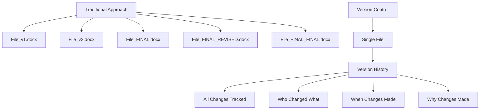

#### Hands-On Understanding

Let's understand this with a simple analogy. Think of version control like a detailed diary for your project:

* **Entry 1:** "Created initial project structure"
* **Entry 2:** "Added user login functionality"
* **Entry 3:** "Fixed bug in password validation"
* **Entry 4:** "Added user dashboard"

Each entry represents a "commit" in Git terminology - a snapshot of your project at that moment.

### Types of Version Control Systems

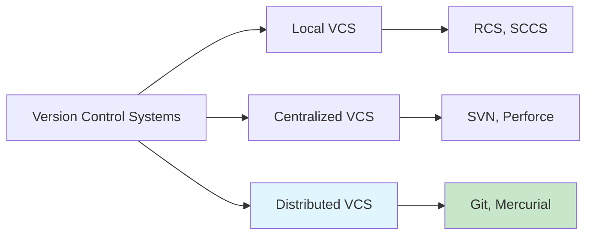

#### 1. Local Version Control

Simple database that keeps all changes to files under revision control on your local machine. Limited to single-user scenarios.

#### 2. Centralized Version Control

Single server contains all versioned files. Clients check out files from this central place. Examples: SVN, Perforce.

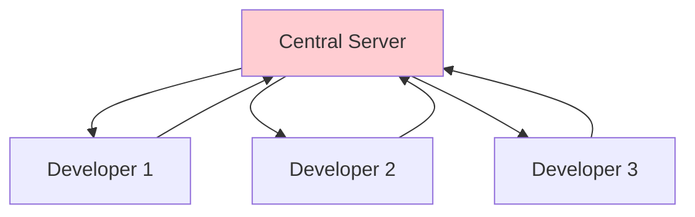

#### 3. Distributed Version Control (Git)

Every client has a complete copy of the project history. No single point of failure. Can work offline.

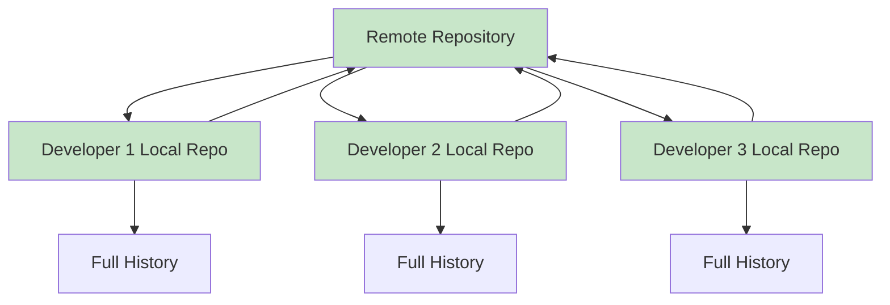

### 🎯 Exercise 1: Understanding Version Control

1. **Step 1:** Think of a project you're currently working on (could be code, writing, design, etc.)
2. **Step 2:** List 3 scenarios where you wished you could go back to a previous version
3. **Step 3:** Imagine collaborating with 3 other people on this project. What challenges would you face without version control?

> **💡 Key Takeaway:** Version control isn't just about backing up files—it's about giving you the confidence to experiment, collaborate, and iterate without fear of losing work or breaking things permanently.

---

## 🔧 Git Fundamentals

### What Makes Git Special?

Git is a distributed version control system created by Linus Torvalds (the creator of Linux) in 2005. Unlike other VCS, Git thinks of data as snapshots, not differences. Every time you commit, Git takes a picture of all your files and stores a reference to that snapshot.

### The Three States of Git

Git has three main states that your files can reside in:  **working directory** ,  **staging area** , and  **repository** .

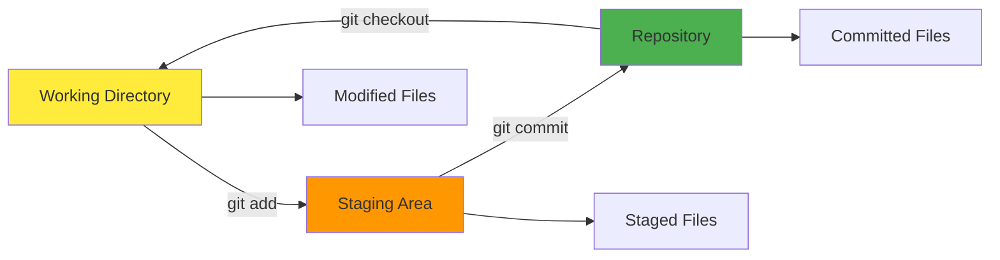

> **Real-World Analogy: The Photography Studio**
>
> Think of Git like a photography studio:
>
> * **Working Directory:** Your models getting ready (files being edited)
> * **Staging Area:** Models positioned and ready for the shot (files selected for commit)
> * **Repository:** The final photographs in your portfolio (committed snapshots)

#### 1. Working Directory

This is where you make changes to your files. It's your current project folder where you edit, create, and delete files.

```bash
# Check what's in your working directory
$ ls -la
total 16
drwxr-xr-x  4 user user 4096 Jan 15 10:30 .
drwxr-xr-x  3 user user 4096 Jan 15 10:29 ..
drwxr-xr-x  8 user user 4096 Jan 15 10:30 .git
-rw-r--r--  1 user user   23 Jan 15 10:30 README.md
-rw-r--r--  1 user user  156 Jan 15 10:30 index.html
```

#### 2. Staging Area (Index)

The staging area is like a loading dock where you prepare your next commit. You can add and remove files from the staging area before making a commit.

**Understanding Staging:** The staging area is Git's unique feature. It allows you to carefully control what goes into each commit. You might change 10 files but only want to commit 3 of them that relate to a specific feature.

#### 3. Repository

The repository is where Git stores all the committed snapshots of your project. Each commit creates a new snapshot that you can return to later.

### Git Configuration

Before using Git, you need to configure it with your identity. This information is used for every commit you make.

```bash
# Set your name and email (do this once)
$ git config --global user.name "John Doe"
$ git config --global user.email "john@example.com"

# Check your configuration
$ git config --list
user.name=John Doe
user.email=john@example.com
core.editor=vim

# Set your default editor
$ git config --global core.editor "code --wait"
```

### 🎯 Exercise 2: First Git Setup

1. **Step 1:** Install Git on your system (git-scm.com)
2. **Step 2:** Configure your name and email
3. **Step 3:** Set your preferred text editor
4. **Step 4:** Run `git config --list` to verify your settings

### Creating Your First Repository

There are two ways to get a Git repository: create one from scratch or clone an existing one.

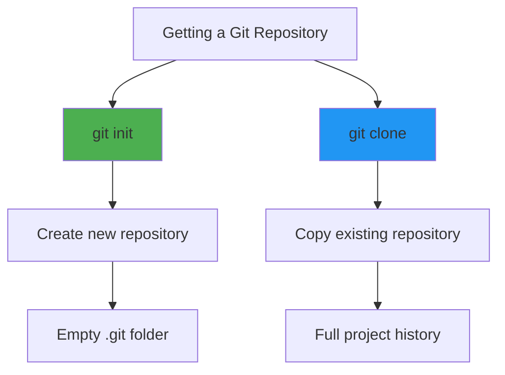

#### Method 1: Initialize a New Repository

```bash
# Create a new directory and initialize Git
$ mkdir my-awesome-project
$ cd my-awesome-project
$ git init
Initialized empty Git repository in /path/to/my-awesome-project/.git/

# Check the status
$ git status
On branch main
No commits yet
nothing to commit (create/copy files and use "git add" to track)
```

#### Method 2: Clone an Existing Repository

```bash
# Clone a repository from GitHub
$ git clone https://github.com/user/repo.git
Cloning into 'repo'...
remote: Counting objects: 100, done.
remote: Compressing objects: 100% (50/50), done.
remote: Total 100 (delta 25), reused 100 (delta 25)
Receiving objects: 100% (100/100), 15.50 KiB | 0 bytes/s, done.
Resolving deltas: 100% (25/25), done.
```

> **⚠️ Important:** The .git folder contains all the repository history. Never delete it unless you want to lose all version control history!

---

## 📁 Working with Repositories

### The Git Workflow

Working with Git follows a predictable pattern: modify files, stage changes, commit snapshots, and optionally push to remote repositories. Understanding this workflow is crucial for effective Git usage.

### The Basic Git Workflow

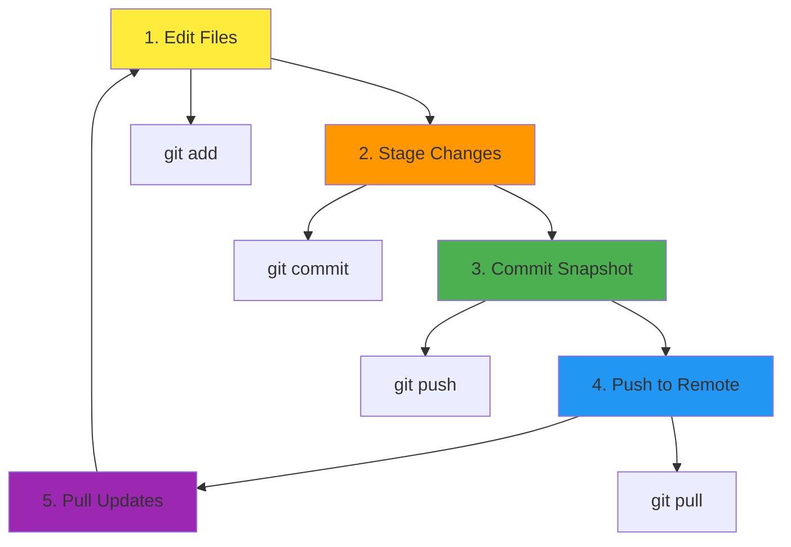

> **Daily Developer Workflow:**
>
> Emma starts her day by pulling the latest changes from the remote repository. She then works on a new feature, adds her changes to staging, commits them with a descriptive message, and pushes her work to share with the team.

### Checking Repository Status

The `git status` command is your best friend. It shows you exactly what's happening in your repository.

```bash
# Check the status of your repository
$ git status
On branch main
Your branch is up to date with 'origin/main'.

Changes to be committed:
  (use "git reset HEAD <file>..." to unstage)
        new file:   index.html

Changes not staged for commit:
  (use "git add <file>..." to update what will be committed)
  (use "git restore <file>..." to discard changes in working directory)
        modified:   README.md

Untracked files:
  (use "git add <file>..." to include in what will be committed)
        styles.css
```

**Understanding Git Status Output:**

* **Changes to be committed:** Files in the staging area
* **Changes not staged for commit:** Modified files in working directory
* **Untracked files:** New files Git doesn't know about

### Staging Changes

The staging area lets you carefully control what goes into each commit. You can stage individual files, parts of files, or everything at once.

```bash
# Stage a specific file
$ git add index.html

# Stage multiple files
$ git add index.html styles.css script.js

# Stage all modified files
$ git add .

# Stage all files including deletions
$ git add -A

# Stage interactively (choose what to stage)
$ git add -i
```

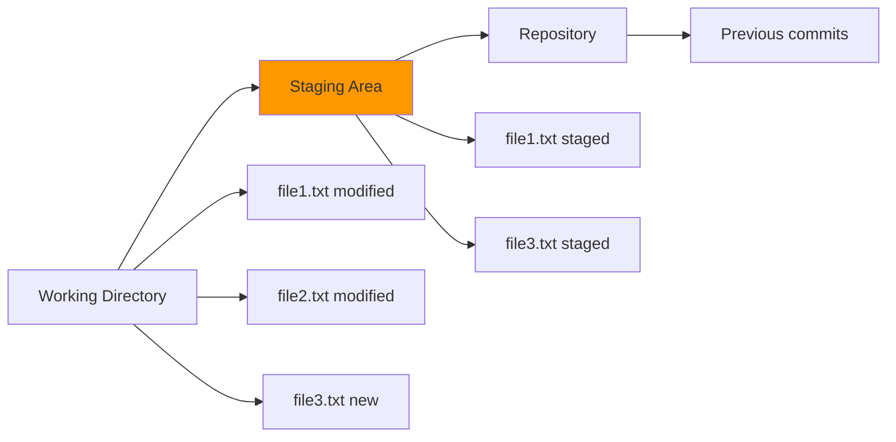

#### Selective Staging

Sometimes you've made multiple changes to a file but only want to commit some of them. Git allows you to stage parts of a file.

```bash
# Stage parts of a file interactively
$ git add -p filename.txt
diff --git a/filename.txt b/filename.txt
index 1234567..abcdefg 100644
--- a/filename.txt
+++ b/filename.txt
@@ -1,4 +1,6 @@
 Line 1
 Line 2
+New line added
 Line 3
 Line 4
Stage this hunk [y,n,q,a,d,/,s,e,?]?
```

### 🎯 Exercise 3: Staging Practice

1. **Step 1:** Create a new file called `index.html` with some basic HTML
2. **Step 2:** Modify an existing file (like README.md)
3. **Step 3:** Run `git status` to see the changes
4. **Step 4:** Stage only the new file using `git add index.html`
5. **Step 5:** Run `git status` again to see the difference

### Making Commits

A commit is a snapshot of your staged changes. Each commit should represent a logical unit of work.

```bash
# Commit with a message
$ git commit -m "Add homepage HTML structure"
[main 1a2b3c4] Add homepage HTML structure
 1 file changed, 20 insertions(+)
 create mode 100644 index.html

# Commit with a detailed message
$ git commit -m "Add user authentication" -m "Implement login/logout functionality with session management"

# Stage and commit in one command
$ git commit -am "Update README with installation instructions"
```

#### Anatomy of a Good Commit Message

* **Subject line:** 50 characters or less, imperative mood
* **Body:** Explain what and why, not how
* **Footer:** Reference issues, breaking changes

### Viewing History

Git provides powerful tools to explore your project's history.

```bash
# Basic log
$ git log
commit 1a2b3c4d5e6f7g8h9i0j1k2l3m4n5o6p7q8r9s0
Author: John Doe <john@example.com>
Date:   Mon Jan 15 10:30:00 2024 -0500

    Add homepage HTML structure

    Created the basic HTML structure for the homepage
    including navigation, header, and main content areas.

# Compact log
$ git log --oneline
1a2b3c4 Add homepage HTML structure
5d6e7f8 Initial commit

# Visual log
$ git log --graph --oneline --all
* 1a2b3c4 Add homepage HTML structure
* 5d6e7f8 Initial commit
```

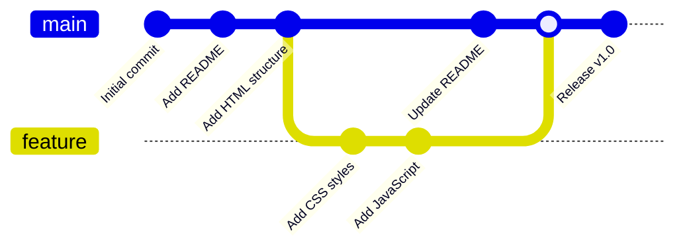

> **💡 Pro Tip:** Use `git log --oneline --graph --all` to see a visual representation of your commit history, including branches and merges.

---

## 🌿 Branching and Merging

### Understanding Branches

Branches in Git are incredibly lightweight and fast. They're simply movable pointers to specific commits. The default branch is usually called 'main' or 'master'. Creating a new branch essentially creates a new pointer to the current commit.

### Why Use Branches?

Branches allow you to diverge from the main line of development and work on features, experiments, or bug fixes in isolation.

> **The Feature Development Scenario:**
>
> Your team is working on a web application. While you're implementing a new user profile feature, your teammate is fixing a critical bug in the payment system. Without branches, you'd interfere with each other's work. With branches, you can work independently and merge when ready.

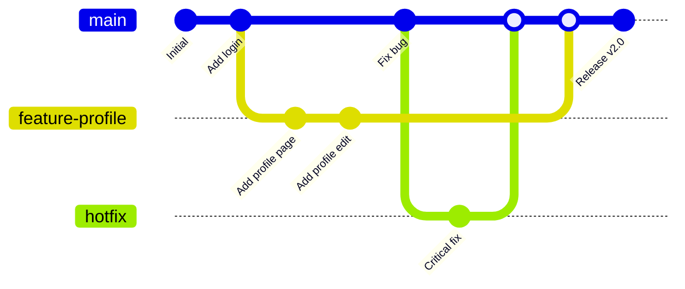

### Creating and Switching Branches

```bash
# Create a new branch
$ git branch feature-user-profile

# List all branches
$ git branch
  feature-user-profile
* main

# Switch to a branch
$ git checkout feature-user-profile
Switched to branch 'feature-user-profile'

# Create and switch in one command
$ git checkout -b feature-dashboard
Switched to a new branch 'feature-dashboard'

# Modern way (Git 2.23+)
$ git switch feature-user-profile
$ git switch -c feature-new-feature
```

### Branch Management

```bash
# List all branches (including remote)
$ git branch -a
* feature-user-profile
  main
  remotes/origin/main
  remotes/origin/feature-dashboard

# Show last commit on each branch
$ git branch -v
* feature-user-profile 1a2b3c4 Add profile form
  main                 5d6e7f8 Update README

# Delete a branch (safe)
$ git branch -d feature-completed
Deleted branch feature-completed (was 1a2b3c4).

# Force delete a branch
$ git branch -D feature-abandoned
Deleted branch feature-abandoned (was 9x8y7z6).
```

### 🎯 Exercise 4: Working with Branches

1. **Step 1:** Create a new branch called `feature-navbar`
2. **Step 2:** Switch to this branch
3. **Step 3:** Create a new file called `navbar.html`
4. **Step 4:** Add and commit this file
5. **Step 5:** Switch back to main and notice the file is gone
6. **Step 6:** Switch back to your feature branch and see the file return

### Merging Branches

Once you've finished work on a branch, you can merge it back into the main branch.

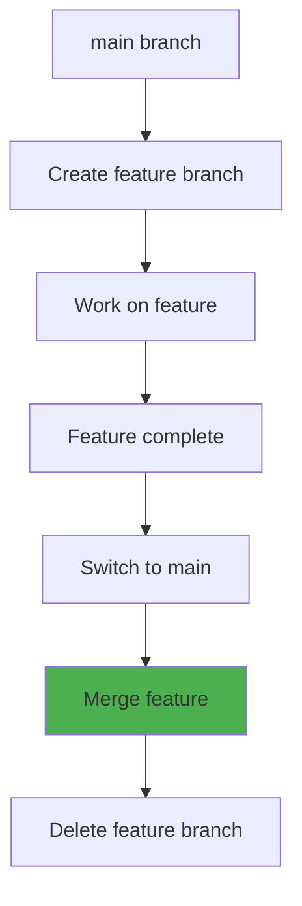

#### Fast-Forward Merge

When the main branch hasn't diverged, Git can simply move the pointer forward.

```bash
# Switch to main branch
$ git checkout main
Switched to branch 'main'

# Merge feature branch
$ git merge feature-navbar
Updating 5d6e7f8..1a2b3c4
Fast-forward
 navbar.html | 25 +++++++++++++++++++++++++
 1 file changed, 25 insertions(+)
 create mode 100644 navbar.html
```

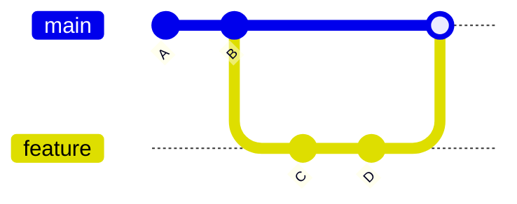

#### Three-Way Merge

When both branches have diverged, Git creates a new commit that combines both histories.

```bash
# Three-way merge example
$ git merge feature-user-profile
Merge made by the 'recursive' strategy.
 profile.html | 45 +++++++++++++++++++++++++++++++++++++++++++++
 profile.css  | 23 +++++++++++++++++++++++
 2 files changed, 68 insertions(+)
 create mode 100644 profile.html
 create mode 100644 profile.css
```

> **⚠️ Merge Conflicts:** Sometimes Git can't automatically merge branches. When this happens, you'll need to manually resolve conflicts before completing the merge.

---

## 🌐 Remote Repositories

### Understanding Remote Repositories

Remote repositories are versions of your project that are hosted on the internet or network. They enable collaboration with other developers. The most common remote hosting services are GitHub, GitLab, and Bitbucket.

### What Are Remote Repositories?

A remote repository is a Git repository that's stored on a server, accessible over the internet. It serves as a central point where team members can share their work.

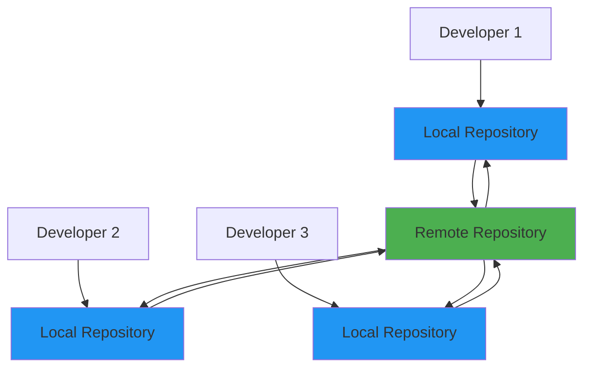

> **Real-World Scenario: The Startup Team**
>
> TechStart Inc. has 5 developers working on their new app. Each developer works on their local machine, but they need to share code. They use GitHub as their remote repository. When Alice finishes a feature, she pushes it to GitHub. Bob can then pull Alice's changes and continue building on top of her work.

### Setting Up Remote Repositories

```bash
# Add a remote repository
$ git remote add origin https://github.com/username/repo.git

# List remote repositories
$ git remote -v
origin  https://github.com/username/repo.git (fetch)
origin  https://github.com/username/repo.git (push)

# Add multiple remotes
$ git remote add upstream https://github.com/original/repo.git
$ git remote add backup https://gitlab.com/username/repo.git
```

#### Common Remote Operations

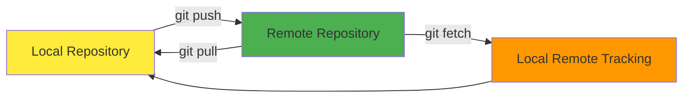

### Pushing Changes

Pushing sends your local commits to the remote repository, making them available to other team members.

```bash
# Push to remote repository
$ git push origin main
Counting objects: 3, done.
Delta compression using up to 4 threads.
Compressing objects: 100% (2/2), done.
Writing objects: 100% (3/3), 312 bytes | 312.00 KiB/s, done.
Total 3 (delta 0), reused 0 (delta 0)
To https://github.com/username/repo.git
   1a2b3c4..5d6e7f8  main -> main

# Push and set upstream
$ git push -u origin feature-branch
Branch 'feature-branch' set up to track remote branch 'feature-branch' from 'origin'.

# Push all branches
$ git push --all origin

# Push tags
$ git push --tags
```

### Pulling Changes

Pulling fetches changes from the remote repository and merges them into your current branch.

```bash
# Pull changes from remote
$ git pull origin main
From https://github.com/username/repo
 * branch            main     -> FETCH_HEAD
Updating 1a2b3c4..9x8y7z6
Fast-forward
 README.md | 5 +++++
 1 file changed, 5 insertions(+)

# Pull with rebase
$ git pull --rebase origin main

# Just fetch (don't merge)
$ git fetch origin
From https://github.com/username/repo
 * [new branch]      feature-new    -> origin/feature-new
   1a2b3c4..5d6e7f8  main           -> origin/main
```

**Understanding Pull vs Fetch:**

* **git fetch:** Downloads changes but doesn't merge them
* **git pull:** Downloads changes and merges them (fetch + merge)
* **git pull --rebase:** Downloads changes and rebases your work on top

### Handling Merge Conflicts

When multiple developers modify the same lines of code, Git can't automatically merge the changes.

```bash
# Conflict occurs during pull
$ git pull origin main
Auto-merging index.html
CONFLICT (content): Merge conflict in index.html
Automatic merge failed; fix conflicts and then commit the result.

# Check conflict status
$ git status
On branch main
You have unmerged paths.
  (fix conflicts and run "git commit")
  (use "git merge --abort" to abort the merge)

Unmerged paths:
  (use "git add <file>..." to mark resolution)
        both modified:   index.html
```

#### Resolving Conflicts Step by Step

When you open the conflicted file, you'll see conflict markers:

```html
<<<<<<< HEAD
Your changes
=======
Changes from remote
>>>>>>> commit-hash
```

Choose which changes to keep, remove the markers, then add and commit.

### 🎯 Exercise 5: Working with Remotes

1. **Step 1:** Create a new repository on GitHub
2. **Step 2:** Add it as a remote to your local repository
3. **Step 3:** Push your local commits to GitHub
4. **Step 4:** Make a change on GitHub's web interface
5. **Step 5:** Pull the changes to your local repository

> **💡 Best Practice:** Always pull before pushing to avoid conflicts. The command `git pull --rebase` often creates cleaner history than regular pulls.

---

## ⚡ Advanced Git Operations

### Beyond Basic Git

Once you're comfortable with basic Git operations, these advanced techniques will help you manage complex scenarios, clean up your history, and work more efficiently with your team.

### Git Stash: Temporary Storage

Stashing allows you to temporarily save your work without committing it. Perfect for when you need to quickly switch branches or pull updates.

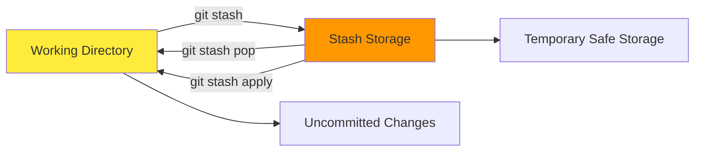

```bash
# Stash current changes
$ git stash
Saved working directory and index state WIP on main: 1a2b3c4 Latest commit

# Stash with a message
$ git stash save "Work in progress on user authentication"

# List all stashes
$ git stash list
stash@{0}: WIP on main: 1a2b3c4 Latest commit
stash@{1}: On feature-branch: Work in progress on user authentication

# Apply and remove stash
$ git stash pop
On branch main
Changes not staged for commit:
        modified:   index.html
Dropped refs/stash@{0}

# Apply specific stash
$ git stash apply stash@{1}

# Delete a stash
$ git stash drop stash@{0}
```

> **Stash Use Case - The Urgent Bug Fix:**
>
> You're working on a new feature when your manager asks you to fix a critical bug immediately. You're not ready to commit your current work, but you need to switch branches. Solution: stash your work, fix the bug, then return to your feature and pop the stash!

### Rebasing: Rewriting History

Rebasing allows you to move or combine commits, creating a cleaner project history.

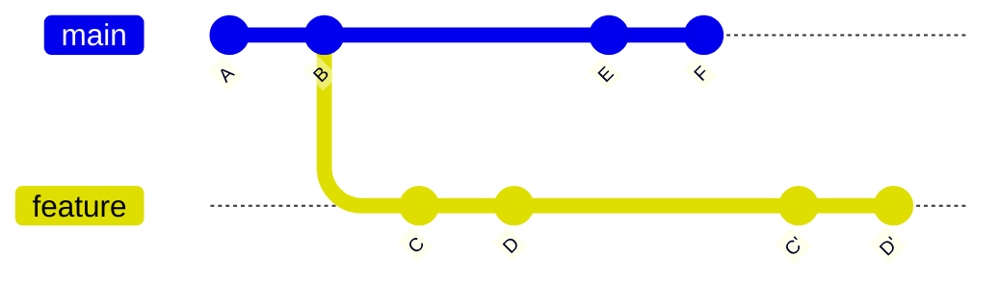

```bash
# Rebase current branch onto main
$ git rebase main
First, rewinding head to replay your work on top of it...
Applying: Add user authentication
Applying: Fix login validation

# Interactive rebase (last 3 commits)
$ git rebase -i HEAD~3
# This opens an editor with:
pick 1a2b3c4 Add user authentication
pick 5d6e7f8 Fix typo in login form
pick 9x8y7z6 Add logout functionality

# Rebase options:
# pick = keep the commit
# reword = change commit message
# edit = stop to modify commit
# squash = combine with previous commit
# drop = remove commit
```

**Interactive Rebase Use Cases:**

* **Squashing:** Combine multiple small commits into one
* **Reordering:** Change the order of commits
* **Editing:** Modify commit messages or content
* **Dropping:** Remove commits from history

### Cherry Picking

Cherry picking applies specific commits from one branch to another without merging the entire branch.

```bash
# Cherry pick a specific commit
$ git cherry-pick 1a2b3c4
[main 5d6e7f8] Fix critical security vulnerability
 1 file changed, 3 insertions(+), 1 deletion(-)

# Cherry pick multiple commits
$ git cherry-pick 1a2b3c4 5d6e7f8 9x8y7z6

# Cherry pick a range of commits
$ git cherry-pick 1a2b3c4..9x8y7z6
```

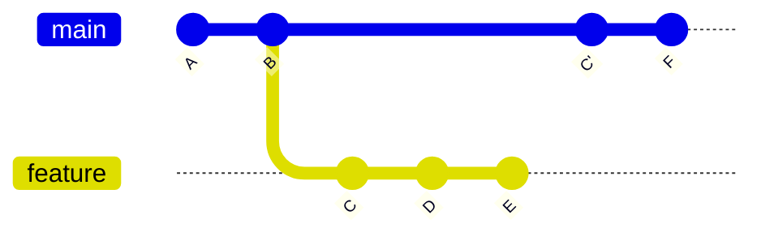

### Git Reset: Undoing Changes

Git reset allows you to undo commits in various ways, depending on how much you want to preserve.

```bash
# Soft reset (keep changes staged)
$ git reset --soft HEAD~1
# Commit is undone, changes remain staged

# Mixed reset (default - unstage changes)
$ git reset HEAD~1
# Commit is undone, changes remain in working directory

# Hard reset (discard all changes)
$ git reset --hard HEAD~1
HEAD is now at 1a2b3c4 Previous commit
```

> **⚠️ Danger Zone:** `git reset --hard` permanently deletes your changes. Use with extreme caution, especially on shared branches!

### Git Revert: Safe Undoing

Unlike reset, revert creates a new commit that undoes the changes from a previous commit.

```bash
# Revert a specific commit
$ git revert 1a2b3c4
[main 5d6e7f8] Revert "Add broken feature"
 1 file changed, 0 insertions(+), 25 deletions(-)

# Revert without creating a commit
$ git revert --no-commit 1a2b3c4

# Revert a merge commit
$ git revert -m 1 5d6e7f8
```

### 🎯 Exercise 6: Advanced Operations

1. **Step 1:** Make some changes to a file but don't commit
2. **Step 2:** Stash your changes
3. **Step 3:** Make a few small commits
4. **Step 4:** Use interactive rebase to squash the commits
5. **Step 5:** Pop your stashed changes

> **💡 Golden Rule:** Never rebase commits that have been pushed to a shared repository. It rewrites history and can cause problems for other developers.

---

## 🔄 Git Workflows

### Choosing the Right Workflow

Different teams and projects require different workflows. The key is choosing one that matches your team size, release schedule, and collaboration style. A good workflow reduces conflicts and makes collaboration smooth.

### Feature Branch Workflow

The most popular workflow where each feature is developed in its own branch, then merged back to main.

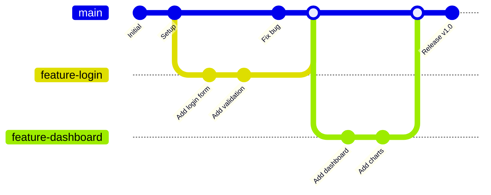

```bash
# Feature Branch Workflow
$ git checkout -b feature-user-profile
Switched to a new branch 'feature-user-profile'

# Work on feature, make commits
$ git add .
$ git commit -m "Add user profile page"

# Push feature branch
$ git push -u origin feature-user-profile

# Switch back to main and merge
$ git checkout main
$ git merge feature-user-profile

# Delete feature branch
$ git branch -d feature-user-profile
```

### GitFlow Workflow

A more structured approach with specific branch types for different purposes.

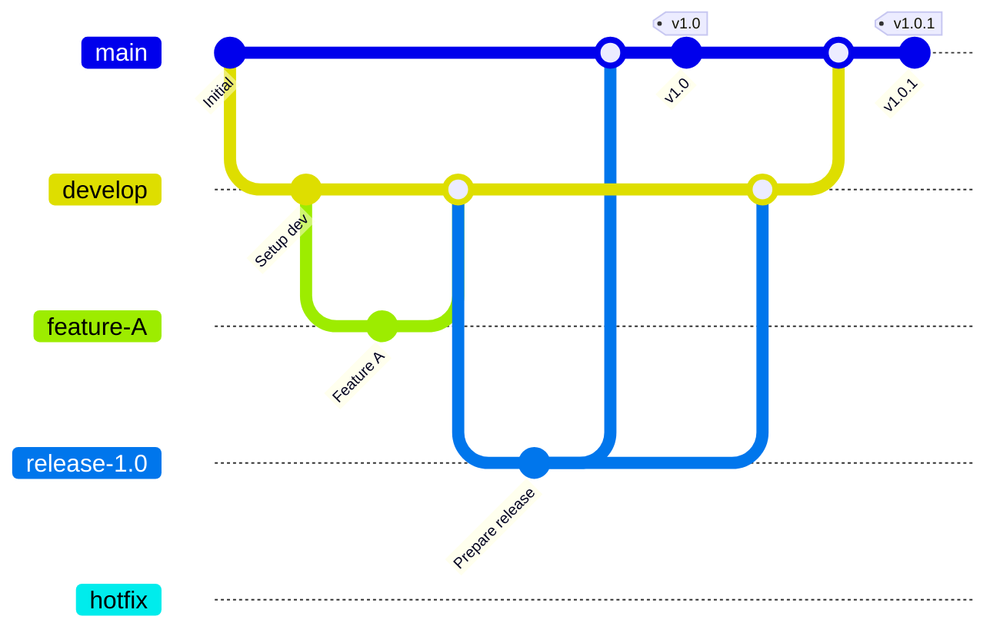

**GitFlow Branch Types:**

* **main:** Production-ready code
* **develop:** Integration branch for features
* **feature/*:** New features
* **release/*:** Prepare new releases
* **hotfix/*:** Critical production fixes

### GitHub Flow

A simpler workflow perfect for continuous deployment.

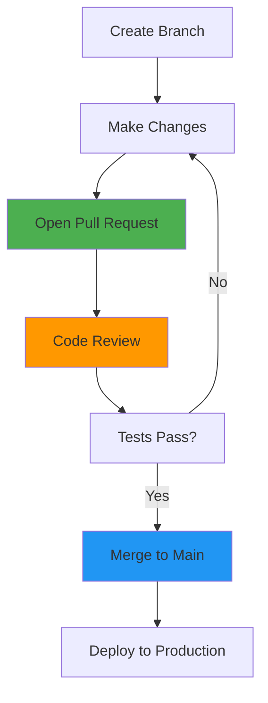

> **GitHub Flow in Action:**
>
> DevCorp deploys multiple times per day. They use GitHub Flow: create a branch, make changes, open a pull request, get reviewed, merge to main, and deploy. Simple, fast, and effective for their rapid release cycle.

### Forking Workflow

Popular for open-source projects where contributors don't have write access to the main repository.

```mermaid
graph TD
    A[Original Repository] --> B[Fork Repository]
    B --> C[Clone Fork]
    C --> D[Create Feature Branch]
    D --> E[Make Changes]
    E --> F[Push to Fork]
    F --> G[Create Pull Request]
    G --> H[Code Review]
    H --> I[Merge to Original]
  
    style A fill:#4caf50
    style B fill:#ff9800
    style G fill:#2196f3
```

```bash
# Forking Workflow Steps
# 1. Fork the repository on GitHub
# 2. Clone your fork
$ git clone https://github.com/yourusername/project.git

# 3. Add upstream remote
$ git remote add upstream https://github.com/original/project.git

# 4. Create feature branch
$ git checkout -b feature-awesome

# 5. Make changes and push to your fork
$ git push origin feature-awesome

# 6. Create pull request on GitHub
# 7. Keep your fork updated
$ git fetch upstream
$ git checkout main
$ git merge upstream/main
```

### Centralized Workflow

Simple workflow where everyone works on the main branch. Best for small teams transitioning from SVN.

```bash
# Centralized Workflow
$ git pull origin main
Already up to date.

# Make changes and commit
$ git add .
$ git commit -m "Add new feature"

# Push to shared repository
$ git push origin main
```

### 🎯 Exercise 7: Implementing a Workflow

1. **Step 1:** Choose a workflow that fits your project
2. **Step 2:** Create a feature branch
3. **Step 3:** Make several commits on the feature branch
4. **Step 4:** Practice the merge/pull request process
5. **Step 5:** Clean up by deleting the feature branch

> **💡 Workflow Selection Tips:**
>
> * **Small team, simple project:** GitHub Flow
> * **Large team, scheduled releases:** GitFlow
> * **Open source project:** Forking Workflow
> * **Transitioning from SVN:** Centralized Workflow

---

## 👥 Team Collaboration

### Effective Git Collaboration

Successful team collaboration with Git requires clear communication, consistent workflows, and good practices. The goal is to enable multiple developers to work together efficiently without stepping on each other's toes.

### Pull Requests / Merge Requests

Pull requests are the cornerstone of collaborative development. They provide a way to propose changes, discuss them, and review code before merging.

```mermaid
graph TD
    A[Create Feature Branch] --> B[Make Changes]
    B --> C[Push Branch]
    C --> D[Open Pull Request]
    D --> E[Team Review]
    E --> F[Request Changes?]
    F -->|Yes| G[Make Updates]
    G --> E
    F -->|No| H[Approve & Merge]
    H --> I[Delete Branch]
  
    style D fill:#4caf50
    style E fill:#ff9800
    style H fill:#2196f3
```

> **Pull Request Best Practices:**
>
> At TechCorp, every change goes through a pull request. Sarah creates a PR for her authentication feature. Her teammates review the code, suggest improvements, and test the feature. This process catches bugs early and ensures code quality.

### Code Review Guidelines

**What to Look for in Code Reviews:**

* **Functionality:** Does the code work as intended?
* **Readability:** Is the code easy to understand?
* **Performance:** Are there any performance issues?
* **Security:** Are there any security vulnerabilities?
* **Testing:** Are there adequate tests?
* **Documentation:** Is the code well-documented?

### Managing Conflicts in Teams

Conflicts are inevitable in team environments. The key is to handle them gracefully and learn from them.

```bash
# Common conflict scenario
$ git pull origin main
Auto-merging src/auth.js
CONFLICT (content): Merge conflict in src/auth.js
Automatic merge failed; fix conflicts and then commit the result.

# View conflicted files
$ git status
On branch feature-auth
You have unmerged paths.
  (fix conflicts and run "git commit")
Unmerged paths:
        both modified:   src/auth.js

# Use merge tool
$ git mergetool

# Or resolve manually and commit
$ git add src/auth.js
$ git commit -m "Resolve merge conflict in auth.js"
```

> **💡 Conflict Prevention:**
>
> * Pull frequently to stay updated
> * Make smaller, focused commits
> * Communicate with team about overlapping work
> * Use feature branches to isolate changes

### Git Hooks for Team Standards

Git hooks are scripts that run automatically at certain points in the Git workflow. They help enforce team standards and automate common tasks.

```bash
#!/bin/sh
# Pre-commit hook example (saved as .git/hooks/pre-commit)
# Run tests before commit
npm test
if [ $? -ne 0 ]; then
    echo "Tests failed! Commit aborted."
    exit 1
fi
```

```bash
#!/bin/sh
# Commit message hook (saved as .git/hooks/commit-msg)
# Check commit message format
commit_regex='^(feat|fix|docs|style|refactor|test|chore)(\(.+\))?: .{1,50}'
if ! grep -qE "$commit_regex" "$1"; then
    echo "Invalid commit message format!"
    exit 1
fi
```

### Branch Protection Rules

Protect important branches from direct pushes and enforce quality standards.

**Common Branch Protection Rules:**

* **Require pull requests:** No direct pushes to main
* **Require reviews:** At least one approval needed
* **Require status checks:** Tests must pass
* **Require up-to-date branches:** Must be current with main
* **Restrict push access:** Only certain users can push

### Team Communication Strategies

**Communication Best Practices:**

* **Daily standups:** Discuss what you're working on
* **Feature planning:** Coordinate overlapping work
* **Code reviews:** Provide constructive feedback
* **Documentation:** Keep README and docs updated
* **Issue tracking:** Use GitHub issues or similar tools

### 🎯 Exercise 8: Team Collaboration Simulation

1. **Step 1:** Set up a shared repository with a teammate
2. **Step 2:** Both create different feature branches
3. **Step 3:** Modify the same file in different ways
4. **Step 4:** One person merges first, the other resolves conflicts
5. **Step 5:** Practice the pull request review process

> **⚠️ Team Anti-Patterns to Avoid:**
>
> * Force pushing to shared branches
> * Committing directly to main/master
> * Large, monolithic commits
> * Ignoring code review feedback
> * Not communicating about major changes

---

## ✨ Best Practices

### Git Mastery Through Good Habits

Following best practices makes Git a powerful ally rather than a source of frustration. These practices will help you maintain clean repositories, collaborate effectively, and avoid common pitfalls.

### Writing Great Commit Messages

A good commit message tells a story about what changed and why. Future you (and your teammates) will thank you for clear, descriptive messages.

#### Commit Message Format

```
type(scope): subject

body

footer
```

* **Type:** feat, fix, docs, style, refactor, test, chore
* **Subject:** 50 characters or less, imperative mood
* **Body:** Explain what and why, not how
* **Footer:** Reference issues, breaking changes

```bash
# Good commit messages
$ git commit -m "feat(auth): add password reset functionality

Implement password reset via email with secure tokens.
Users can now reset forgotten passwords safely.

Closes #123"

# Bad commit messages
❌ "fix stuff"
❌ "update"
❌ "working on login"
❌ "asdf"

# Good commit messages
✅ "fix(auth): prevent SQL injection in login form"
✅ "docs: update installation instructions"
✅ "refactor: extract user validation logic"
✅ "test: add unit tests for payment processing"
```

### Repository Structure

A well-organized repository makes it easy for new contributors to understand and contribute to your project.

```
my-project/
├── .github/
│   ├── workflows/        # GitHub Actions
│   ├── ISSUE_TEMPLATE/   # Issue templates
│   └── PULL_REQUEST_TEMPLATE.md
├── .gitignore           # Files to ignore
├── README.md            # Project overview
├── CONTRIBUTING.md      # How to contribute
├── LICENSE              # License information
├── package.json         # Dependencies
├── src/                 # Source code
│   ├── components/
│   ├── utils/
│   └── index.js
├── tests/               # Test files
├── docs/                # Documentation
└── examples/            # Usage examples
```

### The .gitignore File

A proper .gitignore file prevents unnecessary files from being tracked and keeps your repository clean.

```gitignore
# Example .gitignore for a Node.js project

# Dependencies
node_modules/
npm-debug.log*
yarn-debug.log*
yarn-error.log*

# Build outputs
dist/
build/
*.min.js
*.min.css

# Environment files
.env
.env.local
.env.development.local
.env.test.local
.env.production.local

# IDE and editor files
.vscode/
.idea/
*.swp
*.swo
*~

# OS generated files
.DS_Store
Thumbs.db

# Logs
*.log
logs/

# Runtime data
pids
*.pid
*.seed
```

### Branching Strategy

**Branch Naming Conventions:**

* **feature/** - New features (feature/user-authentication)
* **bugfix/** - Bug fixes (bugfix/login-validation)
* **hotfix/** - Critical production fixes (hotfix/security-patch)
* **release/** - Release preparation (release/v1.2.0)
* **chore/** - Maintenance tasks (chore/update-dependencies)

### Security Best Practices

> **⚠️ Security Considerations:**
>
> * Never commit secrets, API keys, or passwords
> * Use environment variables for sensitive data
> * Regularly update dependencies
> * Be careful with public repositories
> * Use signed commits for verification

```bash
# Set up GPG signing
$ git config --global user.signingkey YOUR_GPG_KEY_ID
$ git config --global commit.gpgsign true

# Sign a commit
$ git commit -S -m "feat: add secure payment processing"

# Verify signatures
$ git log --show-signature
```

### Performance Optimization

**Keep Your Repository Fast:**

* **Avoid large files:** Use Git LFS for binary files
* **Regular cleanup:** Use git gc to optimize
* **Shallow clones:** Use --depth for faster clones
* **Prune remotes:** Clean up deleted branches

```bash
# Repository maintenance
$ git gc --aggressive
Counting objects: 1000, done.
Delta compression using up to 4 threads.
Compressing objects: 100% (500/500), done.

# Shallow clone
$ git clone --depth 1 https://github.com/user/repo.git

# Prune remote branches
$ git remote prune origin

# Clean up local branches
$ git branch --merged | grep -v "main\|develop" | xargs -n 1 git branch -d
```

### 🎯 Exercise 9: Repository Audit

1. **Step 1:** Review your commit messages - are they descriptive?
2. **Step 2:** Check your .gitignore - is it comprehensive?
3. **Step 3:** Audit your repository structure - is it organized?
4. **Step 4:** Set up branch naming conventions
5. **Step 5:** Configure GPG signing for commits

> **💡 Remember:** Good practices become habits with repetition. Start with one or two practices and gradually incorporate more as they become natural.

---

## 🔧 Troubleshooting

### Git Recovery and Problem Solving

Even experienced Git users encounter problems. The key is knowing how to diagnose issues and having the right tools to fix them. Git is very forgiving - most "disasters" can be recovered from.

### Common Git Problems

**The "Oh No!" Moments:**

* 😱 "I committed to the wrong branch!"
* 😱 "I pushed sensitive data to GitHub!"
* 😱 "I lost my work after a hard reset!"
* 😱 "I can't push because of conflicts!"
* 😱 "I accidentally deleted my branch!"

Don't panic! Git has solutions for all of these problems.

### Undoing Commits

```mermaid
graph TD
    A[Commit Problem] --> B{Already Pushed?}
    B -->|No| C[git reset]
    B -->|Yes| D[git revert]
  
    C --> E[--soft: Keep changes staged]
    C --> F[--mixed: Keep changes unstaged]
    C --> G[--hard: Discard changes]
  
    D --> H[Create new commit that undoes changes]
  
    style C fill:#ff9800
    style D fill:#4caf50
```

```bash
# Undo last commit (not pushed)
$ git reset --soft HEAD~1
# Commit undone, changes still staged

# Undo last commit and unstage changes
$ git reset HEAD~1

# Undo last commit and discard changes
$ git reset --hard HEAD~1
HEAD is now at 1a2b3c4 Previous commit

# Undo a pushed commit safely
$ git revert HEAD
[main 5d6e7f8] Revert "Bad commit"
```

### Recovering Lost Work

Git's reflog keeps track of all your actions, making it possible to recover "lost" work.

```bash
# View reflog to find lost commits
$ git reflog
1a2b3c4 (HEAD -> main) HEAD@{0}: reset: moving to HEAD~1
5d6e7f8 HEAD@{1}: commit: Important work
9x8y7z6 HEAD@{2}: commit: Previous commit

# Recover the lost commit
$ git checkout 5d6e7f8
You are in 'detached HEAD' state...

# Create a new branch to save the work
$ git checkout -b recovery-branch
Switched to a new branch 'recovery-branch'

# Or reset main to the lost commit
$ git checkout main
$ git reset --hard 5d6e7f8
```

### Fixing Merge Conflicts

Merge conflicts happen when Git can't automatically merge changes. Here's how to resolve them systematically.

```bash
# Conflict occurs during merge
$ git merge feature-branch
Auto-merging index.html
CONFLICT (content): Merge conflict in index.html
Automatic merge failed; fix conflicts and then commit the result.

# See conflicted files
$ git status
Unmerged paths:
  (use "git add <file>..." to mark resolution)
        both modified:   index.html

# View the conflict
$ cat index.html
<<<<<<< HEAD
    <h1>Welcome to our site</h1>
=======
    <h1>Welcome to our website</h1>
>>>>>>> feature-branch

# After manually resolving:
$ git add index.html
$ git commit -m "Resolve merge conflict in index.html"
```

**Merge Conflict Resolution Steps:**

1. Open the conflicted file in your editor
2. Look for conflict markers (<<<<<<, =======, >>>>>>>)
3. Decide which changes to keep
4. Remove the conflict markers
5. Test that the file works correctly
6. Stage the resolved file with git add
7. Commit the resolution

### Removing Sensitive Data

Accidentally committed passwords or API keys? Here's how to remove them from history.

```bash
# Remove file from all history (dangerous!)
$ git filter-branch --force --index-filter \
  'git rm --cached --ignore-unmatch secrets.txt' \
  --prune-empty --tag-name-filter cat -- --all

# Better: use BFG Repo-Cleaner
$ java -jar bfg.jar --delete-files secrets.txt
$ git reflog expire --expire=now --all
$ git gc --prune=now --aggressive

# Force push (after backup!)
$ git push --force-with-lease origin main
```

> **⚠️ Important:** After removing sensitive data, change all exposed credentials immediately. The data might still be cached or accessible through other means.

### Fixing Detached HEAD

```bash
# You're in detached HEAD state
$ git status
HEAD detached at 1a2b3c4

# Create a branch to save your work
$ git checkout -b fix-detached-head
Switched to a new branch 'fix-detached-head'

# Or go back to main
$ git checkout main
Warning: you are leaving 1 commit behind
```

### Repository Corruption

In rare cases, Git repositories can become corrupted. Here's how to fix them.

```bash
# Check repository integrity
$ git fsck --full
Checking object directories: 100% (256/256), done.
Checking objects: 100% (1000/1000), done.

# Find and recover dangling commits
$ git fsck --lost-found
dangling commit 1a2b3c4d5e6f7g8h9i0j1k2l3m4n5o6p7q8r9s0

# Recover a dangling commit
$ git show 1a2b3c4d5e6f7g8h9i0j1k2l3m4n5o6p7q8r9s0
$ git cherry-pick 1a2b3c4d5e6f7g8h9i0j1k2l3m4n5o6p7q8r9s0
```

### Diagnostic Commands

**Git Debugging Toolkit:**

* **git status:** See current state
* **git log --oneline:** View recent commits
* **git reflog:** See all actions taken
* **git diff:** See what changed
* **git blame:** See who changed what
* **git bisect:** Find when bug was introduced

### 🎯 Exercise 10: Disaster Recovery

1. **Step 1:** Create a test repository with several commits
2. **Step 2:** Simulate a problem (hard reset, accidental deletion)
3. **Step 3:** Use git reflog to find the lost work
4. **Step 4:** Recover the lost commits
5. **Step 5:** Practice creating and resolving a merge conflict

> **💡 Prevention is Better Than Cure:**
>
> * Commit frequently
> * Use descriptive commit messages
> * Test before committing
> * Keep backups of important work
> * Use branches for experiments

---

## 📚 Quick Reference

### Your Git Command Cheat Sheet

This comprehensive reference covers all the Git commands you'll need in your daily workflow. Bookmark this page and refer to it whenever you need a quick reminder!

### Repository Setup

```bash
# Initialize a new repository
$ git init
$ git init my-project

# Clone an existing repository
$ git clone https://github.com/user/repo.git
$ git clone https://github.com/user/repo.git my-project

# Configure Git
$ git config --global user.name "Your Name"
$ git config --global user.email "your.email@example.com"
$ git config --global init.defaultBranch main
$ git config --list
```

### Basic Workflow

```bash
# Check repository status
$ git status
$ git status -s

# Add files to staging
$ git add file.txt
$ git add .
$ git add -A
$ git add -p

# Commit changes
$ git commit -m "Commit message"
$ git commit -am "Stage and commit"
$ git commit --amend

# View history
$ git log
$ git log --oneline
$ git log --graph --oneline --all
$ git show HEAD
```

### Branching and Merging

```bash
# Branch operations
$ git branch
$ git branch feature-name
$ git branch -d feature-name
$ git branch -D feature-name
$ git branch -m old-name new-name

# Switch branches
$ git checkout branch-name
$ git checkout -b new-branch
$ git switch branch-name
$ git switch -c new-branch

# Merging
$ git merge branch-name
$ git merge --no-ff branch-name
$ git merge --squash branch-name
```

### Remote Operations

```bash
# Remote management
$ git remote -v
$ git remote add origin url
$ git remote remove origin
$ git remote rename old-name new-name

# Fetch and pull
$ git fetch
$ git fetch origin
$ git pull
$ git pull origin main
$ git pull --rebase

# Push operations
$ git push
$ git push origin main
$ git push -u origin branch-name
$ git push --force-with-lease
```

### Undoing Changes

```bash
# Unstage files
$ git restore --staged file.txt
$ git reset HEAD file.txt

# Discard working directory changes
$ git restore file.txt
$ git checkout -- file.txt

# Reset commits
$ git reset --soft HEAD~1
$ git reset HEAD~1
$ git reset --hard HEAD~1

# Revert commits
$ git revert HEAD
$ git revert commit-hash
```

### Stashing

```bash
# Stash operations
$ git stash
$ git stash save "message"
$ git stash list
$ git stash pop
$ git stash apply
$ git stash drop
$ git stash clear
```

### Advanced Operations

```bash
# Rebasing
$ git rebase main
$ git rebase -i HEAD~3
$ git rebase --continue
$ git rebase --abort

# Cherry picking
$ git cherry-pick commit-hash
$ git cherry-pick commit1..commit2

# Tagging
$ git tag
$ git tag v1.0.0
$ git tag -a v1.0.0 -m "Version 1.0"
$ git push --tags
```

### Information and Inspection

```bash
# View differences
$ git diff
$ git diff --staged
$ git diff HEAD
$ git diff branch1..branch2

# Search and blame
$ git grep "search term"
$ git blame file.txt
$ git log --grep="search"
$ git log -p file.txt

# Repository information
$ git reflog
$ git fsck
$ git gc
```

### Useful Aliases

```bash
# Set up helpful aliases
$ git config --global alias.co checkout
$ git config --global alias.br branch
$ git config --global alias.ci commit
$ git config --global alias.st status
$ git config --global alias.unstage 'reset HEAD --'
$ git config --global alias.last 'log -1 HEAD'
$ git config --global alias.visual '!gitk'
$ git config --global alias.lg "log --color --graph --pretty=format:'%Cred%h%Creset -%C(yellow)%d%Creset %s %Cgreen(%cr) %C(bold blue)<%an>%Creset' --abbrev-commit"
```

### Git Flow Commands

```bash
# Git Flow initialization
$ git flow init

# Feature branches
$ git flow feature start feature-name
$ git flow feature finish feature-name
$ git flow feature publish feature-name

# Release branches
$ git flow release start 1.0.0
$ git flow release finish 1.0.0

# Hotfix branches
$ git flow hotfix start hotfix-name
$ git flow hotfix finish hotfix-name
```

### Emergency Commands

> **⚠️ Use with Caution:** These commands can cause data loss if used incorrectly.

```bash
# Force operations (dangerous!)
$ git push --force
$ git push --force-with-lease
$ git reset --hard HEAD
$ git clean -fd

# Recovery operations
$ git reflog
$ git fsck --lost-found
$ git filter-branch --force --index-filter 'git rm --cached --ignore-unmatch filename' HEAD
```

### Git Configuration Reference

```bash
# User configuration
$ git config --global user.name "Your Name"
$ git config --global user.email "email@example.com"
$ git config --global core.editor "code --wait"

# Behavior configuration
$ git config --global init.defaultBranch main
$ git config --global push.default simple
$ git config --global pull.rebase false
$ git config --global merge.tool vimdiff

# Security configuration
$ git config --global user.signingkey GPG-KEY-ID
$ git config --global commit.gpgsign true
```

### Git Mastery Journey

```mermaid
graph TD
    A[Git Mastery Journey] --> B[Learn Basics]
    B --> C[Practice Daily Workflow]
    C --> D[Master Branching]
    D --> E[Team Collaboration]
    E --> F[Advanced Techniques]
    F --> G[Troubleshooting Expert]
    G --> H[Git Master! 🏆]
  
    style A fill:#4caf50
    style H fill:#ff9800
```

### 🎓 Congratulations!

You've completed the comprehensive Git guide! You now have the knowledge and tools to:

* ✅ Understand version control fundamentals
* ✅ Master the Git workflow
* ✅ Work effectively with branches
* ✅ Collaborate seamlessly with teams
* ✅ Handle complex scenarios with confidence
* ✅ Troubleshoot and recover from problems

### Next Steps in Your Git Journey

* **Practice regularly:** Use Git daily to build muscle memory
* **Contribute to open source:** Practice with real projects
* **Learn advanced topics:** Git hooks, submodules, LFS
* **Teach others:** Sharing knowledge reinforces learning
* **Stay updated:** Git continues to evolve with new features

### 💡 Final Pro Tips

* Commit early and often
* Write meaningful commit messages
* Use branches for all new work
* Keep your repository clean and organized
* Don't be afraid to experiment - Git has your back!

---

## 🎉 Happy Git-ing!

You're now equipped with the knowledge to version control like a pro. Go forth and build amazing things!

---

*This guide covers everything from Git basics to advanced techniques. Keep practicing, and remember that mastery comes with experience. The Git community is always ready to help when you need it!*
