# Complete Java Programming Guide

## Table of Contents
1. [Java Basics - Introduction to Java](#java-basics---introduction-to-java)
2. [History of Java](#history-of-java)
3. [What is Java & Why Java](#what-is-java--why-java)
4. [Java Architecture](#java-architecture)
5. [JVM & Byte Code](#jvm--byte-code)
6. [Java Class](#java-class)
7. [Data Types, Variables, Values/Literals](#data-types-variables-valuesliterals)
8. [Type Casting](#type-casting)
9. [Operators and Expressions](#operators-and-expressions)
10. [Object-Oriented Programming (OOPs) with APIE](#object-oriented-programming-oops-with-apie)
11. [Java Coding Standards](#java-coding-standards)
12. [Packages](#packages)
13. [Java Keywords](#java-keywords)
14. [Access Specifiers](#access-specifiers)
15. [Static Concept](#static-concept)
16. [Scanner Class](#scanner-class)
17. [Control Statements](#control-statements)
18. [Flow Statements](#flow-statements)
19. [Constructors](#constructors)
20. [Inheritance](#inheritance)
21. [Method Overloading & Overriding](#method-overloading--overriding)
22. [Interface](#interface)
23. [Abstract Class](#abstract-class)
24. [Garbage Collection](#garbage-collection)
25. [Marker Interface](#marker-interface)
26. [Serialization](#serialization)
27. [Exception Handling](#exception-handling)
28. [String Concept](#string-concept)
29. [Collection Framework](#collection-framework)
30. [JDK 1.8 New Features](#jdk-18-new-features)
31. [Java Enum](#java-enum)
32. [Date Concept](#date-concept)
33. [File Handling](#file-handling)
34. [Threading](#threading)
35. [Multithreading](#multithreading)

---

## Java Basics - Introduction to Java

Java is a high-level, object-oriented programming language developed by Sun Microsystems (now owned by Oracle Corporation). It's designed to be platform-independent, secure, and robust.

### Key Features of Java:
- **Platform Independent**: Write Once, Run Anywhere (WORA)
- **Object-Oriented**: Everything is an object in Java
- **Simple**: Easy to learn and understand
- **Secure**: Built-in security features
- **Robust**: Strong memory management and exception handling
- **Multithreaded**: Supports concurrent programming
- **High Performance**: Just-in-time compilation


---

## History of Java

### Timeline:
- **1991**: James Gosling and team at Sun Microsystems started the Green Project
- **1995**: Java 1.0 was released
- **1996**: JDK 1.0 released
- **1997**: JDK 1.1 released
- **1998**: Java 2 (JDK 1.2) - introduced Swing, Collections Framework
- **2000**: J2SE 1.3 - HotSpot JVM
- **2002**: J2SE 1.4 - assertions, regex, NIO
- **2004**: J2SE 5.0 - generics, annotations, autoboxing
- **2006**: Java SE 6 - performance improvements
- **2011**: Java SE 7 - try-with-resources, diamond operator
- **2014**: Java SE 8 - lambda expressions, streams
- **2017**: Java SE 9 - modules, jshell
- **2018**: Java SE 10 - local variable type inference
- **2018**: Java SE 11 - LTS version
- **2019**: Java SE 12, 13
- **2020**: Java SE 14, 15
- **2021**: Java SE 16, 17 (LTS)
- **2022**: Java SE 18, 19
- **2023**: Java SE 20, 21 (LTS)

---

## What is Java & Why Java

### What is Java?
Java is a high-level, class-based, object-oriented programming language that is designed to have as few implementation dependencies as possible.

### Why Java?


**Advantages:**
1. **Platform Independence**: Java code runs on any platform with JVM
2. **Object-Oriented**: Promotes code reusability and modularity
3. **Automatic Memory Management**: Garbage collection handles memory
4. **Rich Standard Library**: Extensive API for various functionalities
5. **Security**: Built-in security features
6. **Multithreading**: Built-in support for concurrent programming
7. **Large Community**: Extensive documentation and third-party libraries

---

## Java Architecture


### Components:
1. **Java Compiler (javac)**: Converts Java source code to bytecode
2. **ClassLoader**: Loads class files into JVM
3. **JVM Components**:
   - **Method Area**: Stores class-level data
   - **Heap**: Object storage
   - **Stack**: Method call storage
   - **PC Register**: Program counter
   - **Native Method Stack**: Native method calls

---

## JVM & Byte Code

### Java Virtual Machine (JVM)


**JVM Architecture:**


### Bytecode
Bytecode is platform-independent intermediate code generated by the Java compiler.

**Example:**
```java
// Java Source Code
public class Hello {
    public static void main(String[] args) {
        System.out.println("Hello World");
    }
}

// Bytecode (simplified)
// public static void main(java.lang.String[]);
//   0: getstatic     #2  // Field java/lang/System.out
//   3: ldc           #3  // String Hello World
//   5: invokevirtual #4  // Method java/io/PrintStream.println
//   8: return
```

---

## Java Class

A class is a blueprint or template for creating objects. Without a class, we cannot write a Java program.

### Basic Class Structure:

```java
// Basic class structure
public class ClassName {
    // Fields (variables)
    private int field1;
    private String field2;
    
    // Constructor
    public ClassName() {
        // initialization code
    }
    
    // Methods
    public void method1() {
        // method implementation
    }
    
    public static void main(String[] args) {
        // main method - entry point
    }
}
```

### Example:

```java
public class Student {
    // Instance variables
    private String name;
    private int age;
    private String course;
    
    // Constructor
    public Student(String name, int age, String course) {
        this.name = name;
        this.age = age;
        this.course = course;
    }
    
    // Methods
    public void displayInfo() {
        System.out.println("Name: " + name);
        System.out.println("Age: " + age);
        System.out.println("Course: " + course);
    }
    
    // Getters and Setters
    public String getName() {
        return name;
    }
    
    public void setName(String name) {
        this.name = name;
    }
    
    public static void main(String[] args) {
        Student student = new Student("John", 20, "Computer Science");
        student.displayInfo();
    }
}
```

**💡 Tips:**
- Always use meaningful class names
- Follow PascalCase naming convention for classes
- Keep classes focused on a single responsibility
- Use proper access modifiers

---

## Data Types, Variables, Values/Literals

### Data Types in Java


### Primitive Data Types:

```java
public class DataTypesExample {
    public static void main(String[] args) {
        // Integer types
        byte byteVar = 127;                    // -128 to 127
        short shortVar = 32767;                // -32,768 to 32,767
        int intVar = 2147483647;               // -2^31 to 2^31-1
        long longVar = 9223372036854775807L;   // -2^63 to 2^63-1
        
        // Floating-point types
        float floatVar = 3.14f;                // 6-7 decimal digits
        double doubleVar = 3.141592653589793;  // 15-16 decimal digits
        
        // Character type
        char charVar = 'A';                    // Single character
        
        // Boolean type
        boolean boolVar = true;                // true or false
        
        System.out.println("byte: " + byteVar);
        System.out.println("short: " + shortVar);
        System.out.println("int: " + intVar);
        System.out.println("long: " + longVar);
        System.out.println("float: " + floatVar);
        System.out.println("double: " + doubleVar);
        System.out.println("char: " + charVar);
        System.out.println("boolean: " + boolVar);
    }
}
```

### Variables:

```java
public class VariablesExample {
    // Instance variables
    private int instanceVar = 10;
    
    // Static variables (class variables)
    private static String staticVar = "Hello";
    
    public void method() {
        // Local variables
        int localVar = 20;
        
        // Final variables (constants)
        final double PI = 3.14159;
        
        System.out.println("Instance: " + instanceVar);
        System.out.println("Static: " + staticVar);
        System.out.println("Local: " + localVar);
        System.out.println("Constant: " + PI);
    }
}
```

### Literals:

```java
public class LiteralsExample {
    public static void main(String[] args) {
        // Integer literals
        int decimal = 100;          // Decimal
        int octal = 0144;          // Octal (prefix 0)
        int hexadecimal = 0x64;    // Hexadecimal (prefix 0x)
        int binary = 0b1100100;    // Binary (prefix 0b)
        
        // Floating-point literals
        double d1 = 123.4;
        double d2 = 1.234e2;       // Scientific notation
        float f1 = 123.4f;
        
        // Character literals
        char c1 = 'A';
        char c2 = '\n';            // Escape sequence
        char c3 = '\u0041';        // Unicode
        
        // String literals
        String str = "Hello World";
        
        // Boolean literals
        boolean bool1 = true;
        boolean bool2 = false;
        
        // Null literal
        String nullStr = null;
    }
}
```

**💡 Tips:**
- Use appropriate data types to save memory
- Use `long` for large numbers and suffix with 'L'
- Use `float` for decimal numbers and suffix with 'f'
- Choose descriptive variable names

---

## Type Casting

Type casting is converting one data type to another.

```mermaid
graph LR
    A[Type Casting] --> B[Implicit Casting Widening]
    A --> C[Explicit Casting Narrowing]
    
    B --> D[byte → short → int → long → float → double]
    C --> E[double → float → long → int → short → byte]
```



### Implicit Casting (Widening):

```java
public class ImplicitCasting {
    public static void main(String[] args) {
        // Automatic conversion from smaller to larger data type
        byte byteVar = 10;
        short shortVar = byteVar;    // byte to short
        int intVar = shortVar;       // short to int
        long longVar = intVar;       // int to long
        float floatVar = longVar;    // long to float
        double doubleVar = floatVar; // float to double
        
        System.out.println("byte: " + byteVar);
        System.out.println("short: " + shortVar);
        System.out.println("int: " + intVar);
        System.out.println("long: " + longVar);
        System.out.println("float: " + floatVar);
        System.out.println("double: " + doubleVar);
    }
}
```

### Explicit Casting (Narrowing):

```java
public class ExplicitCasting {
    public static void main(String[] args) {
        // Manual conversion from larger to smaller data type
        double doubleVar = 9.78;
        float floatVar = (float) doubleVar;  // double to float
        long longVar = (long) floatVar;      // float to long
        int intVar = (int) longVar;          // long to int
        short shortVar = (short) intVar;     // int to short
        byte byteVar = (byte) shortVar;      // short to byte
        
        System.out.println("double: " + doubleVar);
        System.out.println("float: " + floatVar);
        System.out.println("long: " + longVar);
        System.out.println("int: " + intVar);
        System.out.println("short: " + shortVar);
        System.out.println("byte: " + byteVar);
        
        // Data loss example
        int largeInt = 300;
        byte smallByte = (byte) largeInt;  // Data loss occurs
        System.out.println("Original int: " + largeInt);
        System.out.println("Casted byte: " + smallByte);  // Output: 44
    }
}
```

### String to Primitive Conversion:

```java
public class StringConversion {
    public static void main(String[] args) {
        // String to primitive
        String str1 = "123";
        String str2 = "45.67";
        String str3 = "true";
        
        int intVal = Integer.parseInt(str1);
        double doubleVal = Double.parseDouble(str2);
        boolean boolVal = Boolean.parseBoolean(str3);
        
        System.out.println("String to int: " + intVal);
        System.out.println("String to double: " + doubleVal);
        System.out.println("String to boolean: " + boolVal);
        
        // Primitive to String
        int num = 456;
        String numStr = String.valueOf(num);
        // or
        String numStr2 = Integer.toString(num);
        
        System.out.println("int to String: " + numStr);
    }
}
```

**⚠️ Important Notes:**
- Data loss may occur during narrowing conversion
- Use wrapper classes for string conversions
- Handle NumberFormatException when parsing strings

---

## Operators and Expressions

### Types of Operators:


### Arithmetic Operators:

```java
public class ArithmeticOperators {
    public static void main(String[] args) {
        int a = 10, b = 3;
        
        System.out.println("a + b = " + (a + b));  // Addition: 13
        System.out.println("a - b = " + (a - b));  // Subtraction: 7
        System.out.println("a * b = " + (a * b));  // Multiplication: 30
        System.out.println("a / b = " + (a / b));  // Division: 3 (integer division)
        System.out.println("a % b = " + (a % b));  // Modulus: 1
        
        // For floating-point division
        double result = (double) a / b;
        System.out.println("a / b (double) = " + result);  // 3.333...
    }
}
```

### Relational Operators:

```java
public class RelationalOperators {
    public static void main(String[] args) {
        int a = 10, b = 20;
        
        System.out.println("a == b: " + (a == b));  // Equal to: false
        System.out.println("a != b: " + (a != b));  // Not equal to: true
        System.out.println("a > b: " + (a > b));    // Greater than: false
        System.out.println("a < b: " + (a < b));    // Less than: true
        System.out.println("a >= b: " + (a >= b));  // Greater than or equal: false
        System.out.println("a <= b: " + (a <= b));  // Less than or equal: true
    }
}
```

### Logical Operators:

```java
public class LogicalOperators {
    public static void main(String[] args) {
        boolean x = true, y = false;
        
        System.out.println("x && y: " + (x && y));  // Logical AND: false
        System.out.println("x || y: " + (x || y));  // Logical OR: true
        System.out.println("!x: " + (!x));          // Logical NOT: false
        
        // Short-circuit evaluation
        int a = 5, b = 0;
        if (b != 0 && a / b > 2) {  // Second condition not evaluated
            System.out.println("Safe division");
        }
    }
}
```

### Assignment Operators:

```java
public class AssignmentOperators {
    public static void main(String[] args) {
        int a = 10;
        
        a += 5;   // a = a + 5; Result: 15
        System.out.println("a += 5: " + a);
        
        a -= 3;   // a = a - 3; Result: 12
        System.out.println("a -= 3: " + a);
        
        a *= 2;   // a = a * 2; Result: 24
        System.out.println("a *= 2: " + a);
        
        a /= 4;   // a = a / 4; Result: 6
        System.out.println("a /= 4: " + a);
        
        a %= 4;   // a = a % 4; Result: 2
        System.out.println("a %= 4: " + a);
    }
}
```

### Unary Operators:

```java
public class UnaryOperators {
    public static void main(String[] args) {
        int a = 10;
        
        System.out.println("a: " + a);        // 10
        System.out.println("+a: " + (+a));    // Unary plus: 10
        System.out.println("-a: " + (-a));    // Unary minus: -10
        
        // Pre-increment and post-increment
        System.out.println("++a: " + (++a));  // Pre-increment: 11
        System.out.println("a++: " + (a++));  // Post-increment: 11 (then becomes 12)
        System.out.println("a: " + a);        // 12
        
        // Pre-decrement and post-decrement
        System.out.println("--a: " + (--a));  // Pre-decrement: 11
        System.out.println("a--: " + (a--));  // Post-decrement: 11 (then becomes 10)
        System.out.println("a: " + a);        // 10
        
        // Logical NOT
        boolean flag = true;
        System.out.println("!flag: " + (!flag));  // false
    }
}
```

### Ternary Operator:

```java
public class TernaryOperator {
    public static void main(String[] args) {
        int a = 10, b = 20;
        
        // condition ? value_if_true : value_if_false
        int max = (a > b) ? a : b;
        System.out.println("Maximum: " + max);  // 20
        
        String result = (a % 2 == 0) ? "Even" : "Odd";
        System.out.println(a + " is " + result);  // 10 is Even
        
        // Nested ternary
        int grade = 85;
        String letterGrade = (grade >= 90) ? "A" : 
                           (grade >= 80) ? "B" : 
                           (grade >= 70) ? "C" : 
                           (grade >= 60) ? "D" : "F";
        System.out.println("Grade: " + letterGrade);  // B
    }
}
```

### Bitwise Operators:

```java
public class BitwiseOperators {
    public static void main(String[] args) {
        int a = 5;   // Binary: 0101
        int b = 3;   // Binary: 0011
        
        System.out.println("a & b: " + (a & b));   // AND: 1 (0001)
        System.out.println("a | b: " + (a | b));   // OR: 7 (0111)
        System.out.println("a ^ b: " + (a ^ b));   // XOR: 6 (0110)
        System.out.println("~a: " + (~a));         // NOT: -6
        
        // Shift operators
        System.out.println("a << 2: " + (a << 2)); // Left shift: 20 (10100)
        System.out.println("a >> 1: " + (a >> 1)); // Right shift: 2 (010)
        
        int c = -8;
        System.out.println("c >>> 1: " + (c >>> 1)); // Unsigned right shift
    }
}
```

**💡 Tips:**
- Use parentheses to clarify operator precedence
- Be careful with integer division - it truncates decimal parts
- Use short-circuit evaluation for performance
- Understand the difference between pre and post increment/decrement

---

## Object-Oriented Programming (OOPs) with APIE

Object-Oriented Programming is a programming paradigm based on objects and classes. The four main principles are:


### 1. Abstraction

Abstraction means hiding the implementation details and showing only the functionality.

```java
// Abstract class example
abstract class Animal {
    // Abstract method (no implementation)
    public abstract void makeSound();
    
    // Concrete method
    public void sleep() {
        System.out.println("Animal is sleeping...");
    }
}

class Dog extends Animal {
    // Implementation of abstract method
    @Override
    public void makeSound() {
        System.out.println("Dog barks: Woof! Woof!");
    }
}

class Cat extends Animal {
    @Override
    public void makeSound() {
        System.out.println("Cat meows: Meow! Meow!");
    }
}

// Interface example
interface Vehicle {
    // All methods are abstract by default
    void start();
    void stop();
    
    // Default method (Java 8+)
    default void horn() {
        System.out.println("Beep! Beep!");
    }
}

class Car implements Vehicle {
    @Override
    public void start() {
        System.out.println("Car started");
    }
    
    @Override
    public void stop() {
        System.out.println("Car stopped");
    }
}

public class AbstractionExample {
    public static void main(String[] args) {
        Animal dog = new Dog();
        Animal cat = new Cat();
        
        dog.makeSound();  // Dog barks: Woof! Woof!
        cat.makeSound();  // Cat meows: Meow! Meow!
        
        Vehicle car = new Car();
        car.start();      // Car started
        car.horn();       // Beep! Beep!
        car.stop();       // Car stopped
    }
}
```

### 2. Encapsulation

Encapsulation is wrapping data and methods together and restricting direct access to some components.

```java
public class Student {
    // Private fields (data hiding)
    private String name;
    private int age;
    private double gpa;
    
    // Constructor
    public Student(String name, int age, double gpa) {
        this.name = name;
        setAge(age);      // Using setter for validation
        setGpa(gpa);      // Using setter for validation
    }
    
    // Getter methods
    public String getName() {
        return name;
    }
    
    public int getAge() {
        return age;
    }
    
    public double getGpa() {
        return gpa;
    }
    
    // Setter methods with validation
    public void setName(String name) {
        if (name != null && !name.trim().isEmpty()) {
            this.name = name;
        }
    }
    
    public void setAge(int age) {
        if (age > 0 && age < 120) {
            this.age = age;
        } else {
            System.out.println("Invalid age!");
        }
    }
    
    public void setGpa(double gpa) {
        if (gpa >= 0.0 && gpa <= 4.0) {
            this.gpa = gpa;
        } else {
            System.out.println("Invalid GPA!");
        }
    }
    
    // Method to display student info
    public void displayInfo() {
        System.out.println("Name: " + name);
        System.out.println("Age: " + age);
        System.out.println("GPA: " + gpa);
    }
}

class EncapsulationExample {
    public static void main(String[] args) {
        Student student = new Student("John Doe", 20, 3.8);
        student.displayInfo();
        
        // Using getters
        System.out.println("Student name: " + student.getName());
        
        // Using setters
        student.setAge(21);
        student.setGpa(3.9);
        
        // Invalid data - will show error message
        student.setAge(-5);   // Invalid age!
        student.setGpa(5.0);  // Invalid GPA!
    }
}
```

### 3. Polymorphism

Polymorphism means "many forms" - same interface, different implementations.

#### Method Overloading (Compile-time Polymorphism):

```java
class Calculator {
    // Method overloading - same method name, different parameters
    public int add(int a, int b) {
        return a + b;
    }
    
    public double add(double a, double b) {
        return a + b;
    }
    
    public int add(int a, int b, int c) {
        return a + b + c;
    }
    
    public String add(String a, String b) {
        return a + b;
    }
}
```

#### Method Overriding (Runtime Polymorphism):

```java
class Shape {
    public void draw() {
        System.out.println("Drawing a shape");
    }
    
    public double area() {
        return 0;
    }
}

class Circle extends Shape {
    private double radius;
    
    public Circle(double radius) {
        this.radius = radius;
    }
    
    @Override
    public void draw() {
        System.out.println("Drawing a circle");
    }
    
    @Override
    public double area() {
        return Math.PI * radius * radius;
    }
}

class Rectangle extends Shape {
    private double length, width;
    
    public Rectangle(double length, double width) {
        this.length = length;
        this.width = width;
    }
    
    @Override
    public void draw() {
        System.out.println("Drawing a rectangle");
    }
    
    @Override
    public double area() {
        return length * width;
    }
}

public class PolymorphismExample {
    public static void main(String[] args) {
        // Method Overloading
        Calculator calc = new Calculator();
        System.out.println("add(5, 3): " + calc.add(5, 3));
        System.out.println("add(2.5, 3.7): " + calc.add(2.5, 3.7));
        System.out.println("add(1, 2, 3): " + calc.add(1, 2, 3));
        System.out.println("add(\"Hello\", \" World\"): " + calc.add("Hello", " World"));
        
        // Method Overriding - Runtime Polymorphism
        Shape[] shapes = {
            new Circle(5),
            new Rectangle(4, 6),
            new Shape()
        };
        
        for (Shape shape : shapes) {
            shape.draw();                    // Calls overridden method
            System.out.println("Area: " + shape.area());
            System.out.println();
        }
    }
}
```

### 4. Inheritance

Inheritance allows a class to inherit properties and methods from another class.

```java
// Base class (Parent/Super class)
class Animal {
    protected String name;
    protected int age;
    
    public Animal(String name, int age) {
        this.name = name;
        this.age = age;
    }
    
    public void eat() {
        System.out.println(name + " is eating");
    }
    
    public void sleep() {
        System.out.println(name + " is sleeping");
    }
    
    public void displayInfo() {
        System.out.println("Name: " + name + ", Age: " + age);
    }
}

// Derived class (Child/Sub class)
class Dog extends Animal {
    private String breed;
    
    public Dog(String name, int age, String breed) {
        super(name, age);  // Call parent constructor
        this.breed = breed;
    }
    
    // Additional method specific to Dog
    public void bark() {
        System.out.println(name + " is barking: Woof! Woof!");
    }
    
    // Override parent method
    @Override
    public void displayInfo() {
        super.displayInfo();  // Call parent method
        System.out.println("Breed: " + breed);
    }
}

class Cat extends Animal {
    private boolean isIndoor;
    
    public Cat(String name, int age, boolean isIndoor) {
        super(name, age);
        this.isIndoor = isIndoor;
    }
    
    public void meow() {
        System.out.println(name + " is meowing: Meow! Meow!");
    }
    
    @Override
    public void displayInfo() {
        super.displayInfo();
        System.out.println("Indoor cat: " + isIndoor);
    }
}

public class InheritanceExample {
    public static void main(String[] args) {
        Dog dog = new Dog("Buddy", 3, "Golden Retriever");
        Cat cat = new Cat("Whiskers", 2, true);
        
        // Using inherited methods
        dog.eat();
        dog.sleep();
        dog.bark();        // Dog-specific method
        dog.displayInfo();
        
        System.out.println();
        
        cat.eat();
        cat.sleep();
        cat.meow();        // Cat-specific method
        cat.displayInfo();
    }
}
```

#### Types of Inheritance:

```mermaid
graph TD
    A[Types of Inheritance] --> B[Single Inheritance]
    A --> C[Multilevel Inheritance]
    A --> D[Hierarchical Inheritance]
    A --> E[Multiple Inheritance via Interfaces]
    
    B --> B1[Class A → Class B]
    C --> C1[Class A → Class B → Class C]
    D --> D1[Class A ← Class B, Class C]
    E --> E1[Interface A, Interface B → Class C]
```



```java
// Single Inheritance: A -> B
class Vehicle {
    void start() { System.out.println("Vehicle started"); }
}
class Car extends Vehicle {
    void drive() { System.out.println("Car is driving"); }
}

// Multilevel Inheritance: A -> B -> C
class Animal2 { void breathe() { System.out.println("Breathing"); } }
class Mammal extends Animal2 { void warmBlooded() { System.out.println("Warm blooded"); } }
class Human extends Mammal { void think() { System.out.println("Thinking"); } }

// Hierarchical Inheritance: A <- B, C
class Shape2 { void draw() { System.out.println("Drawing shape"); } }
class Circle2 extends Shape2 { void drawCircle() { System.out.println("Drawing circle"); } }
class Square extends Shape2 { void drawSquare() { System.out.println("Drawing square"); } }

// Multiple Inheritance through Interfaces
interface Flyable { void fly(); }
interface Swimmable { void swim(); }
class Duck implements Flyable, Swimmable {
    public void fly() { System.out.println("Duck is flying"); }
    public void swim() { System.out.println("Duck is swimming"); }
}
```

**💡 Tips:**
- Use abstraction to hide complex implementation details
- Encapsulate data to maintain data integrity
- Leverage polymorphism for flexible and maintainable code
- Use inheritance to promote code reusability
- Prefer composition over inheritance when appropriate

---

## Java Coding Standards

Following coding standards makes code more readable, maintainable, and professional.

### Naming Conventions:

```java
// Class names: PascalCase
public class StudentManagementSystem {
    
    // Constants: UPPER_CASE with underscores
    public static final int MAX_STUDENTS = 100;
    public static final String DEFAULT_COURSE = "Computer Science";
    
    // Instance variables: camelCase
    private String studentName;
    private int studentAge;
    private double gpaScore;
    
    // Method names: camelCase (verb + noun)
    public void addStudent() { }
    public String getStudentName() { return studentName; }
    public void setStudentName(String name) { this.studentName = name; }
    
    // Parameter names: camelCase
    public void updateGPA(double newGpa, boolean isVerified) {
        // Local variables: camelCase
        double previousGpa = this.gpaScore;
        boolean updateSuccessful = false;
        
        if (isVerified && newGpa >= 0.0 && newGpa <= 4.0) {
            this.gpaScore = newGpa;
            updateSuccessful = true;
        }
    }
}

// Interface names: PascalCase (often adjectives ending with -able)
interface Drawable {
    void draw();
}

interface Comparable<T> {
    int compareTo(T other);
}

// Package names: lowercase with dots
// package com.company.projectname.modulename;

// Enum names: PascalCase
enum DayOfWeek {
    MONDAY, TUESDAY, WEDNESDAY, THURSDAY, FRIDAY, SATURDAY, SUNDAY
}
```

### Code Formatting and Structure:

```java
/**
 * Represents a bank account with basic operations.
 * 
 * @author John Doe
 * @version 1.0
 * @since 2024-01-01
 */
public class BankAccount {
    
    // Class-level constants
    private static final double MIN_BALANCE = 0.0;
    private static final double MAX_WITHDRAWAL = 10000.0;
    
    // Instance variables
    private String accountNumber;
    private String accountHolderName;
    private double balance;
    private boolean isActive;
    
    /**
     * Constructor to create a new bank account.
     * 
     * @param accountNumber unique account identifier
     * @param accountHolderName name of the account holder
     * @param initialBalance starting balance
     */
    public BankAccount(String accountNumber, String accountHolderName, double initialBalance) {
        this.accountNumber = accountNumber;
        this.accountHolderName = accountHolderName;
        this.balance = Math.max(initialBalance, MIN_BALANCE);
        this.isActive = true;
    }
    
    /**
     * Deposits money into the account.
     * 
     * @param amount amount to deposit
     * @return true if deposit successful, false otherwise
     */
    public boolean deposit(double amount) {
        // Input validation
        if (amount <= 0) {
            System.out.println("Deposit amount must be positive");
            return false;
        }
        
        if (!isActive) {
            System.out.println("Account is not active");
            return false;
        }
        
        // Perform deposit
        balance += amount;
        System.out.println("Deposited: $" + amount);
        System.out.println("New balance: $" + balance);
        return true;
    }
    
    /**
     * Withdraws money from the account.
     * 
     * @param amount amount to withdraw
     * @return true if withdrawal successful, false otherwise
     */
    public boolean withdraw(double amount) {
        // Input validation
        if (amount <= 0) {
            System.out.println("Withdrawal amount must be positive");
            return false;
        }
        
        if (amount > MAX_WITHDRAWAL) {
            System.out.println("Withdrawal amount exceeds daily limit");
            return false;
        }
        
        if (!isActive) {
            System.out.println("Account is not active");
            return false;
        }
        
        if (balance < amount) {
            System.out.println("Insufficient funds");
            return false;
        }
        
        // Perform withdrawal
        balance -= amount;
        System.out.println("Withdrawn: $" + amount);
        System.out.println("New balance: $" + balance);
        return true;
    }
    
    // Getters and setters
    public String getAccountNumber() { 
        return accountNumber; 
    }
    
    public String getAccountHolderName() { 
        return accountHolderName; 
    }
    
    public double getBalance() { 
        return balance; 
    }
    
    public boolean isActive() { 
        return isActive; 
    }
    
    public void setActive(boolean active) { 
        this.isActive = active; 
    }
    
    @Override
    public String toString() {
        return String.format("BankAccount{accountNumber='%s', accountHolderName='%s', balance=%.2f, isActive=%s}",
                accountNumber, accountHolderName, balance, isActive);
    }
}
```

### Best Practices:

```java
public class CodingBestPractices {
    
    // 1. Use meaningful variable names
    // Bad
    int d = 30;
    String n = "John";
    
    // Good
    int daysInMonth = 30;
    String customerName = "John";
    
    // 2. Keep methods small and focused
    public void processOrder(Order order) {
        if (validateOrder(order)) {
            calculateTotal(order);
            applyDiscounts(order);
            updateInventory(order);
            sendConfirmation(order);
        }
    }
    
    // 3. Use proper exception handling
    public void readFile(String fileName) {
        try (BufferedReader reader = new BufferedReader(new FileReader(fileName))) {
            String line;
            while ((line = reader.readLine()) != null) {
                processLine(line);
            }
        } catch (IOException e) {
            System.err.println("Error reading file: " + e.getMessage());
            // Log the exception
        }
    }
    
    // 4. Use constants instead of magic numbers
    private static final int MAXIMUM_RETRY_ATTEMPTS = 3;
    private static final long CONNECTION_TIMEOUT_MS = 5000L;
    
    // 5. Avoid deep nesting
    public String processGrade(int score) {
        if (score < 0 || score > 100) {
            return "Invalid score";
        }
        
        if (score >= 90) return "A";
        if (score >= 80) return "B";
        if (score >= 70) return "C";
        if (score >= 60) return "D";
        return "F";
    }
    
    // Helper methods
    private boolean validateOrder(Order order) { /* implementation */ return true; }
    private void calculateTotal(Order order) { /* implementation */ }
    private void applyDiscounts(Order order) { /* implementation */ }
    private void updateInventory(Order order) { /* implementation */ }
    private void sendConfirmation(Order order) { /* implementation */ }
    private void processLine(String line) { /* implementation */ }
}

// Example Order class for demonstration
class Order {
    private String orderId;
    private double amount;
    // ... other fields and methods
}
```

**💡 Coding Standards Checklist:**
- Use descriptive names for classes, methods, and variables
- Follow Java naming conventions consistently
- Write meaningful comments and documentation
- Keep methods short and focused (ideally under 20 lines)
- Use proper indentation and spacing
- Handle exceptions appropriately
- Avoid magic numbers - use constants
- Remove unused imports and variables
- Use generics for type safety
- Follow the DRY principle (Don't Repeat Yourself)

---

## Packages

Packages are used to organize related classes and interfaces into a namespace.


### Creating and Using Packages:

```java
// File: com/mycompany/utils/MathUtils.java
package com.mycompany.utils;

/**
 * Utility class for mathematical operations
 */
public class MathUtils {
    
    // Private constructor to prevent instantiation
    private MathUtils() {
        throw new UnsupportedOperationException("Utility class");
    }
    
    /**
     * Calculates factorial of a number
     */
    public static long factorial(int n) {
        if (n < 0) {
            throw new IllegalArgumentException("Number must be non-negative");
        }
        
        long result = 1;
        for (int i = 2; i <= n; i++) {
            result *= i;
        }
        return result;
    }
    
    /**
     * Checks if a number is prime
     */
    public static boolean isPrime(int n) {
        if (n <= 1) return false;
        if (n <= 3) return true;
        if (n % 2 == 0 || n % 3 == 0) return false;
        
        for (int i = 5; i * i <= n; i += 6) {
            if (n % i == 0 || n % (i + 2) == 0) {
                return false;
            }
        }
        return true;
    }
    
    /**
     * Calculates GCD of two numbers
     */
    public static int gcd(int a, int b) {
        while (b != 0) {
            int temp = b;
            b = a % b;
            a = temp;
        }
        return Math.abs(a);
    }
}

// File: com/mycompany/models/Student.java
package com.mycompany.models;

import java.util.Objects;

public class Student {
    private String name;
    private int age;
    private String course;
    
    public Student(String name, int age, String course) {
        this.name = name;
        this.age = age;
        this.course = course;
    }
    
    // Getters and setters
    public String getName() { return name; }
    public void setName(String name) { this.name = name; }
    
    public int getAge() { return age; }
    public void setAge(int age) { this.age = age; }
    
    public String getCourse() { return course; }
    public void setCourse(String course) { this.course = course; }
    
    @Override
    public boolean equals(Object obj) {
        if (this == obj) return true;
        if (obj == null || getClass() != obj.getClass()) return false;
        Student student = (Student) obj;
        return age == student.age && 
               Objects.equals(name, student.name) && 
               Objects.equals(course, student.course);
    }
    
    @Override
    public int hashCode() {
        return Objects.hash(name, age, course);
    }
    
    @Override
    public String toString() {
        return String.format("Student{name='%s', age=%d, course='%s'}", name, age, course);
    }
}

// File: com/mycompany/services/StudentService.java
package com.mycompany.services;

import com.mycompany.models.Student;
import java.util.ArrayList;
import java.util.List;
import java.util.stream.Collectors;

public class StudentService {
    private List<Student> students;
    
    public StudentService() {
        this.students = new ArrayList<>();
    }
    
    public void addStudent(Student student) {
        if (student != null) {
            students.add(student);
            System.out.println("Student added: " + student.getName());
        }
    }
    
    public void removeStudent(String name) {
        students.removeIf(student -> student.getName().equals(name));
        System.out.println("Student removed: " + name);
    }
    
    public Student findStudent(String name) {
        return students.stream()
                .filter(student -> student.getName().equals(name))
                .findFirst()
                .orElse(null);
    }
    
    public List<Student> getStudentsByCourse(String course) {
        return students.stream()
                .filter(student -> student.getCourse().equals(course))
                .collect(Collectors.toList());
    }
    
    public void displayAllStudents() {
        System.out.println("All Students:");
        students.forEach(System.out::println);
    }
    
    public int getTotalStudents() {
        return students.size();
    }
}

// File: com/mycompany/main/Main.java
package com.mycompany.main;

// Import statements
import com.mycompany.models.Student;
import com.mycompany.services.StudentService;
import com.mycompany.utils.MathUtils;

// Static imports
import static com.mycompany.utils.MathUtils.factorial;
import static com.mycompany.utils.MathUtils.isPrime;

// Import all from java.util
import java.util.*;

public class Main {
    public static void main(String[] args) {
        // Using StudentService
        StudentService service = new StudentService();
        
        // Adding students
        service.addStudent(new Student("Alice", 20, "Computer Science"));
        service.addStudent(new Student("Bob", 21, "Mathematics"));
        service.addStudent(new Student("Charlie", 19, "Computer Science"));
        
        // Display all students
        service.displayAllStudents();
        
        // Find students by course
        List<Student> csStudents = service.getStudentsByCourse("Computer Science");
        System.out.println("\nComputer Science Students:");
        csStudents.forEach(System.out::println);
        
        // Using MathUtils
        System.out.println("\nMath Operations:");
        System.out.println("Factorial of 5: " + factorial(5));
        System.out.println("Is 17 prime? " + isPrime(17));
        System.out.println("GCD of 48 and 18: " + MathUtils.gcd(48, 18));
    }
}
```

### Package Naming Conventions:

```java
// Company domain-based naming
package com.oracle.database.driver;
package com.google.android.apps;
package com.microsoft.azure.storage;

// Organization-based naming
package org.apache.commons.lang;
package org.springframework.boot.autoconfigure;
package org.junit.jupiter.api;

// Project-based naming
package myproject.core.entities;
package myproject.web.controllers;
package myproject.data.repositories;

// Feature-based naming
package ecommerce.user.management;
package ecommerce.order.processing;
package ecommerce.payment.gateway;
```

### Import Statements:

```java
// Specific class import (preferred)
import java.util.ArrayList;
import java.util.HashMap;
import java.util.List;

// Package import (use sparingly)
import java.util.*;

// Static imports for frequently used methods
import static java.lang.Math.PI;
import static java.lang.Math.sqrt;
import static java.lang.System.out;

public class ImportExample {
    public static void main(String[] args) {
        // Using imported classes
        List<String> names = new ArrayList<>();
        
        // Using static imports
        double radius = 5.0;
        double area = PI * radius * radius;
        double diagonal = sqrt(2) * radius;
        
        out.println("Area: " + area);
        out.println("Diagonal: " + diagonal);
    }
}
```

**💡 Package Best Practices:**
- Use reverse domain naming convention
- Keep package names lowercase
- Use meaningful package structure
- Avoid deep package hierarchies
- Group related classes together
- Use specific imports over wildcard imports
- Organize imports alphabetically

---

## Java Keywords

Java has 50 reserved keywords that have special meaning and cannot be used as identifiers.

### Complete List of Java Keywords:

```java
/**
 * Java Keywords (50 total)
 * These words are reserved and cannot be used as variable names, 
 * method names, or class names.
 */

// Access Modifiers
public class KeywordsExample {
    private int privateVar;
    protected int protectedVar;
    public int publicVar;
    
    // Data Types
    boolean boolVar = true;
    byte byteVar = 127;
    char charVar = 'A';
    double doubleVar = 3.14;
    float floatVar = 3.14f;
    int intVar = 100;
    long longVar = 100L;
    short shortVar = 32000;
    void voidMethod() { }
    
    // Control Flow
    public void controlFlowExample() {
        // Conditional statements
        if (true) {
            System.out.println("if block");
        } else {
            System.out.println("else block");
        }
        
        // Switch statement
        switch (intVar) {
            case 100:
                System.out.println("Case 100");
                break;
            default:
                System.out.println("Default case");
        }
        
        // Loops
        for (int i = 0; i < 5; i++) {
            System.out.println("for loop: " + i);
        }
        
        while (intVar > 0) {
            intVar--;
            if (intVar == 95) continue;
            if (intVar == 90) break;
        }
        
        do {
            System.out.println("do-while loop");
        } while (false);
    }
    
    // Class-related keywords
    static final int CONSTANT = 100;
    
    // Exception handling
    public void exceptionExample() {
        try {
            int result = 10 / 0;
        } catch (ArithmeticException e) {
            System.out.println("Exception caught");
        } finally {
            System.out.println("Finally block");
        }
    }
    
    // Object creation and reference
    public void objectExample() {
        KeywordsExample obj = new KeywordsExample();
        
        if (obj instanceof KeywordsExample) {
            System.out.println("obj is instance of KeywordsExample");
        }
        
        obj = null;  // null is a literal, not a keyword
    }
    
    // Inheritance
    class ChildClass extends KeywordsExample {
        public ChildClass() {
            super();  // Call parent constructor
        }
        
        public void childMethod() {
            super.controlFlowExample();  // Call parent method
            this.privateVar = 10;  // Access current object
        }
    }
    
    // Interface
    interface SampleInterface {
        void interfaceMethod();
    }
    
    // Implementation
    class Implementation implements SampleInterface {
        public void interfaceMethod() {
            System.out.println("Interface method implementation");
        }
    }
    
    // Abstract class
    abstract class AbstractClass {
        abstract void abstractMethod();
    }
    
    // Package and import (used at file level)
    // package com.example;
    // import java.util.List;
    
    // Synchronization (for multithreading)
    synchronized void synchronizedMethod() {
        System.out.println("Synchronized method");
    }
    
    // Volatile (for multithreading)
    volatile boolean flag = false;
    
    // Native (for JNI)
    native void nativeMethod();
    
    // Strictfp (for floating-point calculations)
    strictfp double strictfpMethod() {
        return 1.0 / 3.0;
    }
    
    // Transient (for serialization)
    transient String temporaryData;
    
    // Assert (for debugging)
    public void assertExample() {
        assert intVar > 0 : "intVar should be positive";
    }
    
    // Enum
    enum Status {
        ACTIVE, INACTIVE, PENDING
    }
}
```

### Keywords by Category:


### Contextual Keywords (added in later versions):

```java
// These are not reserved keywords but have special meaning in specific contexts

// Java 9+ Module system
// module-info.java
/*
module my.module {
    requires java.base;
    exports com.mypackage;
    opens com.mypackage.internal;
    uses com.mypackage.Service;
    provides com.mypackage.Service with com.mypackage.ServiceImpl;
}
*/

// Java 10+ Local variable type inference
public void varExample() {
    var list = new ArrayList<String>();  // var infers ArrayList<String>
    var map = new HashMap<String, Integer>();  // var infers HashMap<String, Integer>
    var number = 42;  // var infers int
    
    // var cannot be used in these contexts:
    // - Instance variables
    // - Method parameters
    // - Return types
    // - Without initializer
}

// Java 14+ Records (preview in 14, standard in 16)
public record Person(String name, int age) {
    // Compact constructor
    public Person {
        if (age < 0) {
            throw new IllegalArgumentException("Age cannot be negative");
        }
    }
}

// Java 17+ Sealed classes
public sealed class Shape permits Circle, Rectangle, Triangle {
    // sealed class implementation
}

final class Circle extends Shape { }
final class Rectangle extends Shape { }
final class Triangle extends Shape { }

// Java 14+ Switch expressions
public String getSeason(int month) {
    return switch (month) {
        case 12, 1, 2 -> "Winter";
        case 3, 4, 5 -> "Spring";
        case 6, 7, 8 -> "Summer";
        case 9, 10, 11 -> "Fall";
        default -> "Invalid month";
    };
}

// Java 17+ Pattern matching for instanceof
public void patternMatchingExample(Object obj) {
    if (obj instanceof String s) {
        System.out.println("String length: " + s.length());
    } else if (obj instanceof Integer i) {
        System.out.println("Integer value: " + i);
    }
}
```

**💡 Important Notes:**
- Keywords are case-sensitive (`int` is a keyword, `Int` is not)
- Cannot use keywords as identifiers (variable names, method names, class names)
- Some words like `goto` and `const` are reserved but not used
- New contextual keywords may be added in future Java versions
- Always check the latest Java documentation for updates

---

## Access Specifiers

Access specifiers control the visibility and accessibility of classes, methods, and variables.

```mermaid
graph TD
    A[Access Specifiers] --> B[public - Accessible everywhere]
    A --> C[protected - Package + Subclasses]
    A --> D[default package - Same package only]
    A --> E[private - Same class only]
    
    B --> B1[Same class ✓]
    B --> B2[Same package ✓]
    B --> B3[Subclass ✓]
    B --> B4[Different package ✓]
    
    C --> C1[Same class ✓]
    C --> C2[Same package ✓]
    C --> C3[Subclass ✓]
    C --> C4[Different package ✗]
    
    D --> D1[Same class ✓]
    D --> D2[Same package ✓]
    D --> D3[Subclass ✗]
    D --> D4[Different package ✗]
    
    E --> E1[Same class ✓]
    E --> E2[Same package ✗]
    E --> E3[Subclass ✗]
    E --> E4[Different package ✗]
```



### Access Specifier Examples:

```java
// File: com/example/package1/AccessExample.java
package com.example.package1;

public class AccessExample {
    
    // Public - accessible from anywhere
    public String publicField = "Public field";
    
    // Protected - accessible within package and subclasses
    protected String protectedField = "Protected field";
    
    // Default (package-private) - accessible within same package only
    String defaultField = "Default field";
    
    // Private - accessible within same class only
    private String privateField = "Private field";
    
    // Public method
    public void publicMethod() {
        System.out.println("Public method called");
        // Can access all fields within same class
        System.out.println(publicField);
        System.out.println(protectedField);
        System.out.println(defaultField);
        System.out.println(privateField);
    }
    
    // Protected method
    protected void protectedMethod() {
        System.out.println("Protected method called");
    }
    
    // Default method
    void defaultMethod() {
        System.out.println("Default method called");
    }
    
    // Private method
    private void privateMethod() {
        System.out.println("Private method called");
    }
    
    // Demonstration method
    public void demonstrateAccess() {
        publicMethod();     // ✓ Accessible
        protectedMethod();  // ✓ Accessible
        defaultMethod();    // ✓ Accessible
        privateMethod();    // ✓ Accessible
    }
}

// File: com/example/package1/SamePackageClass.java
package com.example.package1;

public class SamePackageClass {
    public void testAccess() {
        AccessExample obj = new AccessExample();
        
        // Accessing fields
        System.out.println(obj.publicField);      // ✓ Accessible
        System.out.println(obj.protectedField);   // ✓ Accessible
        System.out.println(obj.defaultField);     // ✓ Accessible
        // System.out.println(obj.privateField);  // ✗ Compilation error
        
        // Accessing methods
        obj.publicMethod();     // ✓ Accessible
        obj.protectedMethod();  // ✓ Accessible
        obj.defaultMethod();    // ✓ Accessible
        // obj.privateMethod(); // ✗ Compilation error
    }
}

// File: com/example/package2/DifferentPackageClass.java
package com.example.package2;
import com.example.package1.AccessExample;

public class DifferentPackageClass {
    public void testAccess() {
        AccessExample obj = new AccessExample();
        
        // Accessing fields
        System.out.println(obj.publicField);      // ✓ Accessible
        // System.out.println(obj.protectedField); // ✗ Compilation error
        // System.out.println(obj.defaultField);   // ✗ Compilation error
        // System.out.println(obj.privateField);   // ✗ Compilation error
        
        // Accessing methods
        obj.publicMethod();     // ✓ Accessible
        // obj.protectedMethod(); // ✗ Compilation error
        // obj.defaultMethod();   // ✗ Compilation error
        // obj.privateMethod();   // ✗ Compilation error
    }
}

// File: com/example/package2/SubclassInDifferentPackage.java
package com.example.package2;
import com.example.package1.AccessExample;

public class SubclassInDifferentPackage extends AccessExample {
    public void testAccess() {
        // Accessing inherited fields
        System.out.println(publicField);      // ✓ Accessible
        System.out.println(protectedField);   // ✓ Accessible (through inheritance)
        // System.out.println(defaultField);   // ✗ Compilation error
        // System.out.println(privateField);   // ✗ Compilation error
        
        // Accessing inherited methods
        publicMethod();     // ✓ Accessible
        protectedMethod();  // ✓ Accessible (through inheritance)
        // defaultMethod();   // ✗ Compilation error
        // privateMethod();   // ✗ Compilation error
        
        // Note: Can access protected members of THIS object, not other objects
        SubclassInDifferentPackage another = new SubclassInDifferentPackage();
        System.out.println(another.publicField);      // ✓ Accessible
        System.out.println(another.protectedField);   // ✓ Accessible
        
        // But cannot access protected members of parent class objects
        AccessExample parent = new AccessExample();
        System.out.println(parent.publicField);       // ✓ Accessible
        // System.out.println(parent.protectedField);  // ✗ Compilation error
    }
}
```

### Access Specifier Summary Table:

```java
/**
 * Access Specifier Visibility Matrix
 * 
 * Modifier    | Same Class | Same Package | Subclass | Different Package
 * ------------|------------|--------------|----------|------------------
 * public      |     ✓      |      ✓       |    ✓     |        ✓
 * protected   |     ✓      |      ✓       |    ✓     |        ✗
 * default     |     ✓      |      ✓       |    ✗     |        ✗
 * private     |     ✓      |      ✗       |    ✗     |        ✗
 */

public class AccessSpecifierDemo {
    
    // Best practices for choosing access specifiers
    
    // 1. Use private for internal implementation details
    private String internalData;
    private void internalCalculation() {
        // Implementation details
    }
    
    // 2. Use protected for inheritance-related functionality
    protected void templateMethod() {
        // Method intended to be overridden by subclasses
    }
    
    // 3. Use package-private (default) for package-internal collaboration
    void packageInternalMethod() {
        // Used by other classes in the same package
    }
    
    // 4. Use public for the class's public API
    public void publicAPI() {
        // Method intended for external use
    }
    
    // 5. Common patterns
    
    // Private fields with public getters/setters (encapsulation)
    private String name;
    
    public String getName() {
        return name;
    }
    
    public void setName(String name) {
        if (name != null && !name.trim().isEmpty()) {
            this.name = name;
        }
    }
    
    // Protected constructor for inheritance
    protected AccessSpecifierDemo(String name) {
        this.name = name;
    }
    
    // Public factory method
    public static AccessSpecifierDemo createInstance(String name) {
        return new AccessSpecifierDemo(name);
    }
}
```

**💡 Access Specifier Best Practices:**
- Start with the most restrictive access level (private)
- Only increase visibility when necessary
- Use private for implementation details
- Use protected for inheritance-related members
- Use public for the class's API
- Default (package-private) for package-internal collaboration
- Avoid public fields - use getters/setters instead

---

## Static Concept

The `static` keyword creates class-level members that belong to the class rather than instances.


### Static Variables:

```java
public class StaticVariableExample {
    
    // Static variable (class variable)
    private static int totalStudents = 0;
    private static final String SCHOOL_NAME = "ABC School";  // Static constant
    
    // Instance variables
    private String name;
    private int rollNumber;
    
    // Constructor
    public StaticVariableExample(String name, int rollNumber) {
        this.name = name;
        this.rollNumber = rollNumber;
        totalStudents++;  // Increment static variable
    }
    
    // Static method to access static variable
    public static int getTotalStudents() {
        return totalStudents;
    }
    
    public static String getSchoolName() {
        return SCHOOL_NAME;
    }
    
    // Instance method
    public void displayInfo() {
        System.out.println("Name: " + name);
        System.out.println("Roll Number: " + rollNumber);
        System.out.println("School: " + SCHOOL_NAME);  // Can access static variable
        System.out.println("Total Students: " + totalStudents);
    }
    
    public static void main(String[] args) {
        System.out.println("Initial total students: " + getTotalStudents());
        
        // Creating instances
        StaticVariableExample student1 = new StaticVariableExample("Alice", 101);
        StaticVariableExample student2 = new StaticVariableExample("Bob", 102);
        StaticVariableExample student3 = new StaticVariableExample("Charlie", 103);
        
        // Static variable is shared among all instances
        System.out.println("Total students after creating 3 objects: " + getTotalStudents());
        
        student1.displayInfo();
        System.out.println();
        student2.displayInfo();
    }
}
```

### Static Methods:

```java
public class StaticMethodExample {
    
    private static final double PI = 3.14159;
    
    // Static utility methods
    public static double calculateCircleArea(double radius) {
        return PI * radius * radius;
    }
    
    public static double calculateCircleCircumference(double radius) {
        return 2 * PI * radius;
    }
    
    public static boolean isPowerOfTwo(int n) {
        return n > 0 && (n & (n - 1)) == 0;
    }
    
    public static int factorial(int n) {
        if (n < 0) {
            throw new IllegalArgumentException("Number must be non-negative");
        }
        
        int result = 1;
        for (int i = 2; i <= n; i++) {
            result *= i;
        }
        return result;
    }
    
    // Static method cannot access instance variables or methods directly
    private String instanceVariable = "Instance";
    
    public static void staticMethod() {
        System.out.println("Static method called");
        
        // This would cause compilation error:
        // System.out.println(instanceVariable);  // Cannot access instance variable
        // instanceMethod();  // Cannot call instance method
        
        // Can only access static members
        System.out.println("PI value: " + PI);
        System.out.println("Factorial of 5: " + factorial(5));
    }
    
    public void instanceMethod() {
        System.out.println("Instance method called");
        
        // Instance methods can access both static and instance members
        System.out.println("Instance variable: " + instanceVariable);
        System.out.println("Static PI: " + PI);
        staticMethod();  // Can call static method
    }
    
    public static void main(String[] args) {
        // Calling static methods without creating object
        System.out.println("Circle area (radius 5): " + calculateCircleArea(5));
        System.out.println("Circle circumference (radius 5): " + calculateCircleCircumference(5));
        System.out.println("Is 16 power of 2? " + isPowerOfTwo(16));
        
        staticMethod();
        
        // To call instance method, need to create object
        StaticMethodExample obj = new StaticMethodExample();
        obj.instanceMethod();
    }
}
```

### Static Blocks:

```java
public class StaticBlockExample {
    
    private static final String DATABASE_URL;
    private static final String API_KEY;
    private static java.util.List<String> configurationList;
    
    // Static block - executed when class is first loaded
    static {
        System.out.println("Static block 1 executed");
        
        // Initialize static variables
        DATABASE_URL = loadDatabaseUrl();
        API_KEY = loadApiKey();
        
        // Complex initialization
        configurationList = new java.util.ArrayList<>();
        configurationList.add("Config 1");
        configurationList.add("Config 2");
        configurationList.add("Config 3");
        
        System.out.println("Configuration loaded");
    }
    
    // Another static block
    static {
        System.out.println("Static block 2 executed");
        
        // Additional initialization
        System.out.println("Database URL: " + DATABASE_URL);
        System.out.println("API Key configured: " + (API_KEY != null));
    }
    
    // Static methods used in static blocks
    private static String loadDatabaseUrl() {
        // Simulate loading from configuration file
        System.out.println("Loading database URL...");
        return "jdbc:mysql://localhost:3306/mydb";
    }
    
    private static String loadApiKey() {
        // Simulate loading from environment variable
        System.out.println("Loading API key...");
        return "your-api-key-here";
    }
    
    // Constructor
    public StaticBlockExample() {
        System.out.println("Constructor called");
    }
    
    public static void displayConfiguration() {
        System.out.println("=== Configuration ===");
        System.out.println("Database URL: " + DATABASE_URL);
        System.out.println("API Key: " + API_KEY);
        System.out.println("Configuration List: " + configurationList);
    }
    
    public static void main(String[] args) {
        System.out.println("Main method started");
        
        // Static blocks are executed before this line
        displayConfiguration();
        
        // Creating objects
        System.out.println("\nCreating first object:");
        StaticBlockExample obj1 = new StaticBlockExample();
        
        System.out.println("\nCreating second object:");
        StaticBlockExample obj2 = new StaticBlockExample();
        
        // Static blocks are executed only once, not for each object creation
    }
}
```

### Static Nested Classes:

```java
public class OuterClass {
    
    private static String staticOuterField = "Static Outer Field";
    private String instanceOuterField = "Instance Outer Field";
    
    // Static nested class
    public static class StaticNestedClass {
        private String nestedField = "Nested Field";
        
        public void display() {
            // Can access static members of outer class
            System.out.println("Accessing: " + staticOuterField);
            
            // Cannot access instance members of outer class directly
            // System.out.println(instanceOuterField);  // Compilation error
            
            // To access instance members, need outer class instance
            OuterClass outer = new OuterClass();
            System.out.println("Accessing through instance: " + outer.instanceOuterField);
        }
        
        public static void staticMethod() {
            System.out.println("Static method in nested class");
            System.out.println("Accessing: " + staticOuterField);
        }
    }
    
    // Non-static nested class (inner class)
    public class InnerClass {
        public void display() {
            // Can access both static and instance members of outer class
            System.out.println("Accessing static: " + staticOuterField);
            System.out.println("Accessing instance: " + instanceOuterField);
        }
    }
    
    public static void main(String[] args) {
        // Creating static nested class object
        // No need for outer class instance
        StaticNestedClass staticNested = new StaticNestedClass();
        staticNested.display();
        
        // Calling static method of nested class
        StaticNestedClass.staticMethod();
        
        // Creating inner class object
        // Need outer class instance
        OuterClass outer = new OuterClass();
        InnerClass inner = outer.new InnerClass();
        inner.display();
    }
}
```

### Real-world Static Usage Examples:

```java
// Utility class with static methods
public final class StringUtils {
    
    // Private constructor to prevent instantiation
    private StringUtils() {
        throw new UnsupportedOperationException("Utility class");
    }
    
    public static boolean isEmpty(String str) {
        return str == null || str.length() == 0;
    }
    
    public static boolean isNotEmpty(String str) {
        return !isEmpty(str);
    }
    
    public static String capitalize(String str) {
        if (isEmpty(str)) {
            return str;
        }
        return str.substring(0, 1).toUpperCase() + str.substring(1).toLowerCase();
    }
    
    public static String reverse(String str) {
        if (isEmpty(str)) {
            return str;
        }
        return new StringBuilder(str).reverse().toString();
    }
}

// Singleton pattern using static
public class DatabaseConnection {
    
    private static DatabaseConnection instance;
    private static final Object lock = new Object();
    
    private String connectionString;
    
    // Private constructor
    private DatabaseConnection() {
        // Initialize connection
        this.connectionString = "jdbc:mysql://localhost:3306/mydb";
        System.out.println("Database connection created");
    }
    
    // Thread-safe singleton
    public static DatabaseConnection getInstance() {
        if (instance == null) {
            synchronized (lock) {
                if (instance == null) {
                    instance = new DatabaseConnection();
                }
            }
        }
        return instance;
    }
    
    public void connect() {
        System.out.println("Connected to: " + connectionString);
    }
    
    public void disconnect() {
        System.out.println("Disconnected from database");
    }
}

// Counter class with static variables
public class Counter {
    
    private static int globalCount = 0;
    private int instanceCount = 0;
    
    public Counter() {
        globalCount++;
        instanceCount++;
    }
    
    public static int getGlobalCount() {
        return globalCount;
    }
    
    public int getInstanceCount() {
        return instanceCount;
    }
    
    public static void resetGlobalCount() {
        globalCount = 0;
    }
    
    public void increment() {
        globalCount++;
        instanceCount++;
    }
}

// Demo class
public class StaticDemo {
    public static void main(String[] args) {
        // Using utility class
        System.out.println("Is empty: " + StringUtils.isEmpty(""));
        System.out.println("Capitalize: " + StringUtils.capitalize("hello world"));
        System.out.println("Reverse: " + StringUtils.reverse("Hello"));
        
        // Using singleton
        DatabaseConnection db1 = DatabaseConnection.getInstance();
        DatabaseConnection db2 = DatabaseConnection.getInstance();
        System.out.println("Same instance: " + (db1 == db2));  // true
        
        // Using counter
        System.out.println("Initial global count: " + Counter.getGlobalCount());
        
        Counter c1 = new Counter();
        Counter c2 = new Counter();
        Counter c3 = new Counter();
        
        System.out.println("Global count after creating 3 objects: " + Counter.getGlobalCount());
        System.out.println("c1 instance count: " + c1.getInstanceCount());
        System.out.println("c2 instance count: " + c2.getInstanceCount());
        
        c1.increment();
        System.out.println("Global count after c1.increment(): " + Counter.getGlobalCount());
    }
}
```

**💡 Static Best Practices:**
- Use static for utility methods that don't need object state
- Use static variables for shared data among all instances
- Use static blocks for complex static initialization
- Avoid static variables for mutable data (thread safety issues)
- Use static nested classes when they don't need outer class instance
- Make utility classes final with private constructor
- Be careful with static variables in multithreaded environments

---

## Scanner Class

The Scanner class is used to read input from various sources like keyboard, files, and strings.

### Basic Scanner Usage:

```java
import java.util.Scanner;
import java.util.InputMismatchException;

public class ScannerBasics {
    public static void main(String[] args) {
        // Create Scanner object for keyboard input
        Scanner scanner = new Scanner(System.in);
        
        try {
            // Reading different data types
            System.out.print("Enter your name: ");
            String name = scanner.nextLine();
            
            System.out.print("Enter your age: ");
            int age = scanner.nextInt();
            
            System.out.print("Enter your height (in meters): ");
            double height = scanner.nextDouble();
            
            System.out.print("Are you a student? (true/false): ");
            boolean isStudent = scanner.nextBoolean();
            
            // Display the input
            System.out.println("\n=== Your Information ===");
            System.out.println("Name: " + name);
            System.out.println("Age: " + age);
            System.out.println("Height: " + height + " meters");
            System.out.println("Student: " + isStudent);
            
        } catch (InputMismatchException e) {
            System.out.println("Invalid input format!");
        } finally {
            scanner.close();  // Always close the scanner
        }
    }
}
```

### Scanner Methods and Examples:

```java
import java.util.Scanner;

public class ScannerMethods {
    public static void main(String[] args) {
        Scanner scanner = new Scanner(System.in);
        
        // nextLine() - reads entire line including spaces
        System.out.print("Enter a sentence: ");
        String sentence = scanner.nextLine();
        System.out.println("You entered: " + sentence);
        
        // next() - reads single word (until whitespace)
        System.out.print("Enter multiple words: ");
        String word1 = scanner.next();
        String word2 = scanner.next();
        System.out.println("First word: " + word1);
        System.out.println("Second word: " + word2);
        
        // Clear the buffer after using next()
        scanner.nextLine();
        
        // Numeric inputs
        System.out.print("Enter an integer: ");
        int intValue = scanner.nextInt();
        
        System.out.print("Enter a long: ");
        long longValue = scanner.nextLong();
        
        System.out.print("Enter a float: ");
        float floatValue = scanner.nextFloat();
        
        System.out.print("Enter a double: ");
        double doubleValue = scanner.nextDouble();
        
        System.out.print("Enter a byte: ");
        byte byteValue = scanner.nextByte();
        
        System.out.print("Enter a short: ");
        short shortValue = scanner.nextShort();
        
        // Boolean input
        System.out.print("Enter true or false: ");
        boolean boolValue = scanner.nextBoolean();
        
        // Display all values
        System.out.println("\n=== All Values ===");
        System.out.println("Integer: " + intValue);
        System.out.println("Long: " + longValue);
        System.out.println("Float: " + floatValue);
        System.out.println("Double: " + doubleValue);
        System.out.println("Byte: " + byteValue);
        System.out.println("Short: " + shortValue);
        System.out.println("Boolean: " + boolValue);
        
        scanner.close();
    }
}
```

### Input Validation with Scanner:

```java
import java.util.Scanner;
import java.util.InputMismatchException;

public class InputValidation {
    
    public static void main(String[] args) {
        Scanner scanner = new Scanner(System.in);
        
        // Validated integer input
        int age = getValidInteger(scanner, "Enter your age (1-120): ", 1, 120);
        System.out.println("Your age: " + age);
        
        // Validated double input
        double gpa = getValidDouble(scanner, "Enter your GPA (0.0-4.0): ", 0.0, 4.0);
        System.out.println("Your GPA: " + gpa);
        
        // Non-empty string input
        String name = getNonEmptyString(scanner, "Enter your name: ");
        System.out.println("Your name: " + name);
        
        // Menu selection
        int choice = getMenuChoice(scanner);
        System.out.println("You selected option: " + choice);
        
        scanner.close();
    }
    
    // Method to get validated integer input
    public static int getValidInteger(Scanner scanner, String prompt, int min, int max) {
        int value;
        while (true) {
            try {
                System.out.print(prompt);
                value = scanner.nextInt();
                
                if (value >= min && value <= max) {
                    break;
                } else {
                    System.out.println("Please enter a number between " + min + " and " + max);
                }
            } catch (InputMismatchException e) {
                System.out.println("Invalid input! Please enter a valid integer.");
                scanner.nextLine(); // Clear invalid input
            }
        }
        scanner.nextLine(); // Clear buffer
        return value;
    }
    
    // Method to get validated double input
    public static double getValidDouble(Scanner scanner, String prompt, double min, double max) {
        double value;
        while (true) {
            try {
                System.out.print(prompt);
                value = scanner.nextDouble();
                
                if (value >= min && value <= max) {
                    break;
                } else {
                    System.out.println("Please enter a number between " + min + " and " + max);
                }
            } catch (InputMismatchException e) {
                System.out.println("Invalid input! Please enter a valid decimal number.");
                scanner.nextLine(); // Clear invalid input
            }
        }
        scanner.nextLine(); // Clear buffer
        return value;
    }
    
    // Method to get non-empty string
    public static String getNonEmptyString(Scanner scanner, String prompt) {
        String input;
        while (true) {
            System.out.print(prompt);
            input = scanner.nextLine().trim();
            
            if (!input.isEmpty()) {
                break;
            } else {
                System.out.println("Input cannot be empty! Please try again.");
            }
        }
        return input;
    }
    
    // Method to get menu choice
    public static int getMenuChoice(Scanner scanner) {
        System.out.println("\n=== Menu ===");
        System.out.println("1. Option One");
        System.out.println("2. Option Two");
        System.out.println("3. Option Three");
        System.out.println("4. Exit");
        
        return getValidInteger(scanner, "Choose an option (1-4): ", 1, 4);
    }
}
```

### Scanner with Files:

```java
import java.util.Scanner;
import java.io.File;
import java.io.FileNotFoundException;
import java.io.PrintWriter;

public class ScannerWithFiles {
    
    public static void main(String[] args) {
        // Create a sample file first
        createSampleFile();
        
        // Read from file using Scanner
        readFromFile("sample.txt");
        
        // Parse structured data
        parseStructuredData();
    }
    
    // Create a sample file for demonstration
    public static void createSampleFile() {
        try (PrintWriter writer = new PrintWriter("sample.txt")) {
            writer.println("John Doe");
            writer.println("25");
            writer.println("3.8");
            writer.println("Computer Science");
            writer.println("true");
            writer.println();
            writer.println("Jane Smith");
            writer.println("22");
            writer.println("3.9");
            writer.println("Mathematics");
            writer.println("false");
            
            System.out.println("Sample file created successfully!");
        } catch (FileNotFoundException e) {
            System.out.println("Error creating file: " + e.getMessage());
        }
    }
    
    // Read from file using Scanner
    public static void readFromFile(String fileName) {
        try (Scanner fileScanner = new Scanner(new File(fileName))) {
            System.out.println("\n=== Reading from file ===");
            
            int lineNumber = 1;
            while (fileScanner.hasNextLine()) {
                String line = fileScanner.nextLine();
                System.out.println("Line " + lineNumber + ": " + line);
                lineNumber++;
            }
            
        } catch (FileNotFoundException e) {
            System.out.println("File not found: " + e.getMessage());
        }
    }
    
    // Parse structured data from file
    public static void parseStructuredData() {
        try (Scanner fileScanner = new Scanner(new File("sample.txt"))) {
            System.out.println("\n=== Parsing structured data ===");
            
            int studentCount = 1;
            while (fileScanner.hasNext()) {
                // Check if there's enough data for a complete student record
                if (!fileScanner.hasNextLine()) break;
                
                String name = fileScanner.nextLine().trim();
                if (name.isEmpty()) continue; // Skip empty lines
                
                if (!fileScanner.hasNextInt()) break;
                int age = fileScanner.nextInt();
                
                if (!fileScanner.hasNextDouble()) break;
                double gpa = fileScanner.nextDouble();
                
                fileScanner.nextLine(); // Clear buffer
                if (!fileScanner.hasNextLine()) break;
                String course = fileScanner.nextLine();
                
                if (!fileScanner.hasNextBoolean()) break;
                boolean isActive = fileScanner.nextBoolean();
                fileScanner.nextLine(); // Clear buffer
                
                // Create and display student object
                Student student = new Student(name, age, gpa, course, isActive);
                System.out.println("Student " + studentCount + ": " + student);
                studentCount++;
            }
            
        } catch (FileNotFoundException e) {
            System.out.println("File not found: " + e.getMessage());
        } catch (Exception e) {
            System.out.println("Error parsing file: " + e.getMessage());
        }
    }
    
    // Student class for demonstration
    static class Student {
        private String name;
        private int age;
        private double gpa;
        private String course;
        private boolean isActive;
        
        public Student(String name, int age, double gpa, String course, boolean isActive) {
            this.name = name;
            this.age = age;
            this.gpa = gpa;
            this.course = course;
            this.isActive = isActive;
        }
        
        @Override
        public String toString() {
            return String.format("Student{name='%s', age=%d, gpa=%.1f, course='%s', active=%s}",
                    name, age, gpa, course, isActive);
        }
    }
}
```

### Scanner with String Parsing:

```java
import java.util.Scanner;

public class ScannerStringParsing {
    
    public static void main(String[] args) {
        // Parse CSV data
        String csvData = "John,25,Engineer,75000.50,true";
        parseCSVData(csvData);
        
        // Parse multiple values from string
        String numbers = "10 20 30 40 50";
        parseNumbers(numbers);
        
        // Parse mixed data
        String mixedData = "Alice 23 3.8 Computer Science false";
        parseMixedData(mixedData);
        
        // Calculate from string
        String mathExpression = "10 + 20 - 5 * 2";
        calculateFromString(mathExpression);
    }
    
    public static void parseCSVData(String csvData) {
        System.out.println("=== Parsing CSV Data ===");
        System.out.println("Input: " + csvData);
        
        Scanner scanner = new Scanner(csvData);
        scanner.useDelimiter(","); // Set comma as delimiter
        
        String name = scanner.next();
        int age = scanner.nextInt();
        String profession = scanner.next();
        double salary = scanner.nextDouble();
        boolean isEmployed = scanner.nextBoolean();
        
        System.out.println("Name: " + name);
        System.out.println("Age: " + age);
        System.out.println("Profession: " + profession);
        System.out.println("Salary: $" + salary);
        System.out.println("Employed: " + isEmployed);
        
        scanner.close();
    }
    
    public static void parseNumbers(String numberString) {
        System.out.println("\n=== Parsing Numbers ===");
        System.out.println("Input: " + numberString);
        
        Scanner scanner = new Scanner(numberString);
        int sum = 0;
        int count = 0;
        
        while (scanner.hasNextInt()) {
            int number = scanner.nextInt();
            sum += number;
            count++;
            System.out.println("Number " + count + ": " + number);
        }
        
        System.out.println("Total numbers: " + count);
        System.out.println("Sum: " + sum);
        System.out.println("Average: " + (count > 0 ? (double) sum / count : 0));
        
        scanner.close();
    }
    
    public static void parseMixedData(String mixedData) {
        System.out.println("\n=== Parsing Mixed Data ===");
        System.out.println("Input: " + mixedData);
        
        Scanner scanner = new Scanner(mixedData);
        
        String name = scanner.next();
        int age = scanner.nextInt();
        double gpa = scanner.nextDouble();
        
        // Read remaining words as course name
        StringBuilder courseBuilder = new StringBuilder();
        while (scanner.hasNext()) {
            String word = scanner.next();
            // Check if it's the boolean at the end
            if (word.equals("true") || word.equals("false")) {
                boolean isActive = Boolean.parseBoolean(word);
                System.out.println("Name: " + name);
                System.out.println("Age: " + age);
                System.out.println("GPA: " + gpa);
                System.out.println("Course: " + courseBuilder.toString().trim());
                System.out.println("Active: " + isActive);
                break;
            } else {
                courseBuilder.append(word).append(" ");
            }
        }
        
        scanner.close();
    }
    
    public static void calculateFromString(String expression) {
        System.out.println("\n=== Simple Calculator ===");
        System.out.println("Expression: " + expression);
        
        Scanner scanner = new Scanner(expression);
        
        if (!scanner.hasNextInt()) {
            System.out.println("Invalid expression");
            scanner.close();
            return;
        }
        
        int result = scanner.nextInt();
        
        while (scanner.hasNext()) {
            String operator = scanner.next();
            if (!scanner.hasNextInt()) break;
            int operand = scanner.nextInt();
            
            switch (operator) {
                case "+":
                    result += operand;
                    break;
                case "-":
                    result -= operand;
                    break;
                case "*":
                    result *= operand;
                    break;
                case "/":
                    if (operand != 0) {
                        result /= operand;
                    } else {
                        System.out.println("Division by zero!");
                        scanner.close();
                        return;
                    }
                    break;
                default:
                    System.out.println("Unknown operator: " + operator);
                    scanner.close();
                    return;
            }
        }
        
        System.out.println("Result: " + result);
        scanner.close();
    }
}
```

### Advanced Scanner Techniques:

```java
import java.util.Scanner;
import java.util.regex.Pattern;

public class AdvancedScanner {
    
    public static void main(String[] args) {
        // Using hasNext() methods for validation
        demonstrateHasNextMethods();
        
        // Using delimiters
        demonstrateDelimiters();
        
        // Using patterns
        demonstratePatterns();
    }
    
    public static void demonstrateHasNextMethods() {
        System.out.println("=== hasNext() Methods Demo ===");
        
        String input = "123 45.67 Hello true 999";
        Scanner scanner = new Scanner(input);
        
        while (scanner.hasNext()) {
            if (scanner.hasNextInt()) {
                System.out.println("Integer: " + scanner.nextInt());
            } else if (scanner.hasNextDouble()) {
                System.out.println("Double: " + scanner.nextDouble());
            } else if (scanner.hasNextBoolean()) {
                System.out.println("Boolean: " + scanner.nextBoolean());
            } else {
                System.out.println("String: " + scanner.next());
            }
        }
        
        scanner.close();
    }
    
    public static void demonstrateDelimiters() {
        System.out.println("\n=== Delimiters Demo ===");
        
        // Using different delimiters
        String data1 = "apple,banana,cherry,date";
        Scanner scanner1 = new Scanner(data1);
        scanner1.useDelimiter(",");
        
        System.out.println("Comma-separated values:");
        while (scanner1.hasNext()) {
            System.out.println("- " + scanner1.next());
        }
        scanner1.close();
        
        // Multiple delimiters
        String data2 = "one;two|three,four:five";
        Scanner scanner2 = new Scanner(data2);
        scanner2.useDelimiter("[;|,:]+"); // Multiple delimiters using regex
        
        System.out.println("\nMultiple delimiters (;|,:):");
        while (scanner2.hasNext()) {
            System.out.println("- " + scanner2.next());
        }
        scanner2.close();
    }
    
    public static void demonstratePatterns() {
        System.out.println("\n=== Patterns Demo ===");
        
        String data = "email1@example.com phone123-456-7890 email2@test.org phone987-654-3210";
        Scanner scanner = new Scanner(data);
        
        // Pattern for email addresses
        Pattern emailPattern = Pattern.compile("[a-zA-Z0-9._%+-]+@[a-zA-Z0-9.-]+\\.[a-zA-Z]{2,}");
        
        // Pattern for phone numbers
        Pattern phonePattern = Pattern.compile("phone\\d{3}-\\d{3}-\\d{4}");
        
        System.out.println("Finding emails and phones:");
        while (scanner.hasNext()) {
            if (scanner.hasNext(emailPattern)) {
                System.out.println("Email found: " + scanner.next(emailPattern));
            } else if (scanner.hasNext(phonePattern)) {
                System.out.println("Phone found: " + scanner.next(phonePattern));
            } else {
                scanner.next(); // Skip non-matching tokens
            }
        }
        
        scanner.close();
    }
}
```

**💡 Scanner Best Practices:**
- Always close Scanner to free resources
- Use try-catch for input validation
- Clear buffer with nextLine() after numeric inputs
- Use hasNext() methods to validate input type
- Use appropriate delimiters for structured data
- Handle InputMismatchException for robust programs
- Consider using try-with-resources for automatic cleanup

---

## Control Statements

Control statements alter the flow of execution in a program.


### If Statements:

```java
import java.util.Scanner;

public class IfStatements {
    
    public static void main(String[] args) {
        Scanner scanner = new Scanner(System.in);
        
        // Simple if statement
        System.out.print("Enter your age: ");
        int age = scanner.nextInt();
        
        if (age >= 18) {
            System.out.println("You are an adult.");
        }
        
        // if-else statement
        if (age >= 65) {
            System.out.println("You are a senior citizen.");
        } else {
            System.out.println("You are not a senior citizen.");
        }
        
        // if-else-if ladder
        System.out.print("Enter your marks (0-100): ");
        int marks = scanner.nextInt();
        
        if (marks >= 90) {
            System.out.println("Grade: A+");
        } else if (marks >= 80) {
            System.out.println("Grade: A");
        } else if (marks >= 70) {
            System.out.println("Grade: B");
        } else if (marks >= 60) {
            System.out.println("Grade: C");
        } else if (marks >= 50) {
            System.out.println("Grade: D");
        } else {
            System.out.println("Grade: F (Fail)");
        }
        
        // Nested if statements
        System.out.print("Enter your income: ");
        double income = scanner.nextDouble();
        
        if (income > 0) {
            if (income <= 50000) {
                System.out.println("Tax bracket: 10%");
            } else if (income <= 100000) {
                System.out.println("Tax bracket: 20%");
            } else {
                System.out.println("Tax bracket: 30%");
            }
        } else {
            System.out.println("Invalid income amount");
        }
        
        // Complex condition with logical operators
        System.out.print("Enter day of week (1-7): ");
        int day = scanner.nextInt();
        
        if (day >= 1 && day <= 5) {
            System.out.println("It's a weekday");
        } else if (day == 6 || day == 7) {
            System.out.println("It's a weekend");
        } else {
            System.out.println("Invalid day");
        }
        
        scanner.close();
    }
    
    // Method demonstrating various if conditions
    public static void demonstrateConditions() {
        int x = 10, y = 20, z = 30;
        
        // Simple conditions
        if (x < y) System.out.println("x is less than y");
        if (y == 20) System.out.println("y equals 20");
        if (z != x) System.out.println("z is not equal to x");
        
        // Compound conditions
        if (x < y && y < z) {
            System.out.println("x < y < z");
        }
        
        if (x == 10 || y == 30) {
            System.out.println("Either x is 10 or y is 30");
        }
        
        if (!(x > y)) {
            System.out.println("x is not greater than y");
        }
        
        // Ternary operator (conditional operator)
        String result = (x > y) ? "x is greater" : "y is greater or equal";
        System.out.println(result);
        
        int max = (x > y) ? ((x > z) ? x : z) : ((y > z) ? y : z);
        System.out.println("Maximum value: " + max);
    }
}
```

### Switch-Case Statements:

```java
import java.util.Scanner;

public class SwitchCaseStatements {
    
    public static void main(String[] args) {
        Scanner scanner = new Scanner(System.in);
        
        // Basic switch-case with integers
        System.out.print("Enter a day number (1-7): ");
        int dayNumber = scanner.nextInt();
        
        switch (dayNumber) {
            case 1:
                System.out.println("Monday");
                break;
            case 2:
                System.out.println("Tuesday");
                break;
            case 3:
                System.out.println("Wednesday");
                break;
            case 4:
                System.out.println("Thursday");
                break;
            case 5:
                System.out.println("Friday");
                break;
            case 6:
                System.out.println("Saturday");
                break;
            case 7:
                System.out.println("Sunday");
                break;
            default:
                System.out.println("Invalid day number");
        }
        
        // Switch-case with strings (Java 7+)
        System.out.print("Enter a month name: ");
        scanner.nextLine(); // Clear buffer
        String month = scanner.nextLine().toLowerCase();
        
        switch (month) {
            case "january":
            case "march":
            case "may":
            case "july":
            case "august":
            case "october":
            case "december":
                System.out.println(month + " has 31 days");
                break;
            case "april":
            case "june":
            case "september":
            case "november":
                System.out.println(month + " has 30 days");
                break;
            case "february":
                System.out.println("February has 28 or 29 days");
                break;
            default:
                System.out.println("Invalid month name");
        }
        
        // Switch without break (fall-through)
        System.out.print("Enter a grade (A, B, C, D, F): ");
        char grade = scanner.next().charAt(0);
        
        switch (grade) {
            case 'A':
            case 'a':
                System.out.println("Excellent!");
                // Fall through
            case 'B':
            case 'b':
                System.out.println("Good job!");
                break;
            case 'C':
            case 'c':
                System.out.println("Average performance");
                break;
            case 'D':
            case 'd':
                System.out.println("Below average");
                break;
            case 'F':
            case 'f':
                System.out.println("Failed");
                break;
            default:
                System.out.println("Invalid grade");
        }
        
        // Calculator using switch
        calculator(scanner);
        
        scanner.close();
    }
    
    public static void calculator(Scanner scanner) {
        System.out.println("\n=== Simple Calculator ===");
        System.out.print("Enter first number: ");
        double num1 = scanner.nextDouble();
        
        System.out.print("Enter operator (+, -, *, /, %): ");
        char operator = scanner.next().charAt(0);
        
        System.out.print("Enter second number: ");
        double num2 = scanner.nextDouble();
        
        double result;
        
        switch (operator) {
            case '+':
                result = num1 + num2;
                System.out.println(num1 + " + " + num2 + " = " + result);
                break;
            case '-':
                result = num1 - num2;
                System.out.println(num1 + " - " + num2 + " = " + result);
                break;
            case '*':
                result = num1 * num2;
                System.out.println(num1 + " * " + num2 + " = " + result);
                break;
            case '/':
                if (num2 != 0) {
                    result = num1 / num2;
                    System.out.println(num1 + " / " + num2 + " = " + result);
                } else {
                    System.out.println("Error: Division by zero!");
                }
                break;
            case '%':
                if (num2 != 0) {
                    result = num1 % num2;
                    System.out.println(num1 + " % " + num2 + " = " + result);
                } else {
                    System.out.println("Error: Division by zero!");
                }
                break;
            default:
                System.out.println("Invalid operator!");
        }
    }
    
    // Enhanced switch (Java 14+) - Switch expressions
    public static void modernSwitchExamples() {
        int dayOfWeek = 3;
        
        // Traditional switch
        String dayName1;
        switch (dayOfWeek) {
            case 1: dayName1 = "Monday"; break;
            case 2: dayName1 = "Tuesday"; break;
            case 3: dayName1 = "Wednesday"; break;
            case 4: dayName1 = "Thursday"; break;
            case 5: dayName1 = "Friday"; break;
            default: dayName1 = "Weekend";
        }
        
        // Modern switch expression (Java 14+)
        String dayName2 = switch (dayOfWeek) {
            case 1 -> "Monday";
            case 2 -> "Tuesday";
            case 3 -> "Wednesday";
            case 4 -> "Thursday";
            case 5 -> "Friday";
            default -> "Weekend";
        };
        
        // Switch with multiple values
        String dayType = switch (dayOfWeek) {
            case 1, 2, 3, 4, 5 -> "Weekday";
            case 6, 7 -> "Weekend";
            default -> "Invalid";
        };
        
        // Switch with block
        String message = switch (dayOfWeek) {
            case 1, 2, 3, 4 -> {
                String prefix = "Weekday: ";
                yield prefix + "Work day";
            }
            case 5 -> {
                String prefix = "Weekday: ";
                yield prefix + "TGIF!";
            }
            case 6, 7 -> "Weekend: Relax!";
            default -> "Invalid day";
        };
        
        System.out.println("Day: " + dayName2);
        System.out.println("Type: " + dayType);
        System.out.println("Message: " + message);
    }
}
```

### Nested Control Statements:

```java
import java.util.Scanner;

public class NestedControlStatements {
    
    public static void main(String[] args) {
        // Nested if-else example: Login system
        loginSystem();
        
        // Nested switch example: Menu system
        menuSystem();
        
        // Complex nesting example: Student grade system
        studentGradeSystem();
    }
    
    public static void loginSystem() {
        Scanner scanner = new Scanner(System.in);
        System.out.println("=== Login System ===");
        
        System.out.print("Enter username: ");
        String username = scanner.nextLine();
        
        if (username.equals("admin")) {
            System.out.print("Enter password: ");
            String password = scanner.nextLine();
            
            if (password.equals("admin123")) {
                System.out.println("Welcome, Administrator!");
                
                System.out.print("Select option (1-View Users, 2-Add User, 3-Delete User): ");
                int option = scanner.nextInt();
                
                switch (option) {
                    case 1:
                        System.out.println("Displaying all users...");
                        break;
                    case 2:
                        System.out.println("Adding new user...");
                        break;
                    case 3:
                        System.out.println("Deleting user...");
                        break;
                    default:
                        System.out.println("Invalid option");
                }
            } else {
                System.out.println("Incorrect password for admin");
            }
        } else if (username.equals("user")) {
            System.out.print("Enter password: ");
            String password = scanner.nextLine();
            
            if (password.equals("user123")) {
                System.out.println("Welcome, User!");
                System.out.println("You have limited access.");
            } else {
                System.out.println("Incorrect password for user");
            }
        } else {
            System.out.println("Username not found");
        }
    }
    
    public static void menuSystem() {
        Scanner scanner = new Scanner(System.in);
        System.out.println("\n=== Restaurant Menu System ===");
        
        System.out.println("1. Appetizers");
        System.out.println("2. Main Course");
        System.out.println("3. Desserts");
        System.out.println("4. Beverages");
        
        System.out.print("Choose category: ");
        int category = scanner.nextInt();
        
        switch (category) {
            case 1:
                System.out.println("\n--- Appetizers ---");
                System.out.println("1. Spring Rolls - $5");
                System.out.println("2. Chicken Wings - $8");
                System.out.println("3. Nachos - $6");
                System.out.print("Choose appetizer: ");
                int appetizer = scanner.nextInt();
                
                switch (appetizer) {
                    case 1:
                        System.out.println("You ordered Spring Rolls");
                        break;
                    case 2:
                        System.out.println("You ordered Chicken Wings");
                        break;
                    case 3:
                        System.out.println("You ordered Nachos");
                        break;
                    default:
                        System.out.println("Invalid appetizer choice");
                }
                break;
                
            case 2:
                System.out.println("\n--- Main Course ---");
                System.out.println("1. Pasta - $12");
                System.out.println("2. Pizza - $15");
                System.out.println("3. Burger - $10");
                System.out.print("Choose main course: ");
                int mainCourse = scanner.nextInt();
                
                switch (mainCourse) {
                    case 1:
                        System.out.println("You ordered Pasta");
                        break;
                    case 2:
                        System.out.println("You ordered Pizza");
                        break;
                    case 3:
                        System.out.println("You ordered Burger");
                        break;
                    default:
                        System.out.println("Invalid main course choice");
                }
                break;
                
            case 3:
                System.out.println("\n--- Desserts ---");
                System.out.println("1. Ice Cream - $4");
                System.out.println("2. Chocolate Cake - $6");
                System.out.println("3. Apple Pie - $5");
                System.out.print("Choose dessert: ");
                int dessert = scanner.nextInt();
                
                switch (dessert) {
                    case 1:
                        System.out.println("You ordered Ice Cream");
                        break;
                    case 2:
                        System.out.println("You ordered Chocolate Cake");
                        break;
                    case 3:
                        System.out.println("You ordered Apple Pie");
                        break;
                    default:
                        System.out.println("Invalid dessert choice");
                }
                break;
                
            case 4:
                System.out.println("\n--- Beverages ---");
                System.out.println("1. Coffee - $3");
                System.out.println("2. Tea - $2");
                System.out.println("3. Soda - $2");
                System.out.print("Choose beverage: ");
                int beverage = scanner.nextInt();
                
                switch (beverage) {
                    case 1:
                        System.out.println("You ordered Coffee");
                        break;
                    case 2:
                        System.out.println("You ordered Tea");
                        break;
                    case 3:
                        System.out.println("You ordered Soda");
                        break;
                    default:
                        System.out.println("Invalid beverage choice");
                }
                break;
                
            default:
                System.out.println("Invalid category choice");
        }
    }
    
    public static void studentGradeSystem() {
        Scanner scanner = new Scanner(System.in);
        System.out.println("\n=== Student Grade System ===");
        
        System.out.print("Enter student type (1-Undergraduate, 2-Graduate): ");
        int studentType = scanner.nextInt();
        
        if (studentType == 1 || studentType == 2) {
            System.out.print("Enter number of subjects: ");
            int numSubjects = scanner.nextInt();
            
            if (numSubjects > 0 && numSubjects <= 10) {
                double totalMarks = 0;
                
                for (int i = 1; i <= numSubjects; i++) {
                    System.out.print("Enter marks for subject " + i + " (0-100): ");
                    double marks = scanner.nextDouble();
                    
                    if (marks >= 0 && marks <= 100) {
                        totalMarks += marks;
                    } else {
                        System.out.println("Invalid marks for subject " + i);
                        return;
                    }
                }
                
                double average = totalMarks / numSubjects;
                System.out.println("Average marks: " + average);
                
                // Grade calculation based on student type
                if (studentType == 1) { // Undergraduate
                    if (average >= 90) {
                        System.out.println("Grade: A+ (Excellent)");
                    } else if (average >= 80) {
                        System.out.println("Grade: A (Very Good)");
                    } else if (average >= 70) {
                        System.out.println("Grade: B (Good)");
                    } else if (average >= 60) {
                        System.out.println("Grade: C (Average)");
                    } else if (average >= 50) {
                        System.out.println("Grade: D (Below Average)");
                    } else {
                        System.out.println("Grade: F (Fail)");
                    }
                } else { // Graduate
                    if (average >= 85) {
                        System.out.println("Grade: A (Excellent)");
                    } else if (average >= 75) {
                        System.out.println("Grade: B (Good)");
                    } else if (average >= 65) {
                        System.out.println("Grade: C (Satisfactory)");
                    } else {
                        System.out.println("Grade: F (Fail)");
                    }
                }
                
                // Scholarship eligibility
                if (average >= 85) {
                    if (studentType == 1) {
                        System.out.println("Eligible for Merit Scholarship!");
                    } else {
                        System.out.println("Eligible for Research Assistantship!");
                    }
                }
                
            } else {
                System.out.println("Invalid number of subjects");
            }
        } else {
            System.out.println("Invalid student type");
        }
    }
}
```

**💡 Control Statement Best Practices:**
- Use braces {} even for single statements to avoid bugs
- Keep conditions simple and readable
- Use switch-case for multiple discrete values
- Prefer if-else for range comparisons
- Use logical operators (&&, ||) to combine conditions
- Avoid deep nesting - use early returns or guard clauses
- Use modern switch expressions when available (Java 14+)
- Always include default case in switch statements

---

## Flow Statements

Flow statements control the iteration and looping behavior in programs.


### For Loop:

```java
public class ForLoopExamples {
    
    public static void main(String[] args) {
        // Basic for loop
        System.out.println("=== Basic For Loop ===");
        for (int i = 1; i <= 5; i++) {
            System.out.println("Iteration: " + i);
        }
        
        // Counting backwards
        System.out.println("\n=== Counting Backwards ===");
        for (int i = 10; i >= 1; i--) {
            System.out.println("Countdown: " + i);
        }
        
        // Step by 2
        System.out.println("\n=== Even Numbers ===");
        for (int i = 2; i <= 20; i += 2) {
            System.out.println("Even: " + i);
        }
        
        // Multiple variables in for loop
        System.out.println("\n=== Multiple Variables ===");
        for (int i = 0, j = 10; i < 5; i++, j--) {
            System.out.println("i = " + i + ", j = " + j);
        }
        
        // Nested for loops
        System.out.println("\n=== Multiplication Table ===");
        for (int i = 1; i <= 5; i++) {
            for (int j = 1; j <= 5; j++) {
                System.out.print(i * j + "\t");
            }
            System.out.println(); // New line after each row
        }
        
        // Pattern printing
        printPatterns();
        
        // Array processing
        arrayProcessing();
        
        // Mathematical operations
        mathematicalOperations();
    }
    
    public static void printPatterns() {
        System.out.println("\n=== Pattern Printing ===");
        
        // Right triangle pattern
        System.out.println("Right Triangle:");
        for (int i = 1; i <= 5; i++) {
            for (int j = 1; j <= i; j++) {
                System.out.print("* ");
            }
            System.out.println();
        }
        
        // Reverse triangle pattern
        System.out.println("\nReverse Triangle:");
        for (int i = 5; i >= 1; i--) {
            for (int j = 1; j <= i; j++) {
                System.out.print("* ");
            }
            System.out.println();
        }
        
        // Number pattern
        System.out.println("\nNumber Pattern:");
        for (int i = 1; i <= 5; i++) {
            for (int j = 1; j <= i; j++) {
                System.out.print(j + " ");
            }
            System.out.println();
        }
        
        // Diamond pattern
        System.out.println("\nDiamond Pattern:");
        int n = 5;
        // Upper half
        for (int i = 1; i <= n; i++) {
            // Print spaces
            for (int j = 1; j <= n - i; j++) {
                System.out.print(" ");
            }
            // Print stars
            for (int j = 1; j <= 2 * i - 1; j++) {
                System.out.print("*");
            }
            System.out.println();
        }
    }
    
    public static void arrayProcessing() {
        System.out.println("\n=== Array Processing ===");
        
        int[] numbers = {10, 25, 30, 45, 50, 60, 75, 80, 90, 95};
        
        // Print all elements
        System.out.print("Array elements: ");
        for (int i = 0; i < numbers.length; i++) {
            System.out.print(numbers[i] + " ");
        }
        System.out.println();
        
        // Find sum and average
        int sum = 0;
        for (int i = 0; i < numbers.length; i++) {
            sum += numbers[i];
        }
        double average = (double) sum / numbers.length;
        System.out.println("Sum: " + sum);
        System.out.println("Average: " + average);
        
        // Find maximum and minimum
        int max = numbers[0];
        int min = numbers[0];
        for (int i = 1; i < numbers.length; i++) {
            if (numbers[i] > max) {
                max = numbers[i];
            }
            if (numbers[i] < min) {
                min = numbers[i];
            }
        }
        System.out.println("Maximum: " + max);
        System.out.println("Minimum: " + min);
        
        // Count even and odd numbers
        int evenCount = 0, oddCount = 0;
        for (int i = 0; i < numbers.length; i++) {
            if (numbers[i] % 2 == 0) {
                evenCount++;
            } else {
                oddCount++;
            }
        }
        System.out.println("Even numbers: " + evenCount);
        System.out.println("Odd numbers: " + oddCount);
    }
    
    public static void mathematicalOperations() {
        System.out.println("\n=== Mathematical Operations ===");
        
        // Calculate factorial
        int n = 5;
        long factorial = 1;
        for (int i = 1; i <= n; i++) {
            factorial *= i;
        }
        System.out.println("Factorial of " + n + " = " + factorial);
        
        // Generate Fibonacci series
        System.out.print("Fibonacci series (first 10 terms): ");
        int first = 0, second = 1;
        System.out.print(first + " " + second + " ");
        for (int i = 2; i < 10; i++) {
            int next = first + second;
            System.out.print(next + " ");
            first = second;
            second = next;
        }
        System.out.println();
        
        // Check prime numbers in range
        System.out.print("Prime numbers from 1 to 20: ");
        for (int i = 2; i <= 20; i++) {
            boolean isPrime = true;
            for (int j = 2; j <= Math.sqrt(i); j++) {
                if (i % j == 0) {
                    isPrime = false;
                    break;
                }
            }
            if (isPrime) {
                System.out.print(i + " ");
            }
        }
        System.out.println();
        
        // Sum of digits
        int number = 12345;
        int digitSum = 0;
        int temp = number;
        for (; temp > 0; temp /= 10) {
            digitSum += temp % 10;
        }
        System.out.println("Sum of digits of " + number + " = " + digitSum);
    }
}
```

### Enhanced For Loop (For-Each):

```java
import java.util.ArrayList;
import java.util.List;

public class EnhancedForLoop {
    
    public static void main(String[] args) {
        // Enhanced for loop with arrays
        arrayExamples();
        
        // Enhanced for loop with collections
        collectionExamples();
        
        // Multidimensional arrays
        multidimensionalArrays();
        
        // Limitations of enhanced for loop
        limitations();
    }
    
    public static void arrayExamples() {
        System.out.println("=== Enhanced For Loop with Arrays ===");
        
        // Integer array
        int[] numbers = {10, 20, 30, 40, 50};
        
        System.out.print("Array elements: ");
        for (int num : numbers) {
            System.out.print(num + " ");
        }
        System.out.println();
        
        // String array
        String[] fruits = {"Apple", "Banana", "Orange", "Mango", "Grapes"};
        
        System.out.println("Fruits:");
        for (String fruit : fruits) {
            System.out.println("- " + fruit);
        }
        
        // Calculate sum using enhanced for loop
        int sum = 0;
        for (int num : numbers) {
            sum += num;
        }
        System.out.println("Sum: " + sum);
        
        // Find maximum
        int max = numbers[0];
        for (int num : numbers) {
            if (num > max) {
                max = num;
            }
        }
        System.out.println("Maximum: " + max);
    }
    
    public static void collectionExamples() {
        System.out.println("\n=== Enhanced For Loop with Collections ===");
        
        // ArrayList
        List<String> cities = new ArrayList<>();
        cities.add("New York");
        cities.add("London");
        cities.add("Paris");
        cities.add("Tokyo");
        cities.add("Sydney");
        
        System.out.println("Cities:");
        for (String city : cities) {
            System.out.println("- " + city);
        }
        
        // List of custom objects
        List<Student> students = new ArrayList<>();
        students.add(new Student("Alice", 85));
        students.add(new Student("Bob", 92));
        students.add(new Student("Charlie", 78));
        students.add(new Student("Diana", 96));
        
        System.out.println("\nStudents:");
        for (Student student : students) {
            System.out.println(student);
        }
        
        // Calculate average grade
        double totalGrades = 0;
        for (Student student : students) {
            totalGrades += student.getGrade();
        }
        double average = totalGrades / students.size();
        System.out.println("Average grade: " + average);
    }
    
    public static void multidimensionalArrays() {
        System.out.println("\n=== Multidimensional Arrays ===");
        
        int[][] matrix = {
            {1, 2, 3},
            {4, 5, 6},
            {7, 8, 9}
        };
        
        System.out.println("Matrix:");
        for (int[] row : matrix) {
            for (int element : row) {
                System.out.print(element + " ");
            }
            System.out.println();
        }
        
        // 3D array example
        int[][][] cube = {
            {{1, 2}, {3, 4}},
            {{5, 6}, {7, 8}}
        };
        
        System.out.println("\n3D Array:");
        for (int[][] layer : cube) {
            for (int[] row : layer) {
                for (int element : row) {
                    System.out.print(element + " ");
                }
                System.out.print(" | ");
            }
            System.out.println();
        }
    }
    
    public static void limitations() {
        System.out.println("\n=== Limitations of Enhanced For Loop ===");
        
        int[] numbers = {10, 20, 30, 40, 50};
        
        // Cannot modify array elements directly
        System.out.println("Original array:");
        for (int num : numbers) {
            System.out.print(num + " ");
        }
        System.out.println();
        
        // This doesn't modify the original array
        for (int num : numbers) {
            num *= 2; // This only modifies the local copy
        }
        
        System.out.println("Array after attempted modification:");
        for (int num : numbers) {
            System.out.print(num + " ");
        }
        System.out.println("(No change - limitation of enhanced for loop)");
        
        // Need traditional for loop for modification
        System.out.println("\nUsing traditional for loop for modification:");
        for (int i = 0; i < numbers.length; i++) {
            numbers[i] *= 2;
        }
        
        for (int num : numbers) {
            System.out.print(num + " ");
        }
        System.out.println();
        
        // Cannot get index with enhanced for loop
        System.out.println("\nWhen you need index, use traditional for loop:");
        for (int i = 0; i < numbers.length; i++) {
            System.out.println("Index " + i + ": " + numbers[i]);
        }
    }
    
    // Helper class for demonstration
    static class Student {
        private String name;
        private int grade;
        
        public Student(String name, int grade) {
            this.name = name;
            this.grade = grade;
        }
        
        public String getName() { return name; }
        public int getGrade() { return grade; }
        
        @Override
        public String toString() {
            return name + " (Grade: " + grade + ")";
        }
    }
}
```

### While Loop:

```java
import java.util.Scanner;
import java.util.Random;

public class WhileLoopExamples {
    
    public static void main(String[] args) {
        // Basic while loop
        basicWhileLoop();
        
        // Input validation with while loop
        inputValidation();
        
        // Number guessing game
        numberGuessingGame();
        
        // Menu-driven program
        menuDrivenProgram();
        
        // Mathematical operations
        mathematicalOperations();
    }
    
    public static void basicWhileLoop() {
        System.out.println("=== Basic While Loop ===");
        
        // Simple counting
        int count = 1;
        while (count <= 5) {
            System.out.println("Count: " + count);
            count++;
        }
        
        // Sum of first n natural numbers
        int n = 10;
        int sum = 0;
        int i = 1;
        while (i <= n) {
            sum += i;
            i++;
        }
        System.out.println("Sum of first " + n + " natural numbers: " + sum);
        
        // Reverse a number
        int number = 12345;
        int reversed = 0;
        int temp = number;
        while (temp > 0) {
            reversed = reversed * 10 + temp % 10;
            temp /= 10;
        }
        System.out.println("Original number: " + number);
        System.out.println("Reversed number: " + reversed);
    }
    
    public static void inputValidation() {
        Scanner scanner = new Scanner(System.in);
        
        System.out.println("\n=== Input Validation ===");
        
        // Validate age input
        int age = -1;
        while (age < 0 || age > 120) {
            System.out.print("Enter your age (0-120): ");
            try {
                age = scanner.nextInt();
                if (age < 0 || age > 120) {
                    System.out.println("Invalid age! Please enter a value between 0 and 120.");
                }
            } catch (Exception e) {
                System.out.println("Invalid input! Please enter a number.");
                scanner.nextLine(); // Clear invalid input
                age = -1; // Reset to continue loop
            }
        }
        System.out.println("Valid age entered: " + age);
        
        // Validate password
        scanner.nextLine(); // Clear buffer
        String password = "";
        while (password.length() < 8) {
            System.out.print("Enter password (minimum 8 characters): ");
            password = scanner.nextLine();
            if (password.length() < 8) {
                System.out.println("Password too short! Must be at least 8 characters.");
            }
        }
        System.out.println("Valid password entered!");
    }
    
    public static void numberGuessingGame() {
        Scanner scanner = new Scanner(System.in);
        Random random = new Random();
        
        System.out.println("\n=== Number Guessing Game ===");
        System.out.println("I'm thinking of a number between 1 and 100.");
        
        int targetNumber = random.nextInt(100) + 1;
        int guess = 0;
        int attempts = 0;
        
        while (guess != targetNumber) {
            System.out.print("Enter your guess: ");
            try {
                guess = scanner.nextInt();
                attempts++;
                
                if (guess < targetNumber) {
                    System.out.println("Too low! Try again.");
                } else if (guess > targetNumber) {
                    System.out.println("Too high! Try again.");
                } else {
                    System.out.println("Congratulations! You guessed it in " + attempts + " attempts!");
                }
            } catch (Exception e) {
                System.out.println("Invalid input! Please enter a number.");
                scanner.nextLine(); // Clear invalid input
            }
        }
    }
    
    public static void menuDrivenProgram() {
        Scanner scanner = new Scanner(System.in);
        
        System.out.println("\n=== Simple Calculator Menu ===");
        
        boolean continueProgram = true;
        while (continueProgram) {
            System.out.println("\n--- Calculator Menu ---");
            System.out.println("1. Addition");
            System.out.println("2. Subtraction");
            System.out.println("3. Multiplication");
            System.out.println("4. Division");
            System.out.println("5. Exit");
            System.out.print("Choose an option: ");
            
            try {
                int choice = scanner.nextInt();
                
                if (choice >= 1 && choice <= 4) {
                    System.out.print("Enter first number: ");
                    double num1 = scanner.nextDouble();
                    System.out.print("Enter second number: ");
                    double num2 = scanner.nextDouble();
                    
                    double result = 0;
                    boolean validOperation = true;
                    
                    switch (choice) {
                        case 1:
                            result = num1 + num2;
                            System.out.println("Result: " + num1 + " + " + num2 + " = " + result);
                            break;
                        case 2:
                            result = num1 - num2;
                            System.out.println("Result: " + num1 + " - " + num2 + " = " + result);
                            break;
                        case 3:
                            result = num1 * num2;
                            System.out.println("Result: " + num1 + " × " + num2 + " = " + result);
                            break;
                        case 4:
                            if (num2 != 0) {
                                result = num1 / num2;
                                System.out.println("Result: " + num1 + " ÷ " + num2 + " = " + result);
                            } else {
                                System.out.println("Error: Division by zero!");
                                validOperation = false;
                            }
                            break;
                    }
                } else if (choice == 5) {
                    System.out.println("Thank you for using the calculator!");
                    continueProgram = false;
                } else {
                    System.out.println("Invalid choice! Please choose 1-5.");
                }
            } catch (Exception e) {
                System.out.println("Invalid input! Please enter a number.");
                scanner.nextLine(); // Clear invalid input
            }
        }
    }
    
    public static void mathematicalOperations() {
        System.out.println("\n=== Mathematical Operations with While Loop ===");
        
        // Calculate GCD using Euclidean algorithm
        int a = 48, b = 18;
        int originalA = a, originalB = b;
        while (b != 0) {
            int temp = b;
            b = a % b;
            a = temp;
        }
        System.out.println("GCD of " + originalA + " and " + originalB + " is: " + a);
        
        // Check if a number is palindrome
        int number = 12321;
        int original = number;
        int reversed = 0;
        while (number > 0) {
            reversed = reversed * 10 + number % 10;
            number /= 10;
        }
        if (original == reversed) {
            System.out.println(original + " is a palindrome");
        } else {
            System.out.println(original + " is not a palindrome");
        }
        
        // Count digits in a number
        int num = 123456;
        int digitCount = 0;
        int temp = num;
        while (temp > 0) {
            digitCount++;
            temp /= 10;
        }
        System.out.println("Number of digits in " + num + ": " + digitCount);
        
        // Find power using while loop
        int base = 2, exponent = 5;
        long power = 1;
        int exp = exponent;
        while (exp > 0) {
            power *= base;
            exp--;
        }
        System.out.println(base + " raised to power " + exponent + " = " + power);
    }
}
```

### Do-While Loop:

```java
import java.util.Scanner;

public class DoWhileLoopExamples {
    
    public static void main(String[] args) {
        // Basic do-while loop
        basicDoWhileLoop();
        
        // Menu system (executes at least once)
        menuSystem();
        
        // Input validation
        inputValidationExample();
        
        // Game with replay option
        gameWithReplay();
        
        // Comparison with while loop
        comparisonWithWhileLoop();
    }
    
    public static void basicDoWhileLoop() {
        System.out.println("=== Basic Do-While Loop ===");
        
        // Simple counting
        int count = 1;
        do {
            System.out.println("Count: " + count);
            count++;
        } while (count <= 5);
        
        // Sum calculation
        int sum = 0;
        int i = 1;
        do {
            sum += i;
            i++;
        } while (i <= 10);
        System.out.println("Sum of 1 to 10: " + sum);
        
        // Factorial calculation
        int n = 5;
        long factorial = 1;
        int j = 1;
        do {
            factorial *= j;
            j++;
        } while (j <= n);
        System.out.println("Factorial of " + n + ": " + factorial);
    }
    
    public static void menuSystem() {
        Scanner scanner = new Scanner(System.in);
        
        System.out.println("\n=== Menu System (Always Shows Menu Once) ===");
        
        int choice;
        do {
            System.out.println("\n--- Main Menu ---");
            System.out.println("1. Display Hello");
            System.out.println("2. Calculate Square");
            System.out.println("3. Show Current Time");
            System.out.println("4. Exit");
            System.out.print("Enter your choice: ");
            
            try {
                choice = scanner.nextInt();
                
                switch (choice) {
                    case 1:
                        System.out.println("Hello, World!");
                        break;
                    case 2:
                        System.out.print("Enter a number: ");
                        int num = scanner.nextInt();
                        System.out.println("Square of " + num + " is: " + (num * num));
                        break;
                    case 3:
                        System.out.println("Current time: " + new java.util.Date());
                        break;
                    case 4:
                        System.out.println("Goodbye!");
                        break;
                    default:
                        System.out.println("Invalid choice! Please try again.");
                }
            } catch (Exception e) {
                System.out.println("Invalid input! Please enter a number.");
                scanner.nextLine(); // Clear invalid input
                choice = -1; // Continue loop
            }
        } while (choice != 4);
    }
    
    public static void inputValidationExample() {
        Scanner scanner = new Scanner(System.in);
        
        System.out.println("\n=== Input Validation Example ===");
        
        // Password validation with do-while
        String password;
        boolean isValidPassword;
        
        do {
            System.out.print("Create a password (must contain at least 8 characters, 1 digit, 1 uppercase): ");
            password = scanner.nextLine();
            
            isValidPassword = password.length() >= 8 && 
                             password.matches(".*\\d.*") && 
                             password.matches(".*[A-Z].*");
            
            if (!isValidPassword) {
                System.out.println("Password doesn't meet requirements! Try again.");
            }
        } while (!isValidPassword);
        
        System.out.println("Password created successfully!");
        
        // Confirm password
        String confirmPassword;
        do {
            System.out.print("Confirm your password: ");
            confirmPassword = scanner.nextLine();
            
            if (!password.equals(confirmPassword)) {
                System.out.println("Passwords don't match! Try again.");
            }
        } while (!password.equals(confirmPassword));
        
        System.out.println("Password confirmed!");
    }
    
    public static void gameWithReplay() {
        Scanner scanner = new Scanner(System.in);
        java.util.Random random = new java.util.Random();
        
        System.out.println("\n=== Dice Rolling Game ===");
        
        char playAgain;
        do {
            System.out.println("\n--- New Game ---");
            System.out.println("Rolling two dice...");
            
            int dice1 = random.nextInt(6) + 1;
            int dice2 = random.nextInt(6) + 1;
            int sum = dice1 + dice2;
            
            System.out.println("Dice 1: " + dice1);
            System.out.println("Dice 2: " + dice2);
            System.out.println("Sum: " + sum);
            
            // Determine result
            if (sum == 7 || sum == 11) {
                System.out.println("🎉 You win!");
            } else if (sum == 2 || sum == 3 || sum == 12) {
                System.out.println("😞 You lose!");
            } else {
                System.out.println("🤔 It's a tie!");
            }
            
            // Ask to play again
            do {
                System.out.print("Play again? (y/n): ");
                String input = scanner.nextLine().toLowerCase();
                if (!input.isEmpty()) {
                    playAgain = input.charAt(0);
                    if (playAgain != 'y' && playAgain != 'n') {
                        System.out.println("Please enter 'y' for yes or 'n' for no.");
                    }
                } else {
                    playAgain = 'x'; // Invalid input
                }
            } while (playAgain != 'y' && playAgain != 'n');
            
        } while (playAgain == 'y');
        
        System.out.println("Thanks for playing!");
    }
    
    public static void comparisonWithWhileLoop() {
        System.out.println("\n=== Comparison: Do-While vs While ===");
        
        // Scenario where condition is false from start
        int condition = 5;
        
        System.out.println("While loop (condition = 5 > 10):");
        while (condition > 10) {
            System.out.println("This will never execute");
            condition++;
        }
        System.out.println("While loop completed without executing body");
        
        System.out.println("\nDo-While loop (condition = 5 > 10):");
        condition = 5; // Reset
        do {
            System.out.println("This executes at least once, even though condition is false");
            condition++;
        } while (condition > 10);
        System.out.println("Do-while loop executed once despite false condition");
        
        // Practical example: ATM PIN validation
        System.out.println("\n--- ATM PIN Example ---");
        
        // Using do-while (more appropriate)
        Scanner scanner = new Scanner(System.in);
        String correctPIN = "1234";
        String enteredPIN;
        int attempts = 0;
        final int MAX_ATTEMPTS = 3;
        
        do {
            attempts++;
            System.out.print("Enter your PIN (attempt " + attempts + "/" + MAX_ATTEMPTS + "): ");
            enteredPIN = scanner.nextLine();
            
            if (!enteredPIN.equals(correctPIN)) {
                if (attempts < MAX_ATTEMPTS) {
                    System.out.println("Incorrect PIN. Try again.");
                } else {
                    System.out.println("Maximum attempts reached. Card blocked!");
                    break;
                }
            }
        } while (!enteredPIN.equals(correctPIN) && attempts < MAX_ATTEMPTS);
        
        if (enteredPIN.equals(correctPIN)) {
            System.out.println("PIN accepted. Welcome!");
        }
    }
}
```

### Loop Control Statements (break, continue):

```java
public class LoopControlStatements {
    
    public static void main(String[] args) {
        // Break statement examples
        breakStatementExamples();
        
        // Continue statement examples
        continueStatementExamples();
        
        // Labeled break and continue
        labeledBreakContinue();
        
        // Practical examples
        practicalExamples();
    }
    
    public static void breakStatementExamples() {
        System.out.println("=== Break Statement Examples ===");
        
        // Break in for loop
        System.out.println("Break in for loop (stop at 5):");
        for (int i = 1; i <= 10; i++) {
            if (i == 5) {
                System.out.println("Breaking at i = " + i);
                break;
            }
            System.out.println("i = " + i);
        }
        
        // Break in while loop
        System.out.println("\nBreak in while loop (stop when sum > 50):");
        int sum = 0;
        int i = 1;
        while (true) { // Infinite loop
            sum += i;
            System.out.println("Adding " + i + ", sum = " + sum);
            if (sum > 50) {
                System.out.println("Breaking because sum > 50");
                break;
            }
            i++;
        }
        
        // Break in nested loops (only breaks inner loop)
        System.out.println("\nBreak in nested loops:");
        for (int outer = 1; outer <= 3; outer++) {
            System.out.println("Outer loop: " + outer);
            for (int inner = 1; inner <= 5; inner++) {
                if (inner == 3) {
                    System.out.println("  Breaking inner loop at inner = " + inner);
                    break; // Only breaks inner loop
                }
                System.out.println("  Inner loop: " + inner);
            }
        }
    }
    
    public static void continueStatementExamples() {
        System.out.println("\n=== Continue Statement Examples ===");
        
        // Continue in for loop (skip even numbers)
        System.out.println("Skip even numbers (1-10):");
        for (int i = 1; i <= 10; i++) {
            if (i % 2 == 0) {
                continue; // Skip rest of loop body for even numbers
            }
            System.out.println("Odd number: " + i);
        }
        
        // Continue in while loop
        System.out.println("\nSkip multiples of 3 (1-15):");
        int j = 0;
        while (j < 15) {
            j++;
            if (j % 3 == 0) {
                continue; // Skip printing multiples of 3
            }
            System.out.println("Not multiple of 3: " + j);
        }
        
        // Continue in enhanced for loop
        System.out.println("\nSkip negative numbers:");
        int[] numbers = {5, -2, 8, -1, 0, 3, -7, 9};
        for (int num : numbers) {
            if (num < 0) {
                continue; // Skip negative numbers
            }
            System.out.println("Non-negative: " + num);
        }
    }
    
    public static void labeledBreakContinue() {
        System.out.println("\n=== Labeled Break and Continue ===");
        
        // Labeled break - break out of nested loops
        System.out.println("Labeled break example:");
        outerLoop: // Label for outer loop
        for (int i = 1; i <= 3; i++) {
            System.out.println("Outer loop i = " + i);
            for (int j = 1; j <= 3; j++) {
                System.out.println("  Inner loop j = " + j);
                if (i == 2 && j == 2) {
                    System.out.println("  Breaking out of both loops");
                    break outerLoop; // Breaks out of outer loop
                }
            }
        }
        System.out.println("After labeled break");
        
        // Labeled continue - continue outer loop
        System.out.println("\nLabeled continue example:");
        outerLoop2: // Label for outer loop
        for (int i = 1; i <= 3; i++) {
            System.out.println("Outer loop i = " + i);
            for (int j = 1; j <= 3; j++) {
                if (i == 2 && j == 2) {
                    System.out.println("  Continuing outer loop");
                    continue outerLoop2; // Continues outer loop
                }
                System.out.println("  Inner loop j = " + j);
            }
            System.out.println("End of outer loop iteration " + i);
        }
    }
    
    public static void practicalExamples() {
        System.out.println("\n=== Practical Examples ===");
        
        // Example 1: Find first prime number after 20
        System.out.println("First prime number after 20:");
        int number = 21;
        while (true) {
            boolean isPrime = true;
            for (int i = 2; i <= Math.sqrt(number); i++) {
                if (number % i == 0) {
                    isPrime = false;
                    break; // Not prime, no need to check further
                }
            }
            if (isPrime) {
                System.out.println("First prime after 20: " + number);
                break; // Found the prime, exit outer loop
            }
            number++;
        }
        
        // Example 2: Process array, skip invalid values
        System.out.println("\nProcessing grades (skip invalid grades):");
        int[] grades = {85, -5, 92, 150, 78, 88, -10, 95};
        double sum = 0;
        int validCount = 0;
        
        for (int grade : grades) {
            if (grade < 0 || grade > 100) {
                System.out.println("Skipping invalid grade: " + grade);
                continue; // Skip invalid grades
            }
            sum += grade;
            validCount++;
            System.out.println("Valid grade: " + grade);
        }
        
        if (validCount > 0) {
            double average = sum / validCount;
            System.out.println("Average of valid grades: " + average);
        }
        
        // Example 3: Matrix search with early termination
        System.out.println("\nSearching for value 7 in matrix:");
        int[][] matrix = {
            {1, 2, 3},
            {4, 5, 6},
            {7, 8, 9}
        };
        
        int target = 7;
        boolean found = false;
        
        searchLoop:
        for (int i = 0; i < matrix.length; i++) {
            for (int j = 0; j < matrix[i].length; j++) {
                System.out.println("Checking position [" + i + "][" + j + "] = " + matrix[i][j]);
                if (matrix[i][j] == target) {
                    System.out.println("Found " + target + " at position [" + i + "][" + j + "]");
                    found = true;
                    break searchLoop; // Exit both loops
                }
            }
        }
        
        if (!found) {
            System.out.println("Value " + target + " not found in matrix");
        }
        
        // Example 4: Input validation with continue
        System.out.println("\nValidating positive numbers (simulated input):");
        int[] simulatedInput = {5, -3, 0, 8, -1, 12, 7};
        java.util.List<Integer> validNumbers = new java.util.ArrayList<>();
        
        for (int input : simulatedInput) {
            System.out.println("Processing input: " + input);
            if (input <= 0) {
                System.out.println("  Skipping non-positive number: " + input);
                continue;
            }
            validNumbers.add(input);
            System.out.println("  Added valid number: " + input);
        }
        
        System.out.println("Valid numbers collected: " + validNumbers);
    }
}
```

**💡 Flow Statement Best Practices:**
- Use for loops when you know the number of iterations
- Use enhanced for loops for iterating over collections/arrays
- Use while loops when the number of iterations is unknown
- Use do-while loops when you need at least one execution
- Use break to exit loops early when a condition is met
- Use continue to skip current iteration and move to next
- Use labeled break/continue for nested loops
- Avoid infinite loops unless intentional (use break for exit condition)
- Initialize loop variables properly to avoid unexpected behavior

---

## Constructors

Constructors are special methods used to initialize objects when they are created.


### Default Constructor:

```java
public class DefaultConstructorExample {
    
    // Instance variables
    private String name;
    private int age;
    private double salary;
    
    // Default constructor (no parameters)
    public DefaultConstructorExample() {
        System.out.println("Default constructor called");
        
        // Initialize with default values
        this.name = "Unknown";
        this.age = 0;
        this.salary = 0.0;
        
        System.out.println("Object initialized with default values");
    }
    
    // Method to display object information
    public void displayInfo() {
        System.out.println("Name: " + name);
        System.out.println("Age: " + age);
        System.out.println("Salary: $" + salary);
    }
    
    // Getters and setters
    public String getName() { return name; }
    public void setName(String name) { this.name = name; }
    
    public int getAge() { return age; }
    public void setAge(int age) { this.age = age; }
    
    public double getSalary() { return salary; }
    public void setSalary(double salary) { this.salary = salary; }
    
    public static void main(String[] args) {
        System.out.println("Creating object with default constructor:");
        
        // Creating object using default constructor
        DefaultConstructorExample obj1 = new DefaultConstructorExample();
        obj1.displayInfo();
        
        System.out.println("\nAfter setting values:");
        obj1.setName("John Doe");
        obj1.setAge(30);
        obj1.setSalary(50000.0);
        obj1.displayInfo();
        
        // Creating another object
        System.out.println("\nCreating another object:");
        DefaultConstructorExample obj2 = new DefaultConstructorExample();
        obj2.displayInfo();
    }
}

// Example of implicit default constructor
class ImplicitDefaultConstructor {
    private String message;
    private int value;
    
    // No constructor defined - compiler provides default constructor
    // public ImplicitDefaultConstructor() { }  // This is automatically provided
    
    public void setMessage(String message) { this.message = message; }
    public void setValue(int value) { this.value = value; }
    
    public void display() {
        System.out.println("Message: " + message + ", Value: " + value);
    }
}

class TestImplicitConstructor {
    public static void main(String[] args) {
        // Using implicit default constructor
        ImplicitDefaultConstructor obj = new ImplicitDefaultConstructor();
        obj.display(); // Will show null and 0 (default values)
        
        obj.setMessage("Hello");
        obj.setValue(42);
        obj.display();
    }
}
```

### Parameterized Constructor:

```java
public class ParameterizedConstructorExample {
    
    private String name;
    private int age;
    private String course;
    private double gpa;
    private boolean isActive;
    
    // Parameterized constructor with all fields
    public ParameterizedConstructorExample(String name, int age, String course, double gpa, boolean isActive) {
        System.out.println("Parameterized constructor (5 parameters) called");
        
        this.name = name;
        this.age = age;
        this.course = course;
        this.gpa = gpa;
        this.isActivity = isActive;
        
        System.out.println("Student object created: " + name);
    }
    
    // Constructor with name and age only
    public ParameterizedConstructorExample(String name, int age) {
        System.out.println("Parameterized constructor (2 parameters) called");
        
        this.name = name;
        this.age = age;
        this.course = "Undecided";  // Default value
        this.gpa = 0.0;             // Default value
        this.isActive = true;       // Default value
        
        System.out.println("Student object created with basic info: " + name);
    }
    
    // Constructor with validation
    public ParameterizedConstructorExample(String name, int age, String course) {
        System.out.println("Parameterized constructor (3 parameters with validation) called");
        
        // Validate and set name
        if (name != null && !name.trim().isEmpty()) {
            this.name = name.trim();
        } else {
            this.name = "Unknown";
            System.out.println("Warning: Invalid name provided, set to 'Unknown'");
        }
        
        // Validate and set age
        if (age >= 0 && age <= 120) {
            this.age = age;
        } else {
            this.age = 18;
            System.out.println("Warning: Invalid age provided, set to 18");
        }
        
        // Validate and set course
        if (course != null && !course.trim().isEmpty()) {
            this.course = course.trim();
        } else {
            this.course = "General Studies";
            System.out.println("Warning: Invalid course provided, set to 'General Studies'");
        }
        
        this.gpa = 0.0;
        this.isActive = true;
    }
    
    // Display method
    public void displayInfo() {
        System.out.println("=== Student Information ===");
        System.out.println("Name: " + name);
        System.out.println("Age: " + age);
        System.out.println("Course: " + course);
        System.out.println("GPA: " + gpa);
        System.out.println("Active: " + isActive);
        System.out.println();
    }
    
    // Getters
    public String getName() { return name; }
    public int getAge() { return age; }
    public String getCourse() { return course; }
    public double getGpa() { return gpa; }
    public boolean isActive() { return isActive; }
    
    // Setters with validation
    public void setGpa(double gpa) {
        if (gpa >= 0.0 && gpa <= 4.0) {
            this.gpa = gpa;
        } else {
            System.out.println("Invalid GPA. Must be between 0.0 and 4.0");
        }
    }
    
    public void setActive(boolean active) {
        this.isActive = active;
    }
    
    public static void main(String[] args) {
        System.out.println("=== Parameterized Constructor Examples ===\n");
        
        // Using constructor with all parameters
        ParameterizedConstructorExample student1 = new ParameterizedConstructorExample(
            "Alice Johnson", 20, "Computer Science", 3.8, true
        );
        student1.displayInfo();
        
        // Using constructor with name and age only
        ParameterizedConstructorExample student2 = new ParameterizedConstructorExample(
            "Bob Smith", 19
        );
        student2.setGpa(3.5);
        student2.displayInfo();
        
        // Using constructor with validation
        ParameterizedConstructorExample student3 = new ParameterizedConstructorExample(
            "Charlie Brown", 21, "Mathematics"
        );
        student3.setGpa(3.9);
        student3.displayInfo();
        
        // Testing validation
        System.out.println("Testing validation:");
        ParameterizedConstructorExample student4 = new ParameterizedConstructorExample(
            "", -5, ""  // Invalid data
        );
        student4.displayInfo();
    }
}
```

### Constructor Overloading:

```java
public class ConstructorOverloadingExample {
    
    private String title;
    private String author;
    private int pages;
    private double price;
    private String isbn;
    private int year;
    
    // Constructor 1: Default constructor
    public ConstructorOverloadingExample() {
        this("Unknown Title", "Unknown Author", 0, 0.0, "000-0000000000", 2024);
        System.out.println("Constructor 1 (Default) called");
    }
    
    // Constructor 2: Title and author only
    public ConstructorOverloadingExample(String title, String author) {
        this(title, author, 0, 0.0, "000-0000000000", 2024);
        System.out.println("Constructor 2 (Title, Author) called");
    }
    
    // Constructor 3: Title, author, and pages
    public ConstructorOverloadingExample(String title, String author, int pages) {
        this(title, author, pages, 0.0, "000-0000000000", 2024);
        System.out.println("Constructor 3 (Title, Author, Pages) called");
    }
    
    // Constructor 4: Title, author, pages, and price
    public ConstructorOverloadingExample(String title, String author, int pages, double price) {
        this(title, author, pages, price, "000-0000000000", 2024);
        System.out.println("Constructor 4 (Title, Author, Pages, Price) called");
    }
    
    // Constructor 5: All parameters except year
    public ConstructorOverloadingExample(String title, String author, int pages, double price, String isbn) {
        this(title, author, pages, price, isbn, 2024);
        System.out.println("Constructor 5 (All except Year) called");
    }
    
    // Constructor 6: All parameters (master constructor)
    public ConstructorOverloadingExample(String title, String author, int pages, double price, String isbn, int year) {
        System.out.println("Constructor 6 (Master - All parameters) called");
        
        this.title = title;
        this.author = author;
        this.pages = pages;
        this.price = price;
        this.isbn = isbn;
        this.year = year;
        
        System.out.println("Book object created: " + title);
    }
    
    // Copy constructor (not built-in in Java, but we can create one)
    public ConstructorOverloadingExample(ConstructorOverloadingExample other) {
        System.out.println("Copy constructor called");
        
        this.title = other.title;
        this.author = other.author;
        this.pages = other.pages;
        this.price = other.price;
        this.isbn = other.isbn;
        this.year = other.year;
        
        System.out.println("Book object copied: " + title);
    }
    
    // Display method
    public void displayInfo() {
        System.out.println("=== Book Information ===");
        System.out.println("Title: " + title);
        System.out.println("Author: " + author);
        System.out.println("Pages: " + pages);
        System.out.println("Price: $" + price);
        System.out.println("ISBN: " + isbn);
        System.out.println("Year: " + year);
        System.out.println();
    }
    
    public static void main(String[] args) {
        System.out.println("=== Constructor Overloading Demo ===\n");
        
        // Using different constructors
        System.out.println("1. Default constructor:");
        ConstructorOverloadingExample book1 = new ConstructorOverloadingExample();
        book1.displayInfo();
        
        System.out.println("2. Title and author constructor:");
        ConstructorOverloadingExample book2 = new ConstructorOverloadingExample("Java Programming", "John Doe");
        book2.displayInfo();
        
        System.out.println("3. Title, author, and pages constructor:");
        ConstructorOverloadingExample book3 = new ConstructorOverloadingExample("Python Basics", "Jane Smith", 350);
        book3.displayInfo();
        
        System.out.println("4. Title, author, pages, and price constructor:");
        ConstructorOverloadingExample book4 = new ConstructorOverloadingExample("C++ Programming", "Bob Johnson", 500, 45.99);
        book4.displayInfo();
        
        System.out.println("5. All parameters except year constructor:");
        ConstructorOverloadingExample book5 = new ConstructorOverloadingExample("JavaScript Guide", "Alice Brown", 300, 39.99, "978-1234567890");
        book5.displayInfo();
        
        System.out.println("6. All parameters constructor:");
        ConstructorOverloadingExample book6 = new ConstructorOverloadingExample("Data Structures", "Charlie Wilson", 600, 55.99, "978-0987654321", 2023);
        book6.displayInfo();
        
        System.out.println("7. Copy constructor:");
        ConstructorOverloadingExample book7 = new ConstructorOverloadingExample(book6);
        book7.displayInfo();
    }
}
```

### Constructor Chaining and Advanced Concepts:

```java
public class AdvancedConstructorConcepts {
    
    private String name;
    private int id;
    private String department;
    private double salary;
    private java.util.Date hireDate;
    
    // Static variable to track employee count
    private static int employeeCount = 0;
    
    // Constructor chaining using this()
    public AdvancedConstructorConcepts() {
        this("Unknown Employee");  // Calls constructor with String parameter
        System.out.println("Default constructor completed");
    }
    
    public AdvancedConstructorConcepts(String name) {
        this(name, generateId());  // Calls constructor with String and int
        System.out.println("Name-only constructor completed");
    }
    
    public AdvancedConstructorConcepts(String name, int id) {
        this(name, id, "General");  // Calls constructor with String, int, String
        System.out.println("Name and ID constructor completed");
    }
    
    public AdvancedConstructorConcepts(String name, int id, String department) {
        this(name, id, department, 30000.0);  // Calls constructor with default salary
        System.out.println("Name, ID, Department constructor completed");
    }
    
    // Master constructor - all other constructors lead here
    public AdvancedConstructorConcepts(String name, int id, String department, double salary) {
        System.out.println("Master constructor called");
        
        // Increment employee count
        employeeCount++;
        
        // Validate and set values
        this.name = (name != null && !name.trim().isEmpty()) ? name.trim() : "Unknown Employee";
        this.id = (id > 0) ? id : generateId();
        this.department = (department != null && !department.trim().isEmpty()) ? department.trim() : "General";
        this.salary = (salary >= 0) ? salary : 0.0;
        this.hireDate = new java.util.Date(); // Current date
        
        System.out.println("Employee #" + employeeCount + " created: " + this.name);
    }
    
    // Static method to generate unique IDs
    private static int generateId() {
        return 1000 + employeeCount;
    }
    
    // Method to display employee information
    public void displayInfo() {
        System.out.println("=== Employee Information ===");
        System.out.println("Name: " + name);
        System.out.println("ID: " + id);
        System.out.println("Department: " + department);
        System.out.println("Salary: $" + String.format("%.2f", salary));
        System.out.println("Hire Date: " + hireDate);
        System.out.println("Total Employees: " + employeeCount);
        System.out.println();
    }
    
    // Static method to get employee count
    public static int getEmployeeCount() {
        return employeeCount;
    }
    
    public static void main(String[] args) {
        System.out.println("=== Advanced Constructor Concepts Demo ===\n");
        
        System.out.println("Creating employees with different constructors:\n");
        
        AdvancedConstructorConcepts emp1 = new AdvancedConstructorConcepts();
        emp1.displayInfo();
        
        AdvancedConstructorConcepts emp2 = new AdvancedConstructorConcepts("John Doe");
        emp2.displayInfo();
        
        AdvancedConstructorConcepts emp3 = new AdvancedConstructorConcepts("Jane Smith", 2001);
        emp3.displayInfo();
        
        AdvancedConstructorConcepts emp4 = new AdvancedConstructorConcepts("Bob Johnson", 2002, "Engineering");
        emp4.displayInfo();
        
        AdvancedConstructorConcepts emp5 = new AdvancedConstructorConcepts("Alice Brown", 2003, "Marketing", 55000.0);
        emp5.displayInfo();
        
        System.out.println("Total employees created: " + AdvancedConstructorConcepts.getEmployeeCount());
    }
}
```

### Builder Pattern Alternative to Multiple Constructors:

```java
public class BuilderPatternExample {
    
    // Immutable fields
    private final String name;
    private final int age;
    private final String email;
    private final String phone;
    private final String address;
    private final String city;
    private final String state;
    private final String zipCode;
    
    // Private constructor - only Builder can create instances
    private BuilderPatternExample(Builder builder) {
        this.name = builder.name;
        this.age = builder.age;
        this.email = builder.email;
        this.phone = builder.phone;
        this.address = builder.address;
        this.city = builder.city;
        this.state = builder.state;
        this.zipCode = builder.zipCode;
    }
    
    // Static nested Builder class
    public static class Builder {
        // Required fields
        private final String name;
        private final int age;
        
        // Optional fields - initialized with default values
        private String email = "";
        private String phone = "";
        private String address = "";
        private String city = "";
        private String state = "";
        private String zipCode = "";
        
        // Constructor with required fields
        public Builder(String name, int age) {
            this.name = name;
            this.age = age;
        }
        
        // Methods to set optional fields
        public Builder email(String email) {
            this.email = email;
            return this;
        }
        
        public Builder phone(String phone) {
            this.phone = phone;
            return this;
        }
        
        public Builder address(String address) {
            this.address = address;
            return this;
        }
        
        public Builder city(String city) {
            this.city = city;
            return this;
        }
        
        public Builder state(String state) {
            this.state = state;
            return this;
        }
        
        public Builder zipCode(String zipCode) {
            this.zipCode = zipCode;
            return this;
        }
        
        // Build method to create the final object
        public BuilderPatternExample build() {
            return new BuilderPatternExample(this);
        }
    }
    
    // Getters (no setters - object is immutable)
    public String getName() { return name; }
    public int getAge() { return age; }
    public String getEmail() { return email; }
    public String getPhone() { return phone; }
    public String getAddress() { return address; }
    public String getCity() { return city; }
    public String getState() { return state; }
    public String getZipCode() { return zipCode; }
    
    @Override
    public String toString() {
        return String.format("Person{name='%s', age=%d, email='%s', phone='%s', address='%s', city='%s', state='%s', zipCode='%s'}",
                name, age, email, phone, address, city, state, zipCode);
    }
    
    public static void main(String[] args) {
        System.out.println("=== Builder Pattern Example ===\n");
        
        // Create object with only required fields
        BuilderPatternExample person1 = new BuilderPatternExample.Builder("John Doe", 30)
                .build();
        System.out.println("Person 1: " + person1);
        
        // Create object with some optional fields
        BuilderPatternExample person2 = new BuilderPatternExample.Builder("Jane Smith", 25)
                .email("jane.smith@email.com")
                .phone("555-1234")
                .build();
        System.out.println("Person 2: " + person2);
        
        // Create object with all fields
        BuilderPatternExample person3 = new BuilderPatternExample.Builder("Bob Johnson", 35)
                .email("bob.johnson@email.com")
                .phone("555-5678")
                .address("123 Main St")
                .city("Anytown")
                .state("CA")
                .zipCode("12345")
                .build();
        System.out.println("Person 3: " + person3);
        
        // Demonstrate method chaining flexibility
        BuilderPatternExample person4 = new BuilderPatternExample.Builder("Alice Brown", 28)
                .city("New York")
                .state("NY")
                .email("alice@email.com")
                .build();
        System.out.println("Person 4: " + person4);
    }
}
```
# Complete Java Programming Guide - Continuation

## Inheritance

Inheritance is a fundamental OOP concept that allows a class to inherit properties and methods from another class.


### Basic Inheritance Example:

```java
// Base class (Parent/Super class)
class Animal {
    protected String name;
    protected int age;
    protected String species;
    
    // Constructor
    public Animal(String name, int age, String species) {
        this.name = name;
        this.age = age;
        this.species = species;
        System.out.println("Animal constructor called: " + name);
    }
    
    // Methods
    public void eat() {
        System.out.println(name + " is eating");
    }
    
    public void sleep() {
        System.out.println(name + " is sleeping");
    }
    
    public void makeSound() {
        System.out.println(name + " makes a sound");
    }
    
    public void displayInfo() {
        System.out.println("Name: " + name);
        System.out.println("Age: " + age);
        System.out.println("Species: " + species);
    }
    
    // Getters
    public String getName() { return name; }
    public int getAge() { return age; }
    public String getSpecies() { return species; }
}

// Derived class (Child/Sub class)
class Dog extends Animal {
    private String breed;
    private boolean isTrained;
    
    // Constructor
    public Dog(String name, int age, String breed, boolean isTrained) {
        super(name, age, "Canine");  // Call parent constructor
        this.breed = breed;
        this.isTrained = isTrained;
        System.out.println("Dog constructor called: " + name);
    }
    
    // Override parent method
    @Override
    public void makeSound() {
        System.out.println(name + " barks: Woof! Woof!");
    }
    
    // Dog-specific methods
    public void fetch() {
        System.out.println(name + " is fetching the ball");
    }
    
    public void wagTail() {
        System.out.println(name + " is wagging tail happily");
    }
    
    // Override displayInfo to include dog-specific information
    @Override
    public void displayInfo() {
        super.displayInfo();  // Call parent method
        System.out.println("Breed: " + breed);
        System.out.println("Trained: " + isTrained);
    }
    
    // Getters
    public String getBreed() { return breed; }
    public boolean isTrained() { return isTrained; }
    
    // Setter
    public void setTrained(boolean trained) { this.isTrained = trained; }
}

class Cat extends Animal {
    private boolean isIndoor;
    private int livesRemaining;
    
    public Cat(String name, int age, boolean isIndoor) {
        super(name, age, "Feline");
        this.isIndoor = isIndoor;
        this.livesRemaining = 9;  // Cats have 9 lives!
        System.out.println("Cat constructor called: " + name);
    }
    
    @Override
    public void makeSound() {
        System.out.println(name + " meows: Meow! Meow!");
    }
    
    public void purr() {
        System.out.println(name + " is purring contentedly");
    }
    
    public void climb() {
        System.out.println(name + " is climbing up high");
    }
    
    @Override
    public void displayInfo() {
        super.displayInfo();
        System.out.println("Indoor cat: " + isIndoor);
        System.out.println("Lives remaining: " + livesRemaining);
    }
}

public class InheritanceExample {
    public static void main(String[] args) {
        System.out.println("=== Inheritance Demo ===\n");
        
        // Create Animal object
        Animal genericAnimal = new Animal("Generic", 5, "Unknown");
        genericAnimal.displayInfo();
        genericAnimal.eat();
        genericAnimal.makeSound();
        System.out.println();
        
        // Create Dog object
        Dog myDog = new Dog("Buddy", 3, "Golden Retriever", true);
        myDog.displayInfo();
        myDog.eat();        // Inherited method
        myDog.makeSound();  // Overridden method
        myDog.fetch();      // Dog-specific method
        myDog.wagTail();    // Dog-specific method
        System.out.println();
        
        // Create Cat object
        Cat myCat = new Cat("Whiskers", 2, true);
        myCat.displayInfo();
        myCat.sleep();      // Inherited method
        myCat.makeSound();  // Overridden method
        myCat.purr();       // Cat-specific method
        myCat.climb();      // Cat-specific method
        System.out.println();
        
        // Polymorphism example
        System.out.println("=== Polymorphism with Inheritance ===");
        Animal[] animals = {
            new Animal("Wild Animal", 8, "Unknown"),
            new Dog("Rex", 4, "German Shepherd", true),
            new Cat("Mittens", 3, false)
        };
        
        for (Animal animal : animals) {
            System.out.println("\nAnimal: " + animal.getName());
            animal.makeSound();  // Calls appropriate overridden method
        }
    }
}
```

### Multilevel Inheritance:

```java
// Grandparent class
class Vehicle {
    protected String brand;
    protected String model;
    protected int year;
    protected double price;
    
    public Vehicle(String brand, String model, int year, double price) {
        this.brand = brand;
        this.model = model;
        this.year = year;
        this.price = price;
        System.out.println("Vehicle constructor: " + brand + " " + model);
    }
    
    public void start() {
        System.out.println(brand + " " + model + " is starting");
    }
    
    public void stop() {
        System.out.println(brand + " " + model + " has stopped");
    }
    
    public void displayBasicInfo() {
        System.out.println("Brand: " + brand);
        System.out.println("Model: " + model);
        System.out.println("Year: " + year);
        System.out.println("Price: $" + price);
    }
}

// Parent class (inherits from Vehicle)
class Car extends Vehicle {
    protected int doors;
    protected String fuelType;
    protected double mileage;
    
    public Car(String brand, String model, int year, double price, int doors, String fuelType, double mileage) {
        super(brand, model, year, price);  // Call Vehicle constructor
        this.doors = doors;
        this.fuelType = fuelType;
        this.mileage = mileage;
        System.out.println("Car constructor: " + doors + " doors, " + fuelType);
    }
    
    public void drive() {
        System.out.println("Driving the " + brand + " " + model);
    }
    
    public void honk() {
        System.out.println("Beep! Beep!");
    }
    
    @Override
    public void displayBasicInfo() {
        super.displayBasicInfo();  // Call parent method
        System.out.println("Doors: " + doors);
        System.out.println("Fuel Type: " + fuelType);
        System.out.println("Mileage: " + mileage + " MPG");
    }
}

// Child class (inherits from Car, which inherits from Vehicle)
class SportsCar extends Car {
    private boolean hasTurbo;
    private int topSpeed;
    private double acceleration; // 0-60 mph time
    
    public SportsCar(String brand, String model, int year, double price, int doors, 
                    String fuelType, double mileage, boolean hasTurbo, int topSpeed, double acceleration) {
        super(brand, model, year, price, doors, fuelType, mileage);  // Call Car constructor
        this.hasTurbo = hasTurbo;
        this.topSpeed = topSpeed;
        this.acceleration = acceleration;
        System.out.println("SportsCar constructor: Top speed " + topSpeed + " mph");
    }
    
    public void race() {
        System.out.println(brand + " " + model + " is racing at high speed!");
    }
    
    public void activateTurbo() {
        if (hasTurbo) {
            System.out.println("Turbo activated! WHOOSH!");
        } else {
            System.out.println("This car doesn't have turbo");
        }
    }
    
    @Override
    public void displayBasicInfo() {
        super.displayBasicInfo();  // Call Car's displayBasicInfo (which calls Vehicle's)
        System.out.println("Has Turbo: " + hasTurbo);
        System.out.println("Top Speed: " + topSpeed + " mph");
        System.out.println("0-60 mph: " + acceleration + " seconds");
    }
    
    // Override start method for sports car
    @Override
    public void start() {
        System.out.println(brand + " " + model + " roars to life! VROOM!");
    }
}

public class MultilevelInheritanceExample {
    public static void main(String[] args) {
        System.out.println("=== Multilevel Inheritance Demo ===\n");
        
        // Create SportsCar object
        SportsCar ferrari = new SportsCar("Ferrari", "488 GTB", 2023, 280000, 2, 
                                         "Gasoline", 16.5, true, 205, 3.0);
        
        System.out.println("\n=== Ferrari Information ===");
        ferrari.displayBasicInfo();
        
        System.out.println("\n=== Ferrari Actions ===");
        ferrari.start();        // Overridden in SportsCar
        ferrari.drive();        // Inherited from Car
        ferrari.honk();         // Inherited from Car
        ferrari.activateTurbo(); // SportsCar specific
        ferrari.race();         // SportsCar specific
        ferrari.stop();         // Inherited from Vehicle
        
        System.out.println("\n=== Method Resolution Demo ===");
        // Demonstrating method resolution order
        Vehicle vehicle = ferrari;  // Upcasting
        vehicle.start();  // Calls SportsCar's overridden start method
        vehicle.stop();   // Calls Vehicle's stop method
        
        Car car = ferrari;  // Upcasting
        car.drive();  // Calls Car's drive method
        car.honk();   // Calls Car's honk method
    }
}
```

### Super Keyword Usage:

```java
class Employee {
    protected String name;
    protected int employeeId;
    protected double baseSalary;
    protected String department;
    
    public Employee(String name, int employeeId, double baseSalary, String department) {
        this.name = name;
        this.employeeId = employeeId;
        this.baseSalary = baseSalary;
        this.department = department;
    }
    
    public void work() {
        System.out.println(name + " is working in " + department);
    }
    
    public double calculateSalary() {
        return baseSalary;
    }
    
    public void displayInfo() {
        System.out.println("Employee: " + name);
        System.out.println("ID: " + employeeId);
        System.out.println("Department: " + department);
        System.out.println("Base Salary: $" + baseSalary);
    }
}

class Manager extends Employee {
    private double bonus;
    private int teamSize;
    
    public Manager(String name, int employeeId, double baseSalary, String department, double bonus, int teamSize) {
        super(name, employeeId, baseSalary, department);  // Call parent constructor
        this.bonus = bonus;
        this.teamSize = teamSize;
    }
    
    @Override
    public void work() {
        super.work();  // Call parent method
        System.out.println(name + " is also managing a team of " + teamSize + " people");
    }
    
    @Override
    public double calculateSalary() {
        double totalSalary = super.calculateSalary() + bonus;  // Use parent method
        return totalSalary;
    }
    
    @Override
    public void displayInfo() {
        super.displayInfo();  // Call parent method first
        System.out.println("Bonus: $" + bonus);
        System.out.println("Team Size: " + teamSize);
        System.out.println("Total Salary: $" + calculateSalary());
    }
    
    public void conductMeeting() {
        System.out.println("Manager " + super.name + " is conducting a team meeting");
    }
}

class Developer extends Employee {
    private String programmingLanguage;
    private int experienceYears;
    private double overtimeRate;
    
    public Developer(String name, int employeeId, double baseSalary, String department, 
                    String programmingLanguage, int experienceYears, double overtimeRate) {
        super(name, employeeId, baseSalary, department);
        this.programmingLanguage = programmingLanguage;
        this.experienceYears = experienceYears;
        this.overtimeRate = overtimeRate;
    }
    
    @Override
    public void work() {
        super.work();  // Call parent work method
        System.out.println(name + " is coding in " + programmingLanguage);
    }
    
    @Override
    public double calculateSalary() {
        // Experience bonus calculation
        double experienceBonus = experienceYears * 1000;
        return super.calculateSalary() + experienceBonus;
    }
    
    @Override
    public void displayInfo() {
        super.displayInfo();
        System.out.println("Programming Language: " + programmingLanguage);
        System.out.println("Experience: " + experienceYears + " years");
        System.out.println("Overtime Rate: $" + overtimeRate + "/hour");
        System.out.println("Total Salary: $" + calculateSalary());
    }
    
    public void writeCode() {
        System.out.println(super.name + " is writing " + programmingLanguage + " code");
    }
    
    public void debugCode() {
        System.out.println(super.name + " is debugging the application");
    }
}

public class SuperKeywordExample {
    public static void main(String[] args) {
        System.out.println("=== Super Keyword Demo ===\n");
        
        // Create Manager
        Manager manager = new Manager("Alice Johnson", 1001, 80000, "Engineering", 15000, 5);
        manager.displayInfo();
        System.out.println();
        manager.work();
        manager.conductMeeting();
        
        System.out.println("\n" + "=".repeat(50) + "\n");
        
        // Create Developer
        Developer developer = new Developer("Bob Smith", 1002, 70000, "Engineering", "Java", 5, 50.0);
        developer.displayInfo();
        System.out.println();
        developer.work();
        developer.writeCode();
        developer.debugCode();
        
        System.out.println("\n=== Polymorphism with Super ===");
        Employee[] employees = {manager, developer};
        
        for (Employee emp : employees) {
            System.out.println("\nEmployee: " + emp.name);
            emp.work();  // Calls overridden methods
            System.out.println("Salary: $" + emp.calculateSalary());
        }
    }
}
```

---

## Method Overloading & Overriding

Method overloading and overriding are key concepts for achieving polymorphism in Java.


### Method Overloading:

```java
public class MethodOverloadingExample {
    
    // Overloaded methods for addition
    public int add(int a, int b) {
        System.out.println("Adding two integers: " + a + " + " + b);
        return a + b;
    }
    
    public double add(double a, double b) {
        System.out.println("Adding two doubles: " + a + " + " + b);
        return a + b;
    }
    
    public int add(int a, int b, int c) {
        System.out.println("Adding three integers: " + a + " + " + b + " + " + c);
        return a + b + c;
    }
    
    public String add(String a, String b) {
        System.out.println("Concatenating strings: '" + a + "' + '" + b + "'");
        return a + b;
    }
    
    // Overloaded methods for displaying information
    public void displayInfo(String name) {
        System.out.println("Name: " + name);
    }
    
    public void displayInfo(String name, int age) {
        System.out.println("Name: " + name + ", Age: " + age);
    }
    
    public void displayInfo(String name, int age, String city) {
        System.out.println("Name: " + name + ", Age: " + age + ", City: " + city);
    }
    
    public void displayInfo(String name, double salary) {
        System.out.println("Name: " + name + ", Salary: $" + salary);
    }
    
    // Overloaded constructors
    private String title;
    private String content;
    private int priority;
    
    public MethodOverloadingExample() {
        this("Default Title", "Default Content", 1);
    }
    
    public MethodOverloadingExample(String title) {
        this(title, "Default Content", 1);
    }
    
    public MethodOverloadingExample(String title, String content) {
        this(title, content, 1);
    }
    
    public MethodOverloadingExample(String title, String content, int priority) {
        this.title = title;
        this.content = content;
        this.priority = priority;
    }
    
    // Overloaded methods with arrays
    public void printArray(int[] array) {
        System.out.print("Integer array: ");
        for (int num : array) {
            System.out.print(num + " ");
        }
        System.out.println();
    }
    
    public void printArray(double[] array) {
        System.out.print("Double array: ");
        for (double num : array) {
            System.out.print(num + " ");
        }
        System.out.println();
    }
    
    public void printArray(String[] array) {
        System.out.print("String array: ");
        for (String str : array) {
            System.out.print("'" + str + "' ");
        }
        System.out.println();
    }
    
    // Varargs overloading
    public void processNumbers(int... numbers) {
        System.out.print("Processing integers: ");
        for (int num : numbers) {
            System.out.print(num + " ");
        }
        System.out.println();
    }
    
    public void processNumbers(double... numbers) {
        System.out.print("Processing doubles: ");
        for (double num : numbers) {
            System.out.print(num + " ");
        }
        System.out.println();
    }
    
    public static void main(String[] args) {
        System.out.println("=== Method Overloading Demo ===\n");
        
        MethodOverloadingExample demo = new MethodOverloadingExample("Sample", "This is content", 5);
        
        // Test addition methods
        System.out.println("Result: " + demo.add(5, 3));
        System.out.println("Result: " + demo.add(2.5, 3.7));
        System.out.println("Result: " + demo.add(1, 2, 3));
        System.out.println("Result: " + demo.add("Hello", " World"));
        System.out.println();
        
        // Test displayInfo methods
        demo.displayInfo("John");
        demo.displayInfo("Alice", 25);
        demo.displayInfo("Bob", 30, "New York");
        demo.displayInfo("Charlie", 50000.0);
        System.out.println();
        
        // Test array methods
        int[] intArray = {1, 2, 3, 4, 5};
        double[] doubleArray = {1.1, 2.2, 3.3};
        String[] stringArray = {"Java", "Python", "C++"};
        
        demo.printArray(intArray);
        demo.printArray(doubleArray);
        demo.printArray(stringArray);
        System.out.println();
        
        // Test varargs methods
        demo.processNumbers(1, 2, 3, 4);
        demo.processNumbers(1.1, 2.2, 3.3);
    }
}
```

### Method Overriding:

```java
// Base class
abstract class Shape {
    protected String color;
    protected boolean filled;
    
    public Shape(String color, boolean filled) {
        this.color = color;
        this.filled = filled;
    }
    
    // Abstract method to be overridden
    public abstract double calculateArea();
    public abstract double calculatePerimeter();
    
    // Method that can be overridden
    public void displayInfo() {
        System.out.println("Shape Information:");
        System.out.println("Color: " + color);
        System.out.println("Filled: " + filled);
        System.out.println("Area: " + calculateArea());
        System.out.println("Perimeter: " + calculatePerimeter());
    }
    
    // Method that should not be overridden
    public final void printType() {
        System.out.println("This is a geometric shape");
    }
    
    // Getters
    public String getColor() { return color; }
    public boolean isFilled() { return filled; }
}

class Circle extends Shape {
    private double radius;
    
    public Circle(String color, boolean filled, double radius) {
        super(color, filled);
        this.radius = radius;
    }
    
    @Override
    public double calculateArea() {
        return Math.PI * radius * radius;
    }
    
    @Override
    public double calculatePerimeter() {
        return 2 * Math.PI * radius;
    }
    
    @Override
    public void displayInfo() {
        System.out.println("Circle Information:");
        System.out.println("Radius: " + radius);
        super.displayInfo(); // Call parent method
    }
    
    // Circle-specific method
    public double getDiameter() {
        return 2 * radius;
    }
}

class Rectangle extends Shape {
    private double width;
    private double height;
    
    public Rectangle(String color, boolean filled, double width, double height) {
        super(color, filled);
        this.width = width;
        this.height = height;
    }
    
    @Override
    public double calculateArea() {
        return width * height;
    }
    
    @Override
    public double calculatePerimeter() {
        return 2 * (width + height);
    }
    
    @Override
    public void displayInfo() {
        System.out.println("Rectangle Information:");
        System.out.println("Width: " + width);
        System.out.println("Height: " + height);
        super.displayInfo();
    }
    
    // Rectangle-specific method
    public boolean isSquare() {
        return width == height;
    }
}

class Triangle extends Shape {
    private double side1, side2, side3;
    
    public Triangle(String color, boolean filled, double side1, double side2, double side3) {
        super(color, filled);
        this.side1 = side1;
        this.side2 = side2;
        this.side3 = side3;
    }
    
    @Override
    public double calculateArea() {
        // Using Heron's formula
        double s = calculatePerimeter() / 2;
        return Math.sqrt(s * (s - side1) * (s - side2) * (s - side3));
    }
    
    @Override
    public double calculatePerimeter() {
        return side1 + side2 + side3;
    }
    
    @Override
    public void displayInfo() {
        System.out.println("Triangle Information:");
        System.out.println("Sides: " + side1 + ", " + side2 + ", " + side3);
        super.displayInfo();
    }
    
    // Triangle-specific method
    public String getTriangleType() {
        if (side1 == side2 && side2 == side3) {
            return "Equilateral";
        } else if (side1 == side2 || side2 == side3 || side1 == side3) {
            return "Isosceles";
        } else {
            return "Scalene";
        }
    }
}

public class MethodOverridingExample {
    public static void main(String[] args) {
        System.out.println("=== Method Overriding Demo ===\n");
        
        // Create different shapes
        Shape[] shapes = {
            new Circle("Red", true, 5.0),
            new Rectangle("Blue", false, 4.0, 6.0),
            new Triangle("Green", true, 3.0, 4.0, 5.0)
        };
        
        // Demonstrate polymorphism through method overriding
        for (Shape shape : shapes) {
            shape.displayInfo();  // Calls overridden method
            shape.printType();    // Calls non-overridden method
            System.out.println();
        }
        
        // Demonstrate specific method calls
        System.out.println("=== Specific Method Calls ===");
        
        if (shapes[0] instanceof Circle) {
            Circle circle = (Circle) shapes[0];
            System.out.println("Circle diameter: " + circle.getDiameter());
        }
        
        if (shapes[1] instanceof Rectangle) {
            Rectangle rectangle = (Rectangle) shapes[1];
            System.out.println("Is square: " + rectangle.isSquare());
        }
        
        if (shapes[2] instanceof Triangle) {
            Triangle triangle = (Triangle) shapes[2];
            System.out.println("Triangle type: " + triangle.getTriangleType());
        }
    }
}
```

### Advanced Overriding Concepts:

```java
// Base class demonstrating various overriding scenarios
class BaseClass {
    protected String name;
    
    public BaseClass(String name) {
        this.name = name;
    }
    
    // Method with different access modifiers
    protected void protectedMethod() {
        System.out.println("BaseClass protected method");
    }
    
    // Method that returns a specific type
    public Object getObject() {
        return new Object();
    }
    
    // Method that throws exceptions
    public void methodWithException() throws Exception {
        System.out.println("BaseClass method with exception");
    }
    
    // Static method (cannot be overridden, but can be hidden)
    public static void staticMethod() {
        System.out.println("BaseClass static method");
    }
    
    // Final method (cannot be overridden)
    public final void finalMethod() {
        System.out.println("BaseClass final method - cannot be overridden");
    }
    
    // Method to be overridden
    public void normalMethod() {
        System.out.println("BaseClass normal method");
    }
}

class DerivedClass extends BaseClass {
    
    public DerivedClass(String name) {
        super(name);
    }
    
    // Overriding with same or broader access modifier
    @Override
    public void protectedMethod() {  // Changed from protected to public
        System.out.println("DerivedClass overridden protected method (now public)");
    }
    
    // Covariant return type (returning more specific type)
    @Override
    public String getObject() {  // Returning String instead of Object
        return "DerivedClass specific object";
    }
    
    // Overriding method with exception handling
    @Override
    public void methodWithException() {  // Not throwing exception
        System.out.println("DerivedClass method without exception");
    }
    
    // Static method hiding (not overriding)
    public static void staticMethod() {
        System.out.println("DerivedClass static method (hiding parent)");
    }
    
    // Cannot override final method - this would cause compilation error
    // public void finalMethod() { } // ERROR!
    
    // Properly overriding normal method
    @Override
    public void normalMethod() {
        System.out.println("DerivedClass overridden normal method");
        super.normalMethod();  // Calling parent method
    }
    
    // Method specific to derived class
    public void derivedSpecificMethod() {
        System.out.println("DerivedClass specific method");
    }
}

// Interface for demonstrating interface method overriding
interface Drawable {
    void draw();
    
    // Default method (Java 8+)
    default void display() {
        System.out.println("Default display method in interface");
    }
}

class DrawableShape implements Drawable {
    private String shapeName;
    
    public DrawableShape(String shapeName) {
        this.shapeName = shapeName;
    }
    
    @Override
    public void draw() {
        System.out.println("Drawing " + shapeName);
    }
    
    @Override
    public void display() {
        System.out.println("Custom display for " + shapeName);
    }
}

public class AdvancedOverridingExample {
    public static void main(String[] args) {
        System.out.println("=== Advanced Method Overriding ===\n");
        
        // Testing overriding concepts
        BaseClass base = new BaseClass("Base");
        DerivedClass derived = new DerivedClass("Derived");
        
        System.out.println("1. Access modifier broadening:");
        base.protectedMethod();
        derived.protectedMethod();
        System.out.println();
        
        System.out.println("2. Covariant return types:");
        Object baseObj = base.getObject();
        String derivedObj = derived.getObject();
        System.out.println("Base returned: " + baseObj.getClass().getSimpleName());
        System.out.println("Derived returned: " + derivedObj);
        System.out.println();
        
        System.out.println("3. Exception handling in overriding:");
        try {
            base.methodWithException();
            derived.methodWithException();
        } catch (Exception e) {
            System.out.println("Exception caught: " + e.getMessage());
        }
        System.out.println();
        
        System.out.println("4. Static method hiding:");
        BaseClass.staticMethod();
        DerivedClass.staticMethod();
        
        // Polymorphism with static methods
        BaseClass polyRef = derived;
        polyRef.staticMethod();  // Calls BaseClass static method!
        System.out.println();
        
        System.out.println("5. Normal method overriding:");
        base.normalMethod();
        derived.normalMethod();
        System.out.println();
        
        System.out.println("6. Polymorphism:");
        BaseClass[] objects = {base, derived};
        for (BaseClass obj : objects) {
            obj.normalMethod();  // Calls appropriate overridden method
        }
        System.out.println();
        
        System.out.println("7. Interface method overriding:");
        Drawable drawable = new DrawableShape("Circle");
        drawable.draw();
        drawable.display();
    }
}
```

**Rules for Method Overloading:**
- Must have different parameter lists
- May have different return types
- May have different access modifiers
- May throw different exceptions
- Can occur in the same class or subclass

**Rules for Method Overriding:**
- Must have the same method signature
- Must have same or broader access modifier
- Must have same or covariant return type
- Cannot override static, final, or private methods
- Can throw same, fewer, or more specific exceptions (not broader)
- Use @Override annotation for clarity

---

## Interface

Interfaces define contracts that implementing classes must follow. They support multiple inheritance and provide abstraction.


### Basic Interface Example:

```java
// Basic interface
interface Animal {
    // Public static final constants (by default)
    String KINGDOM = "Animalia";
    int MAX_LIFESPAN = 200;
    
    // Abstract methods (public abstract by default)
    void eat();
    void sleep();
    void makeSound();
    
    // Default method (Java 8+)
    default void breathe() {
        System.out.println("Breathing...");
    }
    
    // Static method (Java 8+)
    static void printKingdom() {
        System.out.println("All animals belong to kingdom: " + KINGDOM);
    }
}

// Multiple interfaces
interface Flyable {
    void fly();
    
    default void takeOff() {
        System.out.println("Taking off...");
    }
    
    default void land() {
        System.out.println("Landing...");
    }
}

interface Swimmable {
    void swim();
    
    default void dive() {
        System.out.println("Diving into water...");
    }
}

// Class implementing single interface
class Dog implements Animal {
    private String name;
    private String breed;
    
    public Dog(String name, String breed) {
        this.name = name;
        this.breed = breed;
    }
    
    @Override
    public void eat() {
        System.out.println(name + " the dog is eating dog food");
    }
    
    @Override
    public void sleep() {
        System.out.println(name + " the dog is sleeping in the doghouse");
    }
    
    @Override
    public void makeSound() {
        System.out.println(name + " barks: Woof! Woof!");
    }
    
    public void fetch() {
        System.out.println(name + " is fetching the ball");
    }
    
    public String getName() { return name; }
    public String getBreed() { return breed; }
}

// Class implementing multiple interfaces
class Duck implements Animal, Flyable, Swimmable {
    private String name;
    
    public Duck(String name) {
        this.name = name;
    }
    
    @Override
    public void eat() {
        System.out.println(name + " the duck is eating breadcrumbs");
    }
    
    @Override
    public void sleep() {
        System.out.println(name + " the duck is sleeping by the pond");
    }
    
    @Override
    public void makeSound() {
        System.out.println(name + " quacks: Quack! Quack!");
    }
    
    @Override
    public void fly() {
        System.out.println(name + " is flying over the pond");
    }
    
    @Override
    public void swim() {
        System.out.println(name + " is swimming in the pond");
    }
    
    public String getName() { return name; }
}

public class BasicInterfaceExample {
    public static void main(String[] args) {
        System.out.println("=== Basic Interface Example ===\n");
        
        // Using interface constants
        Animal.printKingdom();
        System.out.println("Maximum lifespan: " + Animal.MAX_LIFESPAN + " years");
        System.out.println();
        
        // Single interface implementation
        Dog dog = new Dog("Buddy", "Golden Retriever");
        System.out.println("Dog actions:");
        dog.eat();
        dog.sleep();
        dog.makeSound();
        dog.breathe();  // Default method
        dog.fetch();    // Dog-specific method
        System.out.println();
        
        // Multiple interface implementation
        Duck duck = new Duck("Donald");
        System.out.println("Duck actions:");
        duck.eat();
        duck.sleep();
        duck.makeSound();
        duck.breathe();  // Default method
        duck.takeOff();  // Default method from Flyable
        duck.fly();
        duck.land();     // Default method from Flyable
        duck.dive();     // Default method from Swimmable
        duck.swim();
        System.out.println();
        
        // Polymorphism with interfaces
        System.out.println("Polymorphism with interfaces:");
        Animal[] animals = {dog, duck};
        for (Animal animal : animals) {
            animal.makeSound();
        }
        
        // Interface reference
        Flyable flyingDuck = duck;
        flyingDuck.fly();
        
        Swimmable swimmingDuck = duck;
        swimmingDuck.swim();
    }
}
```

### Advanced Interface Features:

```java
// Interface with default and static methods
interface Calculator {
    // Abstract methods
    double add(double a, double b);
    double subtract(double a, double b);
    double multiply(double a, double b);
    double divide(double a, double b);
    
    // Default methods
    default double power(double base, double exponent) {
        double result = 1;
        for (int i = 0; i < exponent; i++) {
            result *= base;
        }
        return result;
    }
    
    default double squareRoot(double number) {
        return Math.sqrt(number);
    }
    
    default void printResult(String operation, double result) {
        System.out.println(operation + " = " + result);
    }
    
    // Static methods
    static boolean isEven(int number) {
        return number % 2 == 0;
    }
    
    static boolean isPrime(int number) {
        if (number <= 1) return false;
        for (int i = 2; i <= Math.sqrt(number); i++) {
            if (number % i == 0) return false;
        }
        return true;
    }
    
    // Private method (Java 9+) - helper for other methods
    private void logOperation(String operation) {
        System.out.println("Performing operation: " + operation);
    }
    
    // Default method using private method
    default void performAddition(double a, double b) {
        logOperation("addition");
        double result = add(a, b);
        printResult(a + " + " + b, result);
    }
}

// Scientific calculator extending basic calculator
interface ScientificCalculator extends Calculator {
    double sin(double angle);
    double cos(double angle);
    double tan(double angle);
    double log(double number);
    
    // Default implementation for factorial
    default long factorial(int n) {
        if (n < 0) throw new IllegalArgumentException("Factorial of negative number");
        long result = 1;
        for (int i = 2; i <= n; i++) {
            result *= i;
        }
        return result;
    }
}

// Implementation of basic calculator
class BasicCalculator implements Calculator {
    @Override
    public double add(double a, double b) {
        return a + b;
    }
    
    @Override
    public double subtract(double a, double b) {
        return a - b;
    }
    
    @Override
    public double multiply(double a, double b) {
        return a * b;
    }
    
    @Override
    public double divide(double a, double b) {
        if (b == 0) throw new ArithmeticException("Division by zero");
        return a / b;
    }
    
    // Override default method
    @Override
    public double power(double base, double exponent) {
        return Math.pow(base, exponent);  // Using Math.pow for efficiency
    }
}

// Implementation of scientific calculator
class AdvancedCalculator implements ScientificCalculator {
    @Override
    public double add(double a, double b) {
        return a + b;
    }
    
    @Override
    public double subtract(double a, double b) {
        return a - b;
    }
    
    @Override
    public double multiply(double a, double b) {
        return a * b;
    }
    
    @Override
    public double divide(double a, double b) {
        if (b == 0) throw new ArithmeticException("Division by zero");
        return a / b;
    }
    
    @Override
    public double sin(double angle) {
        return Math.sin(Math.toRadians(angle));
    }
    
    @Override
    public double cos(double angle) {
        return Math.cos(Math.toRadians(angle));
    }
    
    @Override
    public double tan(double angle) {
        return Math.tan(Math.toRadians(angle));
    }
    
    @Override
    public double log(double number) {
        return Math.log(number);
    }
}

// Functional interface (SAM - Single Abstract Method)
@FunctionalInterface
interface Operation {
    double calculate(double a, double b);
    
    // Default and static methods allowed
    default void printOperation() {
        System.out.println("Performing mathematical operation");
    }
    
    static Operation getAddition() {
        return (a, b) -> a + b;
    }
}

public class AdvancedInterfaceExample {
    public static void main(String[] args) {
        System.out.println("=== Advanced Interface Features ===\n");
        
        // Basic calculator
        Calculator basic = new BasicCalculator();
        System.out.println("Basic Calculator:");
        basic.performAddition(10, 5);
        basic.printResult("15 - 7", basic.subtract(15, 7));
        basic.printResult("4 * 6", basic.multiply(4, 6));
        basic.printResult("20 / 4", basic.divide(20, 4));
        basic.printResult("2^3", basic.power(2, 3));
        basic.printResult("√16", basic.squareRoot(16));
        System.out.println();
        
        // Scientific calculator
        ScientificCalculator scientific = new AdvancedCalculator();
        System.out.println("Scientific Calculator:");
        scientific.printResult("sin(30°)", scientific.sin(30));
        scientific.printResult("cos(60°)", scientific.cos(60));
        scientific.printResult("tan(45°)", scientific.tan(45));
        scientific.printResult("log(10)", scientific.log(10));
        scientific.printResult("5!", scientific.factorial(5));
        System.out.println();
        
        // Static methods
        System.out.println("Static method examples:");
        System.out.println("Is 8 even? " + Calculator.isEven(8));
        System.out.println("Is 17 prime? " + Calculator.isPrime(17));
        System.out.println();
        
        // Functional interface with lambda
        System.out.println("Functional Interface with Lambda:");
        Operation addition = (a, b) -> a + b;
        Operation multiplication = (a, b) -> a * b;
        
        System.out.println("Lambda addition: " + addition.calculate(5, 3));
        System.out.println("Lambda multiplication: " + multiplication.calculate(4, 7));
        
        // Using static factory method
        Operation staticAddition = Operation.getAddition();
        System.out.println("Static factory addition: " + staticAddition.calculate(10, 20));
        
        // Method reference
        Operation subtraction = Double::sum;  // This is actually addition
        System.out.println("Method reference: " + subtraction.calculate(15, 25));
    }
}
```

### Real-world Interface Examples:

```java
// Repository pattern interfaces
interface Repository<T, ID> {
    void save(T entity);
    T findById(ID id);
    java.util.List<T> findAll();
    void update(T entity);
    void delete(ID id);
    
    default boolean exists(ID id) {
        return findById(id) != null;
    }
}

interface UserRepository extends Repository<User, Long> {
    User findByUsername(String username);
    User findByEmail(String email);
    java.util.List<User> findByActive(boolean active);
}

// Strategy pattern interfaces
interface PaymentStrategy {
    void pay(double amount);
    boolean validate();
    
    default void printReceipt(double amount) {
        System.out.println("Payment receipt for $" + amount);
    }
}

interface NotificationStrategy {
    void sendNotification(String message);
    boolean isAvailable();
}

// Entity class
class User {
    private Long id;
    private String username;
    private String email;
    private boolean active;
    
    public User(Long id, String username, String email, boolean active) {
        this.id = id;
        this.username = username;
        this.email = email;
        this.active = active;
    }
    
    // Getters and setters
    public Long getId() { return id; }
    public String getUsername() { return username; }
    public String getEmail() { return email; }
    public boolean isActive() { return active; }
    
    @Override
    public String toString() {
        return String.format("User{id=%d, username='%s', email='%s', active=%s}", 
                           id, username, email, active);
    }
}

// Repository implementation
class InMemoryUserRepository implements UserRepository {
    private java.util.Map<Long, User> users = new java.util.HashMap<>();
    private Long nextId = 1L;
    
    @Override
    public void save(User user) {
        if (user.getId() == null) {
            user = new User(nextId++, user.getUsername(), user.getEmail(), user.isActive());
        }
        users.put(user.getId(), user);
        System.out.println("User saved: " + user);
    }
    
    @Override
    public User findById(Long id) {
        return users.get(id);
    }
    
    @Override
    public java.util.List<User> findAll() {
        return new java.util.ArrayList<>(users.values());
    }
    
    @Override
    public void update(User user) {
        if (exists(user.getId())) {
            users.put(user.getId(), user);
            System.out.println("User updated: " + user);
        }
    }
    
    @Override
    public void delete(Long id) {
        User removed = users.remove(id);
        if (removed != null) {
            System.out.println("User deleted: " + removed);
        }
    }
    
    @Override
    public User findByUsername(String username) {
        return users.values().stream()
                .filter(user -> user.getUsername().equals(username))
                .findFirst()
                .orElse(null);
    }
    
    @Override
    public User findByEmail(String email) {
        return users.values().stream()
                .filter(user -> user.getEmail().equals(email))
                .findFirst()
                .orElse(null);
    }
    
    @Override
    public java.util.List<User> findByActive(boolean active) {
        return users.values().stream()
                .filter(user -> user.isActive() == active)
                .collect(java.util.stream.Collectors.toList());
    }
}

// Payment strategy implementations
class CreditCardPayment implements PaymentStrategy {
    private String cardNumber;
    private String holderName;
    
    public CreditCardPayment(String cardNumber, String holderName) {
        this.cardNumber = cardNumber;
        this.holderName = holderName;
    }
    
    @Override
    public void pay(double amount) {
        System.out.println("Paid $" + amount + " using Credit Card ending in " + 
                         cardNumber.substring(cardNumber.length() - 4));
    }
    
    @Override
    public boolean validate() {
        return cardNumber.length() == 16 && holderName != null && !holderName.trim().isEmpty();
    }
}

class PayPalPayment implements PaymentStrategy {
    private String email;
    
    public PayPalPayment(String email) {
        this.email = email;
    }
    
    @Override
    public void pay(double amount) {
        System.out.println("Paid $" + amount + " using PayPal account: " + email);
    }
    
    @Override
    public boolean validate() {
        return email.contains("@") && email.contains(".");
    }
}

// Notification strategy implementations
class EmailNotification implements NotificationStrategy {
    private String emailAddress;
    
    public EmailNotification(String emailAddress) {
        this.emailAddress = emailAddress;
    }
    
    @Override
    public void sendNotification(String message) {
        System.out.println("Email sent to " + emailAddress + ": " + message);
    }
    
    @Override
    public boolean isAvailable() {
        return emailAddress != null && emailAddress.contains("@");
    }
}

class SMSNotification implements NotificationStrategy {
    private String phoneNumber;
    
    public SMSNotification(String phoneNumber) {
        this.phoneNumber = phoneNumber;
    }
    
    @Override
    public void sendNotification(String message) {
        System.out.println("SMS sent to " + phoneNumber + ": " + message);
    }
    
    @Override
    public boolean isAvailable() {
        return phoneNumber != null && phoneNumber.length() >= 10;
    }
}

public class RealWorldInterfaceExample {
    public static void main(String[] args) {
        System.out.println("=== Real-world Interface Examples ===\n");
        
        // Repository pattern example
        System.out.println("1. Repository Pattern:");
        UserRepository userRepo = new InMemoryUserRepository();
        
        userRepo.save(new User(null, "john_doe", "john@example.com", true));
        userRepo.save(new User(null, "jane_smith", "jane@example.com", true));
        userRepo.save(new User(null, "bob_inactive", "bob@example.com", false));
        
        System.out.println("\nAll users:");
        userRepo.findAll().forEach(System.out::println);
        
        System.out.println("\nActive users:");
        userRepo.findByActive(true).forEach(System.out::println);
        
        User foundUser = userRepo.findByUsername("john_doe");
        System.out.println("\nFound user by username: " + foundUser);
        System.out.println();
        
        // Strategy pattern example
        System.out.println("2. Strategy Pattern - Payment:");
        PaymentStrategy creditCard = new CreditCardPayment("1234567890123456", "John Doe");
        PaymentStrategy paypal = new PayPalPayment("john@example.com");
        
        double amount = 99.99;
        
        if (creditCard.validate()) {
            creditCard.pay(amount);
            creditCard.printReceipt(amount);
        }
        
        if (paypal.validate()) {
            paypal.pay(amount);
            paypal.printReceipt(amount);
        }
        System.out.println();
        
        // Strategy pattern example
        System.out.println("3. Strategy Pattern - Notification:");
        NotificationStrategy email = new EmailNotification("user@example.com");
        NotificationStrategy sms = new SMSNotification("1234567890");
        
        String message = "Your order has been confirmed!";
        
        if (email.isAvailable()) {
            email.sendNotification(message);
        }
        
        if (sms.isAvailable()) {
            sms.sendNotification(message);
        }
    }
}
```

**Interface Best Practices:**
- Use interfaces to define contracts
- Prefer interfaces over abstract classes for multiple inheritance
- Use default methods for backward compatibility
- Use static methods for utility functions
- Use functional interfaces with lambda expressions
- Follow naming conventions (e.g., -able suffix for behavioral interfaces)
- Keep interfaces focused and cohesive
- Use marker interfaces sparingly
- Document interface contracts clearly

