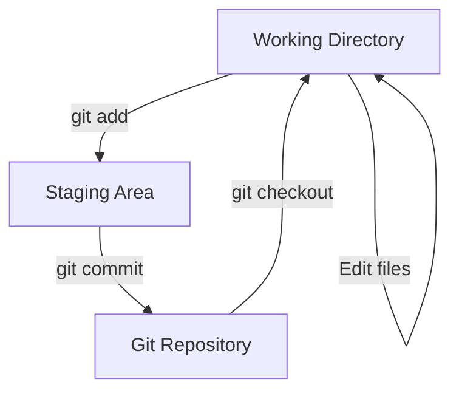
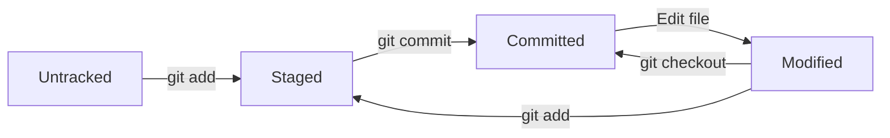
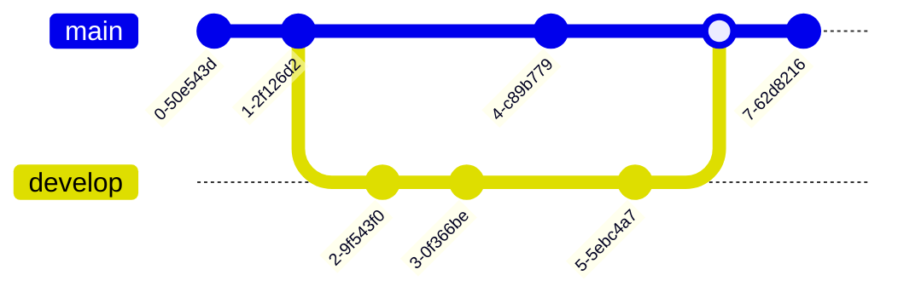
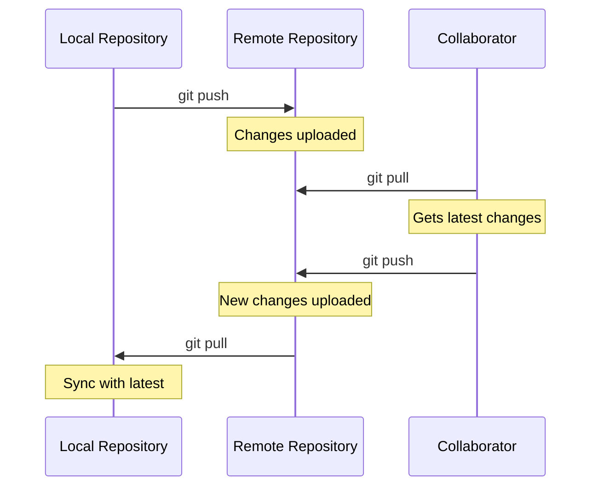

# Getting Started with Git

Welcome to the comprehensive Git tutorial! This guide will take you from beginner to advanced Git usage.

## What is Git?

Git is a distributed version control system that tracks changes in any set of computer files. It's designed for coordinating work among programmers, but it can be used to track changes in any set of files.

:::theory

#### Core Concepts

Git operates on three main concepts:

- **Working Directory**: Where you make changes to files
- **Staging Area**: Where you prepare changes for commit
- **Repository**: Where Git stores committed changes permanently
  :::

### Key Features

* **Distributed**: Every developer has a full copy of the project history
* **Fast**: Git is optimized for speed and performance
* **Secure**: Uses SHA-1 hashing to ensure data integrity
* **Flexible**: Supports various workflows and branching strategies

## Basic Commands

Let's start with the fundamental Git commands:

```bash
# Initialize a new Git repository
git init

# Clone an existing repository
git clone https://github.com/user/repo.git

# Check repository status
git status

# Add files to staging area
git add filename.txt
git add .

# Commit changes
git commit -m "Initial commit"

# View commit history
git log
```

:::practice

#### Try It Yourself

1. Create a new directory for your project
2. Initialize it as a Git repository
3. Create a simple text file
4. Add and commit the file
   :::

# Understanding Git Workflow

The Git workflow follows a simple pattern that becomes second nature with practice.

## The Three States

Git has three main states that your files can reside in:

1. **Modified**: You have changed the file but not committed it
2. **Staged**: You have marked a modified file to go into your next commit
3. **Committed**: The data is safely stored in your local database



## File Status Lifecycle

Understanding how Git tracks your files:



:::warning

#### Important Note

Always check `git status` before committing to see what changes you're about to commit. This helps avoid committing unwanted files or changes.
:::

## Interactive Demo

Try these commands in your terminal:

:::demo
`<button class="demo-button" onclick="showStatus('clean')">`Clean Status`</button>`
`<button class="demo-button" onclick="showStatus('modified')">`Modified Files`</button>`
`<button class="demo-button" onclick="showStatus('staged')">`Staged Files`</button>`
`<button class="demo-button" onclick="showStatus('committed')">`After Commit`</button>`

<div class="demo-output" id="statusOutput">Click a button to see git status output</div>
:::

# Branching and Merging

Branching is one of Git's most powerful features. It allows you to diverge from the main line of development and work on features independently.

## Why Use Branches?

- **Isolation**: Work on features without affecting main code
- **Collaboration**: Multiple developers can work simultaneously
- **Experimentation**: Try new ideas without risk
- **Organization**: Keep different features separate

## Branch Commands

```bash
# Create a new branch
git branch feature-login

# Switch to a branch
git checkout feature-login

# Create and switch in one command
git checkout -b feature-login

# List all branches
git branch

# Merge a branch
git merge feature-login

# Delete a branch
git branch -d feature-login
```

:::tip

#### Best Practice

Use descriptive branch names like `feature/user-authentication` or `bugfix/login-validation` to make your project history clear.
:::

## Branching Visualization

Here's how branches work in Git:



## Interactive Branch Demo

See how branches evolve over time:

:::demo
`<button class="demo-button" onclick="showBranch('initial')">`Initial State`</button>`
`<button class="demo-button" onclick="showBranch('branch')">`Create Branch`</button>`
`<button class="demo-button" onclick="showBranch('commits')">`Add Commits`</button>`
`<button class="demo-button" onclick="showBranch('merge')">`Merge Branch`</button>`

<div class="demo-output" id="branchOutput">Click a button to see branch evolution</div>
:::

# Remote Repositories

Working with remote repositories is essential for collaboration and backup.

## Remote Commands

```bash
# Add a remote repository
git remote add origin https://github.com/user/repo.git

# View remote repositories
git remote -v

# Push changes to remote
git push origin main

# Pull changes from remote
git pull origin main

# Fetch changes without merging
git fetch origin
```

:::exercise

#### Exercise: Working with Remotes

**Step 1**: Create a repository on GitHub
**Step 2**: Link your local repository to the remote
**Step 3**: Push your changes to GitHub
**Step 4**: Make changes on GitHub and pull them locally
:::

## Remote Workflow

The typical workflow with remote repositories:



## Common Remote Operations

| Command        | Description                             |
| -------------- | --------------------------------------- |
| `git clone`  | Download a repository from remote       |
| `git push`   | Upload local changes to remote          |
| `git pull`   | Download and merge remote changes       |
| `git fetch`  | Download remote changes without merging |
| `git remote` | Manage remote repository connections    |

---

## Summary

Congratulations! You've learned the fundamentals of Git:

1. **Basic Commands**: `init`, `add`, `commit`, `status`, `log`
2. **Workflow**: Understanding the three states of Git
3. **Branching**: Creating, switching, and merging branches
4. **Remote Repositories**: Collaborating with others

:::tip

#### Next Steps

- Practice these commands with a real project
- Learn about Git hooks and advanced features
- Explore different branching strategies (Git Flow, GitHub Flow)
- Master conflict resolution techniques
  :::

Keep practicing, and Git will become an indispensable tool in your development workflow!
